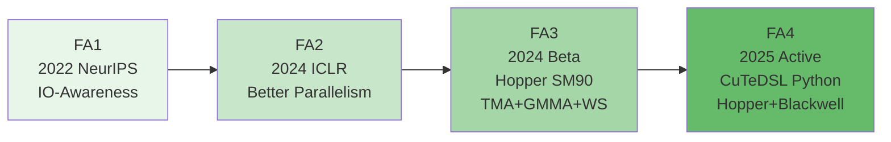
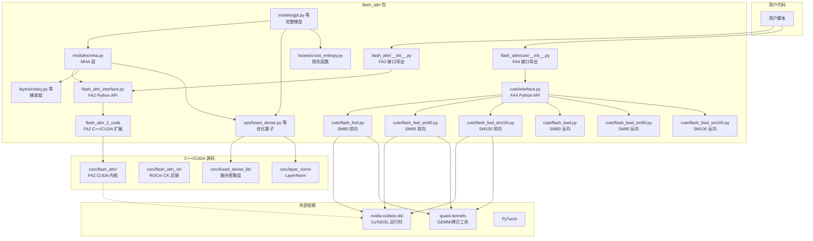
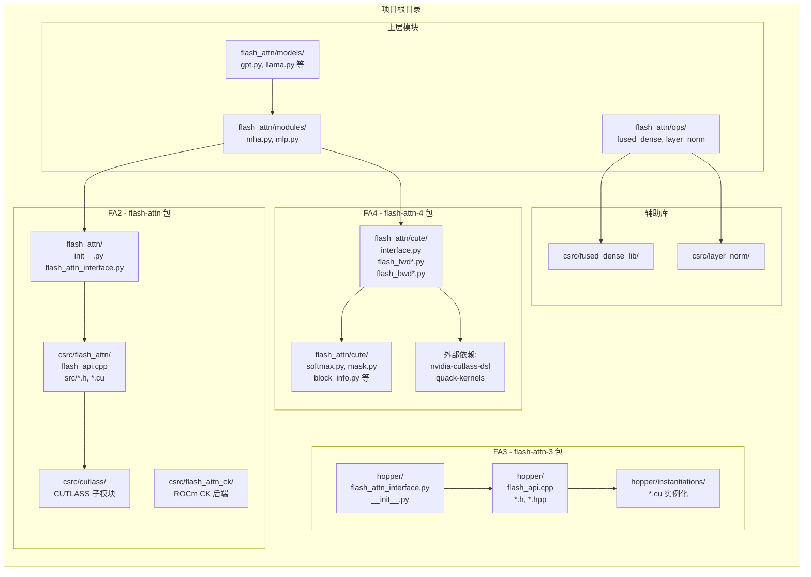

# 01 - 项目总览与架构

## 【总】开篇

本篇对 FlashAttention 项目的整体架构进行系统性分析。FlashAttention 是由 Tri Dao 等人开发的快速、内存高效的精确注意力机制实现，从 2022 年发布至今已演进至第四代，每一代都在性能和架构上实现了重大突破。

**核心结论预览：**

1. **四代实现分布在不同目录**：FA2 位于 `csrc/flash_attn/`（C++/CUDA 内核）+ `flash_attn/flash_attn_interface.py`（Python 接口）；FA3 位于 `hopper/`（C++/CUDA，针对 Hopper SM90）；FA4 位于 `flash_attn/cute/`（CuTeDSL Python，支持 Hopper + Blackwell）。
2. **Python + C++/CUDA + CuTeDSL 混合架构**：FA2 和 FA3 使用传统的 C++/CUDA 编写内核，通过 pybind11 绑定到 Python；FA4 则完全使用 Python 编写，基于 NVIDIA CuTeDSL（CUTLASS DSL）在运行时 JIT 编译为 PTX/CUBIN。
3. **FA4 是活跃开发方向**：从 `CLAUDE.md`（第 9 行）明确指出 "active development is on FA4 in `flash_attn/cute/`"，FA4 的包名为 `flash-attn-4`，独立于 FA2 的 `flash-attn` 包发布。

**与其他篇章的关联：** 本篇建立全局视角，后续篇章将分别深入 FA2/FA3 的 C++/CUDA 内核设计原理（第 2 篇）、FA4 的 CuTeDSL 内核实现（第 3 篇）、Python 上层模块与模型集成（第 4 篇）以及构建与部署体系（第 5 篇）。

---

## 【分】主体内容

### 1. 完整目录树及职责说明

以下是项目根目录下所有关键目录和文件的职责标注：

```
flash-attention/                          # 项目根目录
├── README.md                             # 项目说明文档，含安装、使用、性能数据
├── CLAUDE.md                             # Claude Code 辅助开发指引，含 FA4 架构说明
├── setup.py                              # FA2 的 setuptools 构建脚本（编译 C++/CUDA 扩展）
├── Makefile                              # 简易构建命令（clean_dist / create_dist / upload_package）
├── LICENSE                               # BSD 许可证
├── MANIFEST.in                           # sdist 打包清单
├── .pre-commit-config.yaml               # pre-commit 钩子配置（ruff 格式化）
├── .gitmodules                           # Git 子模块定义（cutlass, composable_kernel, aiter）
│
├── flash_attn/                           # ★ Python 包（FA2 接口 + FA4 实现 + 上层模块）
│   ├── __init__.py                       # FA2 包入口，导出 flash_attn_func 等核心函数
│   ├── flash_attn_interface.py           # FA2 Python 接口层（调用 C++/CUDA 内核）
│   ├── flash_attn_triton.py              # Triton 实验性实现（支持 ALiBi）
│   ├── flash_attn_triton_og.py           # Triton 原始实现
│   ├── flash_blocksparse_attention.py    # 块稀疏注意力实现
│   ├── flash_blocksparse_attn_interface.py # 块稀疏注意力接口
│   ├── bert_padding.py                   # BERT 变长序列 padding 工具
│   ├── pyproject.toml                    # FA2 包的构建配置
│   ├── cute/                             # ★★ FA4: CuTeDSL 实现（活跃开发方向）
│   │   ├── __init__.py                   # FA4 包入口，导出 flash_attn_func / flash_attn_varlen_func
│   │   ├── interface.py                  # FA4 公共 API，内核调度入口
│   │   ├── pyproject.toml                # FA4 独立包配置（包名 flash-attn-4）
│   │   ├── flash_fwd.py                  # SM80 前向内核（FlashAttentionForwardSm80/Base）
│   │   ├── flash_fwd_sm90.py             # SM90 Hopper 前向内核
│   │   ├── flash_fwd_sm100.py            # SM100 Blackwell 前向内核
│   │   ├── flash_fwd_sm120.py            # SM120 Thor 前向内核
│   │   ├── flash_fwd_combine.py          # SplitKV 部分结果合并内核
│   │   ├── flash_fwd_mla_sm100.py        # MLA（Multi-head Latent Attention）前向内核
│   │   ├── flash_bwd.py                  # SM80 反向内核（FlashAttentionBackwardSm80）
│   │   ├── flash_bwd_sm90.py             # SM90 Hopper 反向内核
│   │   ├── flash_bwd_sm100.py            # SM100 Blackwell 反向内核
│   │   ├── flash_bwd_sm120.py            # SM120 Thor 反向内核
│   │   ├── flash_bwd_preprocess.py       # 反向预处理（计算 D_i = (dO_i * O_i).sum()）
│   │   ├── flash_bwd_postprocess.py      # 反向后处理（dQ 累积等）
│   │   ├── softmax.py                    # Online softmax + score modifier
│   │   ├── mask.py                       # AttentionMask：causal/local/块稀疏/mask_mod
│   │   ├── block_info.py                 # BlockInfo：tile 维度与 block range 计算
│   │   ├── seqlen_info.py                # SeqlenInfoQK：变长序列信息追踪
│   │   ├── pipeline.py                   # PipelineStateSimple：循环缓冲区流水线管理
│   │   ├── tile_scheduler.py             # Tile 调度策略（单 tile / varlen / persistent）
│   │   ├── copy_utils.py                 # 类型转换拷贝、shared-to-register 加载、TMA copy
│   │   ├── named_barrier.py              # Named barrier 枚举（warp 同步）
│   │   ├── pack_gqa.py                   # GQA 打包：多 Q head 共享 KV head
│   │   ├── paged_kv.py                   # PagedKVManager：分页 KV 缓存 + TMA
│   │   ├── block_sparsity.py             # 块稀疏注意力支持
│   │   ├── block_sparse_utils.py         # 块稀疏工具函数
│   │   ├── cache_utils.py                # JIT 编译缓存管理
│   │   ├── cute_dsl_utils.py             # 修补的 cute.compile（可选 SASS dump）
│   │   ├── cute_dsl_ptxas.py             # 自定义 ptxas 路径支持
│   │   ├── fast_math.py                  # exp2 多项式系数、softcap score_mod
│   │   ├── utils.py                      # 哈希函数、warp reductions、谓词
│   │   ├── fa_logging.py                 # 日志工具
│   │   ├── testing.py                    # 测试辅助（FakeTensorMode 检测）
│   │   ├── ampere_helpers.py             # SM80 warp-level GEMM 辅助
│   │   ├── blackwell_helpers.py          # SM100 UMMA GEMM / 2CTA 辅助
│   │   ├── mma_sm100_desc.py             # SM100 MMA 描述符枚举
│   │   ├── sm90_config_search.py         # SM90 tile 配置搜索
│   │   ├── sm100_hd256_2cta_fmha_forward.py  # SM100 hdim=256 2CTA 前向
│   │   ├── sm100_hd256_2cta_fmha_backward.py # SM100 hdim=256 2CTA 反向
│   │   ├── sm100_hd256_2cta_fmha_backward_dqkernel.py  # 2CTA dQ 内核
│   │   ├── sm100_hd256_2cta_fmha_backward_dkdvkernel.py # 2CTA dK/dV 内核
│   │   ├── topk_gather_kv.py             # Top-K KV 收集
│   │   ├── benchmark.py                  # 性能基准测试
│   │   ├── bench_utils.py                # 基准测试工具
│   │   └── ...                           # 其他辅助文件
│   ├── modules/                          # 神经网络模块
│   │   ├── mha.py                        # ★ Multi-Head Attention 层（核心模块）
│   │   ├── mlp.py                        # MLP 层（FusedMLP / ParallelMLP）
│   │   ├── block.py                      # Transformer Block
│   │   └── embedding.py                  # 嵌入层（VocabParallelEmbedding）
│   ├── models/                           # 完整模型实现
│   │   ├── gpt.py                        # GPT 模型（含训练脚本集成）
│   │   ├── llama.py                      # LLaMA 模型
│   │   ├── bert.py                       # BERT 模型
│   │   ├── baichuan.py                   # Baichuan 模型
│   │   ├── falcon.py                     # Falcon 模型
│   │   ├── gpt_neox.py                   # GPT-NeoX 模型
│   │   ├── gptj.py                       # GPT-J 模型
│   │   ├── opt.py                        # OPT 模型
│   │   ├── vit.py                        # ViT 模型
│   │   ├── bigcode.py                    # BigCode 模型
│   │   └── btlm.py                       # BTLM 模型
│   ├── layers/                           # 辅助层
│   │   ├── rotary.py                     # 旋转位置编码（RotaryEmbedding）
│   │   └── patch_embed.py               # ViT Patch Embedding
│   ├── ops/                              # 优化算子
│   │   ├── fused_dense.py                # 融合密集层（ColumnParallelLinear 等）
│   │   ├── layer_norm.py                 # LayerNorm（调用 csrc/layer_norm）
│   │   ├── rms_norm.py                   # RMSNorm
│   │   ├── activations.py                # 激活函数（FusedGeluMul 等）
│   │   └── triton/                       # Triton 实现的算子
│   │       ├── layer_norm.py             # Triton LayerNorm
│   │       ├── linear.py                 # Triton 线性层
│   │       ├── mlp.py                    # Triton MLP
│   │       ├── rotary.py                 # Triton 旋转编码
│   │       ├── cross_entropy.py          # Triton 交叉熵
│   │       └── k_activations.py          # Triton 激活函数
│   ├── losses/                           # 损失函数
│   │   └── cross_entropy.py              # 融合交叉熵损失
│   └── utils/                            # 工具函数
│       ├── benchmark.py                  # 基准测试工具
│       ├── distributed.py                # 分布式训练工具
│       ├── generation.py                 # 文本生成工具
│       ├── library.py                    # 库加载工具
│       ├── pretrained.py                 # 预训练模型加载
│       ├── testing.py                    # 测试工具
│       └── torch.py                      # PyTorch 辅助
│
├── csrc/                                 # ★ C++/CUDA 源码（FA2 内核 + 辅助库）
│   ├── flash_attn/                       # FA2 CUDA 内核
│   │   ├── flash_api.cpp                 # FA2 C++ API 入口（pybind11 绑定）
│   │   └── src/                          # FA2 CUDA 内核源码
│   │       ├── flash.h                   # 核心参数结构体定义
│   │       ├── flash_fwd_kernel.h        # 前向内核模板
│   │       ├── flash_bwd_kernel.h        # 反向内核模板
│   │       ├── flash_fwd_launch_template.h # 前向启动模板（分派到具体 hdim/dtype）
│   │       ├── flash_bwd_launch_template.h # 反向启动模板
│   │       ├── flash_bwd_preprocess_kernel.h # 反向预处理内核
│   │       ├── kernel_traits.h           # 内核 traits（tile size 等）
│   │       ├── static_switch.h           # 编译期开关宏
│   │       ├── block_info.h              # Block 信息计算
│   │       ├── alibi.h                   # ALiBi 偏置
│   │       ├── mask.h                    # 掩码计算
│   │       ├── softmax.h                 # Softmax 计算
│   │       ├── rotary.h                  # 旋转位置编码
│   │       ├── dropout.h                 # Dropout 实现
│   │       ├── utils.h                   # 工具函数
│   │       ├── hardware_info.h           # GPU 硬件信息查询
│   │       ├── namespace_config.h        # 命名空间配置
│   │       ├── philox.cuh                # Philox 随机数生成器
│   │       ├── philox_unpack.cuh         # Philox 解包
│   │       ├── generate_kernels.py       # 内核实例化代码生成脚本
│   │       └── flash_fwd_hdim*.cu        # 按头维度+数据类型实例化的前向内核
│   │       └── flash_bwd_hdim*.cu        # 按头维度+数据类型实例化的反向内核
│   │       └── flash_fwd_split_hdim*.cu  # SplitKV 前向内核实例化
│   ├── flash_attn_ck/                    # ROCm CK 后端（AMD GPU）
│   │   ├── flash_api.cpp                 # CK 后端 C++ API
│   │   ├── flash_common.cpp/hpp          # CK 公共工具
│   │   ├── mha_fwd.cpp                   # 前向实现
│   │   ├── mha_bwd.cpp                   # 反向实现
│   │   ├── mha_fwd_kvcache.cpp           # KV Cache 前向
│   │   ├── mha_varlen_fwd.cpp            # 变长序列前向
│   │   ├── mha_varlen_bwd.cpp            # 变长序列反向
│   │   └── mha_fwd_head_grouping_utils.hpp # GQA 头分组工具
│   ├── fused_dense_lib/                  # 融合密集层 CUDA 内核
│   │   ├── fused_dense.cpp               # C++ API
│   │   └── fused_dense_cuda.cu           # CUDA 内核
│   ├── layer_norm/                       # LayerNorm CUDA 内核
│   │   ├── ln_api.cpp                    # C++ API
│   │   ├── ln.h                          # 参数结构体
│   │   ├── ln_fwd_*.cu                   # 按隐藏维度实例化的前向内核
│   │   ├── ln_bwd_*.cu                   # 按隐藏维度实例化的反向内核
│   │   └── ln_parallel_*.cu              # 并行 LayerNorm 内核
│   └── cutlass/                          # CUTLASS 子模块（FA2 依赖）
│
├── hopper/                               # ★ FA3: Hopper GPU 优化实现
│   ├── flash_api.cpp                     # FA3 C++ API 入口（TORCH_LIBRARY 注册）
│   ├── flash_api_stable.cpp              # FA3 稳定版 API
│   ├── flash_attn_interface.py           # FA3 Python 接口
│   ├── __init__.py                       # FA3 包初始化
│   ├── setup.py                          # FA3 独立构建脚本
│   ├── flash.h                           # FA3 核心参数结构体
│   ├── flash_fwd_kernel_sm80.h           # SM80 前向内核
│   ├── flash_fwd_kernel_sm90.h           # SM90 前向内核（TMA + GMMA）
│   ├── flash_bwd_kernel_sm80.h           # SM80 反向内核
│   ├── flash_bwd_kernel_sm90.h           # SM90 反向内核
│   ├── flash_fwd_launch_template.h       # 前向启动模板
│   ├── flash_bwd_launch_template.h       # 反向启动模板
│   ├── flash_bwd_preprocess_kernel.h     # 反向预处理
│   ├── flash_bwd_postprocess_kernel.h    # 反向后处理
│   ├── flash_fwd_combine_kernel.h        # SplitKV 合并内核
│   ├── flash_fwd_combine.cu              # SplitKV 合并 CUDA 实现
│   ├── flash_fwd_combine_launch_template.h # 合并启动模板
│   ├── flash_prepare_scheduler.cu        # 调度器准备
│   ├── mainloop_fwd_sm80.hpp             # SM80 前向主循环
│   ├── mainloop_fwd_sm90_tma_gmma_ws.hpp # SM90 前向主循环（TMA+GMMA+Warpspecialize）
│   ├── mainloop_bwd_sm80.hpp             # SM80 反向主循环
│   ├── mainloop_bwd_sm90_tma_gmma_ws.hpp # SM90 反向主循环
│   ├── epilogue_fwd.hpp                  # 前向 Epilogue
│   ├── epilogue_bwd.hpp                  # 反向 Epilogue
│   ├── sm90_pipeline_no_cluster.hpp      # SM90 流水线（无 Cluster）
│   ├── tile_scheduler.hpp                # Tile 调度器
│   ├── tile_size.h                       # Tile 大小配置
│   ├── heuristics.h                      # 启发式参数选择
│   ├── block.h                           # Block 定义
│   ├── mask.h                            # 掩码
│   ├── softmax.h                         # Softmax
│   ├── rotary.h                          # 旋转编码
│   ├── seqlen.h                          # 序列长度信息
│   ├── paged_kv.h                        # 分页 KV 缓存
│   ├── pack_gqa.h                        # GQA 打包
│   ├── named_barrier.hpp                 # 命名屏障
│   ├── copy_sm90_bulk_reduce.hpp         # SM90 Bulk Reduce 拷贝
│   ├── static_switch.h                   # 编译期开关
│   ├── utils.h                           # 工具函数
│   ├── cuda_check.h                      # CUDA 检查
│   ├── generate_kernels.py               # 内核实例化代码生成
│   ├── instantiations/                   # 生成的 .cu 实例化文件
│   ├── test_flash_attn.py                # FA3 测试
│   └── benchmark_*.py                    # FA3 基准测试
│
├── tests/                                # 测试目录
│   ├── test_flash_attn.py                # FA2 主测试
│   ├── test_flash_attn_ck.py             # CK 后端测试
│   ├── cute/                             # FA4 测试
│   │   ├── test_flash_attn.py            # FA4 主测试
│   │   ├── test_flash_attn_varlen.py     # FA4 变长序列测试
│   │   ├── test_mask_mod.py              # mask_mod 测试
│   │   ├── test_score_mod.py             # score_mod 测试
│   │   └── test_block_sparsity.py        # 块稀疏测试
│   ├── models/                           # 模型测试
│   ├── modules/                          # 模块测试
│   ├── ops/                              # 算子测试
│   └── losses/                           # 损失函数测试
│
├── benchmarks/                           # 基准测试
│   ├── benchmark_flash_attention.py      # FA 基准
│   ├── benchmark_attn.py                 # 注意力基准
│   └── bench_sm90.py                     # SM90 基准
│
├── training/                             # 训练脚本
├── examples/                             # 示例代码
├── assets/                               # 文档资源（图片、PDF）
├── AI/                                   # AI 辅助调试文档
└── .github/                              # CI/CD 配置
```

### 2. 四代 FlashAttention 的代码分布与关系

#### 2.1 FA2：成熟稳定的生产级实现

**代码分布：**
- **C++/CUDA 内核**：`csrc/flash_attn/` 目录，核心文件为 `flash_api.cpp`（第 1 行起定义了 `FLASH_NAMESPACE` 命名空间下的参数设置和内核调用函数）
- **Python 接口**：`flash_attn/flash_attn_interface.py`（第 8-23 行导入 `flash_attn_2_cuda` 模块，通过 `flash_attn_gpu.fwd()` / `flash_attn_gpu.varlen_fwd()` 调用 C++ 内核）

**技术特征：**
- 使用传统 C++/CUDA 编写内核，通过 `torch.utils.cpp_extension.CUDAExtension` 编译为 Python 扩展模块 `flash_attn_2_cuda`
- 内核按头维度（32/64/96/128/192/256）× 数据类型（fp16/bf16）× 是否 causal 实例化，生成大量 `.cu` 文件
- `setup.py`（第 304-391 行）列出所有源文件，编译为单一 `flash_attn_2_cuda` 扩展
- 支持 Ampere（SM80）及以上 GPU，通过 `setup.py`（第 74 行）的 `cuda_archs()` 函数配置目标架构 `"80;90;100;110;120"`

**关键入口：** `flash_attn/__init__.py`（第 8-16 行）从 `flash_attn_interface` 导出 7 个核心函数：
```python
from flash_attn.flash_attn_interface import (
    flash_attn_func,
    flash_attn_kvpacked_func,
    flash_attn_qkvpacked_func,
    flash_attn_varlen_func,
    flash_attn_varlen_kvpacked_func,
    flash_attn_varlen_qkvpacked_func,
    flash_attn_with_kvcache,
)
```

#### 2.2 FA3：Hopper 架构的激进优化

**代码分布：**
- **C++/CUDA 内核**：`hopper/` 目录，核心文件为 `flash_api.cpp`（使用 `TORCH_LIBRARY` 注册算子，而非 FA2 的 pybind11 方式）
- **Python 接口**：`hopper/flash_attn_interface.py`（第 24 行 `import flash_attn_3._C`，第 28 行 `flash_attn_3_gpu = torch.ops.flash_attn_3`）
- **独立构建**：`hopper/setup.py` 提供独立的安装流程

**技术特征：**
- 专门针对 Hopper SM90 GPU 优化，充分利用 TMA（Tensor Memory Accelerator）和 GMMA（Grouped MMA）指令
- 采用 Warpspecialize 模式，将数据加载和计算分配到不同 warp 组
- 内核头文件按架构分离：`flash_fwd_kernel_sm80.h` 和 `flash_fwd_kernel_sm90.h`
- 主循环按架构分离：`mainloop_fwd_sm80.hpp` 和 `mainloop_fwd_sm90_tma_gmma_ws.hpp`
- 支持 FP8（E4M3）前向，这是 FA2 不具备的
- `instantiations/` 目录包含大量按 hdim×dtype×feature×arch 组合实例化的 `.cu` 文件

**与 FA2 的区别：**
- FA3 的 `flash_api.cpp`（第 19-36 行）使用 `PyInit__C` 创建空模块 + `TORCH_LIBRARY` 静态初始化器注册算子，而 FA2 使用 pybind11 的 `PYBIND11_MODULE` 宏
- FA3 的 Python 接口通过 `torch.ops.flash_attn_3` 调用算子，而 FA2 直接调用 `flash_attn_2_cuda.fwd()`
- FA3 是 beta 版本，README（第 39 行）说明 "This is a beta release for testing / benchmarking before we integrate that with the rest of the repo"

#### 2.3 FA4：CuTeDSL 的范式转变

**代码分布：**
- **全部在 Python 中**：`flash_attn/cute/` 目录，使用 CuTeDSL（NVIDIA CUTLASS DSL）编写
- **独立包**：`flash_attn/cute/pyproject.toml`（第 6 行 `name = "flash-attn-4"`），独立于 FA2 的 `flash-attn` 包
- **公共 API**：`flash_attn/cute/interface.py`（第 10-13 行导出 `flash_attn_func` 和 `flash_attn_varlen_func`）

**技术特征：**
- **纯 Python 编写内核**：使用 `cutlass.cute` DSL 在 Python 中描述 GPU 内核，运行时 JIT 编译为 PTX/CUBIN
- **多架构支持**：`interface.py`（第 37-48 行）根据 GPU 架构动态选择内核：
  ```python
  from flash_attn.cute.flash_fwd import FlashAttentionForwardSm80        # SM80 Ampere
  from flash_attn.cute.flash_fwd_sm90 import FlashAttentionForwardSm90   # SM90 Hopper
  from flash_attn.cute.flash_fwd_sm100 import FlashAttentionForwardSm100 # SM100 Blackwell
  from flash_attn.cute.flash_fwd_sm120 import FlashAttentionForwardSm120 # SM120 Thor
  ```
- **JIT 编译缓存**：`cache_utils.py` 实现内存 LRU + 可选磁盘缓存，缓存键包含 dtype、head_dim、causal、mask/score_mod 哈希、架构、block sizes
- **编译期常量**：使用 `cutlass.Constexpr[type]` 实现内核特化
- **用户可扩展**：score_mod 和 mask_mod 是用户定义的 `@cute.jit` 可调用对象，在编译时注入内核

**与 FA3 的演进关系：**
- FA4 的每个内核文件头部都标注了对应的 FA3 C++ 源文件，例如 `flash_fwd.py`（第 3-4 行）：
  ```
  # A reimplementation of
  # https://github.com/Dao-AILab/flash-attention/blob/main/hopper/flash_fwd_kernel_sm80.h
  # and https://github.com/Dao-AILab/flash-attention/blob/main/hopper/flash_fwd_kernel_sm90.h
  ```
- FA4 的 tile 配置直接参考 FA3 的 C++ 实现，例如 `interface.py`（第 120-152 行）的 `_tile_size_fwd_sm90()` 函数注释说明 "Tile sizes and flags based on tile_size_fwd_sm90 in hopper/tile_size.h"
- FA4 新增了 SM100/SM120 Blackwell/Thor 支持，这是 FA3 没有的

#### 2.4 四代演进逻辑



**演进逻辑总结：**

| 维度 | FA2 | FA3 | FA4 |
|------|-----|-----|-----|
| 编写语言 | C++/CUDA | C++/CUDA | Python (CuTeDSL) |
| 编译方式 | 预编译 AOT | 预编译 AOT | JIT 运行时编译 |
| 目标架构 | SM80+ | SM90 (Hopper) | SM80/90/100/120 |
| 包名 | flash-attn | flash-attn-3 | flash-attn-4 |
| 代码位置 | csrc/flash_attn/ | hopper/ | flash_attn/cute/ |
| 开发状态 | 维护模式 | Beta | 活跃开发 |
| 新特性 | - | FP8前向, Warpspecialize | 2CTA, score/mask_mod, MLA |

### 3. Python 包结构

`flash_attn` 顶层包采用命名空间包（namespace package）机制，允许 FA2 和 FA4 共存。`flash_attn/__init__.py`（第 1-4 行）使用 `pkgutil.extend_path` 实现：

```python
from pkgutil import extend_path
__path__ = extend_path(__path__, __name__)
```

这使得 `flash_attn.cute` 可以作为独立安装的子包存在，同时 `from flash_attn import flash_attn_func` 仍然指向 FA2 的接口。

#### 3.1 模块划分

| 子包 | 职责 | 关键文件 |
|------|------|----------|
| `flash_attn.cute/` | FA4 CuTeDSL 内核实现 | `interface.py`, `flash_fwd.py`, `flash_bwd.py` 等 |
| `flash_attn.modules/` | 神经网络基础模块 | `mha.py`（MHA层）, `mlp.py`, `block.py` |
| `flash_attn.models/` | 完整模型实现 | `gpt.py`, `llama.py`, `bert.py` 等 11 个模型 |
| `flash_attn.layers/` | 辅助层 | `rotary.py`（旋转编码）, `patch_embed.py` |
| `flash_attn.ops/` | 优化算子 | `fused_dense.py`, `layer_norm.py`, `rms_norm.py` |
| `flash_attn.ops.triton/` | Triton 实现的算子 | `layer_norm.py`, `linear.py`, `mlp.py` 等 |
| `flash_attn.losses/` | 损失函数 | `cross_entropy.py` |
| `flash_attn.utils/` | 工具函数 | `distributed.py`, `generation.py`, `pretrained.py` |

#### 3.2 FA2 接口层

`flash_attn/flash_attn_interface.py` 是 FA2 的核心接口文件，它：
- 第 12-23 行：根据环境变量 `FLASH_ATTENTION_TRITON_AMD_ENABLE` 选择 CUDA 或 ROCm Triton 后端
- 第 84-114 行：使用 `torch.library.custom_op` 注册 `_flash_attn_forward` 算子（支持 `torch.compile`）
- 第 153-199 行：注册 `_flash_attn_varlen_forward` 算子（变长序列支持）
- 所有算子最终调用 `flash_attn_gpu.fwd()` / `flash_attn_gpu.varlen_fwd()`，即 C++ 编译的 `flash_attn_2_cuda` 模块

#### 3.3 FA4 接口层

`flash_attn/cute/interface.py` 是 FA4 的核心接口文件，它：
- 第 14-16 行：导入 CuTeDSL 核心库 `import cutlass` 和 `import cutlass.cute as cute`
- 第 37-48 行：导入所有架构的前向/反向内核类
- 第 63-89 行：`_get_device_arch()` 函数检测 GPU 架构并缓存结果
- 第 92-109 行：`_validate_head_dims()` 验证头维度约束
- 根据架构动态选择内核类，通过 CuTeDSL JIT 编译执行

### 4. C++/CUDA 源码结构

`csrc/` 目录包含四个子项目，各自独立编译为 Python 扩展模块：

#### 4.1 flash_attn（FA2 内核）

**入口**：`csrc/flash_attn/flash_api.cpp`

该文件是 FA2 的 C++ API 层，使用 pybind11 绑定 Python。核心结构：
- 第 24 行定义 `FLASH_NAMESPACE` 命名空间
- `set_params_fprop()` 函数（第 26 行起）设置前向参数结构体 `Flash_fwd_params`
- 内核通过模板实例化分派到具体的头维度/数据类型组合

**内核源码**：`csrc/flash_attn/src/`

核心头文件：
- `flash.h`：定义 `Flash_fwd_params` 和 `Flash_bwd_params` 参数结构体
- `flash_fwd_kernel.h`：前向内核模板（`flash_attn_fwd_kernel`）
- `flash_bwd_kernel.h`：反向内核模板（`flash_attn_bwd_kernel`）
- `flash_fwd_launch_template.h`：前向启动模板，根据 hdim/dtype/causal 分派
- `flash_bwd_launch_template.h`：反向启动模板
- `kernel_traits.h`：内核 traits（tile 大小、线程数等编译期配置）
- `static_switch.h`：编译期开关宏（`SWITCH_DTYPE`、`SWITCH_HEADDIM` 等）

实例化文件命名规则：`flash_{fwd,bwd}_hdim{32,64,96,128,192,256}_{fp16,bf16}{_causal,}_sm80.cu`

`generate_kernels.py` 脚本用于自动生成这些实例化文件。

#### 4.2 flash_attn_ck（ROCm CK 后端）

**入口**：`csrc/flash_attn_ck/flash_api.cpp`

为 AMD GPU 提供基于 Composable Kernel 的实现。文件结构：
- `flash_api.cpp`：C++ API 入口
- `flash_common.cpp/hpp`：公共工具函数
- `mha_fwd.cpp` / `mha_bwd.cpp`：前向/反向实现
- `mha_fwd_kvcache.cpp`：KV Cache 前向
- `mha_varlen_fwd.cpp` / `mha_varlen_bwd.cpp`：变长序列实现
- `mha_fwd_head_grouping_utils.hpp`：GQA 头分组工具

`setup.py`（第 399-534 行）在 ROCm 构建时，先通过 `generate.py` 生成 CK tile 内核代码，再编译为 `flash_attn_2_cuda` 扩展。

#### 4.3 fused_dense_lib（融合密集层）

**入口**：`csrc/fused_dense_lib/fused_dense.cpp`

提供融合的线性层 CUDA 内核，支持：
- 前向：融合 bias + GELU 激活
- 反向：融合 dW + db 计算
- 被 `flash_attn/ops/fused_dense.py` 调用

#### 4.4 layer_norm（LayerNorm 内核）

**入口**：`csrc/layer_norm/ln_api.cpp`

提供高性能 LayerNorm / RMSNorm CUDA 内核：
- `ln_fwd_*.cu`：按隐藏维度（256-8192）实例化的前向内核
- `ln_bwd_*.cu`：按隐藏维度实例化的反向内核
- `ln_parallel_fwd_*.cu` / `ln_parallel_bwd_*.cu`：并行 LayerNorm（用于残差连接融合）
- 被 `flash_attn/ops/layer_norm.py` 和 `flash_attn/ops/rms_norm.py` 调用

### 5. 依赖关系图

#### 5.1 模块依赖关系



#### 5.2 FA4 内核内部依赖

```mermaid
graph TD
    subgraph "FA4 内核层"
        IF["interface.py<br/>公共 API + 调度"]
        FWD80["flash_fwd.py<br/>FlashAttentionForwardSm80"]
        FWD90["flash_fwd_sm90.py<br/>FlashAttentionForwardSm90"]
        FWD100["flash_fwd_sm100.py<br/>FlashAttentionForwardSm100"]
        FWD120["flash_fwd_sm120.py<br/>FlashAttentionForwardSm120"]
        BWD80["flash_bwd.py<br/>FlashAttentionBackwardSm80"]
        BWD90["flash_bwd_sm90.py<br/>FlashAttentionBackwardSm90"]
        BWD100["flash_bwd_sm100.py<br/>FlashAttentionBackwardSm100"]
        BWD120["flash_bwd_sm120.py<br/>FlashAttentionBackwardSm120"]
        COMBINE["flash_fwd_combine.py<br/>SplitKV 合并"]
        PRE["flash_bwd_preprocess.py<br/>反向预处理"]
        POST["flash_bwd_postprocess.py<br/>反向后处理"]
    end

    subgraph "核心抽象层"
        SOFTMAX["softmax.py<br/>Online Softmax"]
        MASK["mask.py<br/>AttentionMask"]
        BLOCK["block_info.py<br/>BlockInfo"]
        SEQLEN["seqlen_info.py<br/>SeqlenInfoQK"]
        PIPE["pipeline.py<br/>PipelineState"]
        SCHED["tile_scheduler.py<br/>Tile 调度"]
        COPY["copy_utils.py<br/>拷贝工具"]
        BARRIER["named_barrier.py<br/>命名屏障"]
    end

    subgraph "架构辅助层"
        AMPERE["ampere_helpers.py<br/>SM80 GEMM"]
        HOPPER["hopper_helpers (quack)<br/>SM90 GEMM"]
        BLACKWELL["blackwell_helpers.py<br/>SM100 UMMA"]
        MMA100["mma_sm100_desc.py<br/>SM100 MMA 描述符"]
    end

    subgraph "功能层"
        PACK["pack_gqa.py<br/>GQA 打包"]
        PAGE["paged_kv.py<br/>分页 KV"]
        SPARSE["block_sparsity.py<br/>块稀疏"]
        CACHE["cache_utils.py<br/>JIT 缓存"]
        MATH["fast_math.py<br/>快速数学"]
        UTILS["utils.py<br/>工具函数"]
    end

    IF --> FWD80 & FWD90 & FWD100 & FWD120
    IF --> BWD80 & BWD90 & BWD100 & BWD120
    IF --> COMBINE & PRE & POST

    FWD80 --> SOFTMAX & MASK & BLOCK & SEQLEN & COPY & BARRIER & PACK & SPARSE
    FWD90 --> SOFTMAX & MASK & BLOCK & SEQLEN & PIPE & SCHED & COPY & BARRIER & PACK & PAGE & SPARSE
    FWD100 --> SOFTMAX & MASK & BLOCK & SEQLEN & PIPE & SCHED & COPY & BARRIER & PACK & PAGE & SPARSE

    BWD80 --> SOFTMAX & MASK & BLOCK & SEQLEN & SCHED & SPARSE
    BWD90 --> SOFTMAX & MASK & BLOCK & SEQLEN & PIPE & SCHED & SPARSE
    BWD100 --> SOFTMAX & MASK & BLOCK & SEQLEN & PIPE & SCHED & SPARSE

    FWD80 --> AMPERE
    FWD90 --> HOPPER
    FWD100 --> BLACKWELL & MMA100
    BWD100 --> BLACKWELL & MMA100

    IF --> CACHE & UTILS
```



### 6. 关键入口点梳理

#### 6.1 FA2 调用路径

从用户代码到内核执行的完整路径：

```
用户代码: from flash_attn import flash_attn_func
    │
    ▼
flash_attn/__init__.py:8-16
    │  导入 flash_attn_interface 中的函数
    ▼
flash_attn/flash_attn_interface.py
    │  flash_attn_func() 定义（约第 350+ 行）
    │  调用 _flash_attn_forward() custom_op
    ▼
flash_attn/flash_attn_interface.py:84-114
    │  _flash_attn_forward() 调用 flash_attn_gpu.fwd()
    ▼
flash_attn_2_cuda (Python C 扩展模块)
    │  pybind11 绑定，对应 C++ 函数
    ▼
csrc/flash_attn/flash_api.cpp
    │  C++ 层参数设置 + 内核启动
    │  set_params_fprop() 设置 Flash_fwd_params
    │  run_mha_fwd_*() 启动内核
    ▼
csrc/flash_attn/src/flash_fwd_launch_template.h
    │  根据 hdim/dtype/causal 模板分派
    ▼
csrc/flash_attn/src/flash_fwd_kernel.h
    │  flash_attn_fwd_kernel() CUDA 内核
    │  Online softmax + tiling 计算
    ▼
GPU 执行
```

#### 6.2 FA3 调用路径

```
用户代码: import flash_attn_interface; flash_attn_interface.flash_attn_func()
    │
    ▼
hopper/flash_attn_interface.py:24
    │  import flash_attn_3._C (注册 TORCH_LIBRARY 算子)
    │  flash_attn_3_gpu = torch.ops.flash_attn_3
    ▼
hopper/flash_attn_interface.py (flash_attn_func)
    │  调用 flash_attn_3_gpu.fwd() 等算子
    ▼
torch.ops.flash_attn_3 (Torch Dispatch 机制)
    │
    ▼
hopper/flash_api.cpp (TORCH_LIBRARY 注册)
    │  C++ 层参数设置 + 内核启动
    │  根据 SM 版本选择 SM80 或 SM90 内核
    ▼
hopper/flash_fwd_kernel_sm90.h / flash_fwd_kernel_sm80.h
    │  前向内核模板
    ▼
hopper/mainloop_fwd_sm90_tma_gmma_ws.hpp
    │  SM90 主循环（TMA + GMMA + Warpspecialize）
    ▼
GPU 执行
```

#### 6.3 FA4 调用路径

```
用户代码: from flash_attn.cute import flash_attn_func
    │
    ▼
flash_attn/cute/__init__.py:10-13
    │  导入 interface.flash_attn_func
    ▼
flash_attn/cute/interface.py (flash_attn_func)
    │  1. _get_device_arch() 检测 GPU 架构
    │  2. _validate_head_dims() 验证参数
    │  3. 根据架构选择内核类:
    │     SM80  → FlashAttentionForwardSm80
    │     SM90  → FlashAttentionForwardSm90
    │     SM100 → FlashAttentionForwardSm100
    │     SM120 → FlashAttentionForwardSm120
    │  4. 构造内核参数，调用 cute.compile() JIT 编译
    │  5. 启动编译后的内核
    ▼
cute.compile() (CuTeDSL JIT 编译器)
    │  Python DSL → PTX → CUBIN
    │  缓存到内存 LRU + 可选磁盘缓存
    ▼
flash_attn/cute/flash_fwd_sm90.py (以 SM90 为例)
    │  FlashAttentionForwardSm90 类
    │  使用 cutlass.cute DSL 描述内核
    │  TMA 加载 + GMMA 计算 + 流水线
    ▼
GPU 执行
```

#### 6.4 MHA 模块调用路径

```
用户代码: from flash_attn.modules.mha import MHA
    │
    ▼
flash_attn/modules/mha.py
    │  MHA 类包含:
    │  - QKV 投影 (ColumnParallelLinear)
    │  - flash_attn_func() 调用
    │  - 输出投影 (RowParallelLinear)
    ▼
flash_attn/flash_attn_interface.py (FA2)
    或 flash_attn/cute/interface.py (FA4)
    │
    ▼
对应内核执行
```

`flash_attn/modules/mha.py`（第 13-23 行）通过 try/except 导入 FA2 接口，如果不可用则设为 None，实现了优雅的降级处理。

### 7. 四代 FA 代码分布地图



---

## 【总】收尾

FlashAttention 项目呈现了一个独特的多代同仓架构：FA2、FA3、FA4 三代实现共存于同一仓库，但各自拥有独立的代码目录、构建系统和包发布流程。这种架构既保证了向后兼容性（FA2 持续维护），又允许新架构的快速迭代（FA4 活跃开发）。

**架构核心特征总结：**

1. **分层解耦**：Python 接口层（`flash_attn_interface.py` / `cute/interface.py`）与内核执行层（C++/CUDA 或 CuTeDSL）清晰分离，用户代码无需关心底层实现
2. **多后端支持**：FA2 同时支持 NVIDIA CUDA（`csrc/flash_attn/`）和 AMD ROCm（`csrc/flash_attn_ck/` + Triton），通过环境变量 `FLASH_ATTENTION_TRITON_AMD_ENABLE` 切换
3. **从 AOT 到 JIT 的范式转变**：FA2/FA3 采用预编译（AOT），需要针对每种 hdim×dtype×feature 组合生成独立的 `.cu` 文件；FA4 采用运行时 JIT 编译，通过 CuTeDSL 在 Python 中描述内核，大幅减少了代码膨胀
4. **命名空间包机制**：`flash_attn/__init__.py` 使用 `pkgutil.extend_path`，允许 FA2（`flash-attn`）和 FA4（`flash-attn-4`）作为独立包共存，用户可以 `from flash_attn import flash_attn_func`（FA2）或 `from flash_attn.cute import flash_attn_func`（FA4）分别调用

**项目当前状态**：FA2 处于维护模式（v2.8.4），FA3 为 beta 版本，FA4 是活跃开发方向。FA4 的 CuTeDSL 方法代表了 GPU 内核开发的未来趋势——用高层 Python DSL 替代底层 C++/CUDA，在保持性能的同时大幅提升开发效率和可维护性。

下一篇将深入 FA2/FA3 的 C++/CUDA 内核设计原理，剖析 Online Softmax、Tiling 策略、SM90 TMA+GMMA 流水线等核心技术细节。
