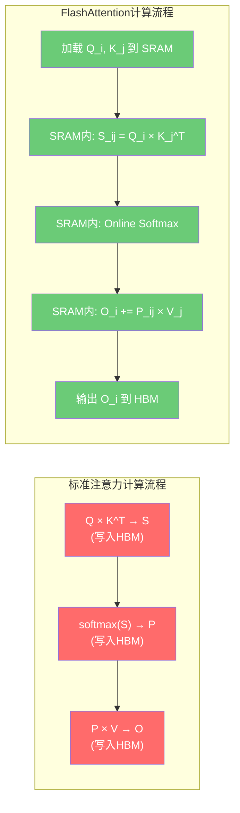
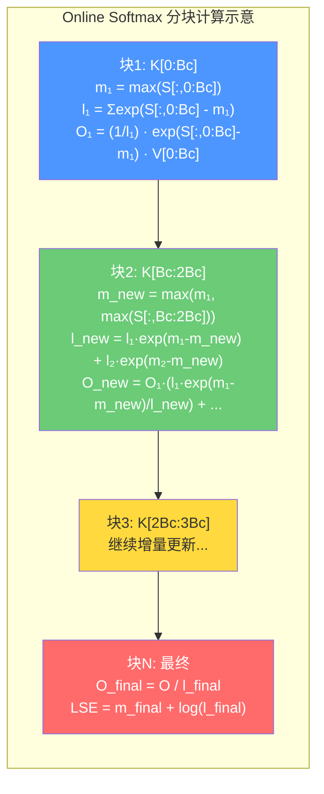
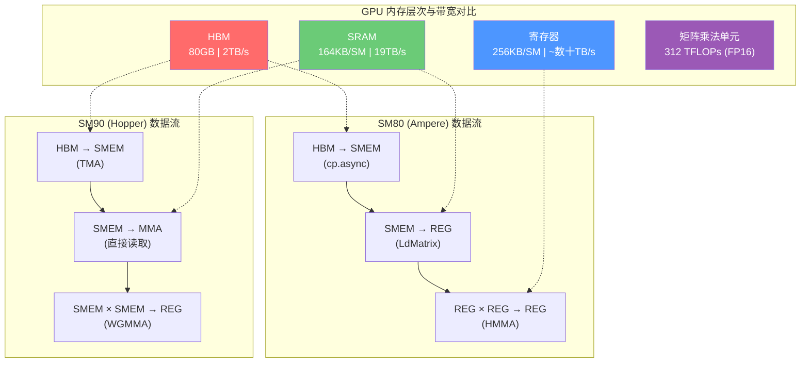
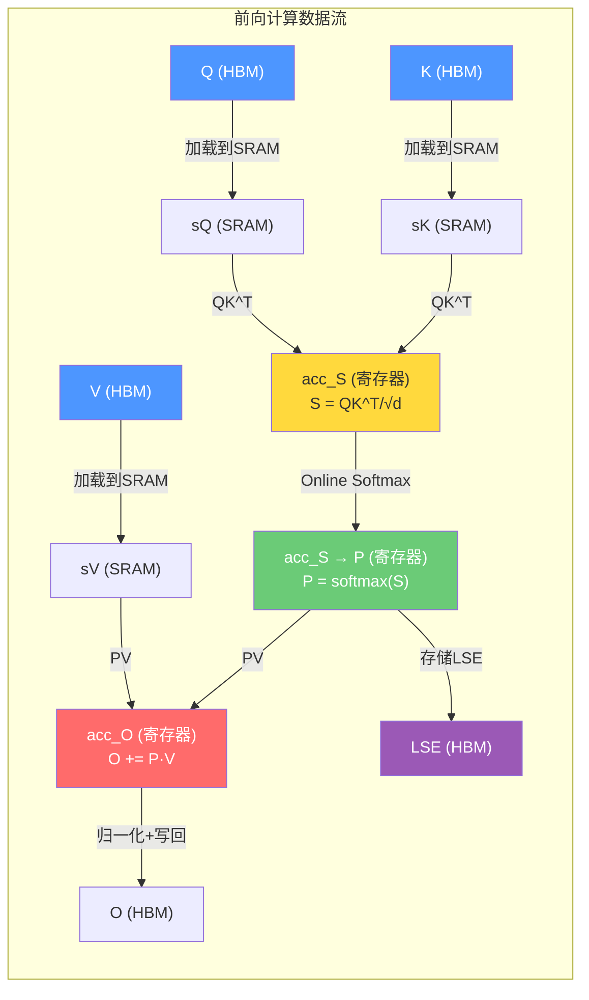
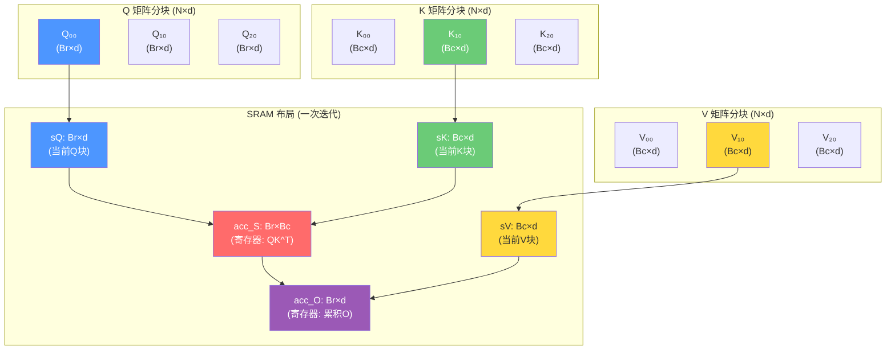

# 02 设计理念与核心原理

## 开篇：FlashAttention 的设计哲学

本篇深入分析 FlashAttention 的设计理念和核心算法原理。FlashAttention 并非通过近似计算来加速注意力——它计算的是**精确的注意力结果**，其加速完全来自对 GPU 硬件特性的深刻理解和极致利用。

**核心结论预览**：

1. **IO 感知是核心**：FlashAttention 的根本洞察是——注意力计算的瓶颈不在算力（FLOPs），而在内存带宽（IO）。标准注意力的 O(N²) 注意力矩阵需要在 HBM 和 SRAM 之间反复搬运，这才是性能的真正杀手。
2. **三大技术支柱**：Tiling（分块计算）+ Online Softmax（在线归一化）+ Kernel Fusion（算子融合）构成了 FlashAttention 的技术基石。
3. **演进本质**：从 FlashAttention-1 到 FlashAttention-4，每一次迭代的本质都是更好地利用 GPU 硬件——从 Ampere 的 HMMA 到 Hopper 的 WGMMA/TMA，再到 Blackwell 的进一步优化。

**与其他篇章的关联**：本篇是理解整个 FlashAttention 项目的理论基础。后续的版本对比篇（03）将建立在本篇的原理之上，而代码架构篇（01）则为本篇提供了代码层面的落地参考。

---

## 一、标准注意力的问题

### 1.1 O(N²) 内存复杂度

标准注意力机制的数学定义为：

$$
\text{Attention}(Q, K, V) = \text{softmax}\left(\frac{QK^T}{\sqrt{d}}\right) V
$$

其中 Q、K、V 的形状为 (N, d)，N 为序列长度，d 为头维度。注意力矩阵 $S = QK^T$ 的大小为 N×N，这意味着：

- **内存占用**：O(N²)，当 N=8192 时，一个 FP16 的注意力矩阵需要 128MB；当 N=32768 时，需要 2GB。
- **计算量**：O(N²d)，矩阵乘法本身已经是 O(N²d) 的计算复杂度。

在 LLM 的上下文长度不断增长的今天（GPT-4 的 128K、Gemini 的 1M），O(N²) 的内存复杂度已经成为严重的瓶颈。

### 1.2 HBM 读写瓶颈

更关键的问题在于：标准注意力的实现中，注意力矩阵 S 和 softmax 归一化后的矩阵 P 都需要写入 HBM（High Bandwidth Memory），然后在后续步骤中再从 HBM 读回。

**具体的 IO 分析**：

1. 计算 $S = QK^T$：需要从 HBM 读取 Q 和 K，将 S 写入 HBM
2. 计算 $P = \text{softmax}(S)$：需要从 HBM 读取 S，将 P 写入 HBM
3. 计算 $O = PV$：需要从 HBM 读取 P 和 V，将 O 写入 HBM

总共需要 **至少 5 次 HBM 读写**，涉及的数据量为 O(N²) 级别。

### 1.3 具体数字：A100 的内存层次

以 NVIDIA A100 80GB GPU 为例：

| 内存层级 | 容量 | 带宽 | 延迟 |
|---------|------|------|------|
| HBM（全局显存） | 80 GB | ~2 TB/s | ~数百 ns |
| L2 缓存 | 40 MB | ~数 TB/s | ~数十 ns |
| SRAM（共享内存/每个 SM） | 164 KB/SM（最大可配置至） | ~19 TB/s | ~数 ns |

关键数字对比：**SRAM 带宽约 19 TB/s，是 HBM 带宽 2 TB/s 的约 9.5 倍**。这意味着如果能把计算放在 SRAM 中完成，避免对 HBM 的频繁读写，就能大幅提升性能。

但 SRAM 的容量极小（每个 SM 仅 164KB），无法容纳完整的 N×N 注意力矩阵。这就引出了 FlashAttention 的核心思想：**分块计算（Tiling）**。

```mermaid
graph TB
    subgraph GPU内存层次
        HBM["HBM (全局显存)<br/>容量: 80GB<br/>带宽: ~2 TB/s<br/>延迟: ~数百ns"]
        L2["L2 Cache<br/>容量: 40MB<br/>带宽: ~数 TB/s"]
        SRAM["SRAM (共享内存)<br/>容量: 164KB/SM<br/>带宽: ~19 TB/s<br/>延迟: ~数ns"]
        REG["寄存器文件<br/>容量: 256KB/SM<br/>带宽: ~数十 TB/s<br/>延迟: ~1ns"]
    end

    HBM --> "|2 TB/s|" L2
    L2 --> "|~数 TB/s|" SRAM
    SRAM --> "|~数十 TB/s|" REG

    style HBM fill:#ff6b6b,color:#fff
    style L2 fill:#ffd93d,color:#333
    style SRAM fill:#6bcb77,color:#fff
    style REG fill:#4d96ff,color:#fff
```

---

## 二、FlashAttention 核心思想

### 2.1 Tiling（分块计算）

Tiling 是 FlashAttention 最核心的优化策略。其基本思想是：将 Q、K、V 沿序列长度维度分成小块，使得每个小块的计算可以在 SRAM 中完成，避免将中间结果写入 HBM。

**分块策略**：

- 将 Q 分成大小为 $B_r \times d$ 的块（$B_r$ 为行块大小）
- 将 K、V 分成大小为 $B_c \times d$ 的块（$B_c$ 为列块大小）
- 对每个 Q 块和 K/V 块的组合，在 SRAM 中完成 $S = QK^T$ 和 $P = \text{softmax}(S)V$ 的计算

在代码中，这些块大小对应 `tile_m`（即 $B_r$）和 `tile_n`（即 $B_c$）参数。在 `flash_fwd.py` 的 `FlashAttentionForwardBase.__init__` 中（第 51-52 行），默认配置为：

```python
tile_m: int = 128,   # Br = 128
tile_n: int = 128,   # Bc = 128
```

**SRAM 容量约束**：分块大小必须满足 SRAM 容量限制。在 `can_implement` 方法（第 119-175 行）中，有明确的共享内存用量计算：

```python
smem_usage_Q = tile_m * head_dim * 2          # Q 块大小
smem_usage_K = tile_n * head_dim * num_stages * 2  # K 块大小（含流水线级数）
smem_usage_V = tile_n * head_dim_v * num_stages * 2 # V 块大小（含流水线级数）
```

当 `Q_in_regs=True` 时，Q 和 V 可以共享同一块 SRAM（因为 Q 在计算完 QK^T 后不再需要，而 V 在计算 PV 时才需要），从而节省 SRAM 空间。



### 2.2 Online Softmax

分块计算带来的核心难题是：**softmax 需要全局信息**。标准 softmax 的分母 $\sum_j \exp(x_j)$ 需要遍历所有元素才能计算，而分块计算时我们只能看到当前块的数据。

Online Softmax 通过增量更新的方式解决了这个问题，使得我们可以在只看到部分数据的情况下，逐步维护正确的 softmax 结果。

#### 2.2.1 标准 Softmax

对于向量 $\mathbf{x} = [x_1, x_2, \ldots, x_N]$，标准 softmax 定义为：

$$
\text{softmax}(x_i) = \frac{\exp(x_i)}{\sum_{j=1}^{N} \exp(x_j)}
$$

数值稳定版本（先减去最大值再求 exp）：

$$
m = \max_j(x_j), \quad \text{softmax}(x_i) = \frac{\exp(x_i - m)}{\sum_j \exp(x_j - m)}
$$

#### 2.2.2 分块计算的问题

假设我们将输入分成两块 $\mathbf{x}_1$ 和 $\mathbf{x}_2$：

- 第一块：$m_1 = \max(\mathbf{x}_1)$，$l_1 = \sum_{x \in \mathbf{x}_1} \exp(x - m_1)$
- 第二块：$m_2 = \max(\mathbf{x}_2)$，$l_2 = \sum_{x \in \mathbf{x}_2} \exp(x - m_2)$

但我们无法仅用 $m_1$ 和 $m_2$ 得到全局最大值 $m = \max(m_1, m_2)$ 后的正确归一化结果，因为 $l_1$ 和 $l_2$ 是基于不同的局部最大值计算的。

#### 2.2.3 Online Softmax 增量更新公式

**第一块计算**：

$$
m_1 = \max(\mathbf{x}_1), \quad l_1 = \sum_{x \in \mathbf{x}_1} \exp(x - m_1)
$$

$$
\mathbf{o}_1 = \frac{1}{l_1} \sum_{x \in \mathbf{x}_1} \exp(x - m_1) \cdot V_1
$$

**合并第二块**：

$$
m_{\text{new}} = \max(m_1, m_2)
$$

$$
l_{\text{new}} = l_1 \cdot \exp(m_1 - m_{\text{new}}) + l_2 \cdot \exp(m_2 - m_{\text{new}})
$$

**输出修正**：

$$
\mathbf{o}_{\text{new}} = \mathbf{o}_1 \cdot \frac{l_1 \cdot \exp(m_1 - m_{\text{new}})}{l_{\text{new}}} + \frac{1}{l_{\text{new}}} \sum_{x \in \mathbf{x}_2} \exp(x - m_{\text{new}}) \cdot V_2
$$

这个公式的直觉是：当新的最大值出现时，之前基于旧最大值计算的 exp 值需要重新缩放（乘以 $\exp(m_{\text{old}} - m_{\text{new}})$），而新的 exp 值则基于新最大值计算。

#### 2.2.4 代码实现

在 `softmax.py` 的 `Softmax.online_softmax` 方法（第 127-190 行）中，可以清晰地看到这个增量更新过程：

```python
# 第 150-188 行：逐行处理 acc_S
for r in cutlass.range(cute.size(row_max), unroll_full=True):
    acc_S_row = acc_S_mn[r, None].load()  # 加载当前行的分数

    # 计算新的行最大值（合并当前块和之前的结果）
    row_max_cur = utils.fmax_reduce(
        acc_S_row,
        init_val=row_max[r] if cutlass.const_expr(not is_first) else None,
        arch=arch,
    )
    row_max_cur = cute.arch.warp_reduction_max(row_max_cur, threads_in_group=4)

    # 保存旧最大值，更新全局最大值
    row_max_prev = row_max[r]
    row_max[r] = row_max_cur

    if cutlass.const_expr(is_first):
        # 第一块：直接计算 exp 和 sum
        row_max_cur_scaled = row_max_cur * scale_log2
        acc_S_row_exp = cute.math.exp2(
            acc_S_row * scale_log2 - row_max_cur_scaled, fastmath=True
        )
        acc_S_row_sum = utils.fadd_reduce(acc_S_row_exp, init_val=None, arch=arch)
        row_scale[r] = 1.0
    else:
        # 非第一块：计算缩放因子并增量更新
        row_max_cur_scaled = row_max_cur * scale_log2
        acc_S_row_exp = cute.math.exp2(
            acc_S_row * scale_log2 - row_max_cur_scaled, fastmath=True
        )
        # 关键：row_scale = exp(m_prev - m_new)，用于修正之前的输出
        row_scale[r] = cute.math.exp2(
            (row_max_prev - row_max_cur) * scale_log2, fastmath=True
        )
        # 增量更新 sum：l_new = l_old * exp(m_old - m_new) + l_current
        acc_S_row_sum = utils.fadd_reduce(
            acc_S_row_exp, init_val=row_sum[r] * row_scale[r], arch=arch
        )

    row_sum[r] = acc_S_row_sum
    acc_S_mn[r, None].store(acc_S_row_exp)
```

其中 `row_scale` 就是用于修正之前累积输出 O 的缩放因子。在 `rescale_O` 方法（第 230-240 行）中应用：

```python
def rescale_O(self, acc_O: cute.Tensor, row_scale: cute.Tensor) -> None:
    acc_O_mn = layout_utils.reshape_acc_to_mn(acc_O)
    for r in cutlass.range(cute.size(row_scale), unroll_full=True):
        acc_O_mn[r, None].store(acc_O_mn[r, None].load() * row_scale[r])
```

**最终归一化**：在所有块处理完毕后，`finalize` 方法（第 193-227 行）计算最终的缩放因子 $1/l_{\text{new}}$ 并应用到输出上：

```python
# 第 217-219 行
row_scale[r] = (
    cute.arch.rcp_approx(row_sum[r] if not acc_O_mn_row_is_zero_or_nan else 1.0)
) * final_scale
```

同时计算 log-sum-exp（LSE）用于反向传播：

```python
# 第 222-226 行
row_sum[r] = (
    (row_max[r] * scale_log2 + cute.math.log2(row_sum_cur, fastmath=True)) * LN2
    if not acc_O_mn_row_is_zero_or_nan
    else -Float32.inf
)
```



### 2.3 Kernel Fusion（算子融合）

标准注意力实现中，QK^T、softmax、dropout、AV 是四个独立的 kernel 调用，每个 kernel 都需要将中间结果写入 HBM 再由下一个 kernel 读出。

FlashAttention 将这四个操作融合到一个 kernel 中：

1. **QK^T**：矩阵乘法计算注意力分数
2. **Softmax**：在线归一化（Online Softmax）
3. **Dropout**：可选的随机丢弃
4. **AV**：注意力权重与 V 的矩阵乘法

在代码中，这个融合体现在 `compute_one_n_block` 方法（`flash_fwd.py` 第 1085-1194 行）中，所有这些操作在同一个函数调用中完成：

```python
# 第 1133-1146 行：QK^T 矩阵乘法
sm80_utils.gemm(
    mma_params.thr_mma_qk,
    acc_S,           # 累积器：存储 QK^T 的结果
    mma_params.tSrQ,
    mma_params.tSrK,
    ...
)

# 第 1172-1175 行：Online Softmax
mask_fn(acc_S, n_block=n_block)
row_scale = softmax.online_softmax(acc_S, is_first=is_first_n_block, check_inf=check_inf)
softmax.rescale_O(mma_params.acc_O, row_scale)

# 第 1176-1192 行：PV 矩阵乘法
rP = cute.make_fragment_like(acc_S, self.dtype)
rP.store(acc_S.load().to(self.dtype))
tOrP = layout_utils.reshape_acc_to_frgA(rP)
sm80_utils.gemm_rs(
    mma_params.thr_mma_pv,
    mma_params.acc_O,   # 累积器：存储最终输出 O
    tOrP,               # P 矩阵（softmax 后的注意力权重）
    mma_params.tOrVt,
    ...
)
```

**融合的效果**：整个计算过程中，注意力矩阵 S 和 P 始终留在寄存器/SRAM 中，从不写入 HBM。只有最终的输出 O 需要写回 HBM。这将 HBM 访问量从 O(N²d) 降低到 O(N²d²/M)，其中 M 是 SRAM 大小。

### 2.4 重计算策略（Recomputation）

在反向传播中，标准实现需要存储前向传播的注意力矩阵 P（大小 N×N），用于计算梯度。FlashAttention 选择**不存储 P**，而是在反向传播时从 Q、K、V 重新计算 P。

**权衡**：
- **节省内存**：从 O(N²) 降至 O(Nd)（只需存储 Q、K、V、O、LSE）
- **增加计算**：需要额外一次 QK^T 和 softmax 计算
- **净效果**：由于计算速度远快于 IO，用计算换内存是划算的

在 `flash_bwd.py` 的 `compute_one_m_block` 方法（第 861-1048 行）中，可以清楚看到重计算的过程：

```python
# 第 890-904 行：重新计算 S = QK^T
acc_S = cute.make_rmem_tensor(acc_shape_SdP, cutlass.Float32)
acc_S.fill(0.0)
sm80_utils.gemm(
    mma_params.thr_mma_sdp, acc_S, mma_params.tSrQ, mma_params.tSrK,
    ...
)

# 第 933-934 行：重新计算 P = softmax(S)（利用存储的 LSE）
for r in cutlass.range(cute.size(acc_S_mn, mode=[0]), unroll_full=True):
    acc_S_mn[r, None].store(
        cute.math.exp2(acc_S_mn[r, None].load() * softmax_scale_log2 - tLSErLSE[r], fastmath=True)
    )
```

这里的关键是：前向传播时存储了 LSE（log-sum-exp），反向传播时利用 LSE 可以高效地重计算 P，而不需要存储完整的 P 矩阵。

---

## 三、GPU 内存层次与 IO 优化原理

### 3.1 HBM vs SRAM：容量与带宽的权衡

GPU 的内存层次结构是一个经典的容量-带宽权衡：

| 层级 | 容量 | 带宽 | 用途 |
|------|------|------|------|
| HBM | 40-80 GB | 1.5-3.35 TB/s | 存储模型参数、激活值 |
| L2 Cache | 40-60 MB | ~5 TB/s | 硬件自动管理 |
| SRAM（共享内存） | 每SM 164KB | ~19 TB/s | 手动管理的快速暂存 |
| 寄存器 | 每SM 256KB | ~数十 TB/s | 最快的存储 |

FlashAttention 的核心策略就是：**让数据尽可能在 SRAM 和寄存器中流动，最小化 HBM 访问**。

### 3.2 TMA（Tensor Memory Accelerator）

TMA 是 Hopper 架构（SM90，如 H100）新增的硬件单元，它带来了革命性的内存加载方式：

**传统方式（SM80，如 A100）**：
- 使用 `cp.async` 指令异步加载数据
- 需要线程参与数据搬运
- 每个线程负责加载一部分数据

**TMA 方式（SM90+）**：
- 专门的硬件单元负责数据搬运
- 只需要一个线程发起 TMA 请求，其余线程可以继续计算
- 支持多维张量的块加载，自动处理边界

在 `flash_fwd_sm90.py` 中，TMA 的使用体现在（第 261-263 行）：

```python
gmem_tiled_copy_Q = cpasync.CopyBulkTensorTileG2SOp()   # TMA 加载 Q
gmem_tiled_copy_KV = cpasync.CopyBulkTensorTileG2SOp()  # TMA 加载 K/V
gmem_tiled_copy_O = cpasync.CopyBulkTensorTileS2GOp()   # TMA 存储 O
```

TMA 的优势在于：
1. **释放线程**：生产者线程（1个 warp）发起 TMA 请求后可以去做其他工作
2. **更大的传输粒度**：TMA 可以一次传输整个 tile，比线程级搬运更高效
3. **自动边界处理**：TMA 支持越界处理，减少 predication 开销

### 3.3 WGMMA：Warp Group 级别的异步矩阵乘法

WGMMA（Warp Group MMA）是 Hopper 架构引入的新指令，与 Ampere 架构的 HMMA 有本质区别：

**HMMA（SM80，Warp 级别）**：
- 一个 Warp（32 线程）执行 16×8×16 的矩阵乘法
- 同步操作：必须等待所有操作数就绪
- 操作数来自寄存器

**WGMMA（SM90，Warp Group 级别）**：
- 一个 Warp Group（4 个 Warp = 128 线程）协同执行矩阵乘法
- **异步操作**：可以与数据加载重叠
- **操作数可以来自共享内存**：A 矩阵可以直接从 SMEM 读取，无需先加载到寄存器
- 更大的计算吞吐量

在 `flash_fwd_sm90.py` 的 `_get_tiled_mma` 方法（第 96-118 行）中：

```python
# SM90 使用 warpgroup 级别的 MMA
tiled_mma_qk = sm90_utils_basic.make_trivial_tiled_mma(
    self.dtype,
    self.dtype,
    warpgroup.OperandMajorMode.K,   # K 矩阵的内存布局模式
    warpgroup.OperandMajorMode.K,
    Float32,                         # 累积器类型
    atom_layout_mnk=(self.tile_m // 64, 1, 1),
    tiler_mn=(64, self.tile_n),
)
```

对比 SM80 的实现（`flash_fwd.py` 第 588-599 行）：

```python
# SM80 使用 warp 级别的 MMA
tiled_mma_qk = cute.make_tiled_mma(
    warp.MmaF16BF16Op(self.dtype, Float32, (16, 8, 16)),  # HMMA 指令
    (self.num_threads // 32, 1, 1),                         # Warp 数量
    permutation_mnk=(self.num_threads // 32 * 16, 16, 16),
)
```

### 3.4 HMMA：Warp 级别的同步矩阵乘法

HMMA 是 Ampere 架构（SM80）的核心矩阵乘法指令，在 FlashAttention 的 SM80 实现中广泛使用：

- 指令形状：16×8×16（M×N×K），每次计算 16×8 的输出块
- 操作数来源：寄存器（需要先从 SMEM 加载到寄存器）
- 同步执行：所有 32 个线程必须同时参与

在 SM80 的前向 kernel 中，使用 `LdMatrix` 指令将数据从 SMEM 加载到寄存器（`flash_fwd.py` 第 868-875 行）：

```python
smem_copy_atom_QK = cute.make_copy_atom(
    warp.LdMatrix8x8x16bOp(transpose=False, num_matrices=4),  # LdMatrix 指令
    self.dtype,
)
smem_copy_atom_V = cute.make_copy_atom(
    warp.LdMatrix8x8x16bOp(transpose=True, num_matrices=4),   # 转置加载
    self.dtype,
)
```



---

## 四、Online Softmax 完整数学推导

### 4.1 标准 Softmax 定义

对于向量 $\mathbf{x} = [x_1, x_2, \ldots, x_N]$：

$$
\text{softmax}(x_i) = \frac{\exp(x_i)}{\sum_{j=1}^{N} \exp(x_j)}
$$

数值稳定版本：

$$
m = \max_j(x_j), \quad \ell = \sum_{j=1}^{N} \exp(x_j - m), \quad \text{softmax}(x_i) = \frac{\exp(x_i - m)}{\ell}
$$

### 4.2 分块计算的问题

假设将输入分成 $T$ 个块，第 $t$ 块为 $\mathbf{x}^{(t)}$。对于第 $t$ 块，我们可以计算局部统计量：

$$
m^{(t)} = \max_{x \in \mathbf{x}^{(t)}}(x), \quad \ell^{(t)} = \sum_{x \in \mathbf{x}^{(t)}} \exp(x - m^{(t)})
$$

但全局 softmax 需要全局的 $m$ 和 $\ell$：

$$
m = \max_t(m^{(t)}), \quad \ell = \sum_t \sum_{x \in \mathbf{x}^{(t)}} \exp(x - m)
$$

### 4.3 Online Softmax 增量更新公式

定义到第 $t$ 步为止的运行统计量：

$$
m^{[t]} = \max(m^{[t-1]}, m^{(t)}), \quad \ell^{[t]} = \ell^{[t-1]} \cdot \exp(m^{[t-1]} - m^{[t]}) + \ell^{(t)} \cdot \exp(m^{(t)} - m^{[t]})
$$

**推导**：

$$
\ell^{[t]} = \sum_{s=1}^{t} \sum_{x \in \mathbf{x}^{(s)}} \exp(x - m^{[t]})
$$

$$
= \sum_{s=1}^{t-1} \sum_{x \in \mathbf{x}^{(s)}} \exp(x - m^{[t]}) + \sum_{x \in \mathbf{x}^{(t)}} \exp(x - m^{[t]})
$$

对于前 $t-1$ 块：

$$
\sum_{s=1}^{t-1} \sum_{x \in \mathbf{x}^{(s)}} \exp(x - m^{[t]}) = \sum_{s=1}^{t-1} \sum_{x \in \mathbf{x}^{(s)}} \exp(x - m^{[t-1]}) \cdot \exp(m^{[t-1]} - m^{[t]}) = \ell^{[t-1]} \cdot \exp(m^{[t-1]} - m^{[t]})
$$

对于第 $t$ 块：

$$
\sum_{x \in \mathbf{x}^{(t)}} \exp(x - m^{[t]}) = \sum_{x \in \mathbf{x}^{(t)}} \exp(x - m^{(t)}) \cdot \exp(m^{(t)} - m^{[t]}) = \ell^{(t)} \cdot \exp(m^{(t)} - m^{[t]})
$$

合并得：

$$
\ell^{[t]} = \ell^{[t-1]} \cdot \exp(m^{[t-1]} - m^{[t]}) + \ell^{(t)} \cdot \exp(m^{(t)} - m^{[t]})
$$

### 4.4 输出的增量更新

定义到第 $t$ 步为止的运行输出（未归一化）：

$$
\tilde{\mathbf{o}}^{[t]} = \sum_{s=1}^{t} \sum_{x \in \mathbf{x}^{(s)}} \exp(x - m^{[t]}) \cdot V_s
$$

增量更新：

$$
\tilde{\mathbf{o}}^{[t]} = \tilde{\mathbf{o}}^{[t-1]} \cdot \exp(m^{[t-1]} - m^{[t]}) + \sum_{x \in \mathbf{x}^{(t)}} \exp(x - m^{[t]}) \cdot V_t
$$

最终归一化输出：

$$
\mathbf{o} = \frac{\tilde{\mathbf{o}}^{[T]}}{\ell^{[T]}}
$$

### 4.5 数值稳定性

Online Softmax 的数值稳定性依赖于以下关键步骤：

1. **先减 max 再 exp**：$\exp(x - m)$ 而非 $\exp(x)$，避免溢出
2. **使用 exp2 代替 exp**：GPU 上 `exp2` 比 `exp` 更快，且精度相当
3. **缩放因子使用乘法**：$\exp(m_{\text{old}} - m_{\text{new}})$ 是一个标量乘法，比重新计算所有 exp 更高效

在代码中，使用 `scale_log2 = log2(1/√d)` 将 softmax 缩放融合到 exp2 计算中（`softmax.py` 第 146 行 `scale_log2` 和第 169-171 行）：

```python
row_max_cur_scaled = row_max_cur * scale_log2
acc_S_row_exp = cute.math.exp2(
    acc_S_row * scale_log2 - row_max_cur_scaled, fastmath=True
)
```

这等价于计算 $\exp2(S/\sqrt{d} - m/\sqrt{d})$，其中 `scale_log2 = log2(1/√d)`。

### 4.6 SoftmaxSm100 的优化

在 Blackwell 架构（SM100）上，`SoftmaxSm100` 类（`softmax.py` 第 244-439 行）引入了额外的优化：

**重计算阈值（rescale_threshold）**：当新旧最大值之差小于阈值时，跳过重缩放（第 293-297 行）：

```python
if cutlass.const_expr(self.rescale_threshold > 0.0):
    if acc_scale_ >= -self.rescale_threshold:
        row_max_new = row_max_old
        row_max_safe = row_max_old
        acc_scale = 1.0
```

这避免了在最大值变化很小时进行不必要的重缩放操作，减少了数值误差和计算开销。

**分离的 scale、exp2、convert 步骤**：`scale_apply_exp2_convert` 方法（第 392-439 行）将缩放、指数和类型转换分步执行，更好地利用 Blackwell 的硬件特性。

---

## 五、反向传播数学推导

### 5.1 前向传播定义

注意力输出：

$$
O = \text{softmax}\left(\frac{QK^T}{\sqrt{d}}\right) V = PV
$$

其中 $P = \text{softmax}(S)$，$S = QK^T / \sqrt{d}$。

### 5.2 反向传播推导

给定上游梯度 $\frac{\partial L}{\partial O}$（记为 $dO$），我们需要计算 $dQ$、$dK$、$dV$。

**步骤 1：计算 dV**

$$
O = PV \implies dV = P^T \cdot dO
$$

**步骤 2：计算 dP**

$$
dP = dO \cdot V^T
$$

**步骤 3：计算 dS**

由于 $P = \text{softmax}(S)$，softmax 的 Jacobian 为：

$$
\frac{\partial P_{ij}}{\partial S_{kl}} = P_{ij}(\delta_{ik}\delta_{jl} - P_{kl}\delta_{ik})
$$

因此：

$$
dS_{ij} = P_{ij} \cdot \left(dP_{ij} - \sum_k dP_{ik} \cdot P_{ik}\right)
$$

令 $D_i = \sum_k dP_{ik} \cdot P_{ik} = (dO \cdot V^T \odot P) \cdot \mathbf{1}$（行和），则：

$$
dS = P \odot (dP - D)
$$

其中 $D$ 是每行的点积和，可以预计算为 $D_i = \sum_j O_{ij} \cdot dO_{ij}$（因为 $P \cdot V = O$，所以 $\sum_j P_{ij} V_{jk} = O_{ik}$，进而 $D_i = \text{rowsum}(dO \odot O)$）。

**步骤 4：计算 dQ、dK**

$$
S = \frac{QK^T}{\sqrt{d}} \implies dQ = \frac{dS \cdot K}{\sqrt{d}}, \quad dK = \frac{dS^T \cdot Q}{\sqrt{d}}
$$

### 5.3 代码实现

在 `flash_bwd.py` 的 `compute_one_m_block` 方法中，反向传播的计算流程为：

**1. 重计算 P = softmax(QK^T/√d)**（第 890-934 行）：

```python
# 重新计算 S = QK^T
acc_S = cute.make_rmem_tensor(acc_shape_SdP, cutlass.Float32)
sm80_utils.gemm(mma_params.thr_mma_sdp, acc_S, mma_params.tSrQ, mma_params.tSrK, ...)

# 利用存储的 LSE 重计算 P = exp2(S * scale_log2 - LSE)
for r in cutlass.range(cute.size(acc_S_mn, mode=[0]), unroll_full=True):
    acc_S_mn[r, None].store(
        cute.math.exp2(acc_S_mn[r, None].load() * softmax_scale_log2 - tLSErLSE[r], fastmath=True)
    )
```

**2. 计算 dP = dO · V^T**（第 938-949 行）：

```python
acc_dP = cute.make_rmem_tensor(acc_shape_SdP, cutlass.Float32)
sm80_utils.gemm(
    mma_params.thr_mma_sdp, acc_dP, mma_params.tdPrdO, mma_params.tdPrV, ...
)
```

**3. 计算 dS = P ⊙ (dP - D)**（第 957-971 行）：

```python
# D = dPsum = rowsum(dO ⊙ O)，在前向传播时预计算并存储
for r in cutlass.range(cute.size(acc_dP_mn, mode=[0]), unroll_full=True):
    grad_val = acc_S_mn[r, None].load() * (acc_dP_mn[r, None].load() - tLSErdPsum[r])
    acc_dP_mn[r, None].store(grad_val)
```

**4. 计算 dV = P^T · dO**（第 992-999 行）：

```python
sm80_utils.gemm(
    mma_params.thr_mma_dkv, mma_params.acc_dV, tdVrP, mma_params.tdVrdO, ...
)
```

**5. 计算 dK = dS^T · Q**（第 1035-1043 行）：

```python
sm80_utils.gemm(
    mma_params.thr_mma_dkv, mma_params.acc_dK, tdKrdS, mma_params.tdKrQ, ...
)
```

**6. 计算 dQ = dS · K**（第 1004-1022 行）：

```python
acc_dQ = cute.make_rmem_tensor(acc_shape_dQ, cutlass.Float32)
sm80_utils.gemm(
    mma_params.thr_mma_dq, acc_dQ, mma_params.tdQrdS, mma_params.tdQrK, ...
)
# dQ 使用原子加法累加到全局内存（因为多个 n_block 可能写同一个 dQ 位置）
for i in cutlass.range(cute.size(acc_dQ_atomic), unroll_full=True):
    utils.atomic_add_fp32(acc_dQ_atomic[i], utils.elem_pointer(tdQgdQaccum_atomic, i))
```

### 5.4 重计算策略详解

反向传播中的重计算策略是 FlashAttention 节省内存的关键。具体来说：

**存储的内容**：
- Q、K、V：原始输入，大小 O(Nd)
- O：前向输出，大小 O(Nd)
- LSE（log-sum-exp）：每行一个值，大小 O(N)
- dPsum（即 D = rowsum(dO ⊙ O)）：每行一个值，大小 O(N)

**不存储的内容**：
- P（softmax 后的注意力矩阵）：大小 O(N²)，这是最大的节省

**重计算的过程**：
1. 从 HBM 加载 Q_i 和 K_j 到 SRAM
2. 在 SRAM 中计算 S_ij = Q_i · K_j^T
3. 利用存储的 LSE 计算 P_ij = exp2(S_ij * scale_log2 - LSE)
4. 使用 P_ij 计算后续梯度

这种策略的代价是额外一次 QK^T 计算，但换来了 O(N²) 的内存节省。在 IO 受限的场景下，这是非常划算的交换。



---

## 六、Tiling 内存布局图



**关键观察**：

1. 对于每个 Q 块 $Q_i$，需要遍历所有 K/V 块 $K_j, V_j$（$j = 0, 1, \ldots$）
2. 每次迭代只需要在 SRAM 中保存一个 Q 块、一个 K 块和一个 V 块
3. acc_S（注意力分数）和 acc_O（累积输出）都在寄存器中，不写入 HBM
4. SRAM 容量约束：$B_r \times d + B_c \times d \times 2 \leq \text{SRAM 大小}$

在 SM80 的实现中，当 `Q_in_regs=True` 时，Q 块被加载到寄存器中，SRAM 中 Q 和 V 可以共享同一块内存区域（`flash_fwd.py` 第 839-843 行）：

```python
if const_expr(not self.Q_in_regs):
    sV = storage.sV.get_tensor(sV_layout)
else:
    # Q 和 V 共享同一块 SRAM
    sV = cute.make_tensor(cute.recast_ptr(sQ.iterator, dtype=self.dtype), sV_layout)
```

---

## 收尾：核心原理总结

FlashAttention 的设计理念可以总结为一个核心洞察和三大技术支柱：

**核心洞察**：注意力计算的瓶颈是 IO 而非计算。在 GPU 上，HBM 带宽（~2 TB/s）远低于 SRAM 带宽（~19 TB/s），因此优化的关键是最小化 HBM 访问，而非最小化 FLOPs。

**三大技术支柱**：

1. **Tiling（分块计算）**：将 Q/K/V 分成小块，使计算可以在 SRAM 中完成，避免 O(N²) 的中间结果写入 HBM。这是物理基础。

2. **Online Softmax（在线归一化）**：通过增量更新最大值、求和和输出，使得分块计算能够得到与全局计算完全一致的结果。这是数学保证。

3. **Kernel Fusion（算子融合）**：将 QK^T、softmax、dropout、AV 融合到一个 kernel 中，消除中间结果的 HBM 写入/读出。这是工程实现。

**演进脉络**：从 FlashAttention-1 到 FlashAttention-4，核心算法（Tiling + Online Softmax）没有变化，变化的是如何更好地利用 GPU 硬件：

- **FA-1/2（SM80）**：基于 HMMA + cp.async，线程级数据搬运
- **FA-3（SM90）**：基于 WGMMA + TMA，硬件级数据搬运，异步计算
- **FA-4（SM90/100）**：CuTeDSL 重写，更灵活的架构支持，Blackwell 优化

**重计算策略**是用计算换内存的经典案例：反向传播时重计算注意力矩阵而非存储，将内存从 O(N²) 降至 O(Nd)，代价仅是额外一次前向计算。

这些原理为后续的版本对比分析奠定了基础——每个版本的改进都可以理解为在相同的核心算法框架下，对 GPU 硬件利用率的持续优化。
