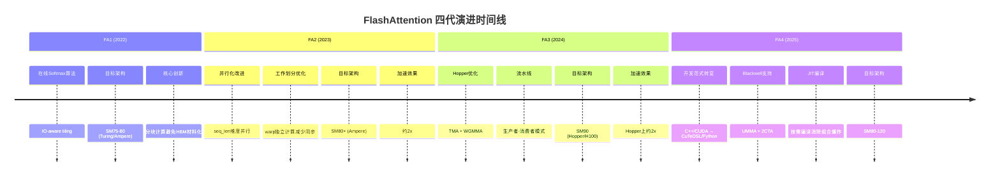
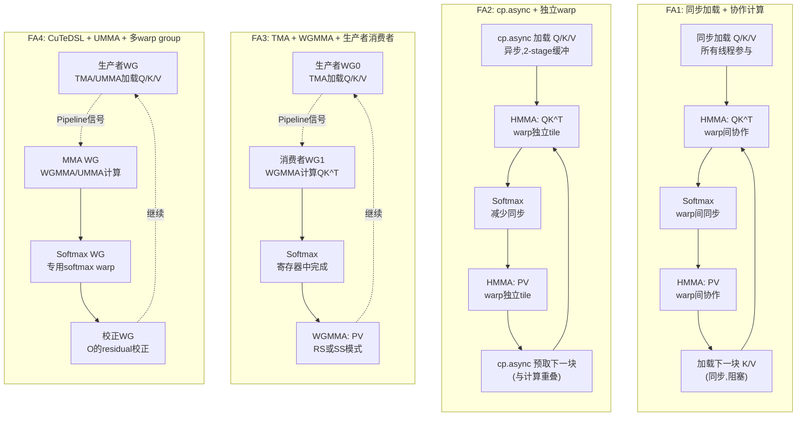
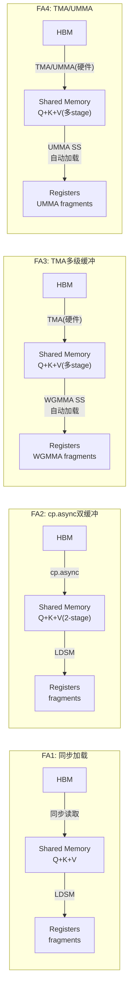
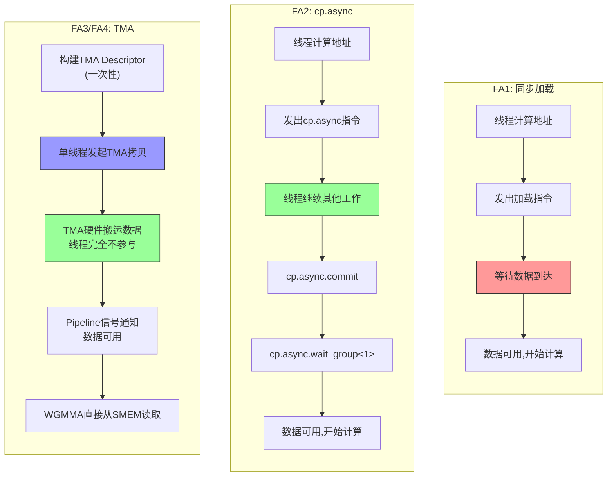
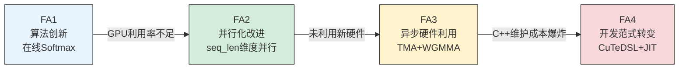

# FlashAttention 版本演进与优化对比

## 开篇：四代 FlashAttention 的演进脉络

本篇对比分析 FlashAttention 从 FA1 到 FA2、FA3、FA4 各版本的核心优化点及其背后的技术动因。FlashAttention 的每一代演进都不是简单的功能堆叠，而是对硬件特性更深层次利用的结果。从 FA1 的在线 Softmax 算法创新，到 FA2 的并行化改进，到 FA3 对 Hopper 新硬件的充分利用，再到 FA4 的开发范式革命，每一步都有明确的硬件动机和性能瓶颈驱动。

**核心结论**：每代优化都有明确的硬件动机——FA1→FA2 是**并行化改进**（解决 GPU 利用率不足），FA2→FA3 是**异步硬件利用**（释放 Hopper TMA/WGMMA 潜力），FA3→FA4 是**开发范式转变**（从 C++/CUDA 转向 CuTeDSL/Python，解决维护成本爆炸问题）。



---

## 一、FA1 → FA2 的优化（约 2x 加速）

### 1.1 并行化改进：从 batch×head 并行到 seq_len 维度并行

FA1 的内核启动配置中，grid 维度按 `batch × head` 分配 thread block，即每个 (batch, head) 对应一个 thread block。这意味着并行度上限为 `batch_size × num_heads`。在长序列场景下（如 batch=1, heads=16），并行度仅为 16，而 A100 有 108 个 SM，大量 SM 处于空闲状态。

FA2 的关键突破在于将 seq_len 维度引入并行分配。在 `csrc/flash_attn/src/flash_fwd_launch_template.h` 中可以清晰看到这一变化：

```cpp
// FA2: grid维度 = (num_m_block, b, h)
const int num_m_block = (params.seqlen_q + Kernel_traits::kBlockM - 1) / Kernel_traits::kBlockM;
dim3 grid(num_m_block, params.b, params.h);
```

这意味着 FA2 的并行度为 `batch × head × ceil(seqlen_q / kBlockM)`。以 batch=1、heads=16、seqlen=8192、kBlockM=128 为例，并行度从 16 跃升到 16 × 64 = 1024，远超 A100 的 108 个 SM，GPU 利用率从极低水平提升到接近饱和。

### 1.2 工作划分改进：从 warp 间同步到 warp 独立计算

FA1 中，每个 warp 负责计算一行注意力分数，4 个 warp 协作完成一个 tile 的计算。这种设计需要 warp 间的 `__syncwarp()` 同步来聚合结果，同步开销不可忽视。

FA2 重新设计了工作划分方式。在 `csrc/flash_attn/src/kernel_traits.h` 中，`TiledMma` 的定义体现了这一改进：

```cpp
// FA2 kernel_traits.h: TiledMma 定义
using TiledMma = TiledMMA<
    typename Base::MMA_Atom_Arch,
    Layout<Shape<Int<kNWarps>,_1,_1>>,  // kNWarps个warp沿M维度排列
    Tile<Int<16 * kNWarps>, _16, _16>>;  // 每个warp独立处理16行
```

每个 warp 独立计算一块注意力（16 行 × 16 列的 MMA tile），4 个 warp 合计处理 64 行（kBlockM=128 时为 8 个 warp 处理 128 行）。warp 之间不需要同步即可完成各自的 QK^T 和 PV 计算，只在最后聚合 O 时才需要跨 warp 通信。这大幅减少了同步开销，提升了计算吞吐。

### 1.3 数据加载改进：cp.async 异步拷贝

FA2 在 SM80+ 架构上使用了 `cp.async` 指令进行全局内存到共享内存的异步拷贝，替代了 FA1 中的同步加载方式。在 `kernel_traits.h` 中可以看到条件编译：

```cpp
// kernel_traits.h: 根据架构选择数据加载方式
using Gmem_copy_struct = std::conditional_t<
    Has_cp_async,
    SM80_CP_ASYNC_CACHEGLOBAL<cute::uint128_t>,  // SM80+: 异步拷贝
    AutoVectorizingCopyWithAssumedAlignment<128>   // SM75: 同步拷贝
>;
```

`cp.async` 允许线程发起数据搬运后立即继续执行其他指令，而不需要等待数据到达共享内存。FA2 利用这一点实现了 2-stage 流水线：在计算当前 K/V 块的同时，异步加载下一个 K/V 块到共享内存的另一个 stage，从而将数据加载延迟与计算重叠。

### 1.4 为什么需要这些优化

FA1 的核心问题在于**长序列时 GPU 利用率极低**。当 batch×head 数量较少时（这在推理场景中很常见），GPU 上百个 SM 中只有几十个在工作。FA2 通过在 seq_len 维度上切分并行，将并行度提升了数十倍，使 GPU 利用率从个位数提升到接近满载。同时，warp 独立计算减少了同步开销，cp.async 实现了计算与加载的重叠，这些改进共同带来了约 2x 的端到端加速。

### 1.5 代码对比：FA1/FA2 的内核结构

FA1/FA2 的代码位于 `csrc/flash_attn/src/` 目录下，核心文件包括：

- **`flash_fwd_kernel.h`**：前向内核实现，`compute_attn_1rowblock` 函数是核心计算逻辑，每个 thread block 处理一个 (m_block, bidb, bidh) 的 tile
- **`kernel_traits.h`**：定义了 `Flash_fwd_kernel_traits` 和 `Flash_kernel_traits`，封装了 MMA 原子操作、共享内存布局、全局内存拷贝等编译期配置
- **`flash_fwd_launch_template.h`**：内核启动模板，包含 `run_flash_fwd` 函数，负责 grid 配置和模板实例化

FA2 的实例化文件（`.cu` 文件）位于 `csrc/flash_attn/src/`，约 72 个文件，按 `hdim × dtype × causal` 组合实例化。例如 `flash_fwd_hdim128_fp16_sm80.cu`、`flash_fwd_hdim128_fp16_causal_sm80.cu` 等。

---

## 二、FA2 → FA3 的优化（Hopper 上约 2x 加速）

### 2.1 TMA 替代 cp.async：硬件级数据搬运

FA3 最重要的改进之一是使用 TMA（Tensor Memory Accelerator）替代 cp.async 进行全局内存到共享内存的数据搬运。TMA 是 Hopper 架构（SM90）新增的专用硬件单元，具有以下关键优势：

1. **零线程参与**：TMA 是一个独立的硬件单元，数据搬运完全由 TMA 硬件完成，不需要任何 CUDA 线程参与。而 cp.async 虽然是"异步"的，但仍需要线程发起拷贝指令
2. **描述符预构建**：TMA 使用预构建的 tensor descriptor 描述数据布局，一次描述即可搬运多维张量的一个 tile，而 cp.async 需要线程计算每个元素的地址
3. **多播支持**：TMA 支持将数据一次广播到 Cluster 内多个 CTA 的共享内存

在 `hopper/mainloop_fwd_sm90_tma_gmma_ws.hpp` 中可以清晰看到 TMA 的使用：

```cpp
// mainloop_fwd_sm90_tma_gmma_ws.hpp: TMA 拷贝定义
using GmemTiledCopyQ = cute::SM90_TMA_LOAD;  // Q使用TMA加载
using GmemTiledCopyKV = decltype(
    cutlass::gemm::collective::detail::sm90_cluster_shape_to_tma_atom(
        shape<0>(ClusterShape{})));  // KV使用TMA加载，支持Cluster多播
```

对比 FA2/FA3 SM80 路径中的 cp.async：

```cpp
// mainloop_fwd_sm80.hpp: cp.async 拷贝定义
using GmemCopyAtom = Copy_Atom<std::conditional_t<
    Has_cp_async,
    SM80_CP_ASYNC_CACHEGLOBAL_ZFILL<cute::uint128_t>,  // SM80: cp.async
    AutoVectorizingCopyWithAssumedAlignment<128>
>, Element>;
```

TMA 的引入释放了大量线程资源。在 FA2 中，所有线程都需要参与数据加载；在 FA3 中，TMA 硬件负责加载，线程可以专注于计算。

### 2.2 WGMMA 替代 HMMA：从 16×16 到 128×128 的矩阵乘法

FA2 使用 HMMA（Half Matrix Multiply-Accumulate）指令，每个 warp 执行 16×16×16 的矩阵乘法。FA3 使用 WGMMA（Warp Group Matrix Multiply-Accumulate），4 个 warp 组成的 warp group 协作完成更大规模的矩阵乘法。

在 `hopper/mainloop_fwd_sm90_tma_gmma_ws.hpp` 中，WGMMA 的使用通过 `GMMA::ss_op_selector` 和 `GMMA::rs_op_selector` 体现：

```cpp
// mainloop_fwd_sm90_tma_gmma_ws.hpp: WGMMA TiledMma 定义
using TiledMmaQK = decltype(cute::make_tiled_mma(
    std::conditional_t<
        !MmaQK_is_RS,
        decltype(cute::GMMA::ss_op_selector<Element, Element, ElementAccum, TileShape_MNK>()),
        decltype(cute::GMMA::rs_op_selector<Element, Element, ElementAccum, TileShape_MNK>())
    >{},
    AtomLayoutQK{}));  // AtomLayoutQK = Layout<Shape<Int<kBlockM/64>, _1, _1>>
```

对比 FA2 的 HMMA：

```cpp
// kernel_traits.h / mainloop_fwd_sm80.hpp: HMMA TiledMma 定义
using MMA_Atom_Arch = std::conditional_t<
    std::is_same_v<elem_type, cutlass::half_t>,
    MMA_Atom<SM80_16x8x16_F32F16F16F32_TN>,  // HMMA: 16x8x16
    MMA_Atom<SM80_16x8x16_F32BF16BF16F32_TN>
>;
using TiledMma = TiledMMA<
    MMA_Atom_Arch,
    Layout<Shape<Int<kNWarps>,_1,_1>>,
    Tile<Int<16 * kNWarps>, _16, _16>>;  // 每个warp 16x16
```

WGMMA 的关键区别：
- **SS 模式**（Shared-to-Shared）：两个操作数都来自共享内存，适合 QK^T 计算
- **RS 模式**（Register-to-Shared）：A 操作数在寄存器，B 操作数在共享内存，适合 PV 计算（P 在寄存器中）
- **4 warp 协作**：一个 warp group（128 线程）协作完成 128×128 或更大规模的矩阵乘法，吞吐量远超 HMMA

### 2.3 生产者-消费者流水线：数据加载与计算重叠

FA3 引入了生产者-消费者（Producer-Consumer）流水线模式，将 thread block 内的线程分为两组：

- **Warp Group 0（生产者）**：负责通过 TMA 加载 Q、K、V 到共享内存
- **Warp Group 1（消费者）**：负责执行 WGMMA 矩阵乘法和 Softmax 计算

在 `hopper/flash_fwd_kernel_sm90.h` 中可以清晰看到这一分工：

```cpp
// flash_fwd_kernel_sm90.h: 生产者-消费者分工
static constexpr uint32_t NumLoadWarpGroups = 1;
static constexpr uint32_t NumMmaWarpGroups = CUTE_STATIC_V(size(TiledMmaPV{})) / cutlass::NumThreadsPerWarpGroup;
static constexpr uint32_t MaxThreadsPerBlock = CUTE_STATIC_V(size(TiledMmaPV{})) + (NumLoadWarpGroups * cutlass::NumThreadsPerWarpGroup);

// 生产者路径 (warp_group_idx == 0)
if (warp_group_idx == 0) {  // Producer
    cutlass::arch::warpgroup_reg_dealloc<LoadRegisterRequirement>();
    // ... TMA加载Q, K, V
    mainloop.load(params.mainloop, pipeline_k, pipeline_v, pipeline_vt, smem_pipe_write,
                   shared_storage, scheduler_prefetch, seqlen_info, block_coord, work_idx);
} else {  // Consumer
    cutlass::arch::warpgroup_reg_alloc<MmaRegisterRequirement>();
    // ... WGMMA计算
    mainloop.mma(...);
}
```

生产者和消费者通过 Pipeline 同步机制协调：生产者加载完数据后发出信号，消费者等待数据就绪后开始计算。这种重叠执行使得数据加载延迟被计算时间隐藏，大幅提升了有效吞吐。

FA2 的流水线仅为 2-stage（双缓冲），所有线程既参与加载又参与计算，无法实现真正的加载-计算重叠。FA3 的生产者-消费者模式实现了真正的异步重叠。

### 2.4 寄存器分配优化

FA3 对生产者和消费者 warp group 采用了不同的寄存器分配策略：

```cpp
// flash_fwd_kernel_sm90.h: 寄存器需求
static constexpr uint32_t LoadRegisterRequirement = NumMmaWarpGroups == 1 ? 56
    : (NumMmaWarpGroups == 2 ? (Use_TMA_KV ? 24 : 40) : 32);
static constexpr uint32_t MmaRegisterRequirement = NumMmaWarpGroups == 1 ? 256
    : (NumMmaWarpGroups == 2 ? (Use_TMA_KV ? 240 : 232) : 160);
```

消费者 warp group 分配了 240 个寄存器（WGMMA 需要大量寄存器来存放累加器和操作数片段），生产者 warp group 仅分配 24 个寄存器（TMA 加载不需要太多寄存器）。这种差异化分配最大化了寄存器利用效率。

### 2.5 为什么需要这些优化

Hopper GPU（H100）新增了 TMA 和 WGMMA 两个关键硬件单元，FA2 完全没有利用这些新特性。TMA 可以将数据搬运从线程中完全卸载，WGMMA 可以将矩阵乘法吞吐提升数倍。FA3 的生产者-消费者流水线正是为了充分利用这两个硬件单元而设计的：TMA 让生产者 warp group 可以用极少的线程资源完成数据加载，WGMMA 让消费者 warp group 可以用更高的吞吐完成矩阵计算。这些改进在 H100 上带来了约 2x 的加速。

### 2.6 代码对比：FA3 的内核结构

FA3 的代码位于 `hopper/` 目录下，核心文件包括：

- **`flash_fwd_kernel_sm90.h`**：SM90 前向内核，`FlashAttnFwdSm90` 类实现生产者-消费者分工
- **`flash_fwd_kernel_sm80.h`**：SM80 兼容路径，`FlashAttnFwdSm80` 类（FA3 中也保留了 SM80 支持）
- **`mainloop_fwd_sm90_tma_gmma_ws.hpp`**：SM90 主循环，`CollectiveMainloopFwdSm90` 实现 TMA 加载和 WGMMA 计算
- **`mainloop_fwd_sm80.hpp`**：SM80 主循环，`CollectiveMainloopFwdSm80` 实现 cp.async 加载和 HMMA 计算
- **`flash_api.cpp`**：C++ API 层，负责参数设置和内核调度

FA3 的实例化文件位于 `hopper/instantiations/`，约 **451 个** `.cu` 文件！这是因为 FA3 增加了 SM90 路径、FP8 支持、Paged KV、Softcapping、PackGQA 等特性，组合爆炸导致实例化文件数量激增。

---

## 三、FA3 → FA4 的优化

### 3.1 开发范式转变：从 C++/CUDA 到 CuTeDSL/Python

FA4 最根本的变化是将内核实现从 C++/CUDA 转向 CuTeDSL（Python）。这不是简单的语言替换，而是开发范式的根本转变。

FA4 的内核代码全部用 Python 编写，使用 CuTeDSL 描述计算逻辑：

```python
# flash_attn/cute/flash_fwd.py: FA4 的Python内核基类
class FlashAttentionForwardBase:
    def __init__(
        self,
        dtype: Type[cutlass.Numeric],
        head_dim: int,
        head_dim_v: Optional[int] = None,
        qhead_per_kvhead: int = 1,
        is_causal: bool = False,
        is_local: bool = False,
        pack_gqa: bool = True,
        tile_m: int = 128,
        tile_n: int = 128,
        num_stages: int = 1,
        num_threads: int = 128,
        score_mod: Optional[cutlass.Constexpr] = None,
        mask_mod: Optional[cutlass.Constexpr] = None,
        ...
    ):
```

对比 FA3 的 C++ 内核定义：

```cpp
// hopper/flash_fwd_kernel_sm90.h: FA3 的C++内核
template <class CollectiveMainloop_, class CollectiveEpilogue_, class TileScheduler_>
class FlashAttnFwdSm90 {
    // ...
    static constexpr bool Is_causal = CollectiveMainloop::Is_causal;
    static constexpr bool Has_softcap = CollectiveMainloop::Has_softcap;
    // 大量编译期常量和模板参数
};
```

Python 的优势在于：
- **动态性**：运行时根据参数选择配置，无需编译期枚举所有组合
- **可读性**：Python 代码更易理解和维护
- **调试便利**：可以使用 Python 生态的调试和分析工具

### 3.2 Blackwell 架构支持：UMMA 与 2CTA

FA4 新增了对 Blackwell 架构（SM100/SM110）的支持，利用了两个关键新特性：

**UMMA（Unified Matrix Multiply-Accumulate）**：Blackwell 的统一矩阵乘累加指令，支持更多数据类型和更大的矩阵操作。在 `flash_attn/cute/flash_fwd_sm100.py` 中可以看到 UMMA 的使用：

```python
# flash_attn/cute/flash_fwd_sm100.py: Blackwell 前向内核
class FlashAttentionForwardSm100:
    def __init__(
        self,
        head_dim: int,
        ...
        use_2cta_instrs: bool = False,  # 2CTA指令支持
        use_clc_scheduler: bool = False,  # CLC调度器
        ...
    ):
        self.cta_group_size = 2 if self.use_2cta_instrs else 1
        self.mma_tiler_qk = (self.cta_group_size * m_block_size, n_block_size, self.head_dim_padded)
        self.cluster_shape_mn = (2, 1) if self.use_2cta_instrs else (1, 1)
```

**2CTA（Two-CTA）指令**：允许两个 CTA 协作完成更大规模的矩阵乘法。在 `flash_fwd_sm100.py` 中，`use_2cta_instrs=True` 时，cluster_shape 变为 (2, 1)，两个 CTA 协作处理 2×m_block_size 行的 Q，大幅提升了 head_dim=256 等大维度场景的性能。

FA4 还引入了 CLC（Collective Load-Compute）调度器，进一步优化了 Blackwell 上的流水线效率。

### 3.3 JIT 编译与缓存：消除组合爆炸

FA3 的最大痛点之一是实例化组合爆炸。451 个 `.cu` 文件需要预编译，编译时间长达 30 分钟以上。FA4 通过 JIT（Just-In-Time）编译彻底解决了这个问题。

在 `flash_attn/cute/interface.py` 中，FA4 的入口函数根据运行时参数动态选择和编译内核：

```python
# flash_attn/cute/interface.py: FA4 的JIT编译入口
def _flash_attn_fwd(
    q, k, v, qv=None,
    cu_seqlens_q=None, cu_seqlens_k=None,
    softmax_scale=None, causal=False,
    score_mod=None, mask_mod=None,
    ...
):
    # 运行时根据参数选择架构和配置
    compute_capability = _get_device_arch()
    # 按需构建和编译内核，无需预编译所有组合
```

JIT 编译的核心优势：
- **按需编译**：只编译当前参数组合对应的内核，无需预编译数百种组合
- **缓存机制**：编译结果缓存到磁盘，相同参数组合只需编译一次
- **零实例化文件**：FA4 不需要任何 `.cu` 实例化文件

### 3.4 可扩展性：score_mod 与 mask_mod

FA4 引入了 `score_mod` 和 `mask_mod` 两个用户自定义钩子，允许用户在不修改内核代码的情况下自定义注意力分数的修改和掩码逻辑：

```python
# flash_attn/cute/flash_fwd.py: score_mod 和 mask_mod 参数
class FlashAttentionForwardBase:
    def __init__(
        self,
        ...
        score_mod: Optional[cutlass.Constexpr] = None,  # 用户自定义分数修改
        mask_mod: Optional[cutlass.Constexpr] = None,    # 用户自定义掩码
        ...
    ):
```

在 FA3 中，添加新的注意力变体（如 ALiBi、Softcapping）需要修改 C++ 内核代码并新增实例化文件。FA4 中，用户只需提供 Python 回调函数：

```python
# 用户自定义 score_mod 示例
def my_score_mod(scores, batch_idx, head_idx, q_idx, kv_idx, aux_tensors):
    return scores * scale + bias  # 自定义缩放和偏置

# 用户自定义 mask_mod 示例
def my_mask_mod(batch_idx, head_idx, q_idx, kv_idx, aux_tensors):
    return q_idx >= kv_idx  # 自定义因果掩码
```

这种设计使得 FA4 具有极强的可扩展性，新功能可以通过用户侧代码实现，无需等待内核开发者修改。

### 3.5 为什么需要这些优化

FA3 的 C++ 实现面临严重的**维护成本问题**：

1. **组合爆炸**：451 个 `.cu` 实例化文件，每个文件对应一种 (hdim, dtype, causal, paged_kv, softcap, packgqa, sm_arch) 组合
2. **编译时间**：完整编译需要 30 分钟以上，严重影响开发迭代速度
3. **修改困难**：任何内核逻辑的修改都需要重新编译所有实例化文件
4. **扩展困难**：添加新特性（如新的注意力变体）需要大量新增实例化文件

FA4 的 CuTeDSL/Python 方案从根本上解决了这些问题：JIT 编译消除了预编译需求，Python 的动态性消除了组合爆炸，score_mod/mask_mod 提供了用户侧扩展能力。

### 3.6 代码对比：FA4 的内核结构

FA4 的代码位于 `flash_attn/cute/` 目录下，核心文件包括：

- **`interface.py`**：Python API 入口，`_flash_attn_fwd` 函数负责参数解析、架构选择和 JIT 编译调度
- **`flash_fwd.py`**：SM80/SM120 通用前向内核基类 `FlashAttentionForwardBase`
- **`flash_fwd_sm90.py`**：SM90 (Hopper) 前向内核 `FlashAttentionForwardSm90`，使用 TMA + WGMMA
- **`flash_fwd_sm100.py`**：SM100 (Blackwell) 前向内核 `FlashAttentionForwardSm100`，使用 UMMA + 2CTA
- **`pipeline.py`**：流水线同步原语的 Python 实现
- **`mask.py`**：`AttentionMask` 类，支持 score_mod 和 mask_mod
- **`softmax.py`**：Softmax 实现，包括 SM100 的 `SoftmaxSm100`

对比 FA3 的 C++ API 层 `hopper/flash_api.cpp`（约 700 行 C++ 代码处理参数设置和内核调度），FA4 的 `interface.py` 用 Python 实现了相同功能，代码更简洁且更易维护。

---

## 四、全维度对比表

| 维度 | FA1 | FA2 | FA3 | FA4 |
|------|-----|-----|-----|-----|
| 目标架构 | SM75-80 | SM80+ | SM90 | SM80-120 |
| 编程语言 | C++/CUDA | C++/CUDA | C++/CUDA | CuTeDSL/Python |
| 数据加载 | 同步 | cp.async | TMA | TMA/UMMA |
| 矩阵乘法 | HMMA | HMMA | WGMMA | WGMMA/UMMA |
| 流水线 | 无 | 2-stage | Producer-Consumer | Producer-Consumer+CLC |
| FP8 支持 | 否 | 否 | 是(前向) | 是 |
| Paged KV | 否 | 否 | 是 | 是 |
| Softcapping | 否 | 否 | 是 | 是 |
| score_mod | 否 | 否 | 否 | 是 |
| mask_mod | 否 | 否 | 否 | 是 |
| 实例化文件数 | ~30 | ~72 | ~451 | 0(JIT) |
| 编译时间 | ~5min | ~5min | ~30min | JIT 按需 |
| 并行策略 | batch×head | batch×head×seq_m | batch×head×seq_m(持久化) | batch×head×seq_m(持久化/CLC) |
| Warp 分工 | 协作计算 | 独立 tile | 生产者-消费者 | 生产者-消费者+校正 warp |
| 寄存器分配 | 统一 | 统一 | 差异化(WG0少/WG1多) | 差异化+多 warp group |
| Cluster 支持 | 否 | 否 | 是(1×1/1×2/2×1) | 是(1×1/2×1) |
| Tile 调度 | 简单 grid | 简单 grid | 持久化调度器 | 持久化/CLC 调度器 |
| Varlen 支持 | 基础 | 基础 | 完善 | 完善 |
| Split-KV | 否 | 是 | 是 | 是 |
| GQA 优化 | 否 | 否 | PackGQA | PackGQA |
| Block Sparsity | 否 | 否 | 否 | 是 |

---

## 五、各版本前向内核计算流程对比



---

## 六、各版本内存访问模式对比



**关键差异**：
- FA1：所有线程同步从 HBM 读取，加载完成才能计算
- FA2：cp.async 异步发起，2-stage 双缓冲实现加载-计算重叠
- FA3：TMA 硬件单元搬运，线程完全不参与；WGMMA 的 SS 模式直接从共享内存读取操作数
- FA4：TMA/UMMA 硬件搬运，UMMA 支持更多数据类型和更大矩阵操作

---

## 七、并行策略演进对比

```mermaid
flowchart TB
    subgraph FA1_PAR["FA1: batch×head 并行"]
        direction LR
        FA1_B0["(b=0,h=0)"] --- FA1_B1["(b=0,h=1)"] --- FA1_B2["(b=0,h=2)"] --- FA1_BN["..."]
        FA1_B0 --> FA1_SM["SM 0"]
        FA1_B1 --> FA1_SM2["SM 1"]
        FA1_B2 --> FA1_SM3["SM 2"]
        FA1_BN --> FA1_SMN["SM N"]
        FA1_IDLE["大量SM空闲!"] -.-> FA1_SMX["SM 3..107"]
    end

    subgraph FA2_PAR["FA2: batch×head×seq_m 并行"]
        direction LR
        FA2_T00["(b=0,h=0,m=0)"] --- FA2_T01["(b=0,h=0,m=1)"] --- FA2_T02["(b=0,h=0,m=2)"] --- FA2_T0N["..."]
        FA2_T10["(b=0,h=1,m=0)"] --- FA2_T11["(b=0,h=1,m=1)"] --- FA2_T12["(b=0,h=1,m=2)"] --- FA2_T1N["..."]
        FA2_T00 --> FA2_SM0["SM 0"]
        FA2_T01 --> FA2_SM1["SM 1"]
        FA2_T02 --> FA2_SM2["SM 2"]
        FA2_T10 --> FA2_SM3["SM 3"]
        FA2_T11 --> FA2_SM4["SM 4"]
        FA2_FULL["所有SM满载!"]
    end

    subgraph FA3_PAR["FA3: 持久化调度"]
        direction LR
        FA3_SCHED["Tile Scheduler\n持久化分配"] --> FA3_CTA0["CTA 0"]
        FA3_SCHED --> FA3_CTA1["CTA 1"]
        FA3_SCHED --> FA3_CTAN["CTA N"]
        FA3_CTA0 --> FA3_WG0["WG0: TMA加载"]
        FA3_CTA0 --> FA3_WG1["WG1: WGMMA计算"]
        FA3_CTA1 --> FA3_WG0B["WG0: TMA加载"]
        FA3_CTA1 --> FA3_WG1B["WG1: WGMMA计算"]
    end

    subgraph FA4_PAR["FA4: 持久化/CLC调度"]
        direction LR
        FA4_SCHED["CLC/持久化调度器"] --> FA4_CTA0["CTA 0"]
        FA4_SCHED --> FA4_CTA1["CTA 1"]
        FA4_CTA0 --> FA4_PROD0["生产者WG"]
        FA4_CTA0 --> FA4_MMA0["MMA WG"]
        FA4_CTA0 --> FA4_SOFT0["Softmax WG"]
        FA4_CTA0 --> FA4_CORR0["校正WG"]
        FA4_2CTA["2CTA: 2个CTA协作"]
    end
```



---

## 八、数据加载方式演进对比



**关键演进**：
- FA1→FA2：从阻塞等待到异步发起，实现加载-计算重叠
- FA2→FA3：从线程参与搬运到硬件自动搬运，释放线程资源
- FA3→FA4：TMA 继续使用，UMMA 在 Blackwell 上提供更高效的多 CTA 协作搬运

---

## 九、优化动机总结：每代优化的根本驱动力

### FA1→FA2：GPU 利用率（并行度不足）

FA1 的并行度受限于 `batch × head`，在长序列推理场景中 GPU 利用率极低。FA2 通过在 seq_len 维度上切分并行，将并行度提升数十倍，同时优化 warp 工作划分和异步数据加载，使 GPU 从"饿着"变为"吃饱"。这是对 **Ampere GPU 计算能力**的充分利用。

### FA2→FA3：新硬件特性（TMA/WGMMA）

Hopper GPU 新增了 TMA 和 WGMMA 两个关键硬件单元，FA2 完全没有利用。TMA 可以将数据搬运从线程中完全卸载，WGMMA 可以将矩阵乘法吞吐提升数倍。FA3 的生产者-消费者流水线正是为了充分利用这两个硬件单元而设计的。这是对 **Hopper GPU 新硬件能力**的释放。

### FA3→FA4：开发效率（C++ 维护成本）

FA3 的 C++ 实现面临严重的组合爆炸问题：451 个实例化文件、30+ 分钟编译时间、难以扩展新特性。FA4 的 CuTeDSL/Python 方案从根本上解决了这些问题：JIT 编译消除了预编译需求，Python 的动态性消除了组合爆炸，score_mod/mask_mod 提供了用户侧扩展能力。这是对 **软件工程效率**的追求。



---

## 收尾：版本演进的核心驱动力是硬件发展

回顾 FlashAttention 四代演进，可以清晰地看到一条主线：**硬件发展驱动软件优化**。

- **Turing/Ampere 时代**（FA1/FA2）：GPU 的计算能力已经足够强大，但传统注意力算法的内存访问模式导致大量时间浪费在 HBM 读写上。FA1 的在线 Softmax 算法解决了 IO 瓶颈，FA2 的并行化改进解决了计算资源利用率问题。
- **Hopper 时代**（FA3）：GPU 新增了 TMA 和 WGMMA 硬件单元，这些单元提供了数量级的性能提升潜力，但需要全新的编程模式（生产者-消费者流水线）才能充分利用。FA3 正是对这些新硬件特性的响应。
- **Blackwell 时代**（FA4）：GPU 继续演进，新增 UMMA 和 2CTA 指令。但更重要的是，C++ 模板元编程的组合爆炸已经无法支撑快速迭代。FA4 的 CuTeDSL/Python 方案不仅支持了新硬件，更解决了软件工程层面的根本问题。

每一代优化的背后，都是对硬件特性更深层理解的结果。FlashAttention 的演进史，本质上是一部**如何更好地利用 GPU 硬件**的历史。从同步到异步，从线程搬运到硬件搬运，从预编译到 JIT，每一步都是对硬件-软件协同设计的更优解。未来的 FlashAttention 演进，仍将遵循这一规律：新的硬件能力催生新的优化机会，而软件工程的需求推动开发范式的变革。

---

**关键源文件参考**：

| 版本 | 文件路径 | 说明 |
|------|---------|------|
| FA1/FA2 | `csrc/flash_attn/src/flash_fwd_kernel.h` | 前向内核核心计算逻辑 |
| FA1/FA2 | `csrc/flash_attn/src/kernel_traits.h` | MMA 原子操作、内存布局、拷贝策略定义 |
| FA1/FA2 | `csrc/flash_attn/src/flash_fwd_launch_template.h` | 内核启动模板和 grid 配置 |
| FA1/FA2 | `csrc/flash_attn/flash_api.cpp` | C++ API 层 |
| FA3 | `hopper/flash_fwd_kernel_sm90.h` | SM90 前向内核（生产者-消费者） |
| FA3 | `hopper/flash_fwd_kernel_sm80.h` | SM80 兼容路径 |
| FA3 | `hopper/mainloop_fwd_sm90_tma_gmma_ws.hpp` | SM90 主循环（TMA+WGMMA） |
| FA3 | `hopper/mainloop_fwd_sm80.hpp` | SM80 主循环（cp.async+HMMA） |
| FA3 | `hopper/flash_api.cpp` | FA3 C++ API 层 |
| FA4 | `flash_attn/cute/interface.py` | FA4 Python API 入口（JIT 编译调度） |
| FA4 | `flash_attn/cute/flash_fwd.py` | SM80/SM120 通用前向内核基类 |
| FA4 | `flash_attn/cute/flash_fwd_sm90.py` | SM90 (Hopper) Python 内核 |
| FA4 | `flash_attn/cute/flash_fwd_sm100.py` | SM100 (Blackwell) Python 内核 |
| FA4 | `flash_attn/cute/pipeline.py` | 流水线同步原语 |
| FA4 | `flash_attn/cute/mask.py` | AttentionMask（score_mod/mask_mod） |
