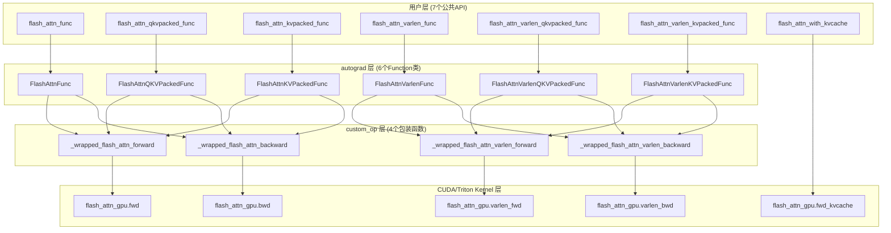
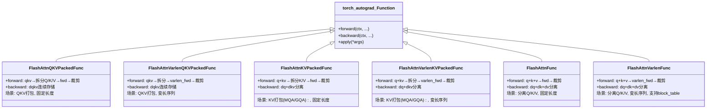
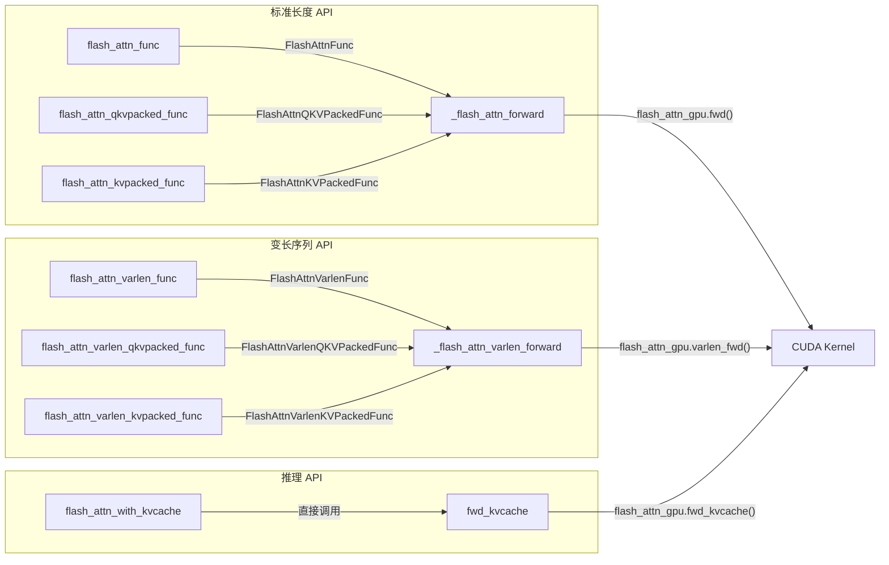
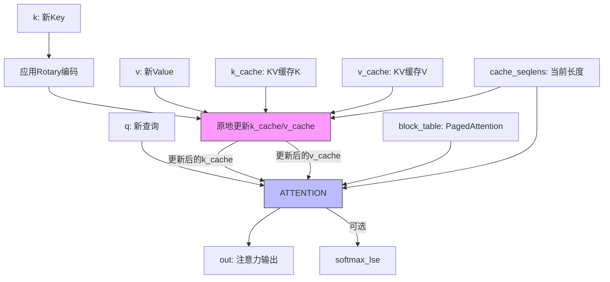
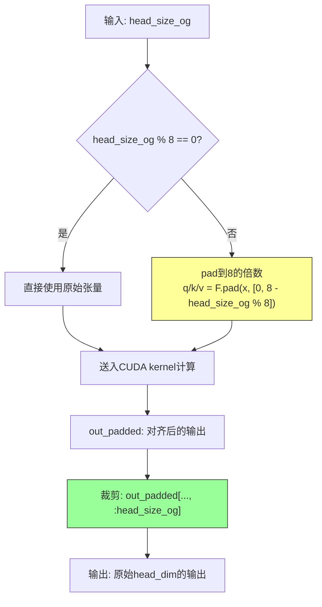

# FA2 Python 接口层深度分析

## 【总】开篇

本篇分析 FlashAttention2（FA2）的 Python 接口层，源文件为 `/workspace/flash_attn/flash_attn_interface.py`（共 1627 行）。

**核心结论**：FA2 的 Python 接口层通过 **6 个 `autograd.Function` 类**封装前向/反向逻辑，提供 **7 个公共 API 函数**覆盖所有使用场景（标准注意力、QKV 打包、KV 打包、变长序列、KV Cache 推理），并通过 `custom_op` / `register_fake` 机制支持 `torch.compile`。整个设计层次分明：用户 API → autograd.Function → custom_op 包装 → CUDA/Triton kernel，实现了 PyTorch 生态的无缝集成。

---

## 【分】主体

### 1. CUDA 后端选择机制

FA2 支持两种 GPU 后端：NVIDIA CUDA 和 AMD ROCm（Triton 实现）。选择逻辑位于文件第 12-23 行：

```python
USE_TRITON_ROCM = os.getenv("FLASH_ATTENTION_TRITON_AMD_ENABLE", "FALSE") == "TRUE"
if not USE_TRITON_ROCM and getattr(torch.version, 'hip', None) is not None:
    try:
        import flash_attn_2_cuda
    except ImportError:
        warnings.warn("flash_attn_2_cuda (which has ROCm/HIP kernels) not found, falling back to Triton implementation")
        USE_TRITON_ROCM = True

if USE_TRITON_ROCM:
    from aiter.ops.triton._triton_kernels.flash_attn_triton_amd import flash_attn_2 as flash_attn_gpu
else:
    import flash_attn_2_cuda as flash_attn_gpu
```

**选择策略**：
1. 首先检查环境变量 `FLASH_ATTENTION_TRITON_AMD_ENABLE`，若为 `"TRUE"` 则强制使用 Triton ROCm 后端
2. 若未强制启用 Triton，且当前是 HIP 环境（`torch.version.hip` 不为 None），尝试导入 `flash_attn_2_cuda`（ROCm/HIP 编译的 CUDA kernel）
3. 若 HIP 环境下导入 `flash_attn_2_cuda` 失败，回退到 Triton 实现并发出警告
4. 非 HIP 环境（即 NVIDIA CUDA）直接导入 `flash_attn_2_cuda`

最终统一为 `flash_attn_gpu` 别名，后续所有底层调用均通过此别名进行，实现了后端透明化。

### 2. 辅助函数

#### 2.1 `maybe_contiguous()` — 确保张量内存连续

定义于第 27-28 行：

```python
def maybe_contiguous(x):
    return x.contiguous() if x is not None and x.stride(-1) != 1 else x
```

**逻辑**：若张量 `x` 不为 `None` 且最后一个维度的 stride 不为 1（即最后一个维度在内存中不连续），则调用 `.contiguous()` 使其连续。CUDA kernel 要求输入张量的最后一个维度（head_dim）在内存中连续，此函数以最小代价保证这一前提。`stride(-1) == 1` 是判断最内层维度连续性的高效方式。

#### 2.2 `_get_block_size_n()` — 根据GPU架构和head_dim确定block大小

定义于第 31-54 行。此函数确定 CUDA kernel 中沿序列长度方向的 block 大小，需与 CUDA kernel 中的 block 大小保持一致。

**决策逻辑**：
- `head_dim <= 32`：返回 128
- `head_dim <= 64`：无 dropout 时返回 128，有 dropout 时返回 64
- `head_dim <= 96`：返回 64
- `head_dim <= 128`：
  - SM8x（sm86/sm89，如 RTX 3090/4090）：无 dropout 且 causal 时返回 64，否则返回 32
  - 其他架构（含 SM80/A100、SM90/H100）：无 dropout 时返回 64，有 dropout 时返回 32
- `head_dim <= 192/224/256`：返回 64

**关键洞察**：head_dim 越大，每个线程处理的元素越多，因此需要更小的 block 来控制寄存器/共享内存使用。SM8x 架构的共享内存较小，在 head_dim=128 且同时有 dropout 和 causal 时，只能用 32 的 block 大小。

#### 2.3 `round_multiple()` — 对齐到块的倍数

定义于第 57-58 行：

```python
def round_multiple(x, m):
    return (x + m - 1) // m * m
```

经典的向上取整到 `m` 倍数的公式。在 `register_fake` 函数中用于将序列长度对齐到 128 的倍数，以匹配 CUDA kernel 中按 128 对齐的内存布局。

### 3. torch.compile 支持：custom_op / register_fake 机制

FA2 通过 PyTorch 2.4+ 引入的 `custom_op` 和 `register_fake` API 支持 `torch.compile`。兼容性处理位于第 61-81 行：

```python
if torch.__version__ >= "2.4.0":
    _torch_custom_op_wrapper = torch.library.custom_op
    _torch_register_fake_wrapper = torch.library.register_fake
else:
    # 提供 noop 包装器，使代码在旧版 PyTorch 上也能运行
    def noop_custom_op_wrapper(name, fn=None, /, *, mutates_args, device_types=None, schema=None):
        def wrap(func):
            return func
        if fn is None:
            return wrap
        return fn
    ...
```

**设计要点**：
- **`custom_op`**：将函数注册为 PyTorch 自定义算子，使 `torch.compile` 能识别并正确处理。关键参数 `mutates_args` 声明哪些参数会被原地修改（如反向传播中的 `dq, dk, dv`）
- **`register_fake`**：为自定义算子注册"假"实现（meta kernel），仅计算输出形状/类型而不执行实际计算。这是 `torch.compile` 进行图追踪时所必需的
- **向后兼容**：PyTorch < 2.4 时，noop 包装器直接返回原函数，不影响功能但失去 `torch.compile` 支持

每个底层 CUDA 调用函数都有三个版本：
1. **实际实现**：如 `_flash_attn_forward()`（第 84-114 行），调用 `flash_attn_gpu.fwd()`
2. **fake 实现**：如 `_flash_attn_forward_fake()`（第 117-144 行），仅构造形状正确的空张量
3. **wrapped 版本**：如 `_wrapped_flash_attn_forward`（第 147-150 行），PyTorch >= 2.4 时使用 `torch.ops.flash_attn._flash_attn_forward`，否则直接使用原函数

### 4. 底层 CUDA 调用

FA2 定义了 4 个底层 CUDA 调用函数，分别对应标准/变长 × 前向/反向的四种组合：

#### 4.1 `_flash_attn_forward()` → `flash_attn_gpu.fwd()`（第 84-114 行）

参数：`q, k, v, dropout_p, softmax_scale, causal, window_size_left, window_size_right, softcap, alibi_slopes, return_softmax`

返回：`(out, softmax_lse, S_dmask, rng_state)`

调用前通过 `maybe_contiguous` 确保 Q/K/V 连续。`flash_attn_gpu.fwd()` 的第 4 个参数为 `None`（对应 cu_seqlens_q，标准模式不需要），最后两个参数分别为 `return_softmax` 和 `None`（对应 rng_state，由 kernel 内部生成）。

#### 4.2 `_flash_attn_varlen_forward()` → `flash_attn_gpu.varlen_fwd()`（第 153-203 行）

参数在标准前向基础上增加：`cu_seqlens_q, cu_seqlens_k, max_seqlen_q, max_seqlen_k`，以及 `block_table, leftpad_k, seqused_k, zero_tensors, num_splits` 等变长特有参数。

返回：`(out, softmax_lse, S_dmask, rng_state)`

varlen_fwd 支持更多高级特性：`block_table` 用于 PagedAttention 风格的分页 KV 缓存，`leftpad_k` 支持左侧填充，`seqused_k` 可独立控制每个序列实际使用的 K 长度，`num_splits` 控制是否将 KV 分片并行处理。

#### 4.3 `_flash_attn_backward()` → `flash_attn_gpu.bwd()`（第 252-301 行）

参数：`dout, q, k, v, out, softmax_lse, dq, dk, dv, dropout_p, softmax_scale, causal, window_size_left, window_size_right, softcap, alibi_slopes, deterministic, rng_state`

返回：`softmax_d`

**关键设计**：`mutates_args=("dq", "dk", "dv")`，即 dq/dk/dv 是原地修改的输出参数。这避免了 `torch.compile` 图追踪时的额外拷贝，梯度直接写入预分配的缓冲区。`rng_state` 用于在反向传播时重现前向的 dropout 模式。

#### 4.4 `_flash_attn_varlen_backward()` → `flash_attn_gpu.varlen_bwd()`（第 347-408 行）

参数在标准反向基础上增加：`cu_seqlens_q, cu_seqlens_k, max_seqlen_q, max_seqlen_k, zero_tensors`

返回：`softmax_d`

同样使用 `mutates_args=("dq", "dk", "dv")` 原地写入梯度。

### 5. 6 个 autograd.Function 类详细分析

6 个类形成 2×3 的矩阵：标准/变长 × QKV打包/KV打包/分离QKV。它们都继承自 `torch.autograd.Function`，实现 `forward` 和 `backward` 静态方法。

#### 5.1 `FlashAttnQKVPackedFunc`（第 461-540 行）

**场景**：Q、K、V 已打包为单个张量 `qkv: (batch, seqlen, 3, nheads, headdim)`

**forward**（第 462-508 行）：
- 从 `qkv` 中分离出 Q/K/V：`qkv[:, :, 0]`, `qkv[:, :, 1]`, `qkv[:, :, 2]`，并 `.detach()` 断开计算图
- 若 `softmax_scale` 为 None，默认 `head_dim^(-0.5)`
- 若 `head_size_og % 8 != 0`，对 Q/K/V 进行 8 字节对齐 padding
- 调用 `_wrapped_flash_attn_forward()` 执行前向计算
- 若需要梯度，保存 `q, k, v, out_padded, softmax_lse, rng_state` 及相关参数到 ctx
- 裁剪输出：`out_padded[..., :head_size_og]` 去除 padding

**backward**（第 510-540 行）：
- 恢复保存的张量
- 预分配 `dqkv` 张量，形状为 `q.shape[:-2] + (3, *q.shape[-2:])`
- 若需要，对 `dout` 进行同样的 8 字节对齐 padding
- 调用 `_wrapped_flash_attn_backward()`，将 `dqkv[:, :, 0/1/2]` 作为 dq/dk/dv 传入
- 裁剪梯度：`dqkv[..., :dout.shape[-1]]`
- 返回 10 个值（对应 forward 的 10 个参数），非张量参数返回 None

**优势**：QKV 打包后，反向传播中 dq/dk/dv 连续存储在 `dqkv` 中，避免了显式拼接梯度。

#### 5.2 `FlashAttnVarlenQKVPackedFunc`（第 543-634 行）

**场景**：变长序列 + QKV 打包，`qkv: (total, 3, nheads, headdim)`

**forward**（第 544-598 行）：
- 与 `FlashAttnQKVPackedFunc` 类似，但：
  - Q/K/V 从 `qkv[:, 0/1/2]` 提取（注意维度差异：varlen 没有 seqlen 维度）
  - 调用 `_wrapped_flash_attn_varlen_forward()`，传入 `cu_seqlens`（Q 和 K 共享同一 cu_seqlens）和 `max_seqlen`
  - 额外保存 `cu_seqlens` 和 `max_seqlen` 到 ctx

**backward**（第 600-634 行）：
- 调用 `_wrapped_flash_attn_varlen_backward()`，传入 `cu_seqlens` 和 `max_seqlen`
- 返回 12 个值

#### 5.3 `FlashAttnKVPackedFunc`（第 637-721 行）

**场景**：KV 打包，支持 MQA/GQA。`q: (batch, seqlen, nheads, headdim)`, `kv: (batch, seqlen, 2, nheads_k, headdim)`

**forward**（第 638-687 行）：
- 梯度判断条件：`any(x.requires_grad for x in [q, kv])`，因为 Q 和 KV 是分离的
- 从 `kv` 中分离 K/V：`kv[:, :, 0]`, `kv[:, :, 1]`
- 调用 `_wrapped_flash_attn_forward()`（标准前向，非 varlen）

**backward**（第 689-721 行）：
- 分别预分配 `dq` 和 `dkv`
- `dkv` 形状为 `k.shape[:-2] + (2, *k.shape[-2:])`
- 调用 `_wrapped_flash_attn_backward()`，传入 `dq` 和 `dkv[:, :, 0/1]`
- 分别裁剪 `dq` 和 `dkv`
- 返回 11 个值

**MQA/GQA 支持**：当 `nheads_k < nheads` 时，K/V 的 head 数少于 Q，实现了多查询/分组查询注意力。

#### 5.4 `FlashAttnVarlenKVPackedFunc`（第 724-825 行）

**场景**：变长序列 + KV 打包。`q: (total_q, nheads, headdim)`, `kv: (total_k, 2, nheads_k, headdim)`

**forward**（第 725-787 行）：
- Q 和 K 可有不同的 `cu_seqlens` 和 `max_seqlen`（支持 Q/K 序列长度不同）
- 调用 `_wrapped_flash_attn_varlen_forward()`
- 保存 `cu_seqlens_q, cu_seqlens_k, max_seqlen_q, max_seqlen_k` 到 ctx

**backward**（第 789-825 行）：
- 调用 `_wrapped_flash_attn_varlen_backward()`
- 返回 15 个值

#### 5.5 `FlashAttnFunc`（第 828-911 行）

**场景**：分离的 Q/K/V，最通用的接口。`q/k/v: (batch, seqlen, nheads/nheads_k, headdim)`

**forward**（第 829-878 行）：
- 梯度判断：`any(x.requires_grad for x in [q, k, v])`
- 直接对 Q/K/V 分别进行 padding
- 调用 `_wrapped_flash_attn_forward()`

**backward**（第 880-911 行）：
- 分别预分配 `dq, dk, dv` 三个独立张量
- 调用 `_wrapped_flash_attn_backward()`
- 分别裁剪三个梯度
- 返回 12 个值

#### 5.6 `FlashAttnVarlenFunc`（第 914-1016 行）

**场景**：变长序列 + 分离 Q/K/V，最灵活的接口。支持 `block_table`（PagedAttention）。

**forward**（第 915-979 行）：
- 唯一支持 `block_table` 参数的 autograd.Function
- 调用 `_wrapped_flash_attn_varlen_forward()`，传入 `block_table`

**backward**（第 981-1016 行）：
- 调用 `_wrapped_flash_attn_varlen_backward()`
- 返回 17 个值

### 6. 7 个公共 API 函数详细分析

每个公共 API 函数都是对对应 `autograd.Function.apply()` 的薄包装，额外传入 `torch.is_grad_enabled()` 以优化推理时的计算。

#### 6.1 `flash_attn_qkvpacked_func()`（第 1019-1075 行）

```python
def flash_attn_qkvpacked_func(qkv, dropout_p=0.0, softmax_scale=None,
    causal=False, window_size=(-1, -1), softcap=0.0, alibi_slopes=None,
    deterministic=False, return_attn_probs=False)
```

- 输入：`qkv: (batch_size, seqlen, 3, nheads, headdim)`
- 输出：`out: (batch_size, seqlen, nheads, headdim)`
- 内部调用：`FlashAttnQKVPackedFunc.apply(qkv, dropout_p, softmax_scale, causal, window_size, softcap, alibi_slopes, deterministic, return_attn_probs, torch.is_grad_enabled())`
- 适用场景：Q/K/V 来自同一线性投影（如标准 MHA），打包后减少内存访问

#### 6.2 `flash_attn_kvpacked_func()`（第 1078-1153 行）

```python
def flash_attn_kvpacked_func(q, kv, dropout_p=0.0, softmax_scale=None,
    causal=False, window_size=(-1, -1), softcap=0.0, alibi_slopes=None,
    deterministic=False, return_attn_probs=False)
```

- 输入：`q: (batch_size, seqlen, nheads, headdim)`, `kv: (batch_size, seqlen, 2, nheads_k, headdim)`
- 输出：`out: (batch_size, seqlen, nheads, headdim)`
- 内部调用：`FlashAttnKVPackedFunc.apply(...)`
- 适用场景：MQA/GQA，K/V head 数少于 Q head 数

#### 6.3 `flash_attn_func()`（第 1156-1230 行）

```python
def flash_attn_func(q, k, v, dropout_p=0.0, softmax_scale=None,
    causal=False, window_size=(-1, -1), softcap=0.0, alibi_slopes=None,
    deterministic=False, return_attn_probs=False)
```

- 输入：分离的 `q, k, v`
- 输出：`out: (batch_size, seqlen, nheads, headdim)`
- 内部调用：`FlashAttnFunc.apply(...)`
- 适用场景：最通用接口，Q/K/V 来自不同投影或需要独立操作

#### 6.4 `flash_attn_varlen_qkvpacked_func()`（第 1233-1296 行）

```python
def flash_attn_varlen_qkvpacked_func(qkv, cu_seqlens, max_seqlen,
    dropout_p=0.0, softmax_scale=None, causal=False, window_size=(-1, -1),
    softcap=0.0, alibi_slopes=None, deterministic=False, return_attn_probs=False)
```

- 输入：`qkv: (total, 3, nheads, headdim)`, `cu_seqlens: (batch_size + 1,)`, `max_seqlen: int`
- 输出：`out: (total, nheads, headdim)`
- 内部调用：`FlashAttnVarlenQKVPackedFunc.apply(...)`
- 适用场景：批量处理不同长度的序列，避免 padding 浪费

#### 6.5 `flash_attn_varlen_kvpacked_func()`（第 1299-1388 行）

```python
def flash_attn_varlen_kvpacked_func(q, kv, cu_seqlens_q, cu_seqlens_k,
    max_seqlen_q, max_seqlen_k, dropout_p=0.0, softmax_scale=None,
    causal=False, window_size=(-1, -1), softcap=0.0, alibi_slopes=None,
    deterministic=False, return_attn_probs=False)
```

- 输入：`q: (total_q, nheads, headdim)`, `kv: (total_k, 2, nheads_k, headdim)`, Q/K 各自的 cu_seqlens 和 max_seqlen
- 输出：`out: (total, nheads, headdim)`
- 内部调用：`FlashAttnVarlenKVPackedFunc.apply(...)`
- 适用场景：变长序列 + MQA/GQA

#### 6.6 `flash_attn_varlen_func()`（第 1391-1482 行）

```python
def flash_attn_varlen_func(q, k, v, cu_seqlens_q, cu_seqlens_k,
    max_seqlen_q, max_seqlen_k, dropout_p=0.0, softmax_scale=None,
    causal=False, window_size=(-1, -1), softcap=0.0, alibi_slopes=None,
    deterministic=False, return_attn_probs=False, block_table=None)
```

- 输入：分离的 `q, k, v`，Q/K 各自的 cu_seqlens 和 max_seqlen，可选 `block_table`
- 输出：`out: (total, nheads, headdim)`
- 内部调用：`FlashAttnVarlenFunc.apply(...)`
- 适用场景：最灵活的变长接口，支持 PagedAttention

#### 6.7 `flash_attn_with_kvcache()`（第 1485-1627 行）

详见第 8 节专门分析。

### 7. head_dim 对齐处理：8 字节对齐 padding 逻辑

CUDA kernel 要求 `head_dim` 是 8 的倍数（即 8 字节对齐，对于 fp16/bf16 来说就是 4 个元素）。所有 6 个 autograd.Function 的 forward 和 backward 方法中都包含相同的对齐逻辑。

**forward 中的 padding**（以 `FlashAttnFunc` 为例，第 850-854 行）：

```python
head_size_og = q.size(3)
if head_size_og % 8 != 0:
    q = torch.nn.functional.pad(q, [0, 8 - head_size_og % 8])
    k = torch.nn.functional.pad(k, [0, 8 - head_size_og % 8])
    v = torch.nn.functional.pad(v, [0, 8 - head_size_og % 8])
```

**forward 中的裁剪**（第 877 行）：

```python
out = out_padded[..., :head_size_og]
```

**backward 中的 padding**（第 886-887 行）：

```python
if head_size_og % 8 != 0:
    dout_padded = torch.nn.functional.pad(dout, [0, 8 - head_size_og % 8])
```

**backward 中的裁剪**（第 908-910 行）：

```python
dq = dq[..., : dout.shape[-1]]
dk = dk[..., : dout.shape[-1]]
dv = dv[..., : dout.shape[-1]]
```

**完整流程**：原始 head_dim → 检测是否 8 的倍数 → 若不是则 pad 到 8 的倍数 → 送入 CUDA kernel → 输出裁剪回原始 head_dim。反向传播时对 dout 做同样的 padding，对 dq/dk/dv 做同样的裁剪。这保证了用户可以传入任意 head_dim（如 48、80 等），而 CUDA kernel 始终处理对齐后的维度。

### 8. KV Cache 推理：`flash_attn_with_kvcache` 完整分析

`flash_attn_with_kvcache()`（第 1485-1627 行）是 FA2 专为自回归推理设计的 API，**不支持反向传播**。

**完整参数列表**：

| 参数 | 形状 | 说明 |
|------|------|------|
| `q` | `(batch_size, seqlen, nheads, headdim)` | 查询张量 |
| `k_cache` | `(batch_size_cache, seqlen_cache, nheads_k, headdim)` 或 `(num_blocks, page_block_size, nheads_k, headdim)` | KV 缓存的 K 部分 |
| `v_cache` | 同 `k_cache` | KV 缓存的 V 部分 |
| `k` | `(batch_size, seqlen_new, nheads_k, headdim)` | 新的 K 值（可选） |
| `v` | 同 `k` | 新的 V 值（可选） |
| `rotary_cos` | `(seqlen_ro, rotary_dim / 2)` | 旋转位置编码 cos 值 |
| `rotary_sin` | 同 `rotary_cos` | 旋转位置编码 sin 值 |
| `cache_seqlens` | `int` 或 `(batch_size,)` | KV 缓存当前序列长度 |
| `cache_batch_idx` | `(batch_size,)` | KV 缓存批次索引 |
| `cache_leftpad` | `(batch_size,)` | KV 缓存左侧填充 |
| `block_table` | `(batch_size, max_num_blocks_per_seq)` | PagedAttention 块表 |
| `softmax_scale` | `float` | 缩放因子 |
| `causal` | `bool` | 因果掩码 |
| `window_size` | `(left, right)` | 滑动窗口大小 |
| `softcap` | `float` | softcap 注意力 |
| `rotary_interleaved` | `bool` | 旋转编码是否交错 |
| `alibi_slopes` | `(nheads,)` 或 `(batch_size, nheads)` | ALiBi 偏置 |
| `num_splits` | `int` | KV 分片数 |
| `return_softmax_lse` | `bool` | 是否返回 logsumexp |

**核心逻辑**（第 1593-1627 行）：

1. **连续性检查**：断言 `k_cache` 和 `v_cache` 的最后一个维度连续（`stride(-1) == 1`）
2. **连续性保证**：对 `q, k, v` 调用 `maybe_contiguous()`
3. **默认缩放**：`softmax_scale` 为 None 时默认 `head_dim^(-0.5)`
4. **cache_seqlens 标量转张量**：若 `cache_seqlens` 是 int，扩展为 `(batch_size,)` 的张量
5. **调用底层**：`flash_attn_gpu.fwd_kvcache()`，这是唯一不通过 custom_op 包装的底层调用（因为不支持反向传播，不需要 torch.compile 的特殊处理）
6. **返回值**：默认只返回 `out`，若 `return_softmax_lse=True` 则额外返回 `softmax_lse`

**KV Cache 更新机制**：若传入 `k` 和 `v`，`fwd_kvcache` kernel 会在计算注意力之前，将新的 K/V 值原地写入 `k_cache`/`v_cache` 中 `cache_seqlens` 指定的位置，实现"更新缓存+计算注意力"一步完成。

**旋转位置编码集成**：若传入 `rotary_cos` 和 `rotary_sin`，kernel 会在写入缓存前对 K 应用旋转编码，对 Q 也会根据 causal/local 条件应用旋转编码。

**PagedAttention 支持**：通过 `block_table` 参数，KV 缓存可以使用非连续的内存布局（分页），这是 vLLM 等推理框架的核心特性。

---

### 配图

#### 图1：API 层次结构图



#### 图2：6 个 autograd.Function 类继承关系图



#### 图3：7 个公共 API 调用路径图



#### 图4：KV Cache 推理数据流图



#### 图5：head_dim 对齐处理流程图



---

## 【总】收尾

FA2 的 Python 接口层设计精巧，体现了以下架构智慧：

1. **分层解耦**：公共 API → autograd.Function → custom_op → CUDA kernel，每层职责清晰。用户只需关心 7 个高层 API，底层复杂性被完全封装
2. **autograd.Function 无缝集成**：通过 `torch.autograd.Function` 的 `forward`/`backward` 机制，FA2 自动融入 PyTorch 的自动微分系统，用户无需手动管理梯度计算
3. **性能优化意识**：QKV 打包避免反向传播中的梯度拼接；`maybe_contiguous` 最小化内存拷贝；`is_grad_enabled` 在推理时跳过不必要的中间态保存
4. **torch.compile 前瞻**：通过 `custom_op`/`register_fake` 机制，FA2 在 PyTorch 2.4+ 上完全支持 `torch.compile` 图编译优化，同时保持向后兼容
5. **8 字节对齐 padding**：统一处理非标准 head_dim，使 CUDA kernel 只需处理对齐情况，简化 kernel 逻辑
6. **KV Cache 一体化**：`flash_attn_with_kvcache` 将缓存更新、旋转编码、注意力计算三合一，单 kernel 完成推理全流程，最大化推理吞吐

这种"接口简洁、内层精细"的设计哲学，使得 FA2 既易于使用又极致高效，成为大模型训练和推理的事实标准注意力实现。
