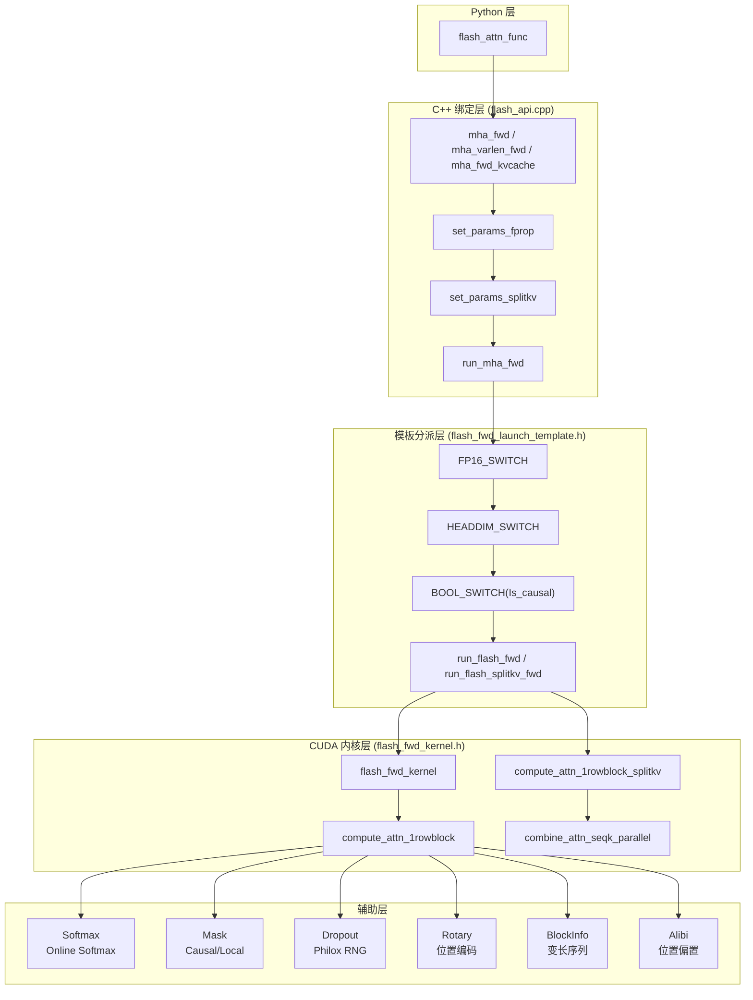
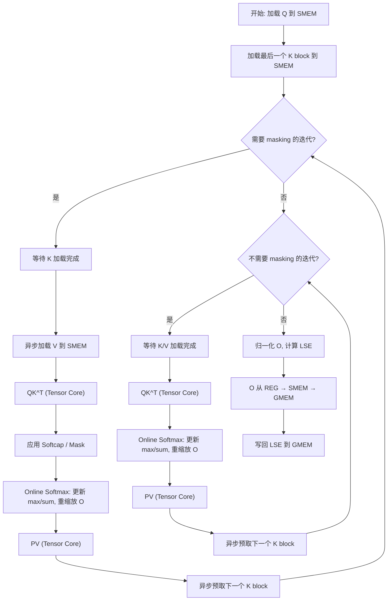
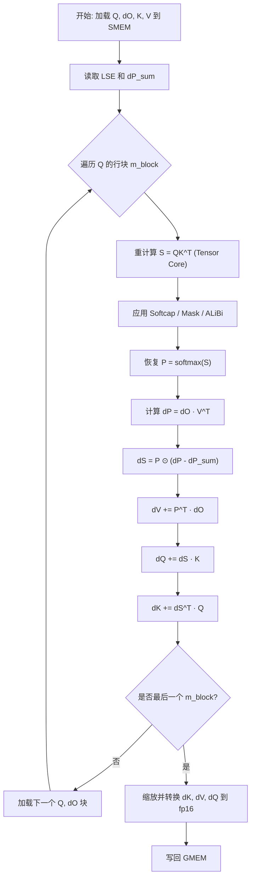
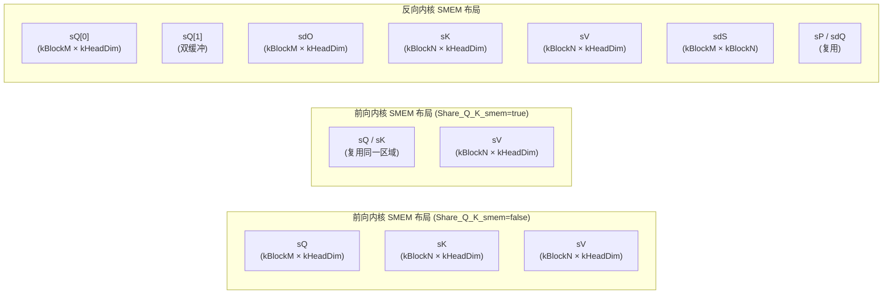
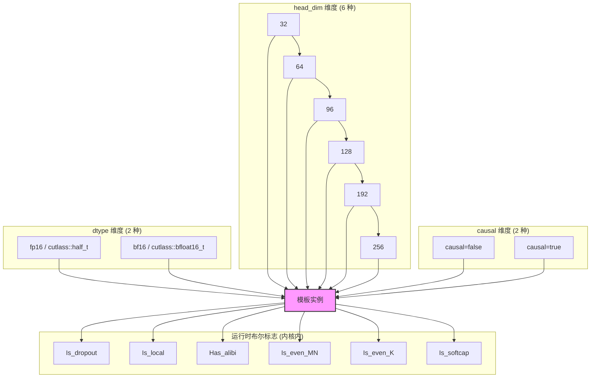

# FA2 CUDA 内核层深度分析

## 【总】开篇

本篇分析 FlashAttention-2（FA2）的 CUDA 内核层实现，这是整个项目最核心、最精巧的层次。FA2 的极致性能并非来自单一的优化技巧，而是模板特化、Online Softmax、重计算、Shared Memory 管理等多重设计决策的协同结果。

**核心结论：模板特化实现 head_dim × dtype × causal 组合优化、Online Softmax 和重计算是两个最关键的设计决策。** 模板特化将运行时分支转化为编译时常量，消除了内核中的条件判断开销；Online Softmax 使得注意力计算可以在有限 Shared Memory 中以分块方式完成，无需物化完整的 N×N 注意力矩阵；重计算策略在反向传播时用计算换显存，避免了存储中间注意力矩阵的巨大开销。三者协同，使 FA2 在数学等价的前提下实现了接近理论峰值的显存带宽利用率。

---

## 【分】主体

### 1. flash_api.cpp：Python-C++ 绑定层

`flash_api.cpp` 是 FA2 的入口层，通过 pybind11 将 C++ 内核函数暴露给 Python。它负责参数校验、内存分配、参数结构体填充和内核启动调度。

#### 1.1 `set_params_fprop()`：前向参数结构体填充

该函数将 Python 层传入的张量和标量参数打包为 `Flash_fwd_params` 结构体，供内核直接使用：

```cpp
void set_params_fprop(Flash_fwd_params &params,
                      const size_t b, const size_t seqlen_q, const size_t seqlen_k,
                      const size_t seqlen_q_rounded, const size_t seqlen_k_rounded,
                      const size_t h, const size_t h_k,
                      const size_t d, const size_t d_rounded,
                      const at::Tensor q, const at::Tensor k, const at::Tensor v,
                      at::Tensor out, /* ... */) {
    params = {};  // 清零
    params.is_bf16 = q.dtype() == torch::kBFloat16;
    params.q_ptr = q.data_ptr();
    params.q_row_stride = q.stride(-3);
    params.q_head_stride = q.stride(-2);
    // ... K, V, O 的指针和步长
    params.scale_softmax = softmax_scale;
    params.scale_softmax_log2 = softmax_scale * M_LOG2E;  // 预计算 log2 域缩放
    params.p_dropout = 1.f - p_dropout;
    params.p_dropout_in_uint8_t = uint8_t(std::floor(params.p_dropout * 255.0));
    params.is_causal = window_size_left < 0 && window_size_right == 0;
    // ...
}
```

关键设计点：
- **步长以元素为单位**（非字节），方便内核中直接做指针算术
- **`scale_softmax_log2`** 预计算 `softmax_scale * log2(e)`，内核中使用 `exp2f` 代替 `expf`，利用 FMA 指令加速
- **`p_dropout_in_uint8_t`** 将 dropout 概率转为 uint8 阈值，内核中直接与随机数比较，避免浮点比较
- **`is_causal`** 由 `window_size_left < 0 && window_size_right == 0` 推导，causal 是 local attention 的特例

#### 1.2 `set_params_dgrad()`：反向参数填充

反向参数填充复用了前向的 `set_params_fprop()`，再追加梯度相关的指针和步长：

```cpp
void set_params_dgrad(Flash_bwd_params &params, /* ... */) {
    set_params_fprop(params, /* 前向参数 */);
    params.do_ptr = dout.data_ptr();
    params.dq_ptr = dq.data_ptr();
    params.dk_ptr = dk.data_ptr();
    params.dv_ptr = dv.data_ptr();
    params.dq_accum_ptr = dq_accum_d;  // dQ 累积缓冲
    params.dsoftmax_sum = dsoftmax_sum_d;
    params.deterministic = deterministic;
}
```

`Flash_bwd_params` 继承自 `Flash_fwd_params`，体现了前向和反向参数的层次关系。

#### 1.3 `set_params_splitkv()`：SplitKV 参数设置

SplitKV 是 FA2 的重要优化策略，将 K/V 序列维度分块并行处理，特别适用于推理场景（seqlen_q=1）：

```cpp
std::tuple<at::Tensor, at::Tensor> set_params_splitkv(
    Flash_fwd_params &params, const int batch_size, const int num_heads,
    const int head_size, const int max_seqlen_k, const int max_seqlen_q,
    const int head_size_rounded, const float p_dropout,
    const int num_splits, const int num_sm, struct c10::TensorOptions opts) {
    const int block_n = head_size <= 64 ? 256 : (head_size <= 128 ? 128 : 64);
    const int num_n_blocks = (max_seqlen_k + block_n - 1) / block_n;
    params.num_splits = num_splits;
    if (p_dropout == 0.0f) {
        if (num_splits < 1) {
            params.num_splits = num_splits_heuristic(
                batch_size * num_heads * num_m_blocks, num_sm * 2, num_n_blocks, 128);
        }
        if (params.num_splits > 1) {
            softmax_lse_accum = torch::empty({params.num_splits, batch_size, num_heads, max_seqlen_q}, ...);
            out_accum = torch::empty({params.num_splits, batch_size, num_heads, max_seqlen_q, head_size_rounded}, ...);
        }
    }
}
```

`num_splits_heuristic()` 函数根据 SM 数量和任务量自动选择最优分裂数，目标是最大化 GPU 占用率：当 `batch × heads` 已足够填满 SM 时，不需要分裂；否则选择使效率达到最大效率 85% 以上的最小分裂数。

#### 1.4 `run_mha_fwd()` / `run_mha_bwd()`：内核启动逻辑

这是从 C++ API 到模板化内核的关键调度入口：

```cpp
void run_mha_fwd(Flash_fwd_params &params, cudaStream_t stream, bool force_split_kernel=false) {
    FP16_SWITCH(!params.is_bf16, [&] {
        HEADDIM_SWITCH(params.d, [&] {
            BOOL_SWITCH(params.is_causal, Is_causal, [&] {
                if (params.num_splits <= 1 && !force_split_kernel) {
                    run_mha_fwd_<elem_type, kHeadDim, Is_causal>(params, stream);
                } else {
                    run_mha_fwd_splitkv_dispatch<elem_type, kHeadDim, Is_causal>(params, stream);
                }
            });
        });
    });
}
```

三层嵌套的编译期分支宏（`FP16_SWITCH` → `HEADDIM_SWITCH` → `BOOL_SWITCH`）将 dtype、head_dim、causal 三个运行时参数转化为编译时常量。这种设计虽然增加了编译时间和二进制体积，但消除了内核中的所有分支判断，对性能至关重要。

#### 1.5 GPU 架构检测与内核选择

FA2 要求最低 Ampere 架构（SM80），在 `mha_fwd()` 入口处进行检测：

```cpp
auto [cc_major, cc_minor] = get_compute_capability(get_current_device());
bool is_sm8x_min = cc_major >= 8;
TORCH_CHECK(is_sm8x_min, "FlashAttention only supports Ampere GPUs or newer.");
```

在 `flash_fwd_launch_template.h` 中，不同 head_dim 和架构组合会选择不同的 block size 配置。例如 hdim=128 时，sm8x（A6000/A100）上 causal 用 64×64，non-causal 用 128×32；而 sm90（H100）上统一使用 128×64。

#### 1.6 MQA/GQA 的 seqlen-ngroups 交换技巧

当 `seqlen_q == 1` 且 `num_heads > num_heads_k`（即 MQA/GQA 推理场景）时，FA2 将 Q 从 `(b, 1, nheads_kv × ngroups, d)` 重塑为 `(b, ngroups, nheads_kv, d)`，把 ngroups 维度当作 seqlen 维度处理：

```cpp
const int seqlenq_ngroups_swapped = seqlen_q == 1 && num_heads > num_heads_k
    && window_size_left < 0 && window_size_right < 0 && p_dropout == 0.f;
if (seqlenq_ngroups_swapped) {
    q = q.reshape({batch_size, num_heads_k, ngroups, head_size}).transpose(1, 2);
    seqlen_q = ngroups;
    num_heads = num_heads_k;
}
```

这一技巧让多个 query head 共享同一 KV head 时，可以在一个内核调用中并行处理所有 group，大幅提升推理吞吐。

---

### 2. flash.h：核心数据结构

#### 2.1 `Qkv_params`：QKV 指针与步长

```cpp
struct Qkv_params {
    using index_t = int64_t;
    void *__restrict__ q_ptr;
    void *__restrict__ k_ptr;
    void *__restrict__ v_ptr;
    index_t q_batch_stride, k_batch_stride, v_batch_stride;
    index_t q_row_stride, k_row_stride, v_row_stride;
    index_t q_head_stride, k_head_stride, v_head_stride;
    int h, h_k;
    int h_h_k_ratio;  // 预计算 h / h_k，用于 GQA
};
```

所有步长以元素为单位存储，内核中直接做指针偏移。`h_h_k_ratio` 预计算了 query heads 与 KV heads 的比值，避免内核中做整数除法。

#### 2.2 `Flash_fwd_params`：前向参数

```cpp
struct Flash_fwd_params : public Qkv_params {
    void *o_ptr, *oaccum_ptr;           // 输出与 SplitKV 累积输出
    index_t o_batch_stride, o_row_stride, o_head_stride;
    void *p_ptr;                         // 注意力概率矩阵（仅 return_softmax 时使用）
    void *softmax_lse_ptr, *softmax_lseaccum_ptr;  // log-sum-exp
    int b, seqlen_q, seqlen_k, seqlen_knew, d;
    int seqlen_q_rounded, seqlen_k_rounded, d_rounded;
    float scale_softmax, scale_softmax_log2;
    int *cu_seqlens_q, *cu_seqlens_k, *leftpad_k, *seqused_k;
    void *knew_ptr, *vnew_ptr;          // KV cache 追加的 K/V
    void *rotary_cos_ptr, *rotary_sin_ptr;  // 旋转位置编码
    int *cache_batch_idx;                // KV cache 批次索引
    int *block_table;                    // Paged KV cache 页表
    int page_block_size;
    float p_dropout; uint8_t p_dropout_in_uint8_t;
    float rp_dropout, scale_softmax_rp_dropout;
    int window_size_left, window_size_right;
    float softcap;
    at::PhiloxCudaState philox_args;
    uint64_t *rng_state;
    bool is_bf16, is_causal, is_seqlens_k_cumulative, is_rotary_interleaved;
    int num_splits;
    void *alibi_slopes_ptr;
    bool unpadded_lse, seqlenq_ngroups_swapped;
};
```

该结构体是前向内核的"万能参数包"，涵盖了标准注意力、varlen、KV cache、Paged Attention、Rotary Embedding、ALiBi、Softcap 等所有功能所需的参数。`d_rounded` 将 head_dim 向上取整到 32/64 的倍数，确保 Shared Memory 对齐访问。

#### 2.3 `Flash_bwd_params`：反向参数

```cpp
struct Flash_bwd_params : public Flash_fwd_params {
    void *do_ptr, *dq_ptr, *dk_ptr, *dv_ptr;
    void *dq_accum_ptr, *dk_accum_ptr, *dv_accum_ptr;
    index_t do_batch_stride, do_row_stride, do_head_stride;
    index_t dq_batch_stride, dk_batch_stride, dv_batch_stride;
    // ... 更多步长
    void *dsoftmax_sum;
    bool deterministic;
    index_t dq_accum_split_stride;
};
```

反向参数继承前向参数，新增了梯度指针和 `dq_accum_ptr`（dQ 累积缓冲）。`deterministic` 标志控制是否使用确定性的 atomicAdd 策略。

---

### 3. flash_fwd_kernel.h：前向内核实现

这是 FA2 最核心的文件，实现了前向注意力的分块计算逻辑。

#### 3.1 `compute_attn_1rowblock()`：核心计算逻辑

该函数是前向内核的真正入口，处理一个 query block（kBlockM 行）与所有 key/value block 的注意力计算：

```cpp
template<typename Kernel_traits, bool Is_dropout, bool Is_causal, bool Is_local,
         bool Has_alibi, bool Is_even_MN, bool Is_even_K, bool Is_softcap,
         bool Return_softmax, typename Params>
inline __device__ void compute_attn_1rowblock(
    const Params &params, const int bidb, const int bidh, const int m_block) {
```

模板参数多达 9 个布尔标志，全部在编译期确定，使得编译器可以完全消除条件分支。

**计算流程分为三个阶段：**

1. **Prologue（序言）**：从 Global Memory 加载 Q 到 Shared Memory，加载最后一个 K block
2. **Main Loop（主循环）**：遍历 K/V blocks，执行 QK^T 和 PV 矩阵乘法
3. **Epilogue（尾声）**：归一化输出，写回 Global Memory

#### 3.2 Online Softmax 实现

Online Softmax 是 FA2 的核心算法创新，实现在 `Softmax<kNRows>` 结构体中：

```cpp
template <int kNRows>
struct Softmax {
    TensorT row_max, row_sum;

    template<bool Is_first, bool Check_inf=false, typename Tensor0, typename Tensor1>
    __forceinline__ __device__ void softmax_rescale_o(
        Tensor0 &acc_s, Tensor1 &acc_o, float softmax_scale_log2) {
        Tensor scores = make_tensor(acc_s.data(), convert_layout_acc_rowcol(acc_s.layout()));
        if (Is_first) {
            reduce_max<true>(scores, row_max);         // 第一个 block：直接求 max
            scale_apply_exp2(scores, row_max, softmax_scale_log2);
            reduce_sum<true>(scores, row_sum);          // 求 sum
        } else {
            Tensor scores_max_prev = make_fragment_like(row_max);
            cute::copy(row_max, scores_max_prev);
            reduce_max<false>(scores, row_max);         // 更新全局 max
            // 关键：用新旧 max 的差值对已累积的 O 进行缩放
            float scores_scale = exp2f((scores_max_prev(mi) - row_max(mi)) * softmax_scale_log2);
            row_sum(mi) *= scores_scale;
            acc_o_rowcol(mi, ni) *= scores_scale;       // 重缩放 O
            scale_apply_exp2(scores, row_max, softmax_scale_log2);
            reduce_sum<false>(scores, row_sum);          // 累加 sum
        }
    }
};
```

**算法原理**：传统 Softmax 需要先遍历所有元素求 max，再遍历一次求 exp 和 sum。Online Softmax 通过维护运行时的 `row_max` 和 `row_sum`，在每处理一个新的 K/V block 后，用新旧 max 的差值对已累积的输出 `acc_o` 进行重缩放：

$$O_{new} = e^{m_{old} - m_{new}} \cdot O_{old} + \text{softmax}(S_{new}) \cdot V_{new}$$

这使得 FA2 只需一次遍历即可完成完整的 Softmax 计算，且无需物化完整的 N×N 注意力矩阵。

最终归一化在 `normalize_softmax_lse()` 中完成：

```cpp
template<bool Is_dropout=false, bool Split=false, typename Tensor0>
__forceinline__ __device__ TensorT normalize_softmax_lse(
    Tensor0 &acc_o, float softmax_scale, float rp_dropout=1.0) {
    float inv_sum = (sum == 0.f) ? 1.f : 1.f / sum;
    lse(mi) = row_max(mi) * softmax_scale + __logf(sum);  // log-sum-exp
    float scale = !Is_dropout ? inv_sum : inv_sum * rp_dropout;
    acc_o_rowcol(mi, ni) *= scale;
    return lse;
}
```

#### 3.3 Causal / Local Masking

FA2 的 masking 策略通过 `Mask<Is_causal, Is_local, Has_alibi>` 模板类实现，利用编译期布尔标志消除运行时分支：

```cpp
template <bool Is_causal, bool Is_local, bool Has_alibi>
struct Mask {
    template <bool Causal_mask=false, bool Is_even_MN=true, typename Engine, typename Layout>
    __forceinline__ __device__ void apply_mask(
        Tensor<Engine, Layout> &tensor_, const int col_idx_offset_,
        const int row_idx_offset, const int warp_row_stride) {
        static constexpr bool Need_masking = Has_alibi || Causal_mask || Is_local || !Is_even_MN;
        if constexpr (Need_masking) {
            // 根据 Causal_mask / Is_local / Has_alibi 编译期选择 masking 逻辑
            if constexpr (Causal_mask) {
                if (col_idx >= col_idx_limit_right) tensor(...) = -INFINITY;
            }
            if constexpr (Is_local) {
                if (col_idx >= col_idx_limit_right || col_idx < col_idx_limit_left)
                    tensor(...) = -INFINITY;
            }
        }
    }
};
```

主循环分为"需要 masking 的迭代"和"不需要 masking 的迭代"两段，减少不必要的 masking 检查：

```cpp
// 需要 masking 的迭代（最后几个 block）
for (int masking_step = 0; masking_step < n_masking_steps; ++masking_step, --n_block) {
    // ... QK^T + masking + Online Softmax + PV
}
// 不需要 masking 的迭代（前面的 block）
for (; n_block >= n_block_min; --n_block) {
    // ... QK^T + Online Softmax + PV（无 masking 开销）
}
```

#### 3.4 `compute_attn_1rowblock_splitkv()`：SplitKV 变体

SplitKV 变体将 K/V 序列维度分裂为多个 chunk，每个 chunk 独立计算局部注意力，最后通过 `combine_attn_seqk_parallel()` 合并：

```cpp
template<typename Kernel_traits, bool Is_causal, bool Is_local, /* ... */ bool Split, bool Append_KV, typename Params>
inline __device__ void compute_attn_1rowblock_splitkv(
    const Params &params, const int bidb, const int bidh,
    const int m_block, const int n_split_idx, const int num_n_splits) {
```

SplitKV 的合并内核 `combine_attn_seqk_parallel()` 使用 Shared Memory 中的 `sLSE[kMaxSplits][kBlockM + 1]` 来存储各 split 的 log-sum-exp，然后通过 log-sum-exp 的数学性质合并：

```cpp
// 合并多个 split 的 LSE
ElementAccum lse_max = Allreduce<kRowsPerLoadTranspose>::run(lse_max, max_op);
float lse_sum = expf(lse_accum(l) - lse_max);
lse_sum = Allreduce<kRowsPerLoadTranspose>::run(lse_sum, sum_op);
ElementAccum lse_logsum = logf(lse_sum) + lse_max;
// 用缩放因子合并各 split 的输出
tOrO(i, m, k) += lse_scale * tOrOaccum(i, m, k);
```

---

### 4. flash_bwd_kernel.h：反向内核实现

#### 4.1 `compute_dq_dk_dv_1colblock()`：单列块梯度计算

反向内核以 K/V 的列块（kBlockN 列）为单位遍历，对每个列块计算 dQ、dK、dV：

```cpp
template<typename Kernel_traits, bool Is_dropout, bool Is_causal, bool Is_local,
         bool Has_alibi, bool Is_even_MN, bool Is_even_K, bool Is_softcap,
         bool Is_first, bool Is_last, bool Seq_parallel=false, typename Params>
inline __device__ void compute_dq_dk_dv_1colblock(
    const Params &params, const int bidb, const int bidh, const int n_block) {
```

`Is_first` 和 `Is_last` 标志标识当前列块是否是第一个/最后一个，用于优化边界处理。

#### 4.2 dQ/dK/dV 梯度计算

反向传播的核心计算分为三步：

**Step 1：重计算注意力分数 S = QK^T**

```cpp
FLASH_NAMESPACE::gemm(acc_s, tSrQ, tSrK, tSsQ, tSsK, tiled_mma_sdp, ...);
```

这是 FA2 "重计算"策略的核心——不存储前向的注意力矩阵 P，而是在反向时重新计算 S。

**Step 2：计算 dS = P ⊙ (dP - diag(dP_sum))**

```cpp
// 计算 dP = dO · V^T
FLASH_NAMESPACE::gemm(acc_dp, tdPrdO, tdPrV, tdPsdO, tdPsV, tiled_mma_sdp, ...);
// dS = P * (dP - dP_sum)
auto pointwise_mult = [](float p, float dp, float d) {
    return p * (!Is_dropout || p >= 0 ? dp - d : d);
};
dS(mi, ni) = pointwise_mult(scores(mi, ni), dS(mi, ni), dP_sum(mi));
```

**Step 3：计算 dQ、dK、dV**

```cpp
// dV = P^T · dO
FLASH_NAMESPACE::gemm(acc_dv, tdVrPt, tdVrdO, tdVsPt, tdVsdOt, tiled_mma_dkv, ...);
// dK = dS^T · Q
FLASH_NAMESPACE::gemm(acc_dk, tdKrdSt, tdKrQt, tdKsdSt, tdKsQt, tiled_mma_dkv, ...);
// dQ = dS · K
FLASH_NAMESPACE::gemm(acc_dq, tdQrdS, tdQrKt, tdQsdS, tdQsKt, tiled_mma_dq, ...);
```

#### 4.3 重计算策略

FA2 的反向传播采用重计算（Recomputation）策略，而非保存前向的注意力矩阵 P。具体来说：

1. **前向传播**只保存 `softmax_lse`（log-sum-exp），不保存 P 矩阵
2. **反向传播**时从 Global Memory 重新读取 Q、K，在 Shared Memory 中重新计算 S = QK^T
3. 利用保存的 `softmax_lse` 和 `dP_sum = dO · O` 恢复 P 和 dS

这一策略将显存占用从 O(N²) 降低到 O(N)，代价是额外的一次 QK^T 计算。在典型的注意力场景中，计算量远小于显存带宽瓶颈，因此这是极佳的权衡。

#### 4.4 dQ 的累积策略

由于多个 K/V 列块会对同一个 dQ 位置产生贡献，FA2 使用 `dq_accum` 缓冲区在 fp32 精度下累积：

```cpp
if (Is_first || Seq_parallel) {
    clear(acc_dq);  // 第一个块：清零
} else {
    cute::copy(gmem_tiled_copy_dQaccum, tdQgdQaccum, acc_dq_reshaped);  // 读取之前的累积值
}
// ... 计算 acc_dq ...
if (!Is_last) {
    cute::copy(gmem_tiled_copy_dQaccum, acc_dq_reshaped, tdQgdQaccum);  // 写回累积值
} else {
    // 最后一个块：缩放并转换为 fp16 写入 gdQ
    Tensor rdQ = FLASH_NAMESPACE::convert_type<Element>(acc_dq);
}
```

在 `deterministic` 模式下，使用 atomicAdd 替代读写累积缓冲，确保数值确定性。

---

### 5. flash_fwd_launch_template.h：模板化内核启动

该文件是连接 C++ API 和 CUDA 内核的桥梁，负责根据运行时参数选择正确的模板实例并启动内核。

#### 5.1 内核定义宏

```cpp
#define DEFINE_FLASH_FORWARD_KERNEL(kernelName, ...) \
template<typename Kernel_traits, __VA_ARGS__> \
__global__ void kernelName(KERNEL_PARAM_MODIFIER const Flash_fwd_params params)

DEFINE_FLASH_FORWARD_KERNEL(flash_fwd_kernel, bool Is_dropout, bool Is_causal,
    bool Is_local, bool Has_alibi, bool Is_even_MN, bool Is_even_K,
    bool Is_softcap, bool Return_softmax) {
    FLASH_NAMESPACE::compute_attn<Kernel_traits, Is_dropout, Is_causal, Is_local,
        Has_alibi, Is_even_MN, Is_even_K, Is_softcap, Return_softmax>(params);
}
```

`KERNEL_PARAM_MODIFIER` 在 SM80+ 上展开为 `__grid_constant__`，将参数缓存于常量内存，减少 Global Memory 访问。

#### 5.2 运行时到编译期的映射

`run_flash_fwd()` 函数通过多层嵌套的 `BOOL_SWITCH` / `EVENK_SWITCH` / `LOCAL_SWITCH` 等宏，将运行时布尔值映射为编译期常量：

```cpp
template<typename Kernel_traits, bool Is_dropout, bool Is_causal>
void run_flash_fwd(Flash_fwd_params &params, cudaStream_t stream) {
    const int num_m_block = (params.seqlen_q + Kernel_traits::kBlockM - 1) / Kernel_traits::kBlockM;
    dim3 grid(num_m_block, params.b, params.h);
    BOOL_SWITCH(is_even_MN, IsEvenMNConst, [&] {
        EVENK_SWITCH(is_even_K, IsEvenKConst, [&] {
            LOCAL_SWITCH(..., Is_local, [&] {
                ALIBI_SWITCH(..., Has_alibi, [&] {
                    SOFTCAP_SWITCH(..., Is_softcap, [&] {
                        auto kernel = &flash_fwd_kernel<Kernel_traits,
                            Is_dropout && !Is_softcap, Is_causal, Is_local && !Is_causal,
                            Has_alibi, IsEvenMNConst && ..., IsEvenKConst && ...,
                            Is_softcap, ReturnSoftmaxConst && Is_dropout && !Is_softcap>;
                        kernel<<<grid, Kernel_traits::kNThreads, smem_size, stream>>>(params);
                    });
                });
            });
        });
    });
}
```

注意 `IsEvenMNConst` 的条件组合：`IsEvenMNConst && IsEvenKConst && !Is_local && !Has_alibi && !ReturnSoftmaxConst && Kernel_traits::kHeadDim <= 128`。当任何可能使 MN 不均匀的条件为真时，`IsEvenMNConst` 被设为 false，减少模板实例数量。

#### 5.3 Head-dim 分派

每种 head_dim 有独立的分派函数，根据 GPU 架构和是否 dropout 选择最优的 block size：

```cpp
template<typename T, bool Is_causal>
void run_mha_fwd_hdim128(Flash_fwd_params &params, cudaStream_t stream) {
    auto [cc_major, cc_minor] = get_compute_capability(get_current_device());
    bool is_sm8x = cc_major == 8 && cc_minor > 0;
    DROPOUT_SWITCH(params.p_dropout < 1.f, Is_dropout, [&] {
        if constexpr(!Is_dropout) {
            if (is_sm8x) {
                if constexpr(!Is_causal)
                    run_flash_fwd<Flash_fwd_kernel_traits<128, 128, 32, 4, false, false, T>, ...>(params, stream);
                else
                    run_flash_fwd<Flash_fwd_kernel_traits<128, 64, 64, 4, false, false, T>, ...>(params, stream);
            } else {
                run_flash_fwd<Flash_fwd_kernel_traits<128, 128, 64, 4, false, false, T>, ...>(params, stream);
            }
        } else {
            run_flash_fwd<Flash_fwd_kernel_traits<128, 128, 32, 4, false, false, T>, ...>(params, stream);
        }
    });
}
```

---

### 6. kernel_traits.h：编译时常量

`kernel_traits.h` 定义了 FA2 内核的所有编译时常量，包括 block size、warp 组织、Shared Memory 布局等。

#### 6.1 `Flash_fwd_kernel_traits`

```cpp
template<int kHeadDim_, int kBlockM_, int kBlockN_, int kNWarps_,
         bool Is_Q_in_regs_=false, bool Share_Q_K_smem_=false, typename elem_type=cutlass::half_t>
struct Flash_fwd_kernel_traits : public Base {
    static constexpr int kBlockM = kBlockM_;    // Q 的行块大小
    static constexpr int kBlockN = kBlockN_;    // K/V 的行块大小
    static constexpr int kHeadDim = kHeadDim_;  // 头维度
    static constexpr int kNWarps = kNWarps_;    // warp 数量
    static constexpr int kNThreads = kNWarps * 32;

    static constexpr int kBlockKSmem = kHeadDim % 64 == 0 ? 64 : 32;  // SMEM 中 K 的块大小
    static constexpr int kBlockKGmem = kHeadDim % 128 == 0 ? 128 : (kHeadDim % 64 == 0 ? 64 : 32);
    static constexpr int kSwizzle = kBlockKSmem == 32 ? 2 : 3;

    using TiledMma = TiledMMA<
        typename Base::MMA_Atom_Arch,
        Layout<Shape<Int<kNWarps>, _1, _1>>,
        Tile<Int<16 * kNWarps>, _16, _16>>;

    // Shared Memory 布局
    using SmemLayoutQ = decltype(tile_to_shape(SmemLayoutAtomQ{}, Shape<Int<kBlockM>, Int<kHeadDim>>{}));
    using SmemLayoutKV = decltype(tile_to_shape(SmemLayoutAtomQ{}, Shape<Int<kBlockN>, Int<kHeadDim>>{}));

    // Shared Memory 大小计算
    static constexpr int kSmemQSize = size(SmemLayoutQ{}) * sizeof(Element);
    static constexpr int kSmemKVSize = size(SmemLayoutKV{}) * 2 * sizeof(Element);
    static constexpr int kSmemSize = Share_Q_K_smem
        ? std::max(kSmemQSize, kSmemKVSize)
        : kSmemQSize + kSmemKVSize;
};
```

关键设计点：
- **`Share_Q_K_smem`**：当启用时，Q 和 K/V 共享同一块 Shared Memory（Q 用完后被 K/V 覆盖），节省约 50% 的 Shared Memory
- **`Is_Q_in_regs`**：将 Q 从 Shared Memory 预加载到寄存器，减少 Shared Memory 访问延迟，但增加寄存器压力
- **Swizzle 模式**：使用 `Swizzle<kSwizzle, 3, 3>` 消除 Shared Memory bank conflicts
- **MMA Atom 选择**：SM80+ 使用 `SM80_16x8x16_F32F16F16F32_TN`，利用 Tensor Core 的 HMMA 指令

#### 6.2 `Flash_bwd_kernel_traits`

反向内核的 traits 更复杂，包含三个独立的 TiledMMA（SdP、dKV、dQ）和更多的 Shared Memory 布局：

```cpp
template<int kHeadDim_, int kBlockM_, int kBlockN_, int kNWarps_,
         int AtomLayoutMSdP_=1, int AtomLayoutNdKV=2, int AtomLayoutMdQ=2,
         bool Is_V_in_regs_=false, bool No_double_buffer_=false, typename elem_type=cutlass::half_t>
struct Flash_bwd_kernel_traits : public Base {
    using TiledMmaSdP = TiledMMA<MMA_Atom_Arch,
        Layout<Shape<Int<AtomLayoutMSdP>, Int<kNWarps / AtomLayoutMSdP>, _1>>,
        Tile<Int<16 * AtomLayoutMSdP>, Int<16 * kNWarps / AtomLayoutMSdP>, _16>>;
    using TiledMmadKV = /* ... */;
    using TiledMmadQ = /* ... */;

    // Shared Memory：Q/dO 双缓冲 + KV + dS + P/dQ 复用
    static constexpr int kSmemQdOSize = size(SmemLayoutQdO{}) * (No_double_buffer ? 2 : 3) * sizeof(Element);
    static constexpr int kSmemSize = kSmemQdOSize
        + (!Is_V_in_regs
           ? kSmemKVSize + kSmemdSSize + std::max(kSmemPSize, kSmemdQSize)
           : std::max(kSmemKVSize, kSmemKVSize / 2 + kSmemdSSize + std::max(kSmemPSize, kSmemdQSize)));
};
```

反向内核的 Shared Memory 更紧张，因此引入了 `Is_V_in_regs`（将 V 存入寄存器减少 SMEM 占用）和 `No_double_buffer`（取消 Q/dO 的双缓冲减少 SMEM 占用）两个优化选项。

---

### 7. static_switch.h：编译期分支宏

`static_switch.h` 定义了一系列宏，将运行时条件转化为编译期常量：

```cpp
#define BOOL_SWITCH(COND, CONST_NAME, ...)      \
  [&] {                                         \
    if (COND) {                                 \
      constexpr static bool CONST_NAME = true;  \
      return __VA_ARGS__();                     \
    } else {                                    \
      constexpr static bool CONST_NAME = false; \
      return __VA_ARGS__();                     \
    }                                           \
}()

#define FP16_SWITCH(COND, ...)               \
  [&] {                                      \
    if (COND) {                              \
      using elem_type = cutlass::half_t;     \
      return __VA_ARGS__();                  \
    } else {                                 \
      using elem_type = cutlass::bfloat16_t; \
      return __VA_ARGS__();                  \
    }                                        \
  }()

#define HEADDIM_SWITCH(HEADDIM, ...)   \
  [&] {                                    \
    if (HEADDIM <= 32) {                   \
      constexpr static int kHeadDim = 32;  \
      return __VA_ARGS__();                \
    } else if (HEADDIM <= 64) {            \
      constexpr static int kHeadDim = 64;  \
      return __VA_ARGS__();                \
    } /* ... 96, 128, 192, 256 */          \
  }()
```

此外还有条件编译宏，允许在编译时禁用特定功能以减少二进制体积：

```cpp
#ifdef FLASHATTENTION_DISABLE_DROPOUT
  #define DROPOUT_SWITCH(COND, CONST_NAME, ...) \
  [&] { constexpr static bool CONST_NAME = false; return __VA_ARGS__(); }()
#else
  #define DROPOUT_SWITCH BOOL_SWITCH
#endif
```

---

### 8. 辅助头文件

#### 8.1 alibi.h：ALiBi 位置编码

```cpp
template <bool Is_causal>
struct Alibi {
    const float alibi_slope;
    template <typename Engine, typename Layout>
    __forceinline__ __device__ void apply_alibi(
        Tensor<Engine, Layout> &tensor, const int col_idx_offset_,
        const int row_idx_offset, const int warp_row_stride) {
        if constexpr (Is_causal) {
            tensor(mi, make_coord(j, nj)) += alibi_slope * col_idx;
        } else {
            tensor(make_coord(i, mi), make_coord(j, nj))
                -= alibi_slope * abs(row_idx + max_seqlen_k - max_seqlen_q - col_idx);
        }
    }
};
```

Causal 模式下 ALiBi 只依赖列索引（简化计算），非 causal 模式下依赖行列索引的绝对差。

#### 8.2 rotary.h：旋转位置编码

支持两种旋转模式：
- **Interleaved**（交错）：相邻元素配对旋转（`[x0, x1, x2, x3]` 中 x0 与 x1 配对）
- **Contiguous**（连续）：前后半段配对旋转（`[x0, x1, x2, x3]` 中 x0 与 x2 配对）

```cpp
// Interleaved 模式
float real = S_fp32(2 * i) * cos_fp32(i) - S_fp32(2 * i + 1) * sin_fp32(i);
float imag = S_fp32(2 * i) * sin_fp32(i) + S_fp32(2 * i + 1) * cos_fp32(i);

// Contiguous 模式
S_fp32(i) = S_fp32(i) * cos_fp32(i) + S_other_fp32(i) * (is_left ? -sin_fp32(i) : sin_fp32(i));
```

Rotary 可以在 Q 从 Global Memory 加载到 Shared Memory 的过程中"免费"完成（`copy_rotary_interleaved` / `copy_rotary_contiguous`），也可以在 KV cache 追加新 KV 时完成。

#### 8.3 block_info.h：变长序列信息

```cpp
template<bool Varlen=true>
struct BlockInfo {
    const int actual_seqlen_q;    // 当前 batch 的实际 Q 序列长度
    const int actual_seqlen_k;    // 当前 batch 的实际 K 序列长度
    const int seqlen_k_cache;     // KV cache 中已有的序列长度

    template <typename index_t>
    __forceinline__ __device__ index_t q_offset(
        const index_t batch_stride, const index_t row_stride, const int bidb) const {
        return sum_s_q == -1 ? bidb * batch_stride : uint32_t(sum_s_q) * row_stride;
    }
};
```

`BlockInfo` 在内核构造时从 `cu_seqlens` 数组计算当前 batch 元素的实际序列长度和偏移量，支持变长序列（varlen）和 Paged KV cache。

#### 8.4 softmax.h：Softmax 归约原语

提供了 `reduce_max`、`reduce_sum`、`scale_apply_exp2` 等基础原语。关键优化是使用 `exp2f` 代替 `expf`：

```cpp
tensor(mi, ni) = exp2f(tensor(mi, ni) * scale - max_scaled);
```

这允许编译器使用 `ffma`（Fused Multiply-Add）指令，将乘法和减法合并为一条指令。

#### 8.5 dropout.h：Dropout 实现

使用 Philox 随机数生成器，确保前向和反向产生相同的 dropout 模式：

```cpp
struct Dropout {
    template <bool encode_dropout_in_sign_bit=false, typename Engine, typename Layout>
    __forceinline__ __device__ void apply_dropout(
        Tensor<Engine, Layout> &tensor_, int block_row_start, int block_col_start, int block_row_stride) {
        uint4 random_uint4 = FLASH_NAMESPACE::philox(seed, reinterpret_cast<unsigned long long&>(rowcol), offset);
        // 对 fp16/bf16 使用 f16x2 比较指令加速
        asm volatile("set.le.u32.f16x2 %0, %1, %2;\n" : "=r"(mask) : "r"(rnd_32), "r"(p_dropout_8bit_in_uint32_t));
        tensor_uint32(i) &= mask;
    }
};
```

对 fp16/bf16 类型，使用 `set.le.u32.f16x2` 内联汇编指令一次比较两个 16 位值，比逐元素比较快一倍。

---

### 9. 实例化文件

FA2 为每种 head_dim × dtype × causal 组合生成独立的 `.cu` 文件，以加速编译（并行编译不同文件）：

```
flash_fwd_hdim128_fp16_causal_sm80.cu
flash_fwd_hdim128_fp16_sm80.cu
flash_fwd_hdim128_bf16_causal_sm80.cu
flash_fwd_hdim128_bf16_sm80.cu
flash_bwd_hdim128_fp16_causal_sm80.cu
...
```

每个文件的内容非常简洁，只是显式实例化对应的模板：

```cpp
// flash_fwd_hdim128_fp16_causal_sm80.cu
#include "namespace_config.h"
#include "flash_fwd_launch_template.h"

namespace FLASH_NAMESPACE {
template<>
void run_mha_fwd_<cutlass::half_t, 128, true>(Flash_fwd_params &params, cudaStream_t stream) {
    run_mha_fwd_hdim128<cutlass::half_t, true>(params, stream);
}
} // namespace FLASH_NAMESPACE
```

此外还有 `fwd_split` 变体用于 SplitKV 内核的显式实例化。

---

### 10. generate_kernels.py：自动生成实例化脚本

`generate_kernels.py` 自动生成所有实例化 `.cu` 文件：

```python
DTYPE_MAP = {
    "fp16": "cutlass::half_t",
    "bf16": "cutlass::bfloat16_t",
}
HEAD_DIMENSIONS = [32, 64, 96, 128, 192, 256]
IS_CAUSAL = ["false", "true"]

def get_all_kernels() -> List[Kernel]:
    for direction in ["fwd", "fwd_split", "bwd"]:
        for dtype, head_dim, is_causal, sm in itertools.product(
                DTYPE_MAP.keys(), HEAD_DIMENSIONS, IS_CAUSAL, SM):
            yield Kernel(sm=sm, dtype=dtype, head_dim=head_dim,
                         is_causal=is_causal, direction=direction)
```

总共生成 `3 (direction) × 2 (dtype) × 6 (head_dim) × 2 (causal) × 1 (sm) = 72` 个 `.cu` 文件。每个文件独立编译，可以充分利用并行编译加速构建。

---

### 配图

#### FA2 CUDA 内核架构图



#### 前向内核计算流程图



#### 反向内核计算流程图



#### Shared Memory 布局图



#### 模板特化组合图



#### Warp 组织与分工图

```mermaid
graph TB
    subgraph "Thread Block (CTA)"
        direction LR
        W0[Warp 0] ~ W1[Warp 1] ~ W2[Warp 2] ~ W3[Warp 3]
    end
    subgraph "每个 Warp 的 MMA 分工"
        direction TB
        M1["MMA Atom: 16×8×16<br/>(SM80 HMMA)"]
        M2["Warp 负责 16×16 的<br/>输出 tile"]
        M3["4 个 Warp 并行处理<br/>kBlockM=64 行的不同段"]
    end
    subgraph "数据加载分工"
        direction TB
        L1["kGmemThreadsPerRow 行线程<br/>协同加载一行"]
        L2["cp.async 异步预取<br/>下一个 K/V block"]
        L3["Double Buffer:<br/>计算当前块时加载下一块"]
    end

    W0 & W1 & W2 & W3 --> M1
    M1 --> M2 --> M3
    W0 & W1 & W2 & W3 --> L1
    L1 --> L2 --> L3
```

---

## 【总】收尾

FA2 的 CUDA 内核通过精细的模板特化和内存管理实现了极致性能。其设计哲学可以概括为三个层次：

**编译期极致优化**：通过 `head_dim × dtype × causal` 的模板特化组合（72 个独立编译单元），加上内核内 9 个布尔标志的编译期展开，将所有运行时分支消除。代价是编译时间和二进制体积的显著增加，但对于注意力这种高频调用的核心算子，这一权衡是值得的。

**算法层创新**：Online Softmax 使得分块计算成为可能——无需物化完整的 N×N 注意力矩阵，仅用 O(kBlockM × kBlockN) 的 Shared Memory 即可完成任意长度序列的注意力计算。重计算策略用一次额外的 QK^T 计算换取 O(N²) 的显存节省，在计算密集型场景中是净收益。

**硬件层协同**：从 Tensor Core 的 HMMA 指令（通过 CuTe 的 TiledMMA 抽象）、到 Shared Memory 的 Swizzle 布局（消除 bank conflicts）、到 cp.async 异步预取（隐藏 Global Memory 延迟）、到 `exp2f` + FMA 的 Softmax 加速，每一层都针对 GPU 硬件特性做了精细适配。`kernel_traits.h` 中的 `kBlockM × kBlockN × kNWarps` 组合根据 head_dim、GPU 架构、是否 dropout 动态选择，在 Shared Memory 容量、寄存器压力和占用率之间取得最优平衡。

这三个层次的协同设计，使 FA2 成为了 GPU 注意力计算的事实标准实现。
