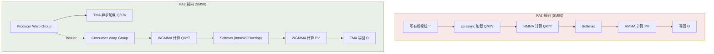
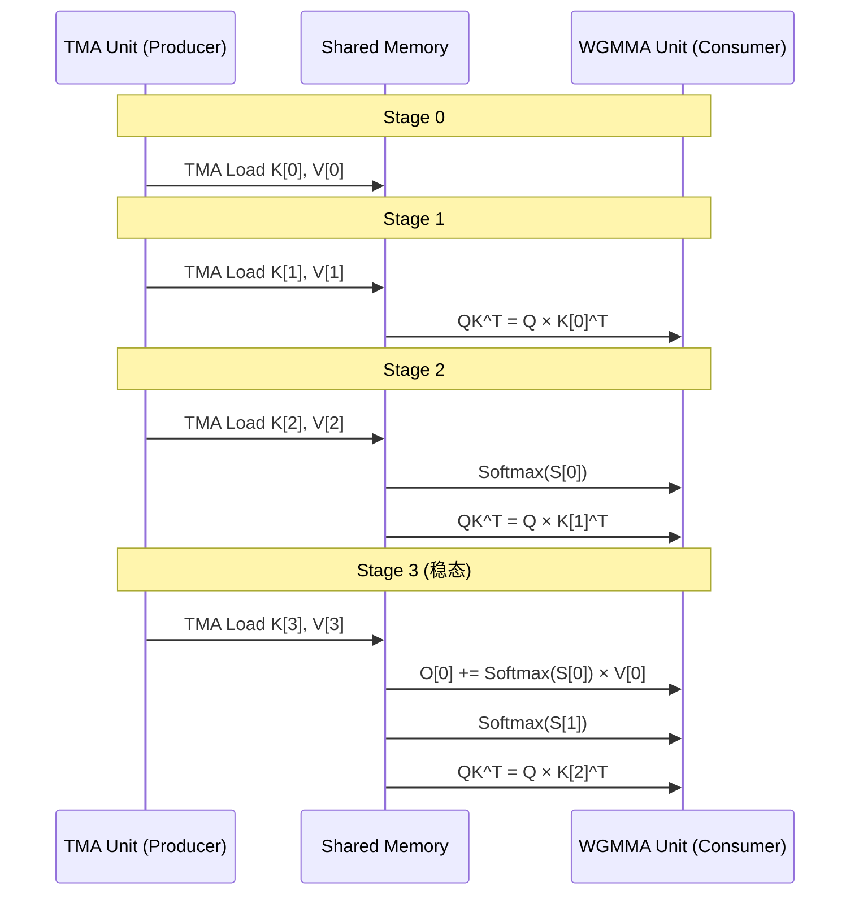
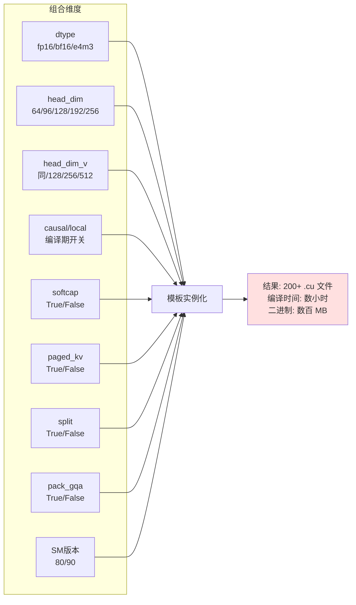
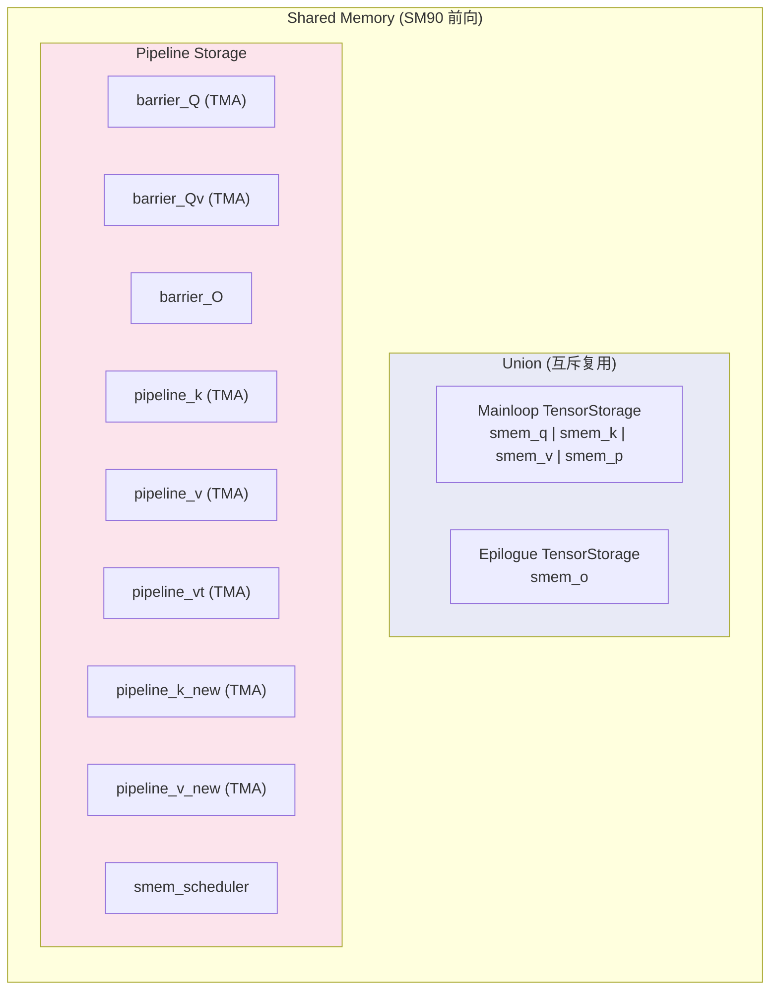

# FlashAttention 3 (Hopper) 实现深度分析

## 【总】开篇

FlashAttention 3 (FA3) 是首个针对 NVIDIA Hopper (SM90) GPU 架构深度优化的 FlashAttention 版本，由 Jay Shah、Ganesh Bikshandi、Ying Zhang、Vijay Thakkar、Pradeep Ramani 和 Tri Dao 联合开发。其核心贡献可以概括为三个维度：

1. **首个 Hopper GPU 优化版本**：充分利用 SM90 架构的 TMA (Tensor Memory Accelerator) 异步数据搬运和 WGMMA (Warp Group Matrix Multiply-Accumulate) 矩阵乘法单元，实现生产者-消费者 (Producer-Consumer) 异步流水线。
2. **TMA + WGMMA + 生产者-消费者流水线**：将数据加载（Producer Warp Group）与计算（Consumer Warp Group）解耦，通过软件流水线重叠内存访问与计算，大幅提升算力利用率。
3. **实例化组合爆炸问题**：由于大量编译期常量（head_dim、dtype、causal、softcap、paged_kv、split、pack_gqa、SM 版本等）的组合，导致内核实例化数量急剧膨胀，编译时间和二进制体积成为严重问题，这直接催生了 FA4 的架构重构。

---

## 【分】主体

### 1. flash_api.cpp：FA3 的 Python-C++ 绑定层

`flash_api.cpp` 是 FA3 的核心入口，负责将 Python 层的调用转换为 C++ 内核调用。通过 `TORCH_LIBRARY` 宏注册了四个操作：

```cpp
TORCH_LIBRARY(flash_attn_3, m) {
    m.def("fwd(...)");          // 前向
    m.def("bwd(...)");          // 反向
    m.def("fwd_combine(...)");  // SplitKV 合并
    m.def("get_scheduler_metadata(...)");  // 调度元数据预计算
}
```

#### 1.1 与 FA2 的参数差异

FA3 相比 FA2 新增了以下关键参数：

| 参数 | 说明 | FA2 是否有 |
|------|------|-----------|
| `attention_chunk` | 将注意力分块计算，实现 chunked attention | 否 |
| `softcap` | tanh softcapping，限制注意力分数范围 | 否 |
| `sm_margin` | 预留部分 SM 不参与计算（用于通信等） | 否 |
| `page_table` / `pagedkv_tma` | Paged KV Cache，支持 TMA 加速 | 部分 |
| `kv_batch_idx` | KV Cache 批次索引（推理时多请求共享） | 否 |
| `k_new` / `v_new` | 增量追加 KV（推理解码） | 否 |
| `rotary_cos` / `rotary_sin` | 内核内 Rotary Embedding | 否 |
| `q_descale` / `k_descale` / `v_descale` | FP8 缩放因子 | 否 |
| `scheduler_metadata` | 预计算的调度元数据 | 否 |
| `num_splits` / `pack_gqa` | Split-KV 和 PackGQA 策略控制 | 部分 |
| `q_v` | 独立的 Q→V 投影（MLA 场景） | 否 |

#### 1.2 SM90 特定参数

```cpp
void set_params_fprop(Flash_fwd_params &params, ..., int attention_chunk,
                      const float softcap=0.f, const int sm_margin=0) {
    params.arch = at::cuda::getCurrentDeviceProperties()->major * 10
                + at::cuda::getCurrentDeviceProperties()->minor;
    params.num_sm = at::cuda::getCurrentDeviceProperties()->multiProcessorCount - sm_margin;
    params.attention_chunk = attention_chunk;
    params.softcap = softcap;
}
```

- `attention_chunk`：当 > 0 时，将长序列的注意力计算分块，每块的窗口大小被限制为 `attention_chunk - 1`，同时 `is_local` 被设为 `true`。
- `sm_margin`：从可用 SM 数量中减去，为 NCCL 等通信预留资源。
- `arch`：运行时检测 GPU 架构（80/86/89/90），决定走 SM80 还是 SM90 内核路径。

#### 1.3 运行时调度决策

`run_mha_fwd` 函数通过多层编译期常量分发选择具体内核：

```cpp
void run_mha_fwd(Flash_fwd_params &params, cudaStream_t stream) {
    ARCH_SWITCH(params.arch, Arch, [&] {           // SM 版本
        SPLIT_SWITCH(params.num_splits > 1, Split, [&] {  // 是否 Split-KV
            PAGEDKV_SWITCH(params.page_table && !params.pagedkv_tma, PagedKVNonTMA, [&] {
                PACKGQA_SWITCH(params.pack_gqa, PackGQA_, [&] {
                    static constexpr bool PackGQA = PackGQA_ || Arch < 90 || PagedKVNonTMA || Split;
                    SOFTCAP_SWITCH(params.softcap > 0.0, Has_softcap, [&] {
                        run_mha_fwd_constexpr<Arch, Split, PagedKVNonTMA, PackGQA, Has_softcap>(params, stream);
                    });
                });
            });
        });
    });
}
```

注意 `static constexpr bool PackGQA = PackGQA_ || Arch < 90 || PagedKVNonTMA || Split;`——对于 SM8x、PagedKV 或 Split 场景，始终启用 PackGQA 以减少编译组合数。

### 2. flash.h：FA3 参数结构体

FA3 定义了三层参数继承结构：

```
Qkv_params → Flash_fwd_params → Flash_bwd_params
```

#### 2.1 Qkv_params：基础 QKV 参数

```cpp
struct Qkv_params {
    using index_t = int64_t;
    void *__restrict__ q_ptr;
    void *__restrict__ k_ptr;
    void *__restrict__ v_ptr;
    index_t q_batch_stride, k_batch_stride, v_batch_stride;
    index_t q_row_stride, k_row_stride, v_row_stride;
    index_t q_head_stride, k_head_stride, v_head_stride;
    index_t v_dim_stride;  // V 可能有不同的维度布局
    int h, h_k;            // Q 头数 vs KV 头数（GQA/MQA）
};
```

#### 2.2 Flash_fwd_params：前向参数

新增的关键字段包括：

- **FP8 支持**：`q_descale_ptr`、`k_descale_ptr`、`v_descale_ptr` 及其 stride
- **Paged KV**：`page_table`、`page_table_batch_stride`、`page_size`、`num_pages`、`pagedkv_tma`
- **增量 KV**：`knew_ptr`、`vnew_ptr` 及其 stride，`cu_seqlens_knew`
- **Rotary Embedding**：`rotary_cos_ptr`、`rotary_sin_ptr`、`rotary_dim`、`is_rotary_interleaved`
- **Split-KV**：`num_splits`、`oaccum_ptr`、`softmax_lseaccum_ptr` 及其 stride
- **调度器**：`tile_count_semaphore`、`num_m_blocks_ptr`、`num_splits_dynamic_ptr`、`varlen_batch_idx_ptr`、`num_nheads_in_l2_ptr`
- **异构头维度**：`dv`、`dv_rounded`（V 的头维度可以与 Q/K 不同）
- **PackGQA**：`pack_gqa`
- **注意力分块**：`attention_chunk`
- **Softcap**：`softcap`

#### 2.3 Flash_bwd_params：反向参数

在 `Flash_fwd_params` 基础上新增：

- `do_ptr`、`dq_ptr`、`dk_ptr`、`dv_ptr` 及其 stride
- `dq_accum_ptr`、`dk_accum_ptr`、`dv_accum_ptr`（FP32 累积缓冲区）
- `dsoftmax_sum`、`softmax_lse_log2_ptr`
- `dq_semaphore`、`dk_semaphore`、`dv_semaphore`（用于确定性反向的信号量）
- `deterministic` 标志

### 3. 前向内核：SM80 基础 vs SM90 优化

FA3 同时维护 SM80 和 SM90 两套前向内核实现，通过 `ARCH_SWITCH` 在运行时选择。

#### 3.1 SM80 前向内核 (FlashAttnFwdSm80)

```cpp
template <class CollectiveMainloop_, class CollectiveEpilogue_, class TileScheduler_>
class FlashAttnFwdSm80 {
    static constexpr uint32_t NumThreads = CUTE_STATIC_V(size(TiledMma{}));
    static constexpr uint32_t MaxThreadsPerBlock = NumThreads;  // 128 或 256
    static constexpr uint32_t MinBlocksPerMultiprocessor = NumThreads == 128 ? 2 : 1;
};
```

SM80 内核特点：
- 使用 `cp.async` (Ampere 异步拷贝) 进行全局内存到共享内存的数据搬运
- MMA 使用 `SM80_16x8x16_F32F16F16F32_TN` 或 `SM80_16x8x16_F32BF16BF16F32_TN`
- 所有线程同时参与加载和计算（无生产者-消费者分离）
- Tile 大小由 `tile_size_fwd_sm8x()` 决定，返回 `{kBlockM, kBlockN, kNWarps, kStages, Q_in_regs}`

#### 3.2 SM90 前向内核 (FlashAttnFwdSm90)

```cpp
template <class CollectiveMainloop_, class CollectiveEpilogue_, class TileScheduler_>
class FlashAttnFwdSm90 {
    static constexpr uint32_t NumLoadWarpGroups = 1;
    static constexpr uint32_t NumMmaWarpGroups = CUTE_STATIC_V(size(TiledMmaPV{})) / cutlass::NumThreadsPerWarpGroup;
    static constexpr uint32_t MaxThreadsPerBlock = CUTE_STATIC_V(size(TiledMmaPV{}))
                                                  + (NumLoadWarpGroups * cutlass::NumThreadsPerWarpGroup);
    // LoadRegisterRequirement 和 MmaRegisterRequirement 精确控制寄存器分配
    static constexpr uint32_t LoadRegisterRequirement = NumMmaWarpGroups == 1 ? 56
        : (NumMmaWarpGroups == 2 ? (Use_TMA_KV ? 24 : 40) : 32);
    static constexpr uint32_t MmaRegisterRequirement = NumMmaWarpGroups == 1 ? 256
        : (NumMmaWarpGroups == 2 ? (Use_TMA_KV ? 240 : 232) : 160);
};
```

SM90 内核的核心差异：

| 特性 | SM80 | SM90 |
|------|------|------|
| 数据搬运 | cp.async | TMA (Tensor Memory Accelerator) |
| 矩阵乘法 | HMMA (Warp-level) | WGMMA (Warp Group-level) |
| 线程组织 | 所有线程统一 | Producer WG + Consumer WG 分离 |
| 寄存器分配 | 统一 | Load/Mma WG 分别配置 |
| 共享内存 | mainloop/epilogue union | mainloop/epilogue union + pipeline barriers |
| Cluster | 不支持 | 支持 ClusterShape 跨 CTA 协作 |

#### 3.3 SM90 Mainloop：TMA + WGMMA 流水线

`CollectiveMainloopFwdSm90` 是 SM90 前向的核心，模板参数多达 16 个：

```cpp
template <int Stages, class ClusterShape_, class TileShape_MNK_, int kHeadDimV,
          class Element_, class ElementAccum_, class ArchTag_,
          bool Is_causal_, bool Is_local_, bool Has_softcap_, bool Varlen_,
          bool PagedKVNonTMA_, bool AppendKV_, bool HasQv_,
          bool MmaPV_is_RS, bool IntraWGOverlap, bool PackGQA_, bool Split_,
          bool V_colmajor_>
struct CollectiveMainloopFwdSm90 { ... };
```

关键编译期决策：

- **Use_TMA_Q = !PackGQA**：PackGQA 模式下 Q 不使用 TMA（因为 Q 的布局被重新排列）
- **Use_TMA_KV = !PagedKVNonTMA**：非 TMA 的 PagedKV 使用 `cp.async` 替代 TMA
- **MmaPV_is_RS**：P×V 矩阵乘法使用 Register-Shared 模式（P 在寄存器，V 在共享内存）
- **IntraWGOverlap**：Warp Group 内部重叠计算与 softmax
- **Transpose_V**：FP8 输入时 V 需要转置以适配 WGMMA 布局

WGMMA 的选择：

```cpp
using TiledMmaQK = decltype(cute::make_tiled_mma(
    std::conditional_t<!MmaQK_is_RS,
        decltype(cute::GMMA::ss_op_selector<Element, Element, ElementAccum, TileShape_MNK>()),
        decltype(cute::GMMA::rs_op_selector<Element, Element, ElementAccum, TileShape_MNK>())
    >{}, AtomLayoutQK{}));
```

QK 使用 SS (Shared-Shared) 模式，PV 使用 RS 或 SS 模式取决于 `MmaPV_is_RS`。

### 4. 反向内核：SM80/SM90

#### 4.1 SM90 反向内核 (FlashAttnBwdSm90)

```cpp
template <class CollectiveMainloop_, class CollectiveEpilogue_, class TileScheduler_>
class FlashAttnBwdSm90 {
    static constexpr uint32_t NumLoadWarpGroups = 1;
    static constexpr uint32_t NumMmaWarpGroups = CUTE_STATIC_V(size(TiledMmaSdP{})) / cutlass::NumThreadsPerWarpGroup;
    static_assert(NumMmaWarpGroups == 2 || NumMmaWarpGroups == 3);
    static constexpr uint32_t LoadRegisterRequirement = NumMmaWarpGroups == 2 ? 24 : 32;
    static constexpr uint32_t MmaRegisterRequirement = NumMmaWarpGroups == 2 ? 240 : 160;
};
```

反向内核同样使用 Producer-Consumer 模型，但有两个 MMA 操作：
- `TiledMmaSdP`：计算 dV = P^T × dO（softmax 概率 × 梯度输出）
- `TiledMmadKV`：计算 dK 和 dV

反向的 SharedStorage 使用 union 重叠 mainloop 和 epilogue：

```cpp
struct SharedStorage {
    struct TensorStorage : cute::aligned_struct<128> {
        union {
            typename CollectiveMainloop::TensorStorage mainloop;
            typename CollectiveEpilogue::TensorStorage epilogue;
        };
    } tensors;
    struct PipelineStorage : cute::aligned_struct<16> {
        alignas(16) cutlass::arch::ClusterTransactionBarrier barrier_KV;
        alignas(16) typename CollectiveMainloop::MainloopPipeline::SharedStorage pipeline_q;
        alignas(16) typename CollectiveMainloop::MainloopPipeline_dO::SharedStorage pipeline_do;
        alignas(16) typename TileScheduler::SharedStorage smem_scheduler;
    } pipelines;
};
```

#### 4.2 反向分发

```cpp
void run_mha_bwd(Flash_bwd_params &params, cudaStream_t stream) {
    ARCH_SWITCH(params.arch, Arch, [&] {
        SOFTCAP_SWITCH(params.softcap > 0.f, Has_softcap, [&] {
            run_mha_bwd_constexpr<Arch, Has_softcap>(params, stream);
        });
    });
}
```

反向内核的模板参数比前向少——不需要 Split、PagedKV、PackGQA 等编译期开关，因为这些逻辑在前向中处理。

### 5. 反向预处理/后处理内核

#### 5.1 预处理内核 (FlashAttnBwdPreprocess)

```cpp
template <class TileShape_MK_, class Element, class ElementAccum, class ArchTag_,
          bool Clear_dQaccum, bool Varlen>
class FlashAttnBwdPreprocess { ... };
```

预处理内核在反向主内核之前运行，完成以下工作：
- 计算 `dP_sum = rowsum(dO * O)`（softmax 梯度的缩放因子）
- 将 `softmax_lse` 转换为 `log2` 格式（`softmax_lse_log2`）
- 如果 `Clear_dQaccum = true`，清零 `dq_accum` 缓冲区
- 清零信号量（`dq_semaphore` 等）

#### 5.2 后处理内核 (FlashAttnBwdPostprocessConvertdQ)

```cpp
template <class TileShape_MK_, class Element, class ElementAccum, class ArchTag_,
          int kNThreads, class TiledMma, bool dQ_swapAB>
class FlashAttnBwdPostprocessConvertdQ { ... };
```

后处理内核将 FP32 累积的 `dq_accum` 转换回 FP16/BF16 的 `dq`，并处理：
- SM90 使用 WarpGroup 级别的共享内存布局优化
- 处理 `dQ_swapAB`（WGMMA 的 A/B 矩阵交换）
- 对 GQA 场景下的 `dk_accum`/`dv_accum` 做 reduce

### 6. Split-KV 结果合并内核

当 KV 序列很长时，FA3 将 KV 沿序列维度拆分为多个 split，每个 split 独立计算部分结果，最后通过合并内核归约。

#### 6.1 合并内核 (FlashAttnFwdCombine)

```cpp
template <class TileShape_MK_, int kLogMaxSplits_, int kNThreads, int AlignmentLSE_,
          bool Is_even_K, bool Varlen, class Element, class ElementPartial, class ArchTag_>
class FlashAttnFwdCombine {
    static constexpr int kMaxSplits = 1 << kLogMaxSplits_;  // 最多 256 splits
    static constexpr int kStages = 4;
};
```

合并过程使用 log-sum-exp 归约：

```
out = Σ_i (exp(lse_i - lse_max) * out_partial_i)
lse = lse_max + log(Σ_i exp(lse_i - lse_max))
```

合并内核支持 FP32/BF16/FP16 输出，使用 `cp.async` 预取数据，4 级软件流水线。

#### 6.2 Split 数量启发式

```cpp
inline int num_splits_heuristic(int total_mblocks, int num_SMs, int num_n_blocks,
                                int num_m_blocks, int size_one_kv_head,
                                bool is_causal_or_local, int max_splits) {
    if (total_mblocks >= 0.8f * num_SMs) {
        int const size_l2 = 50 * 1024 * 1024;
        if (size_one_kv_head > size_l2 && num_m_blocks >= num_SMs * 2 && !is_causal_or_local) {
            return std::min((size_one_kv_head + size_l2 - 1) / size_l2, max_splits);
        }
        return 1;
    }
    if (num_n_blocks <= 4) return 1;
    // 遍历所有可能的 split 数，选择效率 >= 85% 最大效率的最小 split 数
    ...
}
```

关键逻辑：
- 如果已有足够多的 M blocks 填充 SM，通常不需要 split
- 但如果单个 KV head 超过 L2 cache (50MB)，需要 split 以提高 L2 命中率
- Causal/Local 模式下通常不 split
- 选择满足 85% 效率阈值的最小 split 数

### 7. heuristics.h：启发式参数选择

`heuristics.h` 包含两个关键启发式函数：

#### 7.1 should_pack_gqa

```cpp
inline bool should_pack_gqa(bool varlen_q, int seqlen_q, int qhead_per_khead, int blockM) {
    if (varlen_q) return true;  // varlen 模式总是启用
    float nopack_gqa_efficiency = float(seqlen_q) / float(round_up(seqlen_q, blockM));
    float pack_gqa_efficiency = float(seqlen_q * qhead_per_khead) / float(round_up(seqlen_q * qhead_per_khead, blockM));
    return nopack_gqa_efficiency < 0.9 * pack_gqa_efficiency;
}
```

PackGQA 将多个 Q head 打包到同一个 tile 中处理，减少 tile 量化损失。当 `seqlen_q` 不是 `kBlockM` 的倍数时，PackGQA 可以显著提高效率。

#### 7.2 num_splits_heuristic

如上节所述，根据 SM 数量、tile 数量和 KV 大小决定 split 数量。

### 8. instantiations/：实例化组合爆炸问题

这是 FA3 最严重的工程问题。由于大量编译期常量的笛卡尔积，内核实例化数量急剧膨胀。

#### 8.1 组合维度

```python
DTYPE_MAP = {"fp16": ..., "bf16": ..., "e4m3": ...}   # 3 种数据类型
HEAD_DIMENSIONS = [64, 96, 128, 192, 256]               # 5 种头维度
PAGEDKV = [False, True]                                  # 2
SPLIT = [False, True]                                    # 2
SOFTCAP = [False, True]                                  # 2
PACKGQA = [False, True]                                  # 2
SM = [80, 90]                                            # 2
```

前向内核的理论组合数：`3 × 5 × 2 × 2 × 2 × 2 × 2 = 480`（基础组合），再加上：
- `hdim=192, hdim_v=128` 的异构头维度组合
- `hdim=64, hdim_v=256` 和 `hdim=64, hdim_v=512` 的 MLA 组合
- SM80 下 e4m3 不可用

反向内核：`2 × 5 × 2 × 2 = 40` 种组合。

#### 8.2 generate_kernels.py 自动生成脚本

```python
def get_all_kernels() -> List[Kernel]:
    for dtype, head_dim, split, paged_kv, softcap, packgqa, sm in itertools.product(
            DTYPE_MAP.keys(), HEAD_DIMENSIONS, SPLIT, PAGEDKV, SOFTCAP, PACKGQA, SM):
        # 优化：SM8x/PagedKV/Split 总是启用 PackGQA，跳过冗余组合
        if packgqa and (sm < 90 or (sm >= 90 and (paged_kv or split))):
            continue
        if sm >= 90 or dtype in DTYPE_MAP_FWD_SM8x:
            yield Kernel(..., direction="fwd")
        if sm == 90 and head_dim == 192:
            yield Kernel(..., head_dim_v=128, direction="fwd")  # 异构头维度
        if sm == 90 and head_dim == 64 and dtype in ["bf16", "fp16"]:
            yield Kernel(..., head_dim_v=256, direction="fwd")  # MLA
            yield Kernel(..., head_dim_v=512, direction="fwd")  # MLA
```

优化策略：
1. **PackGQA 合并**：SM8x、PagedKV、Split 场景下总是启用 PackGQA，避免单独编译 `packgqa=False` 版本
2. **FP8 仅 SM90**：e4m3 数据类型只在 SM90 上编译
3. **异构头维度仅 SM90**：`hdim≠hdim_v` 的组合只在 SM90 上支持

生成的文件命名规则：
```
flash_{fwd/bwd}_hdim{HEAD_DIM}[_{HEAD_DIM_V}]_{dtype}[_paged][_split][_softcap][_packgqa]_sm{SM}.cu
```

实际 instantiations 目录下有超过 200 个 `.cu` 文件，每个文件包含一个模板显式实例化。

#### 8.3 批量聚合文件

为减少编译单元数量，`generate_kernels.py` 还生成聚合文件：

- `flash_fwd_hdimall_*.cu`：同一 dtype/split/paged/softcap/packgqa/sm 下所有 head_dim 的聚合
- `flash_fwd_hdimdiff_*.cu`：异构头维度的聚合
- `flash_bwd_hdim*_softcapall_sm90.cu`：SM90 反向的 softcap 聚合

### 9. flash_attn_interface.py：FA3 的 Python 接口

FA3 的 Python 接口相比 FA2 有重大变化：

#### 9.1 torch.library 自定义算子

FA3 使用 `torch.library.custom_op` 注册算子，支持 `torch.compile` 和 `torch.export`：

```python
@torch.library.custom_op("flash_attn_3::_flash_attn_forward", mutates_args=(), device_types="cuda")
def _flash_attn_forward(q, k, v, k_new=None, v_new=None, qv=None, ...) -> Tuple[...]:
    ...

@torch.library.register_fake("flash_attn_3::_flash_attn_forward")
def _flash_attn_forward_fake(q, k, v, ...) -> Tuple[...]:
    # 仅计算输出 shape/dtype，不做实际计算
    ...
```

`register_fake` 实现了 symbolic shape 推导，使得 `torch.compile` 可以正确追踪。

#### 9.2 三种高层接口

```python
class FlashAttnFunc(torch.autograd.Function):           # 标准 (batch, seqlen, heads, dim)
class FlashAttnQKVPackedFunc(torch.autograd.Function):  # QKV 打包 (batch, seqlen, 3, heads, dim)
class FlashAttnVarlenFunc(torch.autograd.Function):     # 变长序列 (total_q, heads, dim) + cu_seqlens
```

#### 9.3 flash_attn_with_kvcache

推理专用接口，支持：
- Paged KV Cache（`page_table`）
- 增量 KV 追加（`k`/`v` + `cache_seqlens`）
- 内核内 Rotary Embedding（`rotary_cos`/`rotary_sin`）
- `scheduler_metadata` 预计算（避免每次调用重复计算调度信息）

#### 9.4 get_scheduler_metadata

```python
def get_scheduler_metadata(batch_size, max_seqlen_q, max_seqlen_k, num_heads_q, num_heads_kv,
                           headdim, cache_seqlens, ...):
    scheduler_metadata = flash_attn_3_gpu.get_scheduler_metadata(...)
    return scheduler_metadata
```

将调度元数据的计算从 `fwd` 中分离出来，允许在预填充阶段预先计算，在解码阶段复用。

### 10. 与 FA2 的对比：新增功能总结

| 功能 | FA2 | FA3 | 说明 |
|------|-----|-----|------|
| Softcap (tanh capping) | 否 | 是 | `softcap > 0` 时 `attn = softcap * tanh(attn / softcap)` |
| Paged KV Cache | 部分 | 完整 | FA3 支持 TMA 加速的 PagedKV |
| FP8 前向 (e4m3) | 否 | 是 | Q/K/V 使用 FP8，输出 BF16，需要 descale 因子 |
| 内核内 Rotary | 否 | 是 | 在内核内直接应用 Rotary Embedding，减少一次 kernel launch |
| 增量 KV 追加 | 否 | 是 | 推理时在内核内将 k_new/v_new 追加到 KV Cache |
| 异构 V 头维度 | 否 | 是 | V 的 head_dim 可以与 Q/K 不同（如 hdim=192, hdim_v=128） |
| MLA 支持 (qv) | 否 | 是 | 独立的 Q→V 投影，支持 hdim=64, hdim_v=512 |
| Attention Chunk | 否 | 是 | 将长序列注意力分块计算 |
| PackGQA | 否 | 是 | 将多个 Q head 打包到一个 tile |
| Split-KV | 部分 | 完整 | FA3 支持动态 split 和 combine kernel |
| torch.compile | 否 | 是 | 通过 `torch.library.custom_op` + `register_fake` |
| Scheduler Metadata | 否 | 是 | 预计算调度信息，支持 CUDA Graph |
| Varlen 排序 | 否 | 是 | 按序列长度排序 batch 以优化 L2 命中 |
| Head Swizzle | 否 | 是 | L2 cache 感知的 head 分配策略 |
| Producer-Consumer 流水线 | 否 | 是 | SM90 独有的 TMA + WGMMA 异步流水线 |

---

### 配图

#### FA3 vs FA2 前向内核对比图



#### TMA + WGMMA 流水线时序图



#### FA3 实例化组合矩阵图



#### SplitKV 执行流程图

```mermaid
flowchart TD
    A[输入 Q, K, V] --> B{num_splits > 1?}
    B -->|否| C[单次前向内核]
    C --> D[输出 O, LSE]
    B -->|是| E[Split 0: 前向内核<br/>K[0:N/2], V[0:N/2]]
    E --> F[Split 1: 前向内核<br/>K[N/2:N], V[N/2:N]]
    F --> G[...更多 Splits]
    G --> H[部分结果:<br/>O_accum[0..S], LSE_accum[0..S]]
    H --> I[Combine 内核:<br/>log-sum-exp 归约]
    I --> D

    style B fill:#fff3cd
    style I fill:#d4edda
```

#### SM90 Shared Memory 布局图



---

## 【总】收尾

FlashAttention 3 充分利用了 Hopper GPU 的硬件特性——TMA 异步数据搬运消除了数据加载对计算线程的占用，WGMMA 大幅提升了矩阵乘法吞吐，Producer-Consumer 流水线实现了加载与计算的高度重叠。这些优化使得 FA3 在 H100 上接近理论算力峰值的 75%。

然而，FA3 也面临着严重的工程挑战。由于大量编译期常量的组合爆炸，instantiations 目录下有超过 200 个 `.cu` 文件，完整编译需要数小时，二进制体积达数百 MB。`generate_kernels.py` 虽然通过 PackGQA 合并、FP8 限制等策略减少了冗余组合，但根本问题在于 C++ 模板元编程的局限性——每个编译期常量组合都需要生成独立的机器码。

这种组合爆炸问题直接催生了 FlashAttention 4 的架构重构：FA4 放弃了 C++ 模板实例化方案，转而使用 Cutlass 的运行时参数化 + JIT 编译策略，将编译期常量推迟到运行时，从根本上解决了维护成本和编译时间的问题。FA3 是 C++ 模板化 FlashAttention 的巅峰之作，也是其工程极限的见证。
