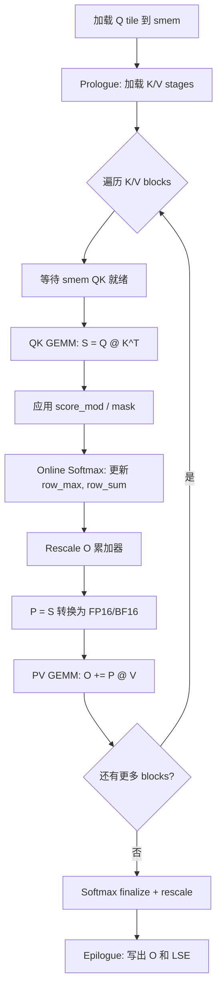
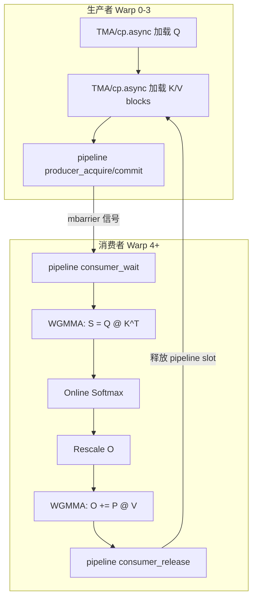
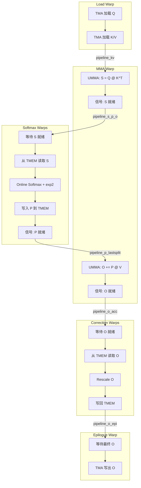
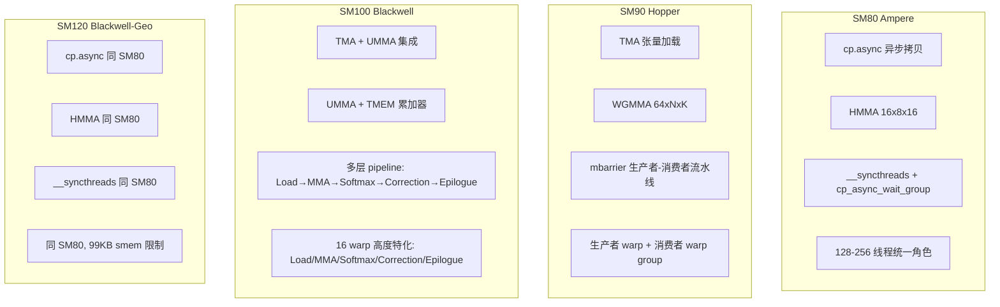

# FA4 CuTeDSL 前向内核深度分析

## 【总】开篇

本篇分析 FA4 CuTeDSL 前向内核的实现架构与核心机制。FA4 前向内核是 FlashAttention 项目中最核心的组件，负责计算 `O = softmax(Q @ K^T) @ V`。FA4 的最大革新在于**使用 Python CuTeDSL 重写了所有内核**，替代了此前基于 Cutlass C++ 的实现，同时支持 SM80/90/100/120 四种 GPU 架构。

**核心结论**：FA4 CuTeDSL 前向内核通过架构特化实现了跨代 GPU 的最优性能——SM80 使用 cp.async 异步拷贝 + HMMA 矩阵乘、SM90 使用 TMA 加载 + WGMMA 矩阵乘 + 生产者-消费者流水线、SM100 使用 UMMA + 2CTA + SplitKV + Paged KV + 持久化内核 + FP8 等黑威尔特性、SM120 复用 SM80 路径但适配更小的共享内存。所有架构的核心计算循环都是 **Q tile 加载 → K/V blocks 遍历 → online softmax → 写出 O**，但在数据搬运、矩阵乘指令、流水线编排上各有根本性差异。

---

## 【分】主体

### 1. flash_fwd.py — FlashAttentionForwardBase / FlashAttentionForwardSm80

#### 1.1 基类设计：FlashAttentionForwardBase

`FlashAttentionForwardBase`（`flash_fwd.py:40-577`）是所有前向内核的公共基类，定义了共享的参数结构、内存布局、数据加载逻辑和 epilogue 写出逻辑。

**`__init__` 参数**（`flash_fwd.py:42-117`）：

| 参数 | 类型 | 说明 |
|------|------|------|
| `dtype` | `Type[cutlass.Numeric]` | 数据类型，支持 FP16/BF16 |
| `head_dim` | `int` | Q/K 的 head 维度 |
| `head_dim_v` | `Optional[int]` | V 的 head 维度，默认等于 head_dim |
| `qhead_per_kvhead` | `int` | GQA 中每个 KV head 对应的 Q head 数 |
| `is_causal` / `is_local` | `bool` | 因果/局部注意力掩码 |
| `pack_gqa` | `bool` | 是否使用 PackGQA 优化 |
| `tile_m` / `tile_n` | `int` | Q/KV 的分块大小，默认 128×128 |
| `num_stages` | `int` | 流水线阶段数 |
| `num_threads` | `int` | 线程数 |
| `Q_in_regs` | `bool` | 是否将 Q 保持在寄存器中 |
| `score_mod` / `mask_mod` | `Optional[cutlass.Constexpr]` | 自定义分数修改/掩码函数 |

基类在 `__init__` 中完成关键的对齐计算：将 `head_dim` 向上取整到 16 的倍数作为 `tile_hdim`（`flash_fwd.py:83`），并设置 `check_hdim_oob` 标志以判断是否需要 head 维度越界检查（`flash_fwd.py:88-89`）。

**`can_implement` 静态方法**（`flash_fwd.py:119-175`）检查内核是否可执行：验证数据类型（仅 FP16/BF16）、head_dim 对齐（8 的倍数）、tile_n 对齐（16 的倍数）、线程数对齐（32 的倍数）、共享内存容量是否足够。共享内存用量计算公式为：

```
smem_usage_QV = (smem_Q + smem_V) if not Q_in_regs else max(smem_Q, smem_V)
smem_usage = smem_usage_QV + smem_K
```

**`_setup_attributes` 方法**（`flash_fwd.py:206-300`）配置共享内存布局和全局内存拷贝：
- 使用 `_get_smem_layout_atom()` 获取架构特定的 smem 布局原子
- 通过 `cute.tile_to_shape` 扩展为完整的 Q/K/V/O 布局
- 配置 `cpasync.CopyG2SOp` 作为异步拷贝原子（128 bits/拷贝）
- 构造 `gmem_tiled_copy_Q/K/V/O` 用于全局内存到共享内存的数据搬运

**`epilogue` 方法**（`flash_fwd.py:331-449`）处理内核的收尾工作：
1. 将 `acc_O`（Float32 累加器）转换为输出数据类型并写入 smem
2. 通过 `NamedBarrierFwd.Epilogue` 同步所有 epilogue 线程
3. 写出 LSE（log-sum-exp）到全局内存
4. 根据 `use_tma_O` 选择 TMA 或 cp.async 写出 O 到全局内存

**`load_Q` / `load_K` / `load_V` 方法**（`flash_fwd.py:456-576`）封装了数据从全局内存到共享内存的异步加载逻辑，包含边界检查和谓词计算。

#### 1.2 FlashAttentionForwardSm80 实现

`FlashAttentionForwardSm80`（`flash_fwd.py:579-1229`）继承自 `FlashAttentionForwardBase`，实现了 Ampere 架构（SM80）的前向注意力内核。

**Smem 布局**（`flash_fwd.py:580-586`）：使用 `sm80_utils.get_smem_layout_atom` 获取 Ampere 兼容的共享内存布局，Q/K 使用相同布局，V/O 使用 `head_dim_v` 对应的布局。

**MMA 指令**（`flash_fwd.py:588-599`）：使用 `warp.MmaF16BF16Op`，即 HMMA（Half-Precision Matrix Multiply-Accumulate），指令形状为 `(16, 8, 16)`，warp 数量为 `num_threads // 32`。QK 和 PV 使用两个独立的 `tiled_mma`。

**共享内存结构**（`flash_fwd.py:601-620`）：根据 `Q_in_regs` 选择 `SharedStorageQKV`（Q/V 分开存储）或 `SharedStorageSharedQV`（Q/V 共享同一块 smem 以节省空间），所有结构体按 1024 字节对齐。

**`__call__` 方法**（`flash_fwd.py:622-743`）：
1. 类型检查和张量布局重排（varlen 3D vs 非 varlen 4D）
2. 选择 TileScheduler：varlen 用 `SingleTileVarlenScheduler`，否则用 `SingleTileScheduler`
3. 计算 softmax_scale 的 log2 版本
4. 启动 kernel，grid 维度由 TileScheduler 决定

**`kernel` 方法**（`flash_fwd.py:745-1082`）是 SM80 前向的核心：

1. **初始化阶段**：获取 tile scheduler 的工作分配，计算序列长度信息，确定 K/V 遍历范围 `[n_block_min, n_block_max)`
2. **共享内存分配**：通过 `SmemAllocator` 分配 smem，获取 Q/K/V 的 tensor 视图
3. **MMA 分区**：为 QK 和 PV 两个 MMA 操作分配寄存器片段 `tSrQ`、`tSrK`、`tOrVt`，以及累加器 `acc_O`（初始化为 0）
4. **Smem 拷贝原子**：使用 `LdMatrix8x8x16bOp` 从 smem 加载到寄存器，Q/K 不转置，V 转置
5. **Softmax 初始化**：创建 `Softmax` 对象并 reset

**Prologue**（`flash_fwd.py:957-989`）：
- 加载 Q tile 到 smem，`cp_async_commit_group`
- 如果 `Q_in_regs`：先加载 1 stage K，等待 Q 加载完成，将 Q 从 smem 拷贝到寄存器，再加载 V
- 如果 `!Q_in_regs`：加载所有 stages 的 K 和 V，然后等待 Q 加载完成

**Mainloop**（`flash_fwd.py:993-1057`）：
核心循环由 `compute_one_n_block` 方法实现，从 `n_block_max-1` 向 `n_block_min` 遍历 K/V blocks。循环分为三段：
1. **最后一块**（需序列长度掩码）：`is_first_n_block=True`
2. **因果/局部掩码块**（需因果掩码）：`mask_seqlen=True`
3. **无掩码块**：`mask_seqlen=False`

**`compute_one_n_block` 方法**（`flash_fwd.py:1084-1194`）处理单个 K/V block 的完整计算：

```
sync() → 加载 V_next → QK GEMM → score_mod → 掩码 → online_softmax → rescale_O →
P 类型转换 → PV GEMM
```

关键步骤：
- `sync()`：等待 smem 中的 QK 数据就绪（`cp_async_wait_group`）
- `sm80_utils.gemm`：执行 Q @ K^T 的 HMMA
- `softmax.online_softmax`：在线 softmax，维护 row_max 和 row_sum
- `softmax.rescale_O`：用新的缩放因子调整 O 累加器
- `sm80_utils.gemm_rs`：执行 P @ V 的 HMMA（P 来自寄存器）



### 2. flash_fwd_sm90.py — FlashAttentionForwardSm90

`FlashAttentionForwardSm90`（`flash_fwd_sm90.py:52-1545`）继承自 `FlashAttentionForwardBase`，实现了 Hopper 架构（SM90）的前向注意力内核。相比 SM80，SM90 的核心升级是 **TMA（Tensor Memory Access）加载**、**WGMMA（Warp Group Matrix Multiply-Accumulate）** 和**生产者-消费者流水线**。

#### 2.1 架构差异：TMA vs cp.async

SM90 的 `__init__`（`flash_fwd_sm90.py:53-70`）新增了：
- `intra_wg_overlap: bool = True`：是否启用 warp group 内重叠
- `mma_pv_is_rs: bool = True`：PV 的 MMA 是否使用寄存器到 smem 路径
- `paged_kv_non_tma: bool = False`：是否使用非 TMA 的 Paged KV

**TMA 加载**（`flash_fwd_sm90.py:261-301`）：
- Q 使用 `CopyBulkTensorTileG2SOp`（TMA G2S）加载
- K/V 同样使用 TMA 加载
- O 使用 `CopyBulkTensorTileS2GOp`（TMA S2G）写回
- TMA 由单个 warp（warp 0）发起，而 cp.async 需要整个 warp group 参与

**WGMMA vs HMMA**（`flash_fwd_sm90.py:96-118`）：
- QK MMA：`warpgroup.OperandMajorMode.K` × `warpgroup.OperandMajorMode.K`，atom_layout 为 `(tile_m // 64, 1, 1)`
- PV MMA：A 来源可以是 RMEM（`mma_pv_is_rs=True`）或 SMEM（`mma_pv_is_rs=False`），B 来源为 SMEM（`OperandMajorMode.MN`）
- WGMMA 指令形状为 64×N×K，由 128 个线程（4 个 warp）组成的 warp group 协同执行

#### 2.2 生产者-消费者流水线

SM90 内核的 `kernel` 方法（`flash_fwd_sm90.py:401-636`）采用**生产者-消费者模型**：

- **生产者**（warp_idx < 4，即 warp 0-3）：负责数据加载
  - `setmaxregister_decrease`：减少寄存器分配以释放给消费者
  - 调用 `self.load()` 方法执行 Q/K/V 的 TMA 或 cp.async 加载

- **消费者**（warp_idx >= 4，即 warp 4-7+）：负责 MMA 计算
  - `setmaxregister_increase`：增加寄存器分配用于 WGMMA
  - 调用 `self.mma()` 方法执行注意力计算

**流水线类型**（`flash_fwd_sm90.py:458-513`）：
- `PipelineTmaAsync`：TMA 加载的异步流水线，生产者为单个 TMA warp
- `PipelineCpAsync`：cp.async 加载的异步流水线，生产者为 128 个线程
- Q 使用 1 stage 流水线，K/V 使用 `num_stages` stage 流水线

**`load` 方法**（`flash_fwd_sm90.py:638-914`）：
生产者端的加载逻辑，使用 `while work_tile.is_valid_tile` 持久化循环：
1. 获取当前 tile 的 m_block、head_idx、batch_idx
2. 计算 TMA 加载的闭包函数 `load_Q`、`load_K`、`load_V`
3. 支持 Paged KV：TMA 路径（page_size == n_block_size）和 cp.async 路径
4. K/V 加载使用 `pipeline_k` 和 `pipeline_v` 的 `producer_acquire/commit` 机制
5. 支持 Block Sparsity 的特殊加载路径

**`mma` 方法**（`flash_fwd_sm90.py:936-1267`）：
消费者端的计算逻辑，同样使用持久化循环：

1. **MMA 分区**：使用 `sm90_utils.partition_fragment_ABC` 分配 QK 和 PV 的寄存器片段
2. **Softmax 初始化**：创建 `Softmax` 对象
3. **主循环**：遍历 K/V blocks，调用 `mma_one_n_block` 或 `mma_one_n_block_intrawg_overlap`

**Intra-WarpGroup Overlap**（`flash_fwd_sm90.py:1410-1477`）：
当 `intra_wg_overlap=True` 时，QK GEMM 和 PV GEMM 可以在同一个 warp group 内重叠执行：
- `first_half_block_overlap`：执行 QK GEMM + softmax + P 转换
- `last_half_block_overlap`：执行 PV GEMM
- 两者之间通过 `warp_scheduler_barrier` 同步



#### 2.3 Warp Scheduler Barrier

当使用多个 MMA warp group（`num_wg_mma >= 2`）时，需要 warp scheduler barrier 来协调不同 warp group 的执行顺序（`flash_fwd_sm90.py:1524-1545`）：
- `warp_scheduler_barrier_sync`：当前 warp group 等待
- `warp_scheduler_barrier_arrive`：通知下一个 warp group 可以开始

### 3. flash_fwd_sm100.py — FlashAttentionForwardSm100

`FlashAttentionForwardSm100`（`flash_fwd_sm100.py:114-999+`）是 Blackwell 架构（SM100）的前向注意力内核，**不继承自 FlashAttentionForwardBase**，而是完全独立实现。这是 SM100 架构根本性变化所致。

#### 3.1 Blackwell 架构核心特性

**UMMA（Unified Matrix Multiply-Accumulate）**：
SM100 使用 `tcgen05` 指令集替代 SM90 的 `warpgroup` 指令。UMMA 的关键区别：
- 累加器存储在 **TMEM（Tensor Memory）** 而非寄存器中
- MMA 指令由单个 warp 发起（而非 warp group）
- 支持 2CTA 模式：两个 CTA 协同执行一个更大的 MMA 操作

**2CTA 模式**（`flash_fwd_sm100.py:154-172`）：
- `use_2cta_instrs=True` 时，`cta_group_size=2`，`cluster_shape_mn=(2,1)`
- MMA tiler 的 M 维度翻倍：`mma_tiler_qk = (2 * m_block_size, n_block_size, head_dim_padded)`
- 两个 CTA 组成一个 cluster，协同加载和计算

**SplitKV**（`flash_fwd_sm100.py:124,190-191`）：
- 将 K/V 序列沿序列维度拆分为多个 split，每个 split 独立计算部分 O 和 LSE
- 最终通过 `flash_fwd_combine.py` 合并部分结果
- 不支持 `head_dim_v_padded >= 192` 的 SplitKV

**Paged KV**（`flash_fwd_sm100.py:139`）：
- `use_tma_KV=True`：TMA 路径，page_size 必须等于 tile_n
- `use_tma_KV=False`（`paged_kv_non_tma`）：cp.async 路径，支持任意 page_size

**持久化内核**（`flash_fwd_sm100.py:130,176`）：
- `is_persistent=True` 时使用 `StaticPersistentTileScheduler`
- 一个 CTA 处理多个 tile，减少 kernel launch 开销
- 支持 CLC（Cooperative Launch Controller）动态调度器

**FP8 支持**（`flash_fwd_sm100.py:105-111,443-460`）：
- 通过 `DescaleTensors` 提供 Q/K/V 的反量化缩放因子
- FP8 的 MMA 使用 `q_dtype.width == 8` 的数据类型

#### 3.2 Warp 特化

SM100 内核使用高度特化的 warp 分配（`flash_fwd_sm100.py:249-286`）：

| Warp ID | 角色 | 说明 |
|---------|------|------|
| 0-3 | Softmax 0 | 计算 S0 的 softmax（第一个 Q stage） |
| 4-7 | Softmax 1 | 计算 S1 的 softmax（第二个 Q stage） |
| 8-11 | Correction | O 的在线缩放修正 |
| 12 | MMA | 执行 QK 和 PV 的 UMMA |
| 13 | Epilogue | 写出 O 到全局内存 |
| 14 | Load | TMA/cp.async 数据加载 |
| 15 | Empty | 空闲（或 CLC 调度器） |

当 `q_stage=1` 时，Softmax 1 warps 被重新分配为 Load warps 或 Empty warps。

**寄存器分配**（`flash_fwd_sm100.py:304-323`）：
通过 `_TUNING_CONFIG` 查找表根据 `(use_2cta, is_causal, head_dim_padded, is_sm103)` 确定各 warp 的寄存器数量。总预算为 512 个寄存器/线程，在 softmax、correction 和 other warps 之间分配。

**TMEM 布局**（`flash_fwd_sm100.py:289-299`）：
- `tmem_s_offset = [0, n_block_size]`：S0 和 S1 的 TMEM 偏移
- `tmem_o_offset`：O 的 TMEM 偏移（紧跟 S 之后）
- `tmem_p_offset`：P 的 TMEM 偏移（S 的后半部分，因为 P 只需 FP16 部分）

#### 3.3 流水线架构

SM100 的流水线比 SM90 更复杂（`flash_fwd_sm100.py:914-999`）：

- `PipelineTmaUmma` / `PipelineAsyncUmma`：Q 和 K/V 的加载流水线，连接 TMA/cp.async 生产者和 UMMA 消费者
- `PipelineUmmaAsync`：S → Softmax 的信号流水线，MMA warp 通知 softmax warp S 已就绪
- `PipelineAsyncUmma`：P → MMA 的信号流水线，softmax warp 通知 MMA warp P 已写入 TMEM
- `PipelineUmmaAsync`：O → Correction 的信号流水线
- `PipelineAsync`：Softmax stats → Correction 的信号流水线



#### 3.4 Exp2 仿真

SM100 的 softmax 需要计算 `exp2(S * scale - row_max * scale)`。在非 SM103 的 Blackwell GPU 上，硬件 exp2 指令较慢，因此使用 **多项式仿真**（`flash_fwd_sm100.py:72-97,462-469`）：
- `ex2_emu_freq`：每隔多少个 fragment 使用一次仿真
- `ex2_emu_start_frg`：从第几个 fragment 开始仿真
- SM103（B300）有快速硬件 exp2，`ex2_emu_freq=0`

### 4. flash_fwd_sm120.py — FlashAttentionForwardSm120

`FlashAttentionForwardSm120`（`flash_fwd_sm120.py:14-59`）是 SM120（Blackwell GeForce / DGX Spark）的前向内核，**继承自 FlashAttentionForwardSm80**。

SM120 的关键约束是**共享内存容量仅 99 KB**（vs SM80 的 163 KB），因此：
- 复用 SM80 的 MMA 指令（`mma.sync.aligned.m16n8k16`，即 HMMA）
- 复用 SM80 的 cp.async 数据加载路径
- 仅重写 `can_implement` 方法，将共享内存容量检查改为 `sm_120` 的 99 KB

```python
# flash_fwd_sm120.py:54
smem_capacity = utils_basic.get_smem_capacity_in_bytes("sm_120")
```

注意 `arch = 80` 是故意设置的（`flash_fwd_sm120.py:17`），因为 SM120 使用与 SM80 相同的 cp.async 代码路径，编译目标由实际 GPU 决定而非此字段。

### 5. flash_fwd_combine.py — FlashAttentionForwardCombine

`FlashAttentionForwardCombine`（`flash_fwd_combine.py:21-698`）负责合并 SplitKV 产生的部分结果。当 K/V 序列很长时，SM100 内核将其拆分为多个 split 并行计算，每个 split 产生 `O_partial` 和 `LSE_partial`，最终由 Combine 内核合并。

**`__init__` 参数**（`flash_fwd_combine.py:22-54`）：
- `dtype`：输出数据类型
- `dtype_partial`：部分累积数据类型
- `head_dim`：head 维度
- `tile_m`：M 分块大小（默认 8）
- `k_block_size`：K 分块大小（默认 64）
- `log_max_splits`：最大 split 数的 log2（默认 4，即最多 16 splits）
- `num_threads`：线程数（默认 256）
- `stages`：流水线阶段数（默认 4）

**合并算法**（`flash_fwd_combine.py:323-665`）：

1. **加载 LSE_partial**：从全局内存加载所有 split 的 LSE 到 smem
2. **计算全局 LSE**：
   - 对每个 row，找到所有 split 中的 `lse_max`
   - 计算缩放因子 `scale_s = exp(lse_s - lse_max)`
   - 求和 `lse_sum = Σ scale_s`
   - 最终 `lse = lse_max + log(lse_sum)`
3. **加载 O_partial 并累积**：
   - 使用流水线化加载，`stages-1` 个 stage 预取
   - 对每个 split：`O += scale_s * O_partial_s`
4. **写出最终 O**：将累积结果写回全局内存

关键优化：使用 `warp_reduction_max` 和 `warp_reduction_sum` 进行高效的 warp 级归约，使用 swizzled smem 布局避免 bank conflict。

### 6. flash_fwd_mla_sm100.py — FlashAttentionMLAForwardSm100

`FlashAttentionMLAForwardSm100`（`flash_fwd_mla_sm100.py:53-200`）实现了 Multi-head Latent Attention（MLA）的前向内核，这是 DeepSeek-V2/V3 提出的注意力变体。

**MLA 的核心思想**：将 K/V 压缩到低维潜在空间，注意力计算在压缩空间中进行。

**关键参数**（`flash_fwd_mla_sm100.py:54-69`）：
- `hdim=64`：Q/K 的 head 维度（较小）
- `hdimv=512`：V 的 head 维度（较大）
- `qhead_per_kvhead=128`：MQA 配置，128 个 Q head 共享 1 个 KV head
- `is_topk_gather=True`：是否使用 TopK 聚合 KV
- `topk_length=2048`：TopK 选择的序列长度

**Warp 分配**（`flash_fwd_mla_sm100.py:110-142`）：
MLA 使用 12 或 16 个 warp，包括专门的 `cpasync_load_warp_indices`（4 个 warp）用于 cp.async 加载 KV，以及 `relay_warp_id` 用于中继。

**2CTA 配置**（`flash_fwd_mla_sm100.py:172-176`）：
- `use_2cta_instrs=True`，`cluster_shape_mn=(2,1)`
- `cta_tile_m=64`，`cluster_tile_m=128`（2 个 CTA 各处理 64 行）

**V 维度拆分**（`flash_fwd_mla_sm100.py:189`）：
- `num_hdimv_splits=2`：将 hdimv=512 拆分为两个 256 的部分
- 每个部分独立执行 `Qv @ V^T` 和 `P @ V` 的 MMA

### 7. sm100_hd256_2cta_fmha_forward.py — BlackwellFusedMultiHeadAttentionForward

`BlackwellFusedMultiHeadAttentionForward`（`sm100_hd256_2cta_fmha_forward.py:36-1889`）是 SM100 上 head_dim=256 的专用 2CTA 前向内核。

**约束**（`sm100_hd256_2cta_fmha_forward.py:60-76`）：
- 仅支持 `(head_dim, head_dim_v) = (256, 256)`
- 不支持 score_mod、mask_mod、aux_tensors、pack_gqa、SplitKV、q_subtile_factor
- 固定 `m_block_size=128, n_block_size=128`

**Warp 分配**（`sm100_hd256_2cta_fmha_forward.py:116-133`）：
- Softmax: 4 warp (0-3)
- Correction: 4 warp (4-7)
- MMA: 1 warp (8)
- Load: 1 warp (9)
- Empty: 2 warp (10-11)
- 共 12 warp = 384 线程

**MMA Tiler**（`sm100_hd256_2cta_fmha_forward.py:82-106`）：
- `mma_tiler = (128, 128, 256)`
- `qk_mma_tiler = (256, 128, 128)`：2CTA 的 QK MMA，M 维度翻倍，K 维度拆分为 128 的迭代
- `iterations_qk = 256 // 128 = 2`：QK 需要两次迭代
- `iterations_pv = 256 // 128 = 2`：PV 需要两次迭代

**内核结构**（`sm100_hd256_2cta_fmha_forward.py:559-1528`）：
内核分为四个主要部分，每个部分由不同的 warp 执行：

1. **Load Warp**（`flash_fwd_sm100.py:808-1031`）：TMA 加载 Q/K/V，使用 `PipelineTmaUmma`
2. **MMA Warp**（`sm100_hd256_2cta_fmha_forward.py:1036-1283`）：执行 UMMA QK 和 PV，只有 leader CTA 发起 MMA
3. **Softmax Warps**（`sm100_hd256_2cta_fmha_forward.py:1285-1401`）：从 TMEM 读取 S，执行 softmax，写 P 回 TMEM
4. **Correction Warps**（`sm100_hd256_2cta_fmha_forward.py:1406-1492`）：在线缩放 O 和最终 epilogue

**TMEM 协作释放**（`sm100_hd256_2cta_fmha_forward.py:1521-1527`）：
2CTA 模式下，TMEM 由两个 CTA 共享，因此需要 cluster 级同步后才能释放：
```python
cute.arch.cluster_arrive()
cute.arch.cluster_wait()
tmem.relinquish_alloc_permit()
tmem.free(tmem_ptr)
```

### 8. Online Softmax 累积过程

所有架构的前向内核都使用 Online Softmax 算法来避免对完整注意力矩阵的物化。以下是其核心过程：

```mermaid
graph LR
    subgraph Block 0
        A0[S₀ = Q @ K₀ᵀ] --> B0[row_max₀ = max S₀]
        B0 --> C0[P₀ = exp S₀ - row_max₀]
        C0 --> D0[row_sum₀ = Σ P₀]
        D0 --> E0[O₀ = P₀ @ V₀]
    end
    subgraph Block 1
        A1[S₁ = Q @ K₁ᵀ] --> B1[row_max₁ = max row_max₀, max S₁]
        B1 --> C1["rescale: O *= exp(row_max₀ - row_max₁)"]
        C1 --> D1[P₁ = exp S₁ - row_max₁]
        D1 --> E1[row_sum₁ = row_sum₀ * exp(...) + Σ P₁]
        E1 --> F1[O₁ = O_rescaled + P₁ @ V₁]
    end
    subgraph Finalize
        F1 --> G["O_final = O / row_sum"]
        G --> H["LSE = row_max + log(row_sum)"]
    end
```

**Online Softmax 的数学原理**：

对于每个新的 K/V block j：
1. 计算新的 row_max：`m_new = max(m_old, max(S_j))`
2. 计算缩放因子：`α = exp(m_old - m_new)`
3. 缩放累积的 O 和 row_sum：`O *= α`, `row_sum *= α`
4. 计算新的 P：`P_j = exp(S_j - m_new)`
5. 更新 row_sum：`row_sum += Σ P_j`
6. 更新 O：`O += P_j @ V_j`

最终：`O_final = O / row_sum`，`LSE = m_final + log(row_sum)`

在 SM80/90 中，这通过 `Softmax.online_softmax()` 和 `Softmax.rescale_O()` 实现。在 SM100 中，softmax 由专门的 warp 执行，correction warp 负责 O 的缩放，两者通过 pipeline barrier 协调。

### 9. 四种架构前向内核对比



| 特性 | SM80 | SM90 | SM100 | SM120 |
|------|------|------|-------|-------|
| 数据加载 | cp.async | TMA / cp.async | TMA / cp.async | cp.async |
| MMA 指令 | HMMA | WGMMA | UMMA (tcgen05) | HMMA |
| 累加器位置 | 寄存器 | 寄存器 | TMEM | 寄存器 |
| 流水线 | cp_async_wait_group | mbarrier Pipeline | 多层 Pipeline | cp_async_wait_group |
| Warp 特化 | 无 | 生产者/消费者 | 5 类 warp | 无 |
| 2CTA | 不支持 | 不支持 | 支持 | 不支持 |
| SplitKV | 不支持 | 不支持 | 支持 | 不支持 |
| Paged KV | 不支持 | TMA/cp.async | TMA/cp.async | 不支持 |
| FP8 | 不支持 | 不支持 | 支持 | 不支持 |
| 持久化 | 不支持 | 不支持 | 支持 | 不支持 |
| 共享内存 | 163 KB | 228 KB | 227 KB | 99 KB |
| head_dim | ≤128 | ≤128 | ≤256 | ≤128 |

---

## 【总】收尾

FA4 CuTeDSL 前向内核通过架构特化实现跨代 GPU 的最优性能。从 SM80 的简单 cp.async + HMMA 模型，到 SM90 的 TMA + WGMMA + 生产者-消费者流水线，再到 SM100 的 UMMA + TMEM + 2CTA + 多层 warp 特化流水线，每一代架构都充分利用了硬件的新特性。

SM120 作为 Blackwell 的消费级版本，因共享内存限制回退到 SM80 路径。SplitKV 和 Combine 内核解决了超长序列的并行度问题。MLA 内核为 DeepSeek 风格的注意力提供了专门优化。hd256 专用内核则为大规模 head 维度场景提供了最高性能。

所有这些内核共享同一套 Online Softmax 数学框架，但在数据搬运、计算指令、同步机制上做了深度架构适配，体现了 FA4 "一次算法、多代优化"的设计哲学。
