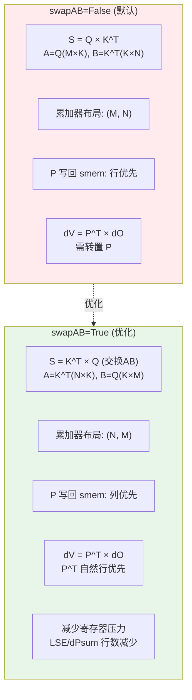

# FA4 CuTeDSL 反向内核深度分析

## 【总】开篇

本篇分析 FlashAttention 4（FA4）CuTeDSL 反向内核的实现。反向传播是注意力机制训练中最关键的瓶颈之一——其计算复杂度和内存访问模式远超前向传播。

**核心结论**：

1. **反向比前向更复杂**：前向仅需一次 GEMM（Q×K^T）+ Softmax + 一次 GEMM（P×V），而反向需要五次 GEMM（S=Q×K^T、dP=dO×V^T、dV=P^T×dO、dK=dS^T×Q、dQ=dS×K），加上逐元素操作（P=exp(S-LSE)、dS=P*(dP-dPsum)），计算密度和同步复杂度显著提升。
2. **三阶段流水线**：反向传播被划分为预处理（Preprocess）→ 主循环（Main Loop）→ 后处理（Postprocess）三个阶段，每个阶段由独立的 kernel 完成，通过 grid dependency control 实现流水线衔接。
3. **swapAB GEMM 布局优化**：通过交换 GEMM 操作的 M/N 维度（swapAB），使得矩阵乘法的操作数布局与共享内存布局匹配，减少寄存器压力和数据搬运开销。

---

## 【分】主体

### 1. flash_bwd.py — FlashAttentionBackwardSm80

#### 1.1 类概述

`FlashAttentionBackwardSm80` 是 Ampere 架构（SM80）的反向传播内核，从 Cutlass C++ 的 `mainloop_bwd_sm80.hpp` 重写为 CuTeDSL。它是整个反向传播的核心计算引擎，负责在一个 CUDA block 内完成对单个 n_block（KV 分块）的所有 m_block（Q 分块）的遍历。

#### 1.2 `__init__` 参数详解

```python
class FlashAttentionBackwardSm80:
    def __init__(
        self,
        dtype: Type[cutlass.Numeric],       # 数据类型：FP16 或 BF16
        head_dim: int,                        # Q/K 头维度
        head_dim_v: Optional[int] = None,     # V 头维度（可与 Q/K 不同）
        qhead_per_kvhead: int = 1,            # GQA 比率
        m_block_size: int = 64,               # Q 分块大小（M 维度）
        n_block_size: int = 128,              # KV 分块大小（N 维度）
        num_stages_Q: int = 2,                # Q 的流水线级数
        num_stages_dO: int = 2,               # dO 的流水线级数
        num_threads: int = 256,               # 线程数
        pack_gqa: bool = False,               # 是否打包 GQA
        is_causal: bool = False,              # 是否因果掩码
        SdP_swapAB: bool = False,             # S/dP GEMM 是否交换 AB
        dKV_swapAB: bool = False,             # dK/dV GEMM 是否交换 AB
        dQ_swapAB: bool = False,              # dQ GEMM 是否交换 AB
        AtomLayoutMSdP: int = 1,              # SdP MMA 的 Atom 布局 M 维
        AtomLayoutNdKV: int = 8,              # dKV MMA 的 Atom 布局 N 维
        AtomLayoutMdQ: int = 1,               # dQ MMA 的 Atom 布局 M 维
        V_in_regs: bool = False,              # V 是否保持在寄存器中
        score_mod: cutlass.Constexpr | None = None,  # 自定义分数修改
        score_mod_bwd: cutlass.Constexpr | None = None,  # 分数修改的反向
    ):
```

**关键设计决策**：

- **head_dim 填充到 32 的倍数**：反向内核对 dQ/dK/dV 的累加器布局要求更严格的对齐（比前向的 16 更严格），因此将 `head_dim_padded` 向上取整到 32 的倍数。代码注释明确指出："padding head_dim to a multiple of 32 (stricter than fwd's 16) due to backward kernel register layout requirements for dQ/dK/dV accumulation"。

- **swapAB 三元组**：三个独立的 swapAB 标志分别控制三组 GEMM 操作的布局：
  - `SdP_swapAB`：控制 S=Q×K^T 和 dP=dO×V^T 的布局
  - `dKV_swapAB`：控制 dV=P^T×dO 和 dK=dS^T×Q 的布局
  - `dQ_swapAB`：控制 dQ=dS×K 的布局

- **Mma_dKV_is_RS 优化**：当 `AtomLayoutMSdP==1`、`AtomLayoutNdKV==num_mma_warps`、`SdP_swapAB==True` 且 `dKV_swapAB==False` 时，dKV 的 GEMM 操作数 A（P/dS）可以直接从寄存器读取，无需经过共享内存，这显著减少了共享内存压力和同步开销。

#### 1.3 共享内存布局

SM80 的共享内存布局使用 `sm80_utils.get_smem_layout_atom` 构建，通过 `cute.tile_to_shape` 扩展到完整的 tile 大小：

```python
sQ_layout_atom = sm80_utils.get_smem_layout_atom(self.dtype, self.head_dim_padded)
self.sQ_layout = cute.tile_to_shape(
    sQ_layout_atom, (self.m_block_size, self.head_dim_padded, self.num_stages_Q), (0, 1, 2),
)
```

共享内存包含以下 buffer：
- **sQ**：Q 分块，支持多级流水线（`num_stages_Q`）
- **sK**：K 分块，单级
- **sV**：V 分块，单级（当 `V_in_regs` 时与 sQ 共享内存）
- **sdO**：dO 分块，支持多级流水线（`num_stages_dO`）
- **sP/sdS**：P 和 dS 共享同一布局（`sPdS_layout`），因为它们不会同时使用
- **sLSE/sdPsum**：LSE 和 dPsum 的统计量

当 `V_in_regs=True` 时，V 在 prologue 阶段被加载到寄存器中，sQ 和 sV 共享同一块共享内存（`share_QV_smem=True`），这节省了共享内存但增加了寄存器压力。

#### 1.4 主循环：compute_one_m_block

这是反向传播的核心计算逻辑。对于每个 m_block（Q 的行分块），执行以下步骤：

**步骤 1：GEMM S = Q × K^T**

```python
acc_S = cute.make_rmem_tensor(acc_shape_SdP, cutlass.Float32)
acc_S.fill(0.0)
sm80_utils.gemm(
    mma_params.thr_mma_sdp, acc_S, mma_params.tSrQ, mma_params.tSrK,
    smem_copy_params.tSsQ[None, None, None, smem_pipe_read_q],
    smem_copy_params.tSsK,
    smem_copy_params.smem_thr_copy_QdO, smem_copy_params.smem_thr_copy_KV,
    swap_AB=self.SdP_swapAB,
)
```

**步骤 2：P = exp(S * scale_log2 - LSE)**

重计算注意力分数 P，而非从前向传播中存储。这是 FlashAttention 的核心设计——用重计算换内存：

```python
for r in cutlass.range(cute.size(acc_S_mn, mode=[0]), unroll_full=True):
    acc_S_mn[r, None].store(cute.math.exp2(
        acc_S_mn[r, None].load() * softmax_scale_log2 - tLSErLSE[r], fastmath=True
    ))
```

**步骤 3：GEMM dP = dO × V^T**

```python
acc_dP = cute.make_rmem_tensor(acc_shape_SdP, cutlass.Float32)
acc_dP.fill(0.0)
sm80_utils.gemm(
    mma_params.thr_mma_sdp, acc_dP, mma_params.tdPrdO, mma_params.tdPrV,
    smem_copy_params.tdPsdO[None, None, None, smem_pipe_read_do],
    smem_copy_params.tdPsV,
    ...
)
```

**步骤 4：dS = P * (dP - dPsum)**

这是反向传播的关键逐元素操作：

```python
for r in cutlass.range(cute.size(acc_dP_mn, mode=[0]), unroll_full=True):
    grad_val = acc_S_mn[r, None].load() * (acc_dP_mn[r, None].load() - tLSErdPsum[r])
    acc_dP_mn[r, None].store(grad_val)
```

**步骤 5：GEMM dV += P^T × dO**

```python
sm80_utils.gemm(
    mma_params.thr_mma_dkv, mma_params.acc_dV, tdVrP, mma_params.tdVrdO,
    smem_copy_params.tdVsPt,
    smem_copy_params.tdVsdOt[None, None, None, smem_pipe_read_do],
    ...
    A_in_regs=self.Mma_dKV_is_RS,
    swap_AB=self.dKV_swapAB,
)
```

**步骤 6：GEMM dK += dS^T × Q**

```python
sm80_utils.gemm(
    mma_params.thr_mma_dkv, mma_params.acc_dK, tdKrdS, mma_params.tdKrQ,
    smem_copy_params.tdKsdSt,
    smem_copy_params.tdKsQt[None, None, None, smem_pipe_read_q],
    ...
)
```

**步骤 7：GEMM dQ = dS × K（原子加到全局内存）**

```python
acc_dQ = cute.make_rmem_tensor(acc_shape_dQ, cutlass.Float32)
acc_dQ.fill(0.0)
sm80_utils.gemm(
    mma_params.thr_mma_dq, acc_dQ, mma_params.tdQrdS, mma_params.tdQrK,
    smem_copy_params.tdQsdS, smem_copy_params.tdQsKt,
    ...
)
# 原子加到全局 dQaccum
for i in cutlass.range(cute.size(acc_dQ_atomic), unroll_full=True):
    utils.atomic_add_fp32(acc_dQ_atomic[i], utils.elem_pointer(tdQgdQaccum_atomic, i))
```

dQ 的写入使用原子加法（`atomic_add_fp32`），因为不同的 n_block 会贡献同一个 m_block 的 dQ 梯度。

#### 1.5 Epilogue：dK/dV 写回

在主循环结束后，累加完成的 dK 和 dV 需要写回全局内存。对于 `qhead_per_kvhead==1` 的情况，使用共享内存中转（rmem→smem→gmem）以获得更宽的向量化写入；对于 GQA（`qhead_per_kvhead>1`），使用原子加法将 float32 累加值写入全局内存。

---

### 2. flash_bwd_sm90.py — FlashAttentionBackwardSm90

#### 2.1 Hopper 架构优化

SM90 内核在 SM80 基础上引入了多项 Hopper 特有优化：

**TMA（Tensor Memory Accelerator）**：使用 `cpasync.CopyBulkTensorTileG2SOp` 和 `CopyBulkTensorTileS2GOp` 替代 SM80 的 `cpasync.CopyG2SOp`，实现硬件加速的张量 tile 加载/存储，减少线程参与数据搬运的开销。

**WGMMA（Warp Group Matrix Multiply-Accumulate）**：使用 `warpgroup` 指令替代 SM80 的 `warp.MmaF16BF16Op`，每个 warp group（4个warp，128线程）协同执行 64×N×16 的矩阵乘法，吞吐量大幅提升。

**Producer-Consumer 分离**：SM90 将线程分为生产者（1个warp负责 TMA 加载）和消费者（2-3个warp group负责 MMA 计算），通过 TMA Pipeline 实现异步数据流：

```python
if warp_idx < 4:  # Producer warps
    cute.arch.setmaxregister_decrease(self.num_producer_regs)
    if warp_idx == 0:
        self.load(...)    # TMA 加载 Q/K/V/dO
    if warp_idx == 1:
        self.dQaccum_store(...)  # dQ 累加值写回
else:  # Consumer warp groups
    cute.arch.setmaxregister_increase(self.num_mma_regs_wg0)
    self.mma(...)
```

**寄存器分配精细控制**：通过 `setmaxregister_decrease/increase` 动态调整寄存器上限：
- Producer warp：24个寄存器
- MMA warp group 0：240-256个寄存器
- MMA warp group 1：224-240个寄存器

#### 2.2 TMA Pipeline

SM90 使用 `PipelineTmaAsync` 管理异步数据流：

```python
pipeline_Q = pipeline.PipelineTmaAsync.create(
    barrier_storage=storage.mbar_ptr_Q.data_ptr(),
    num_stages=self.Q_stage,
    producer_group=pipeline_producer_group,
    consumer_group=pipeline_consumer_group,
    tx_count=self.tma_copy_bytes["Q"] + self.tma_copy_bytes["LSE"],
    defer_sync=True,
)
```

Pipeline 的生产者-消费者同步通过 barrier（mbarrier）实现，支持多级缓冲（Q_stage=2 时双缓冲 Q 和 LSE）。

#### 2.3 mma_one_m_block：五阶段 GEMM 流水线

SM90 的 `mma_one_m_block` 方法实现了更精细的五阶段 GEMM 流水线：

1. **GEMM 1**：S = Q @ K^T（WGMMA，从 smem 读取 Q 和 K）
2. **GEMM 2**：dP = dO @ V^T（WGMMA，与 GEMM1 使用相同的 tiled_mma）
3. **Pointwise 1**：P = exp(S * scale_log2 - LSE)，将 f32 累加器转为 f16
4. **Pointwise 2**：dS = P * (dP - dPsum)，将 f32 累加器转为 f16
5. **GEMM 3**：dV += P^T @ dO（WGMMA，P 从寄存器或 smem 读取）
6. **GEMM 4**：dQ = dS @ K（WGMMA，结果通过 smem 中转后 TMA 写回）
7. **GEMM 5**：dK += dS^T @ Q（WGMMA，dS 从寄存器或 smem 读取）

P 和 dS 的 R2S（Register to Shared Memory）使用 `copy_utils.get_smem_store_C` 实现 position-independent 的存储，避免跨 warp group 的同步问题。

#### 2.4 dQ 累加与存储

SM90 使用独立的 warp（warp 1）负责 dQ 累加值的 TMA 写回，通过 NamedBarrier 与 MMA warp groups 同步：

```python
cute.arch.barrier(
    barrier_id=int(NamedBarrierBwd.dQEmptyWG0) + warp_group_idx,
    number_of_threads=self.num_threads_per_warp_group + cute.arch.WARP_SIZE,
)
```

MMA warp group 将 dQ 写入 smem 的 `sdQaccum`，然后 dQaccum_store warp 通过 `cpasync_reduce_bulk_add_f32` 执行 TMA reduce-add 操作，将 smem 中的 dQ 累加到全局内存。

#### 2.5 dQ_single_wg 优化

当 `dQ_single_wg=True` 时，仅 WG0 计算 dQ GEMM，WG1 跳过。这减少了 dQ 的寄存器开销，允许 WG0 使用更多寄存器（256 vs 240）：

```python
if dQ_single_wg:
    assert self.num_wg_mma == 2, "dQ_single_wg only supports 2 warp groups"
self.num_wg_dQ = 1 if dQ_single_wg else self.num_wg_mma
```

#### 2.6 确定性模式

SM90 支持确定性反向传播（`deterministic=True`），通过 semaphore 确保 dQ 和 dK/dV 的写入顺序：

```python
if const_expr(self.deterministic):
    TileScheduler = SingleTileLPTBwdScheduler  # 线程块级持久化调度
```

确定性模式使用 `SingleTileLPTBwdScheduler` 调度器，通过 semaphore 控制不同 n_block 对同一 m_block 的 dQ 写入顺序，以及不同 Q head 对同一 KV head 的 dK/dV 写入顺序。

---

### 3. flash_bwd_sm100.py — FlashAttentionBackwardSm100

#### 3.1 Blackwell 架构特性

SM100（Blackwell）内核引入了多项架构级创新：

**TCGEN05（Tensor Core Generation 5）**：使用 `tcgen05` 指令替代 WGMMA，支持 2-CTA（Cross-Thread-Group-Address）操作，允许两个 CTA 协同执行一个更大的 GEMM tile。

**TMEM（Tensor Memory）**：Blackwell 引入了片上张量内存，用于存储 MMA 的累加器和操作数。SM100 内核将 S、P、dP、dS、dK、dV、dQ 的累加器都分配在 TMEM 中：

```python
self.tmem_S_offset = 0
self.tmem_P_offset = 0  # overlap with S
self.tmem_dV_offset = self.tmem_S_offset + self.tile_n
self.tmem_dP_offset = self.tmem_dV_offset + self.tile_hdimv
self.tmem_dQ_offset = (self.tmem_S_offset + (self.tile_hdim // 2)) if self.use_2cta_instrs else self.tmem_dP_offset
self.tmem_dK_offset = self.tmem_dP_offset + self.tile_m
self.tmem_dS_offset = self.tmem_dP_offset  # overlap with dP
```

注意 TMEM 的重叠复用——S 和 P 共享同一区域（因为 S 转换为 P 后不再需要），dP 和 dS 共享同一区域。

**2-CTA 支持**：当 `use_2cta_instrs=True` 且 `cluster_size=2` 时，两个 CTA 组成一个 cluster，协同处理更大的 tile。MMA tiler 在 N 维度上翻倍：

```python
self.mma_tiler_kq = (self.cta_group_size * tile_n, tile_m, self.tile_hdim)
```

**16 个 Warp 的分工**：SM100 使用 512 个线程（16 个 warp），分工如下：
- Warp 0-3：Reduce warps（dQ 累加值归约）
- Warp 4-11：Compute warps（MMA 计算）
- Warp 12：MMA warp（TCGEN05 指令发射）
- Warp 13：Load warp（TMA 加载）
- Warp 14：Relay warp（数据中继）
- Warp 15：Empty warp（占位）

#### 3.2 五组 Tiled MMA

SM100 定义了五组独立的 Tiled MMA 操作：

```python
# S.T = K @ Q.T（注意：SM100 使用 K@Q.T 而非 Q@K.T）
tiled_mma_S = sm100_utils_basic.make_trivial_tiled_mma(
    self.q_dtype, tcgen05.OperandMajorMode.K, tcgen05.OperandMajorMode.K,
    self.acc_dtype, self.cta_group, self.mma_tiler_kq[:2],
)
# dP.T = V @ dO.T
tiled_mma_dP = sm100_utils_basic.make_trivial_tiled_mma(...)
# dV += P.T @ dO（P 从 TMEM 读取）
tiled_mma_dV = sm100_utils_basic.make_trivial_tiled_mma(
    ..., a_source=tcgen05.OperandSource.TMEM,
)
# dK += dS.T @ Q（dS 从 TMEM 或 SMEM 读取）
tiled_mma_dK = sm100_utils_basic.make_trivial_tiled_mma(
    ..., a_source=mma_dK_a_src,
)
# dQ = dS @ K
tiled_mma_dQ = sm100_utils_basic.make_trivial_tiled_mma(...)
```

与 SM80/90 不同，SM100 的 S 和 dP 计算使用转置形式（K@Q.T 和 V@dO.T），这是 TCGEN05 指令的布局要求。

#### 3.3 Block Sparse 支持

SM100 内核原生支持 Block Sparse Attention，通过 `blocksparse_tensors` 参数传入稀疏掩码。稀疏模式下的 m_block 遍历不再是连续的，而是根据稀疏掩码动态确定：

```python
total_m_block_cnt = get_total_q_block_count_bwd(
    blocksparse_tensors, batch_idx, head_idx, n_block,
    subtile_factor=self.subtile_factor, m_block_max=m_block_max,
)
```

---

### 4. flash_bwd_sm120.py

该文件在当前代码库中不存在。FA4 的 SM120（下一代架构）支持尚未实现。

---

### 5. flash_bwd_preprocess.py — 反向传播预处理

#### 5.1 功能概述

预处理内核计算反向传播所需的统计量，其核心计算为：

$$D_i = \sum_j (dO_{ij} \cdot O_{ij})$$

即 dO 与 O 的逐元素点积在 head_dim 维度上的求和。这个值在后续的 dS 计算中作为行级归一化因子使用。

代码注释给出了完整的数学推导：

```
dS_ij = P_ij * (dP_ij - D_i)                     [标准形式]
当 LSE 可微时，d(loss)/d(S_ij) 获得额外项 dLSE_i * P_ij
（因为 d(LSE_i)/d(S_ij) = P_ij），得到：
dS_ij = P_ij * (dP_ij - D_i) + dLSE_i * P_ij
      = P_ij * (dP_ij - (D_i - dLSE_i))
因此主反向内核不变，只需在此处将 D 替换为 D' = D - dLSE。
```

#### 5.2 核心计算

```python
# 加载 O 和 dO 到寄存器
tOrO = cute.make_rmem_tensor_like(tOgO)
tOrdO = cute.make_rmem_tensor_like(tOgdO)
# 逐元素乘法并沿 head_dim 维度归约
pdpsum = (tOrO.load().to(Float32) * tOrdO.load().to(Float32)).reduce(
    cute.ReductionOp.ADD, init_val=0.0, reduction_profile=(0, None, 1)
)
# Warp 级归约
pdpsum = utils.warp_reduce(pdpsum, operator.add, width=threads_per_row)
```

#### 5.3 Grid Dependency Control

预处理内核使用 `use_pdl=True` 启动，允许 GPU 在前一个 kernel 仍在运行时就开始执行。通过 `griddepcontrol_wait` 和 `griddepcontrol_launch_dependents` 确保数据依赖：

```python
if const_expr(self.use_pdl):
    cute.arch.griddepcontrol_wait()  # 等待前向/上游 kernel 完成
# ... 计算 ...
if const_expr(self.use_pdl):
    cute.arch.griddepcontrol_launch_dependents()  # 通知下游 kernel 可以开始
```

#### 5.4 dQaccum 清零

预处理内核还负责将 `dQaccum` 张量清零，因为主循环中的 dQ 使用原子加法累加：

```python
if const_expr(mdQaccum is not None):
    zero = cute.make_rmem_tensor_like(tdQgdQaccum)
    zero.fill(0.0)
    cute.copy(gmem_tiled_copy_dQaccum, zero, tdQgdQaccum)
```

#### 5.5 LSE log2 转换

如果提供了 LSE，预处理内核还计算 `LSE * log2(e)` 并存储到 `mLSElog2`，供主循环中的 `exp2` 运算使用：

```python
if tidx < seqlen_q_rounded - m_block * self.tile_m:
    gLSElog2[tidx] = lse * LOG2_E if lse != -Float32.inf else 0.0
```

---

### 6. flash_bwd_postprocess.py — 反向传播后处理

#### 6.1 功能概述

后处理内核将主循环输出的 float32 累加梯度（`dQaccum`）转换为最终的数据类型（FP16/BF16）并应用缩放因子：

$$dQ_{final} = dQ_{accum} \times \text{softmax\_scale}$$

#### 6.2 多架构支持

后处理内核支持 SM80、SM90、SM100 三种架构，通过 `arch` 参数选择不同的 MMA 和拷贝策略：

```python
if const_expr(self.arch // 10 in [8, 12]):
    # Ampere: 使用 warp-level MMA 布局
    tiled_mma = cute.make_tiled_mma(
        warp.MmaF16BF16Op(self.dtype, Float32, (16, 8, 16)), atom_layout_dQ, ...
    )
elif const_expr(self.arch // 10 == 9):
    # Hopper: 使用 WGMMA 布局
    tiled_mma = sm90_utils_basic.make_trivial_tiled_mma(...)
else:
    # Blackwell: 使用 TCGEN05 布局
    tiled_mma = sm100_utils_basic.make_trivial_tiled_mma(...)
```

#### 6.3 数据流

后处理的数据流为：GMEM(dQaccum, f32) → SMEM → RMEM → 缩放+类型转换 → SMEM → RMEM → GMEM(dQ, f16/bf16)

这个看似冗长的流程是为了最大化内存合并写入：
1. **G→S**：异步批量加载 dQaccum 到 smem
2. **S→R**：从 smem 加载到寄存器，使用 MMA 分区布局
3. **R→R**：乘以 scale 并转换数据类型
4. **R→S**：使用 `tiled_copy_C` 写回 smem，获得更好的向量化布局
5. **S→R→G**：从 smem 读取并通过合并写入存储到 gmem

#### 6.4 2-CTA 指令支持

当 `use_2cta_instrs=True` 时，后处理使用 TCGEN05 的 TMEM 加载指令进行 dQ 累加值的归约：

```python
tmem_load_atom = cute.make_copy_atom(
    tcgen05.copy.Ld32x32bOp(tcgen05.copy.Repetition(self.dQ_reduce_ncol)), Float32
)
tiled_tmem_ld = tcgen05.make_tmem_copy(tmem_load_atom, tdQtdQ)
```

dQ 累加值按 `dQ_reduce_ncol` 列分块归约，通过多阶段流水线完成。

---

### 7. sm100_hd256_2cta_fmha_backward.py

该文件在当前代码库中不存在。hdim=256 的 2-CTA 反向内核可能尚未实现或使用了不同的文件命名。

---

### 8. 反向传播数学推导

#### 8.1 前向传播回顾

FlashAttention 的前向传播计算：

$$S_{ij} = \frac{Q_i \cdot K_j^T}{\sqrt{d}}$$

$$P_{ij} = \text{softmax}(S_i)_j = \frac{e^{S_{ij}}}{\sum_j e^{S_{ij}}}$$

$$O_i = \sum_j P_{ij} V_j$$

其中 LSE（Log-Sum-Exp）定义为：

$$\text{LSE}_i = \log \sum_j e^{S_{ij}}$$

#### 8.2 dV 的推导

$$\frac{\partial L}{\partial V_j} = \sum_i P_{ij}^T \cdot \frac{\partial L}{\partial O_i} = P^T \cdot dO$$

这是一个标准的矩阵乘法 dV = P^T × dO。

#### 8.3 dS 的推导

$$\frac{\partial L}{\partial S_{ij}} = \frac{\partial L}{\partial P_{ij}} \cdot \frac{\partial P_{ij}}{\partial S_{ij}}$$

由于 softmax 的雅可比矩阵：

$$\frac{\partial P_{ij}}{\partial S_{ik}} = P_{ij}(\delta_{jk} - P_{ik})$$

因此：

$$dS_{ij} = P_{ij} \cdot (dP_{ij} - \sum_k P_{ik} \cdot dP_{ik})$$

其中 $dP_{ij} = dO_i \cdot V_j^T$，而 $\sum_k P_{ik} \cdot dP_{ik} = \sum_k P_{ik} \cdot (dO_i \cdot V_k^T) = dO_i \cdot O_i^T = D_i$。

所以：

$$dS_{ij} = P_{ij} \cdot (dP_{ij} - D_i)$$

其中 $D_i = \sum_j dO_{ij} \cdot O_{ij}$，这正是预处理内核计算的值。

#### 8.4 dQ 的推导

$$\frac{\partial L}{\partial Q_i} = \sum_j \frac{\partial L}{\partial S_{ij}} \cdot \frac{\partial S_{ij}}{\partial Q_i} = \sum_j dS_{ij} \cdot K_j \cdot \frac{1}{\sqrt{d}}$$

即 dQ = dS × K × softmax_scale。

#### 8.5 dK 的推导

$$\frac{\partial L}{\partial K_j} = \sum_i \frac{\partial L}{\partial S_{ij}} \cdot \frac{\partial S_{ij}}{\partial K_j} = \sum_i dS_{ij}^T \cdot Q_i \cdot \frac{1}{\sqrt{d}}$$

即 dK = dS^T × Q × softmax_scale。

#### 8.6 汇总

| 梯度 | 公式 | GEMM 操作 |
|------|------|-----------|
| dV | P^T × dO | (N×M) × (M×d_v) → (N×d_v) |
| dS | P * (dP - D) | 逐元素操作 |
| dQ | dS × K × scale | (M×N) × (N×d) → (M×d) |
| dK | dS^T × Q × scale | (N×M) × (M×d) → (N×d) |

---

### 9. 配图

#### 9.1 反向传播三阶段流程图

```mermaid
flowchart TD
    A[Preprocess Kernel] --> B[Main Loop Kernel]
    B --> C[Postprocess Kernel]

    subgraph Preprocess["阶段1: 预处理"]
        A1[加载 O 和 dO] --> A2[计算 D_i = sum dO*O]
        A2 --> A3[可选: D' = D - dLSE]
        A3 --> A4[清零 dQaccum]
        A4 --> A5[计算 LSE * log2e]
    end

    subgraph MainLoop["阶段2: 主循环 (遍历 n_block)"]
        B1[加载 K, V 分块] --> B2[遍历 m_block]
        B2 --> B3["GEMM: S = Q × K^T"]
        B3 --> B4["P = exp(S * scale - LSE)"]
        B4 --> B5["GEMM: dP = dO × V^T"]
        B5 --> B6["dS = P * (dP - D)"]
        B6 --> B7["GEMM: dV += P^T × dO"]
        B7 --> B8["GEMM: dK += dS^T × Q"]
        B8 --> B9["GEMM: dQ += dS × K (atomic)"]
        B9 --> B2
    end

    subgraph Postprocess["阶段3: 后处理"]
        C1[加载 dQaccum (f32)] --> C2[缩放: dQ * softmax_scale]
        C2 --> C3[类型转换: f32 → f16/bf16]
        C3 --> C4[写回 dQ 到全局内存]
    end

    A -.->|griddepcontrol| B
    B -.->|dQaccum, dK, dV| C
```

#### 9.2 dQ/dK/dV 计算数据流图

```mermaid
flowchart LR
    Q[Q<br/>(M×d)] --> S_GEMM["S = Q×K^T<br/>(M×N)"]
    K[K<br/>(N×d)] --> S_GEMM
    K --> dQ_GEMM["dQ = dS×K<br/>(M×d)"]

    S_GEMM --> P["P = softmax(S)<br/>(M×N)"]
    LSE["LSE<br/>(M)"] --> P

    dO["dO<br/>(M×d_v)"] --> dP_GEMM["dP = dO×V^T<br/>(M×N)"]
    V["V<br/>(N×d_v)"] --> dP_GEMM

    P --> dS["dS = P*(dP-D)<br/>(M×N)"]
    dP_GEMM --> dS
    D["D=sum(dO*O)<br/>(M)"] --> dS

    P --> dV_GEMM["dV = P^T×dO<br/>(N×d_v)"]
    dO --> dV_GEMM

    dS --> dK_GEMM["dK = dS^T×Q<br/>(N×d)"]
    Q --> dK_GEMM

    dS --> dQ_GEMM

    style Q fill:#e1f5fe
    style K fill:#e1f5fe
    style V fill:#e1f5fe
    style dO fill:#fff3e0
    style dS fill:#fce4ec
    style dQ_GEMM fill:#e8f5e9
    style dK_GEMM fill:#e8f5e9
    style dV_GEMM fill:#e8f5e9
```

#### 9.3 重计算 vs 存储权衡分析图

```mermaid
graph TD
    subgraph Recompute["重计算策略 (FlashAttention)"]
        R1[前向: 不存储 S 和 P] --> R2[反向: 重计算 S = Q×K^T]
        R2 --> R3[重计算 P = softmax(S)]
        R3 --> R4[内存节省: O(N) → O(1)]
        R4 --> R5[额外计算: +1 GEMM]
    end

    subgraph Store["存储策略 (传统方法)"]
        S1[前向: 存储 S 和 P] --> S2[反向: 直接读取 S 和 P]
        S2 --> S3[内存开销: O(M×N) per block]
        S3 --> S4[计算节省: -1 GEMM]
    end

    R5 -.->|权衡| S4
    R4 -.->|权衡| S3

    style Recompute fill:#e3f2fd
    style Store fill:#fce4ec
```

#### 9.4 SM80/90/100 反向内核对比图

```mermaid
graph LR
    subgraph SM80["SM80 (Ampere)"]
        SM80_1["256 线程<br/>8 MMA warps"]
        SM80_2["cpasync G2S<br/>LdMatrix S2R"]
        SM80_3["warp.MmaF16BF16Op<br/>16×8×16"]
        SM80_4["单线程块<br/>无 TMA"]
    end

    subgraph SM90["SM90 (Hopper)"]
        SM90_1["384 线程<br/>2-3 WGs + 1 producer"]
        SM90_2["TMA Bulk Copy<br/>WGMMA"]
        SM90_3["warpgroup MMA<br/>64×N×16"]
        SM90_4["Producer-Consumer<br/>Pipeline"]
        SM90_5["dQ_single_wg 优化"]
    end

    subgraph SM100["SM100 (Blackwell)"]
        SM100_1["512 线程<br/>16 warps 分工"]
        SM100_2["TMA + TMEM<br/>TCGEN05"]
        SM100_3["2-CTA 协同<br/>更大 tile"]
        SM100_4["Block Sparse 原生"]
        SM100_5["TMEM 累加器复用"]
    end

    SM80 --> SM90 --> SM100

    style SM80 fill:#e3f2fd
    style SM90 fill:#e8f5e9
    style SM100 fill:#fff3e0
```



#### 9.5 swapAB GEMM 布局对比图



swapAB 的核心优势在于：当 SdP_swapAB=True 时，累加器的行维度从 M 变为 N。对于每个线程，需要维护的 LSE 和 dPsum 值从 `kBlockM/4` 行减少到更少的行数，从而降低寄存器压力。SM90 中通过 `shuffle_LSE` 和 `shuffle_dPsum` 进一步优化——当 `SdP_swapAB` 且 `tile_hdim<=64` 时，LSE 和 dPsum 在 8 个线程间分布并通过 warp shuffle 共享：

```python
self.shuffle_LSE = self.SdP_swapAB and self.tile_hdim <= 64
self.shuffle_dPsum = self.SdP_swapAB and self.tile_hdim <= 64
```

---

## 【总】收尾

FA4 反向内核通过精细的 GEMM 布局和阶段划分实现高效梯度计算。三个阶段（预处理→主循环→后处理）的划分使得每个 kernel 的寄存器需求和共享内存使用都能独立优化，而 grid dependency control 保证了阶段间的数据依赖正确性。

从 SM80 到 SM100 的演进体现了硬件特性对软件设计的深刻影响：SM80 的同步 cpasync + warp MMA、SM90 的异步 TMA pipeline + WGMMA + producer-consumer 分离、SM100 的 TMEM + TCGEN05 + 2-CTA 协同，每一代架构都带来了根本性的编程模型变革。而 swapAB 布局优化贯穿三代架构，通过交换 GEMM 操作数维度来匹配共享内存布局和减少寄存器压力，是反向内核性能优化的关键手段。

反向传播的五次 GEMM 和两次逐元素操作构成了一个复杂的数据依赖图，FA4 通过重计算策略（不存储 S/P，在反向时重新计算）以额外一次 GEMM 的代价换取了 O(M×N) 的内存节省，这在长序列场景下是决定性的优势。
