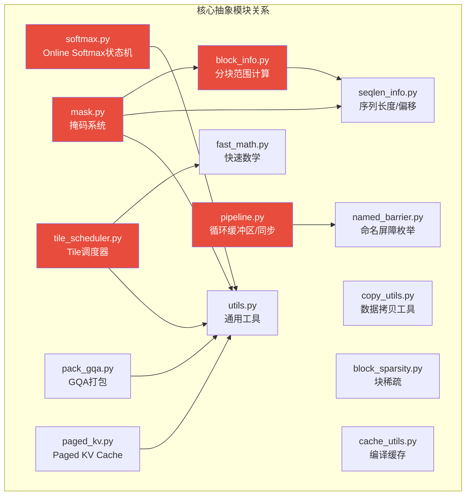
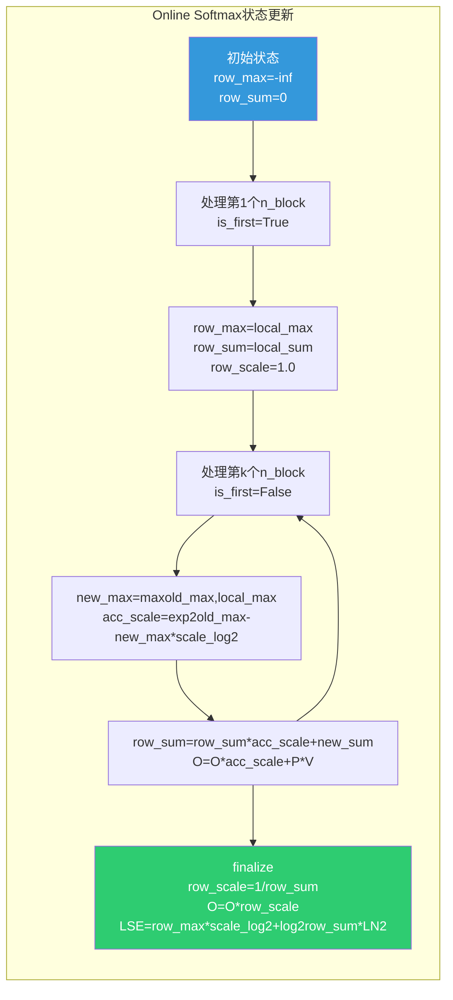
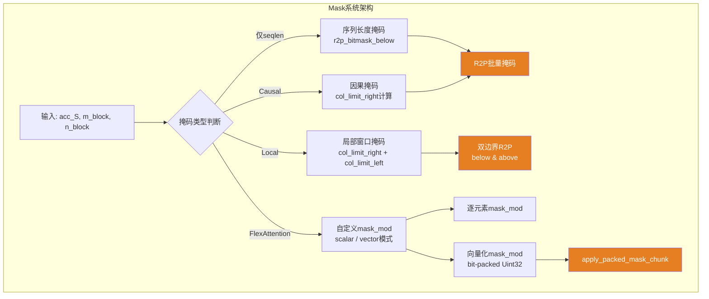
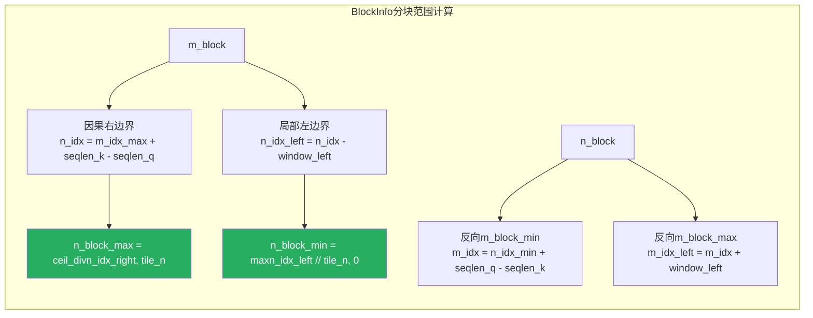
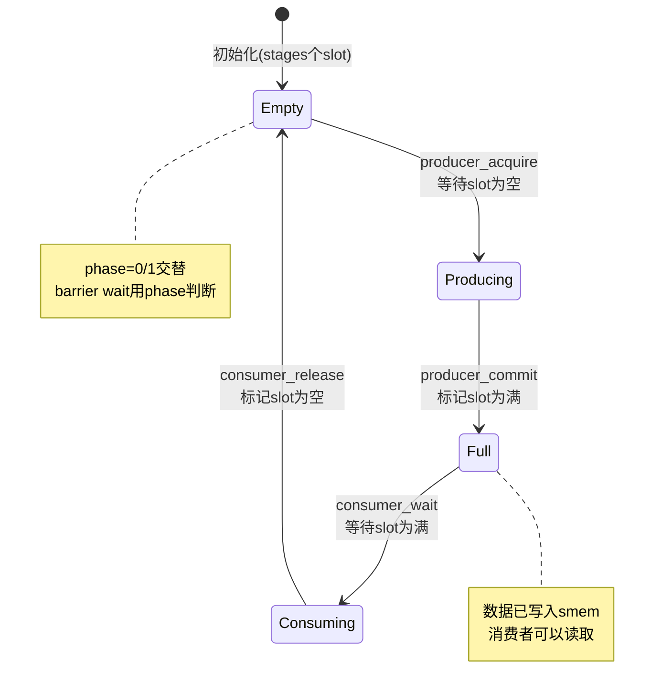
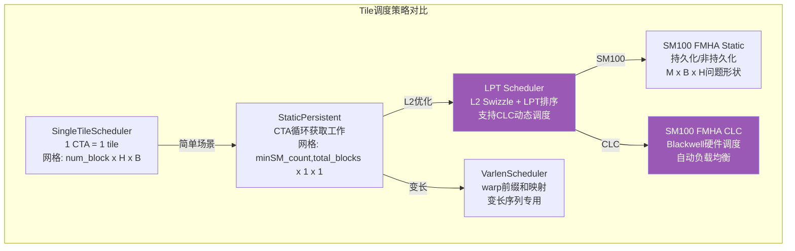
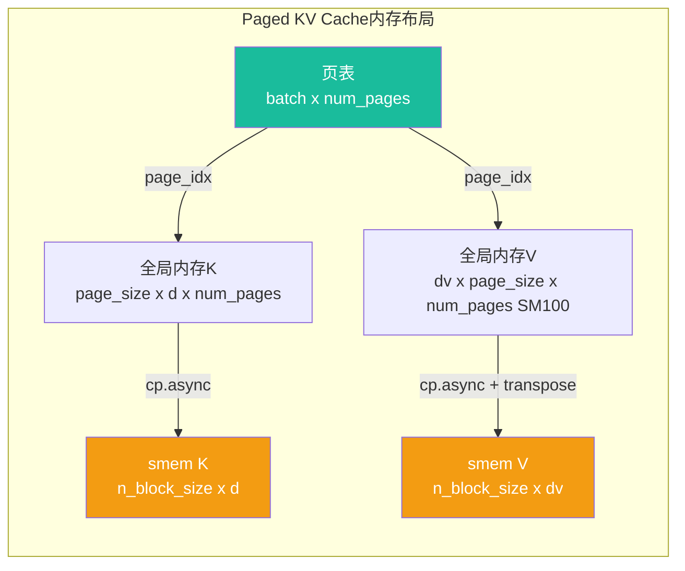

# FA4 核心抽象模块深度分析

## 【总】开篇

FlashAttention 4（FA4）的 `flash_attn/cute/` 目录下包含14个核心抽象模块，它们共同构成了 FA4 的基础设施层。这些模块将算法逻辑与硬件细节彻底解耦：上层 Kernel 只需调用 `Softmax.online_softmax()`、`AttentionMask.apply_mask()`、`BlockInfo.get_n_block_min_max()` 等语义清晰的接口，而底层则由各模块自行处理 SM90/SM100 架构差异、R2P 指令生成、循环缓冲区同步等硬件相关细节。

**核心结论：softmax、mask、block_info、pipeline、tile_scheduler 是最关键的五个抽象。** Softmax 封装了 Online Softmax 的完整状态机；Mask 统一了因果/局部/FlexAttention 三种掩码范式；BlockInfo 将分块范围计算从 Kernel 循环中剥离；Pipeline 实现了生产者-消费者解耦的循环缓冲区；Tile Scheduler 则决定了 CTA 如何映射到问题空间。这五个模块的协同工作，使得 FA4 能够在保持代码可维护性的同时，高效支持 SM90 和 SM100 两种架构。



---

## 【分】主体：14个核心抽象模块详解

### 1. softmax.py —— Online Softmax 状态机

softmax.py 是 FA4 数值稳定性的核心，封装了 Online Softmax 的完整状态更新逻辑。它包含两个主要类：`Softmax`（SM90 通用版本）和 `SoftmaxSm100`（SM100 专用版本），以及两个关键的 score modification 函数。

#### 1.1 Softmax 类（SM90）

`Softmax` 类维护了 Online Softmax 的两个核心状态：`row_max`（行最大值）和 `row_sum`（行指数和），通过 `scale_log2` 参数将缩放因子融合到 exp2 计算中，避免额外的乘法开销。

```python
@dataclass
class Softmax(ParamsBase):
    scale_log2: Float32       # softmax_scale * log2(e)，用于exp2融合
    num_rows: cutlass.Constexpr[int]
    row_max: cute.Tensor      # 每行的当前最大值，初始化为-inf
    row_sum: cute.Tensor      # 每行的当前指数和，初始化为0
    arch: cutlass.Constexpr[int] = 80
```

**`online_softmax()` 方法** 是核心，实现了 FlashAttention 的增量式 softmax 更新：

```python
@cute.jit
def online_softmax(self, acc_S, is_first=False, check_inf=True):
    # 1. 计算新的行最大值（与旧值取max）
    row_max_cur = utils.fmax_reduce(acc_S_row, init_val=row_max[r], arch=arch)
    # 2. 跨warp-group规约
    row_max_cur = cute.arch.warp_reduction_max(row_max_cur, threads_in_group=4)
    # 3. 计算缩放因子：exp2((row_max_prev - row_max_cur) * scale_log2)
    row_scale[r] = cute.math.exp2((row_max_prev - row_max_cur) * scale_log2, fastmath=True)
    # 4. 更新指数和：row_sum = row_sum * row_scale + sum(exp2(acc_S * scale_log2 - row_max_cur * scale_log2))
    acc_S_row_sum = utils.fadd_reduce(acc_S_row_exp, init_val=row_sum[r] * row_scale[r], arch=arch)
```

**`finalize()` 方法** 完成最后的归一化，计算 `row_scale = 1/row_sum` 和 logsumexp：

```python
@cute.jit
def finalize(self, final_scale=1.0, sink_val=None):
    row_scale[r] = cute.arch.rcp_approx(row_sum[r]) * final_scale
    row_sum[r] = (row_max[r] * scale_log2 + cute.math.log2(row_sum_cur, fastmath=True)) * LN2
```

#### 1.2 SoftmaxSm100 类（SM100）

SM100 版本针对单行处理优化，将 `online_softmax` 拆分为更细粒度的操作：

- **`compute_row_max_local()`**：计算局部行最大值
- **`update_row_max()`**：更新全局行最大值，返回 `row_max_safe` 和 `acc_scale`（重缩放因子）
- **`update_row_sum()`**：更新行指数和
- **`scale_subtract_rowmax()`**：使用 `fma_packed_f32x2` 同时完成缩放和减去最大值
- **`apply_exp2_convert()`**：执行 exp2 并转换数据类型，支持 exp2 仿真（`ex2_emu_freq` 参数控制仿真频率）

`rescale_threshold` 是 SM100 的关键优化：当 `acc_scale_ >= -rescale_threshold` 时，跳过重缩放，保持旧的 `row_max`，避免不必要的 O 矩阵重缩放操作。

#### 1.3 call_score_mod() 与 apply_score_mod_inner()

`call_score_mod()` 是 score modification 的统一入口，支持 `aux_tensors` 和 `aux_scalars` 两种辅助数据：

```python
@cute.jit
def call_score_mod(score_mod, score, batch_idx, head_idx, q_idx, kv_idx, seqlen_info, aux_data):
    if cutlass.const_expr(aux_data.scalars is not None):
        return score_mod(score, batch_idx, head_idx, q_idx=q_idx, kv_idx=kv_idx,
                         seqlen_info=seqlen_info, aux_tensors=aux_tensors, aux_scalars=aux_data.scalars)
    return score_mod(score, batch_idx, head_idx, q_idx=q_idx, kv_idx=kv_idx,
                     seqlen_info=seqlen_info, aux_tensors=aux_tensors)
```

`apply_score_mod_inner()` 处理了 Pack-GQA 的索引转换（`floor_if_packed`）、fastdiv 边界检查、以及前向/反向的索引交换（`transpose_indices`），是 score modification 的共享实现层。



---

### 2. mask.py —— 统一掩码系统

mask.py 是 FA4 中最复杂的模块之一，统一了序列长度掩码、因果掩码、局部窗口掩码和 FlexAttention 自定义掩码四种范式。核心类 `AttentionMask` 和 `Sm100FusedMask` 分别服务于 SM90 和 SM100 架构。

#### 2.1 R2P（Register-to-Predicate）位掩码系统

R2P 是 SM90 MMA 累加器特有的掩码技术，通过 32 位 bitmask 批量设置谓词，避免逐元素分支：

```python
MASK_R2P_CHUNK_SIZE: int = 32  # 每个bitmask处理32列

@cute.jit
def r2p_bitmask_below(limit: Int32, s: int) -> Uint32:
    """保留位置 < limit 的元素，其余置为-inf"""
    m = max((s + 1) * MASK_R2P_CHUNK_SIZE - limit, 0)
    return utils.shr_u32(Uint32(0xFFFFFFFF), Uint32(m))

@cute.jit
def r2p_bitmask_above(limit: Int32, s: int) -> Uint32:
    """保留位置 >= limit 的元素，其余置为-inf"""
    n = max(limit - s * MASK_R2P_CHUNK_SIZE, 0)
    return utils.shl_u32(Uint32(0xFFFFFFFF), Uint32(n))
```

`sm90_col_to_r2p_idx()` 将 SM90 MMA 累加器的非连续列索引（0,1,8,9,16,17,...）转换为连续元素索引，`row_to_r2p_idx()` 处理 SM100 后向传递中 warp-group 交错布局的行索引转换。

#### 2.2 AttentionMask 类

`AttentionMask` 类通过 `apply_mask()` 方法统一处理三种掩码路径：

1. **仅序列长度掩码**（`mask_seqlen=True, mask_causal=False, mask_local=False, mask_mod=None`）：使用 R2P 位掩码批量处理越界列
2. **FlexAttention 掩码**（`mask_mod is not None`）：逐元素调用 `call_mask_mod()`，支持 Pack-GQA 的 head_idx 转换和 fastdiv 索引包装
3. **因果/局部掩码**（`mask_causal=True` 或 `mask_local=True`）：计算 `causal_row_offset` 和窗口边界，使用 R2P 或逐列遍历

因果掩码的核心计算：
```python
causal_row_offset = 1 + self.seqlen_k - n_block * self.tile_n - self.seqlen_q - thr_col_offset
col_limit_right = row_idx + causal_row_offset  # 每行的右边界
```

局部窗口掩码在此基础上增加左右窗口：
```python
col_limit_right = row_idx + causal_row_offset + self.window_size_right
col_limit_left = row_idx + causal_row_offset - 1 - self.window_size_left
# R2P: r2p_bitmask_below(col_limit_right_r2p, s) & r2p_bitmask_above(col_limit_left_r2p, s)
```

#### 2.3 SM100 掩码系统

SM100 的 `apply_mask_sm100()` 支持 R2P 和非 R2P 两种路径，以及 FlexAttention 的标量（`apply_mask_mod_sm100_scalar`）和向量化（`apply_mask_mod_sm100_vector`）两种模式。向量化模式将 `mask_mod` 返回的 bit-packed `Uint32` 掩码与序列边界掩码合并，通过 `apply_packed_mask_chunk()` 降级为 R2P 指令。

`Sm100FusedMask` 类提供了 SM100 FMHA 专用的高级掩码接口，通过 `Sm100MaskEnum` 枚举区分 `NO_MASK`、`RESIDUAL_MASK`、`CAUSAL_MASK`、`WINDOW_MASK` 等类型，并计算 leading/trailing masked 和 unmasked 的 trip count，用于将 KV 迭代分为"需要掩码的边界块"和"不需要掩码的中间块"两段，减少掩码开销。



---

### 3. block_info.py —— 分块范围计算

`BlockInfo` 是 FA4 中将分块迭代范围计算从 Kernel 主循环中剥离的关键抽象。它根据因果/局部窗口约束，为每个 m_block 计算合法的 n_block 范围，避免遍历完全被掩码的 KV 块。

#### 3.1 get_n_block_min_max()

```python
@cute.jit
def get_n_block_min_max(self, seqlen_info, m_block, split_idx=0, num_splits=1):
    n_block_max = cute.ceil_div(seqlen_info.seqlen_k, self.tile_n)
    # 因果/右窗口约束：n_block_max受限于当前m_block对应的KV右边界
    if self.is_causal or (self.is_local and self.window_size_right is not None):
        m_idx_max = (m_block + 1) * self.tile_m
        n_idx = m_idx_max + seqlen_info.seqlen_k - seqlen_info.seqlen_q
        n_idx_right = n_idx if self.is_causal else n_idx + self.window_size_right
        n_block_max = min(n_block_max, cute.ceil_div(n_idx_right, self.tile_n))
    # 左窗口约束：n_block_min受限于当前m_block对应的KV左边界
    n_block_min = 0
    if self.is_local and self.window_size_left is not None:
        m_idx_min = m_block * self.tile_m
        n_idx = m_idx_min + seqlen_info.seqlen_k - seqlen_info.seqlen_q
        n_idx_left = n_idx - self.window_size_left
        n_block_min = max(n_idx_left // self.tile_n, 0)
    # Split-KV：将n_block范围进一步切分给不同的split
    if self.is_split_kv:
        num_n_blocks_per_split = (n_block_max - n_block_min + num_splits - 1) // num_splits
        n_block_min = n_block_min + split_idx * num_n_blocks_per_split
        n_block_max = min(n_block_min + num_n_blocks_per_split, n_block_max)
    return n_block_min, n_block_max
```

#### 3.2 get_m_block_min_max()

反向传播中，需要根据 n_block 计算 m_block 的范围（因为反向的 S = K @ Q.T）：

```python
@cute.jit
def get_m_block_min_max(self, seqlen_info, n_block):
    # 因果约束：m_block_min受限于当前n_block对应的Q左边界
    if self.is_causal or (self.is_local and self.window_size_right is not None):
        n_idx_min = n_block * self.tile_n
        m_idx = n_idx_min + seqlen_info.seqlen_q - seqlen_info.seqlen_k
        m_idx_right = m_idx if self.is_causal else m_idx - self.window_size_right
        m_block_min = max(0, m_idx_right // self.tile_m)
    # 左窗口约束：m_block_max受限于当前n_block对应的Q右边界
    if self.is_local and self.window_size_left is not None:
        n_idx_max = (n_block + 1) * self.tile_n
        m_idx = n_idx_max + seqlen_info.seqlen_q - seqlen_info.seqlen_k
        m_idx_left = m_idx + self.window_size_left
        m_block_max = min(m_block_max, cute.ceil_div(m_idx_left, self.tile_m))
    return m_block_min, m_block_max
```

#### 3.3 辅助方法

- **`get_n_block_min_causal_local_mask()`**：计算"因果/局部掩码结束位置"，用于 SM100 的分段迭代
- **`get_n_block_min_before_local_mask()`**：计算"局部掩码开始前的位置"，区分需要掩码和不需要掩码的迭代段
- **`get_n_block_k_new_min_max()`**：为 Append-KV 场景计算新 K token 的块范围



---

### 4. seqlen_info.py —— 序列长度与偏移量跟踪

`seqlen_info.py` 将所有与序列长度相关的信息集中管理，避免在 Kernel 中重复读取 `cu_seqlens` 或 `seqused` 张量。

#### 4.1 SeqlenInfo

基础类，管理单个序列的偏移量和长度：

```python
@dataclass(frozen=True)
class SeqlenInfo:
    offset: Int32           # cu_seqlens[batch_idx]
    offset_padded: Int32    # 对齐到tile边界的偏移量（用于编译器对齐假设）
    seqlen: Int32           # 实际序列长度
    has_cu_seqlens: cutlass.Constexpr[bool]
```

`offset_batch()` 方法根据是否有变长（`cu_seqlens`）选择不同的批偏移方式：固定形状直接索引，变长则通过 `domain_offset` 偏移指针。

#### 4.2 SeqlenInfoQK

联合管理 Q 和 K 的序列信息，是 Kernel 中最常用的数据结构：

```python
@dataclass(frozen=True)
class SeqlenInfoQK:
    offset_q: Int32         padded_offset_q: Int32
    offset_k: Int32         padded_offset_k: Int32
    seqlen_q: Int32         seqlen_k: Int32
    m_block_offset: Int32   # 变长时cu_total_m_blocks[batch_idx]
    block_idx_offset: Int32 # 变长时的block索引偏移
    num_n_blocks: Int32     # ceil_div(seqlen_k, tile_n)
```

`offset_batch_Q()` 和 `offset_batch_K()` 支持 ragged tensor（非填充变长序列），通过 `copy_utils.offset_ragged_tensor()` 处理指针偏移。

#### 4.3 SeqlenInfoQKNewK

为 Append-KV 场景扩展，增加了 `leftpad_k`、`seqlen_k_og`（原始 K 长度）、`seqlen_k_new`（新 K 长度）、`seqlen_rotary`（旋转位置编码位置）等字段。

---

### 5. pipeline.py —— 循环缓冲区与生产者-消费者同步

pipeline.py 实现了 FA4 的异步数据加载管线，将数据搬运（生产者）与计算（消费者）解耦，通过循环缓冲区实现重叠执行。

#### 5.1 PipelineStateSimple

轻量级管线状态，用单个 `Int32` 同时编码索引和相位：

```python
class PipelineStateSimple:
    def __init__(self, stages: int, phase_index: Int32):
        self._stages = stages
        self._phase_index = phase_index

    @property
    def index(self):
        return self._phase_index % self._stages  # 循环缓冲区位置

    @property
    def phase(self):
        return self._phase_index // self._stages  # 相位位（用于barrier wait）

    def advance(self):
        self._phase_index += 1  # 推进到下一个slot
```

`make_pipeline_state()` 工厂函数设置生产者和消费者的初始状态：生产者从 `phase_index = stages` 开始（相位为1，表示缓冲区为空），消费者从 `phase_index = 0` 开始（相位为0，表示缓冲区未满）。

#### 5.2 Pipeline 变体

FA4 继承并扩展了 CUTLASS 的多种 Pipeline 实现：

- **`PipelineAsync`**：通用异步管线，增加了 `elect_one_commit` 和 `elect_one_release` 选项，只让 warp 中的一个线程发出 barrier 信号
- **`PipelineCpAsync`**：cp.async 专用管线，支持 `elect_one_release`
- **`PipelineTmaAsync`**：TMA 专用管线，重写 `producer_acquire()` 支持 `extra_tx_count` 参数
- **`PipelineTmaUmma`**：TMA + UMMA 组合管线，只让 leader CTA 发出 arrive 信号
- **`PipelineUmmaAsync`** / **`PipelineAsyncUmma`**：UMMA 相关管线

所有 Pipeline 变体通过 `_PipelineIndexPhaseMixin` 获得 `_w_index_phase` 系列方法，允许直接使用 `(index, phase)` 对而非 `PipelineState` 对象调用同步原语。



---

### 6. tile_scheduler.py —— Tile 调度策略

tile_scheduler.py 是 FA4 工作分配的核心，定义了 CTA（Cooperative Thread Array）如何映射到注意力计算的问题空间。

#### 6.1 SchedulingMode

```python
class SchedulingMode(IntEnum):
    NONE = auto()      # 无调度
    STATIC = auto()    # 静态网格步进
    DYNAMIC = auto()   # 动态持久化
    CLC = auto()       # Cluster Launch Control (Blackwell硬件调度)
```

#### 6.2 调度器族谱

FA4 提供了多种调度器，适配不同场景：

- **`SingleTileScheduler`**：最简单的调度器，每个 CTA 只处理一个 tile，网格形状为 `(num_block, num_head * num_splits, num_batch)`
- **`StaticPersistentTileScheduler`**：持久化内核调度器，CTA 通过网格步进（grid-stride）循环获取工作，网格形状为 `(min(SM_count, total_blocks), 1, 1)`
- **`SingleTileLPTScheduler`**：L2 缓存优化的调度器，通过 L2 swizzle 将访问相同 KV 块的 head/batch 安排到相邻 CTA，并支持 LPT（Longest Processing Time first）排序和 CLC 动态调度
- **`SingleTileLPTBwdScheduler`**：反向传播专用的 LPT 调度器
- **`SingleTileVarlenScheduler`**：变长序列调度器，通过 warp 级前缀和（`warp_prefix_sum`）将线性 tile 索引映射到 `(block, head, batch)` 坐标
- **`Sm100FmhaStaticTileScheduler`** / **`Sm100FmhaClcDynamicTileScheduler`**：SM100 FMHA 专用调度器

#### 6.3 L2 Swizzle 与 LPT

L2 Swizzle 的核心思想：将 `num_head * num_batch` 个头按照 L2 缓存容量分组（`l2_minor = 2^floor(log2(L2_size / per_head_KV_size))`），同一组的头共享 KV 缓存行：

```python
# L2 swizzle坐标映射
bidhb, l2_mod = divmod(self._tile_idx, params.l2_major_divmod)
block, bidhb_residual = divmod(l2_mod, params.l2_minor_divmod)
bidhb_actual = bidhb * params.l2_minor + bidhb_residual
batch_idx, head_idx = divmod(bidhb_actual, params.num_head_divmod)
```

LPT 排序将处理时间最长的块（序列最长的 m_block）优先调度，减少尾部延迟：`block = params.num_block - 1 - block`。

#### 6.4 CLC 动态调度

`ClcState` 封装了 Blackwell CLC 硬件调度的运行时状态，包括硬件调度器（`ClcDynamicPersistentTileScheduler`）和异步管线（`PipelineClcFetchAsync`）：

```python
class ClcState(ParamsBase):
    _hw_scheduler: ClcDynamicPersistentTileScheduler
    _pipeline: PipelineClcFetchAsync
    def prefetch_next_work(self):  # 生产者端：发出CLC查询
        self._pipeline.producer_acquire(self._producer_state)
        mbarrier_addr = self._pipeline.producer_get_barrier(self._producer_state)
        self._hw_scheduler.advance_to_next_work(mbarrier_addr)
    def consumer_wait(self): ...   # 消费者端：等待CLC响应
    def consumer_release(self): ... # 消费者端：释放管线slot
```



---

### 7. copy_utils.py —— 数据拷贝工具

copy_utils.py 提供了多种数据搬运原语，覆盖了 SM90 的 TMA 和 cp.async，以及 SM100 的 TMEM 加载和 bulk 拷贝。

#### 7.1 基础拷贝函数

- **`cvt_copy()`**：带类型转换的拷贝，先转换再拷贝
- **`load_s2r()`**：shared memory 到 register 的自动向量化加载
- **`get_copy_atom()`**：根据数据类型和元素数量创建 CopyAtom，支持异步模式
- **`copy()`**：自动选择 CopyAtom 的通用拷贝接口

#### 7.2 Tiled Copy 工厂

- **`tiled_copy_1d()`**：一维分块拷贝，线程布局为 `(num_threads,)`，值布局为 `(num_copy_elems,)`
- **`tiled_copy_2d()`**：二维分块拷贝，自动计算 `num_copy_bits = gcd(major_mode_size, 128/dtype.width) * dtype.width`

#### 7.3 SM100 专用

- **`make_tmem_copy()`**：创建 TMEM 拷贝的 TiledCopy，处理 SM100 的 TMEM 布局
- **`atomic_add_fp32x4()`**：4 元素 FP32 原子加，使用 PTX `red.global.add.v4.f32`
- **`set_block_rank()`**：Cluster 内 smem 地址映射（`mapa.shared::cluster`）
- **`store_shared_remote_fp32x4()`**：向远程 CTA 的 smem 异步写入（`st.async.shared::cluster`）
- **`cpasync_bulk_s2cluster()`**：Cluster 内 smem 到 smem 的 bulk 拷贝
- **`cpasync_bulk_g2s()`**：Global 到 shared 的 bulk 拷贝
- **`cpasync_reduce_bulk_add_f32()`**：Bulk 归约加法（`cp.reduce.async.bulk.global.shared::cta.bulk_group.add.f32`）

#### 7.4 TMA 集成

- **`tma_get_copy_fn()`**：创建 TMA 拷贝闭包，处理 smem/gmem 分区和 filter_zeros
- **`cpasync_bulk_get_copy_fn()`**：创建 bulk cp.async 拷贝闭包
- **`tma_producer_copy_fn()`**：将 TMA 拷贝与 Pipeline 的 producer 状态绑定

---

### 8. named_barrier.py —— 命名屏障枚举

named_barrier.py 定义了 FA4 各 Kernel 中使用的命名屏障 ID，确保不同同步点使用不同的屏障，避免死锁。

#### 8.1 前向屏障

```python
class NamedBarrierFwd(enum.IntEnum):
    Epilogue = 1          # Epilogue同步
    WarpSchedulerWG1 = 2  # Warp Group 1调度
    WarpSchedulerWG2 = 3  # Warp Group 2调度
    WarpSchedulerWG3 = 4  # Warp Group 3调度
    PFull = 5             # P矩阵已满（生产者→消费者）
    PEmpty = 6            # P矩阵已空（消费者→生产者）
```

#### 8.2 SM100 前向屏障

```python
class NamedBarrierFwdSm100(enum.IntEnum):
    Epilogue = 1
    TmemPtr = 2           # TMEM指针同步
    SoftmaxStatsW0..W7 = 3..10  # 8个softmax统计屏障
```

#### 8.3 反向屏障

```python
class NamedBarrierBwd(enum.IntEnum):
    Epilogue = 1
    WarpSchedulerWG1..WG3 = 2..4
    PdS = 5               # dS同步
    dQFullWG0..WG2 = 6..8   # dQ已满
    dQEmptyWG0..WG2 = 9..11 # dQ已空
```

SM100 反向屏障增加了 `Compute`、`dQaccReduce`、`TmemPtr` 等专用屏障。2-CTA MLA 变体增加了 `Cpasync`、`Softmax`、`SoftmaxStatsFull/Empty` 屏障。

---

### 9. pack_gqa.py —— GQA 打包

pack_gqa.py 实现了 Grouped Query Attention (GQA) 的打包优化，将多个 Q head 折叠到 seqlen 维度，使单个 CTA 能同时处理多个 Q head 共享的 KV 对。

#### 9.1 布局转换

```python
def pack_gqa_layout(T, qhead_per_kvhead, nheads_kv, head_idx):
    # Q/O: (seqlen_q, headdim, nheads, batch) -> ((qhead_per_kvhead, seqlen_q), headdim, nheads_kv, batch)
    # LSE: (seqlen_q, nheads, batch) -> ((qhead_per_kvhead, seqlen_q), nheads_kv, batch)
```

`unpack_gqa_layout()` 执行逆变换，将打包的布局还原为标准布局。

#### 9.2 PackGQA 类

`PackGQA` 类提供了打包 GQA 的完整加载/存储流程：

- **`compute_ptr()`**：计算每个线程负责的 Q 行指针，将打包索引 `(block * m_block_size + row)` 解码为 `(m_idx, h_idx)`
- **`load_Q()`**：通过 `shuffle_sync` 在线程间共享指针，使用 cp.async 异步加载 Q 块
- **`store_O()`**：将输出 O 从寄存器写回全局内存，处理边界条件
- **`store_LSE()`**：存储 log-softmax-exp 值

`make_packgqa_tiled_tma_atom()` 创建支持 GQA 打包的 TMA atom，保持 TMA 维度不变（4D 而非 5D），通过布局重排实现。

---

### 10. paged_kv.py —— Paged KV Cache 管理

`PagedKVManager` 实现了分页 KV 缓存的加载逻辑，将不连续的页面映射为连续的 smem 块。

#### 10.1 核心数据结构

```python
@dataclass
class PagedKVManager(ParamsBase):
    mPageTable: cute.Tensor       # 页表: [batch, num_pages] -> page_id
    mK_paged: cute.Tensor         # 分页K: [page_size, d, num_pages]
    mV_paged: cute.Tensor         # 分页V: [page_size, dv, num_pages] (SM90) 或 [dv, page_size, num_pages] (SM100)
    page_size_divmod: FastDivmodDivisor
    seqlen_k: Int32
    leftpad_k: Int32
```

#### 10.2 加载流程

1. **`load_page_table()`**：加载当前 n_block 对应的页表项，计算每个行的 `(page_idx, page_offset)`
2. **`compute_X_ptr()`**：根据页表项计算 K/V 的全局内存指针
3. **`load_KV()`**：异步加载 K/V 块到 smem，处理边界条件和 SM100 的 V 转置

```python
@cute.jit
def load_page_table(self, n_block):
    for i in cutlass.range(self.page_entry_per_thread, unroll=1):
        row_idx = n_block * self.n_block_size + row
        page_idx, page_offset = divmod(row_idx + self.leftpad_k, self.page_size_divmod)
        self.tPrPage[i] = self.mPageTable[page_idx] if is_valid else 0
        self.tPrPageOffset[i] = page_offset
```

SM100 的 V 在全局内存中是转置布局 `(dv, page_size, num_pages)`，`_flatten_smem_sm100()` 在加载后将 smem 中的 V 转置回 `(page_size, dv)` 布局。



---

### 11. block_sparsity.py —— 块稀疏注意力

block_sparsity.py 为 FlexAttention 的块稀疏模式提供基础设施，包括稀疏张量的验证、归一化和转换。

#### 11.1 核心数据结构

```python
class BlockSparseTensors(NamedTuple):
    mask_block_cnt: cute.Tensor      # 每行的部分贡献者数量
    mask_block_idx: cute.Tensor      # 部分贡献者的n_block索引
    full_block_cnt: cute.Tensor      # 每行的完全贡献者数量（可选）
    full_block_idx: cute.Tensor      # 完全贡献者的n_block索引（可选）
    cu_total_m_blocks: cute.Tensor   # 变长时的累积m_block数（可选）
    cu_block_idx_offsets: cute.Tensor # 变长时的block索引偏移（可选）
    dq_write_order: cute.Tensor      # 反向dQ写入顺序（可选）
```

#### 11.2 验证与归一化

`normalize_block_sparse_config()` 是前向的入口，验证稀疏张量的形状、广播模式，推断 `q_subtile_factor`。`normalize_block_sparse_config_bwd()` 处理反向的 Q 方向索引。

关键约束：`sparse_block_size_kv` 必须等于 `tile_n`，`sparse_block_size_q` 必须是 `q_stage * tile_m` 的倍数。

#### 11.3 dQ 写入顺序

`compute_dq_write_order()` 为反向传播计算确定性写入顺序，通过累积和排名表（rank table）确保死锁自由：

```python
def compute_dq_write_order(fwd_mask_cnt, fwd_mask_idx, bwd_mask_idx, spt=False):
    dense = _ordered_to_dense_simple(fwd_mask_cnt, fwd_mask_idx, num_n)
    cumsum = dense.cumsum(dim=-1)
    rank_table = (cumsum - dense).to(torch.int32)
    if spt:  # Shortest Processing Time first (逆序)
        rank_table = (total_per_m - 1 - rank_table).to(torch.int32)
```

---

### 12. fast_math.py —— 快速数学运算

fast_math.py 目前只包含一个函数 `clz()`（Count Leading Zeros），用于 tile_scheduler 中计算 L2 swizzle 的对数：

```python
@cute.jit
def clz(x: Int32) -> Int32:
    res = Int32(32)
    done = False
    for i in cutlass.range(32):
        if ((1 << (31 - i)) & x) and not done:
            res = Int32(i)
            done = True
    return res
```

在 `SingleTileLPTScheduler.Params.create()` 中，`clz` 用于计算 `swizzle = 1 << log2_floor(size_l2 // size_one_head)`，即 L2 缓存能容纳的头数的最大 2 的幂。

---

### 13. utils.py —— 通用工具集

utils.py 是 FA4 最大的工具模块，提供了从数学运算到内存管理的广泛功能。

#### 13.1 哈希系统

`hash_callable()` 为可调用对象生成确定性哈希，用于 JIT 编译缓存键。它支持 `__cute_hash__` 快速路径、源码/字节码回退、闭包值混合、以及 `__vec_size__` 等 mixer 属性：

```python
def hash_callable(func, mixer_attrs=("_MIXER_ATTRS",), set_cute_hash=True):
    if hasattr(func, "__cute_hash__"):
        base_hash = func.__cute_hash__
    else:
        base_hash = _compute_base_hash(base_func)
    mixer_values = tuple(getattr(func, attr, None) for attr in mixer_attrs)
    # 混合metadata生成最终哈希
```

#### 13.2 Softcap Score Modification

`create_softcap_scoremod()` 和 `create_softcap_scoremod_bwd()` 创建 softcap 限制的 score modification 函数：

```python
def create_softcap_scoremod(softcap_val):
    def scoremod_premask_fn(acc_S_SSA, batch_idx, head_idx, q_idx, kv_idx, seqlen_info, aux_tensors):
        scores = acc_S_SSA / softcap_val
        return softcap_val * cute.math.tanh(scores, fastmath=True)
```

#### 13.3 规约操作

- **`fmax_reduce()`**：行最大值规约，SM100 使用 3 输入 `fmax` 指令优化
- **`fadd_reduce()`**：行求和规约，SM100 使用 `add_packed_f32x2` 指令优化
- **`warp_reduce()`**：通用 warp 级规约，支持自定义二元操作
- **`warp_reduction()`**：可配置线程组大小的规约
- **`warp_prefix_sum()`**：warp 级前缀和，用于变长调度器的坐标映射

#### 13.4 exp2 仿真

`ex2_emulation()` 和 `ex2_emulation_2()` 提供了 exp2 的软件仿真，使用 Sollya 生成的高精度多项式近似（最高 5 阶）：

```python
POLY_EX2 = {
    3: (1.0, 0.695146143436431884765625, 0.227564394474029541015625, 0.077119089663028717041015625),
    ...
}
```

仿真通过 `add_round_down`（PTX `add.rm.ftz.f32`）分离整数和小数部分，小数部分用多项式近似，整数部分通过位移直接构造 IEEE 754 浮点数。

#### 13.5 其他工具

- **`predicate_k()`**：为 K 维度生成边界谓词
- **`shuffle_sync()`**：跨线程数据交换，处理非 32 位对齐的类型
- **`shl_u32()` / `shr_u32()`**：使用 PTX 内联汇编的安全移位，避免 LLVM 移位 UB
- **`compute_softmax_scale_log2()`**：根据是否有 score_mod 决定是否将 `log2(e)` 融入缩放因子
- **`compute_fastdiv_mods()`**：为 FlexAttention 的 aux_tensors 计算快速除法器
- **`scalar_to_ssa()` / `ssa_to_scalar()`**：标量与 SSA 张量的互转
- **`get_batch_from_cu_tensor()`**：二分搜索从累积张量确定 batch 索引

---

### 14. cache_utils.py —— 编译缓存管理

cache_utils.py 实现了 FA4 的 JIT 编译缓存系统，支持内存缓存和持久化磁盘缓存两级结构。

#### 14.1 JITCache（内存缓存）

```python
class JITCache:
    def __init__(self):
        self.cache: dict[CompileKeyType, CallableFunction] = {}
```

简单的字典缓存，键为编译参数元组，值为编译后的函数对象。

#### 14.2 JITPersistentCache（持久化缓存）

继承 `JITCache`，增加磁盘持久化支持：

```python
class JITPersistentCache(JITCache):
    def __setitem__(self, key, fn):
        JITCache.__setitem__(self, key, fn)  # 先写入内存
        self._try_export_to_storage(key, fn)  # 再导出到磁盘

    def __contains__(self, key):
        if JITCache.__contains__(self, key):  # 先查内存
            return True
        return self._try_load_from_storage(key)  # 再查磁盘
```

磁盘缓存使用 SHA256 哈希作为文件名，通过 `FileLock`（基于 `fcntl.flock`）保证并发安全：

```python
class FileLock:
    """使用fcntl.flock的咨询文件锁，支持排他/共享模式"""
    def __enter__(self):
        lock_type = fcntl.LOCK_EX if self.exclusive else fcntl.LOCK_SH
        # 非阻塞轮询，超时后抛出RuntimeError
```

#### 14.3 源码指纹

`_compute_source_fingerprint()` 对 `flash_attn/cute/` 下所有 `.py` 文件计算 SHA256 哈希，混合 Python 版本和 cutlass/tvm_ffi 版本，确保代码变更自动失效缓存：

```python
@lru_cache(maxsize=1)
def _compute_source_fingerprint() -> str:
    h = hashlib.sha256()
    h.update(f"py{sys.version_info.major}.{sys.version_info.minor}".encode())
    h.update(f"cutlass={cutlass.__version__}".encode())
    for src in sorted(cute_root.rglob("*.py")):
        h.update(src.relative_to(cute_root).as_posix().encode())
        h.update(src.read_bytes())
    return h.hexdigest()
```

缓存通过环境变量控制：`FLASH_ATTENTION_CUTE_DSL_CACHE_ENABLED=1` 启用持久化，`FLASH_ATTENTION_CUTE_DSL_CACHE_DIR` 自定义路径。

---

## 【总】收尾

FA4 的14个核心抽象模块构成了一个精心设计的层次化基础设施：

1. **最底层**是 `fast_math.py`、`utils.py`、`cache_utils.py`，提供数学原语、通用工具和编译缓存
2. **中间层**是 `pipeline.py`、`named_barrier.py`、`copy_utils.py`，封装了硬件同步和数据搬运
3. **算法层**是 `softmax.py`、`mask.py`、`block_info.py`、`seqlen_info.py`，实现了注意力算法的核心逻辑
4. **调度层**是 `tile_scheduler.py`，决定了工作分配策略
5. **扩展层**是 `pack_gqa.py`、`paged_kv.py`、`block_sparsity.py`，支持 GQA、分页 KV 和稀疏注意力等高级特性

这种分层设计使得每一层都可以独立演化和优化。例如，SM100 架构的适配主要通过在 `SoftmaxSm100`、`AttentionMask.apply_mask_sm100()`、`Sm100FusedMask` 等子类/方法中添加新路径，而不影响 SM90 的现有逻辑。Pipeline 的多种变体通过 Mixin 和继承组合，避免了代码重复。Tile Scheduler 的协议化设计（`TileSchedulerProtocol`）使得新调度策略可以即插即用。

**核心抽象模块是 FA4 可维护性和可扩展性的基础。** 它们将算法的"做什么"与硬件的"怎么做"彻底分离，使得 FA4 能够在支持多种 GPU 架构、多种注意力变体的同时，保持代码的清晰和可测试性。这种设计哲学也为后续架构（如 SM100+）的适配提供了清晰的扩展路径。
