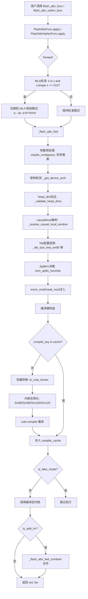
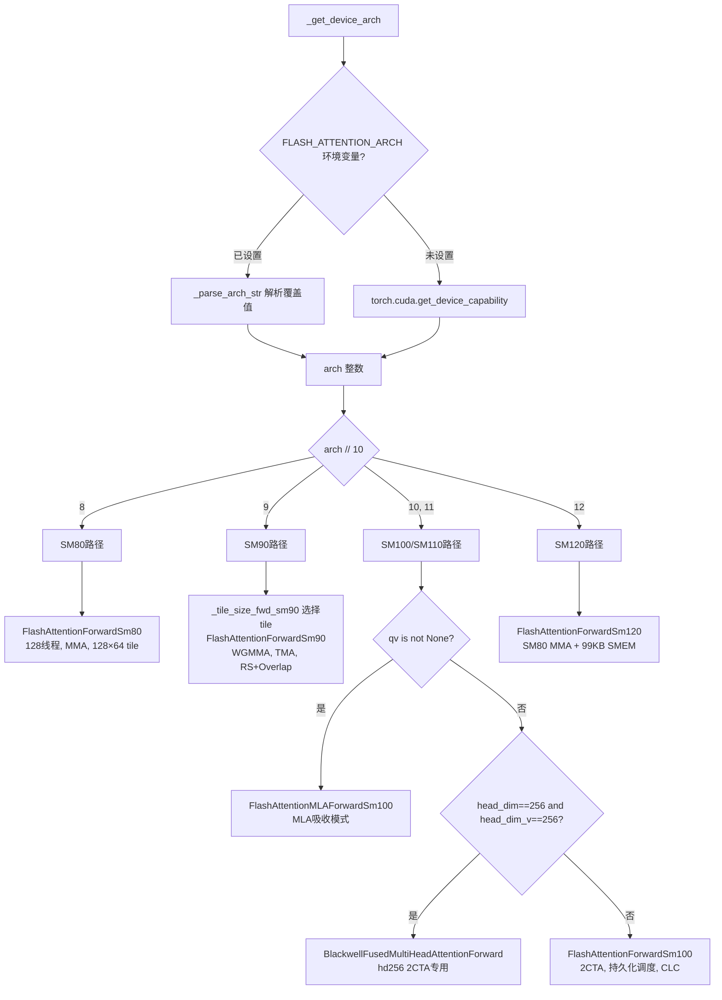
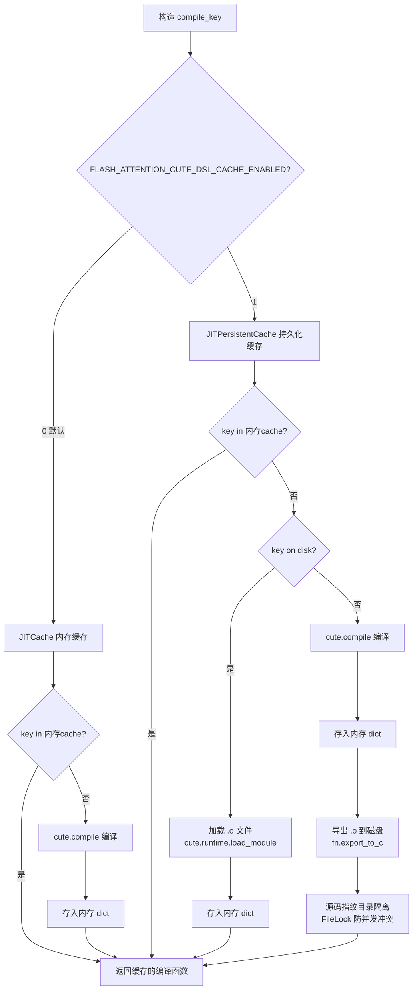
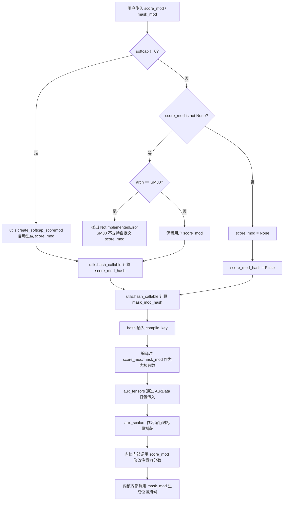

# FA4 公共接口层分析

## 【总】开篇

本篇分析 FA4（FlashAttention 4）的公共接口层，这是用户与 FA4 内核交互的唯一入口。FA4 的接口层代码主要位于 `flash_attn/cute/` 目录下，以 `interface.py` 为核心，辅以 `cute_dsl_utils.py`、`cute_dsl_ptxas.py`、`fa_logging.py` 等工具模块。

**核心结论**：FA4 接口层遵循 **架构检测 → 内核选择 → JIT编译 → 执行** 的四阶段流水线，其中 **支持自定义 `score_mod` 和 `mask_mod`** 是 FA4 区别于 FA2/FA3 的独特能力。这一设计借鉴了 PyTorch FlexAttention 的理念，但通过 CuTe DSL 在 GPU 内核层面原生实现，无需回退到 PyTorch 的逐 token 调度，从而兼顾了灵活性与性能。同时，JIT 编译缓存机制（支持内存缓存和磁盘持久化）确保了首次编译后的零开销复用，使 FA4 真正实现了"一次编写，多架构运行"的目标。

---

## 【分】主体

### 1. `cute/__init__.py`：模块入口与导出

```python
from .interface import (
    flash_attn_func,
    flash_attn_varlen_func,
)

__all__ = [
    "flash_attn_func",
    "flash_attn_varlen_func",
]
```

`__init__.py` 的职责极为精简：仅导出两个公共函数 `flash_attn_func` 和 `flash_attn_varlen_func`。版本号通过 `importlib.metadata` 获取，若未安装则回退到 `"0.0.0"`。这种极简导出策略确保了 API 表面积最小化——用户只需关注两个入口函数，其余所有内部实现细节均被封装。

---

### 2. `cute/interface.py`：核心接口（最重要的文件）

这是 FA4 接口层最核心的文件，超过 2500 行代码，涵盖了从参数验证到内核编译调用的完整流程。

#### 2.1 `_parse_arch_str()`：架构字符串解析

```python
def _parse_arch_str(arch_str):
    """Parse arch string (e.g. 'sm_80', 'sm_90a', '80', '100') to int (e.g. 80, 90, 100)."""
    import re
    match = re.match(r"^(?:sm_?|SM_?)?(\d+)(\d)([af]?)$", arch_str)
    if not match:
        raise ValueError(f"Invalid arch format: {arch_str}")
    major, minor, _ = match.groups()
    return int(major) * 10 + int(minor)
```

该函数支持多种格式的架构字符串输入：`'sm_80'`、`'SM_90a'`、`'80'`、`'100'` 等，统一解析为整数（如 80、90、100）。正则表达式 `^(?:sm_?|SM_?)?(\d+)(\d)([af]?)$` 中的 `[af]?` 用于匹配 Hopper 架构的 `sm_90a` 或未来架构的后缀标识，但在当前实现中该后缀被忽略（`_` 占位），只取主版本号和次版本号进行计算。

#### 2.2 `_get_device_arch()`：设备架构检测（带缓存和环境变量覆盖）

```python
@lru_cache(maxsize=None)
def _get_device_arch():
    arch_override = os.environ.get("FLASH_ATTENTION_ARCH", None)
    if arch_override is not None:
        return _parse_arch_str(arch_override)
    major, minor = torch.cuda.get_device_capability()
    return major * 10 + int(minor)
```

该函数通过 `@lru_cache(maxsize=None)` 装饰器实现进程级缓存，避免重复调用 `torch.cuda.get_device_capability()`。更关键的是，它支持通过环境变量 `FLASH_ATTENTION_ARCH` 覆盖实际设备架构，这在以下场景中至关重要：

- **CPU-only 编译**：在没有 GPU 的 CI 环境中，设置 `FLASH_ATTENTION_ARCH=sm_80` 和 `CUTE_DSL_ARCH=sm_80` 即可完成编译
- **跨架构测试**：在 H100 上测试 SM80 内核路径
- **内核选择与编译目标解耦**：`FLASH_ATTENTION_ARCH` 控制内核选择逻辑，`CUTE_DSL_ARCH` 控制 CuTe DSL 的编译目标，两者独立

#### 2.3 `_validate_head_dims()`：head_dim 约束验证

```python
def _validate_head_dims(head_dim: int, head_dim_v: int, compute_capability: int, alignment: int) -> None:
    is_deepseek_shape = head_dim == 192 and head_dim_v == 128
    is_deepseek_mla_absorbed_shape = (head_dim == 64 or head_dim == head_dim_v) and head_dim_v == 512
    is_dedicate_kernel_shape = head_dim == 256 and head_dim_v == 256
    is_standard_range = 8 <= head_dim <= 128 and 8 <= head_dim_v <= 128
    is_sm90_range = 8 <= head_dim <= 256 and 8 <= head_dim_v <= 256
```

该函数根据计算能力验证 head_dim 和 head_dim_v 的合法性：

| 架构 | 允许的 head_dim 范围 | 特殊形状 |
|------|---------------------|----------|
| SM90 | 8~256（需对齐） | 无 |
| SM100/SM110 | 8~128（需对齐） | DeepSeek (192,128)、MLA absorbed (64/512, 512)、hd256 (256,256) |

对齐要求 `alignment = 16 // v.element_size()`，对于 fp16/bf16 为 8，对于 fp8 为 16。这确保了 TMA 加载的内存对齐约束。

#### 2.4 `flash_attn_func()`：标准注意力入口

`flash_attn_func` 是 FA4 面向用户的主要入口，它通过 `FlashAttnFunc.apply()` 桥接到 PyTorch 的自动求导系统：

```python
def flash_attn_func(
    q, k, v, qv=None, gather_kv_indices=None,
    softmax_scale=None, causal=False, window_size=(None, None),
    learnable_sink=None, softcap=0.0, num_splits=1,
    pack_gqa=None, deterministic=False,
    score_mod=None, score_mod_bwd=None, mask_mod=None,
    aux_tensors=None, aux_scalars=None,
    block_sparse_tensors=None, block_sparse_tensors_bwd=None,
    return_lse=False,
):
    return FlashAttnFunc.apply(...)
```

**参数预处理阶段**：`FlashAttnFunc.forward()` 首先处理 MLA（Multi-head Latent Attention）的特殊情况——当 `k is v` 且 `v.shape[-1] == 512` 时，自动将公式从 `softmax(Q @ K.T) @ V` 切换为 `softmax(Q @ K.T + Qv @ V.T) @ V`，这是 DeepSeek-V2/V3 MLA 吸收模式的专用路径。

**前向调用流程**（`_flash_attn_fwd` 函数）：

1. **输入连续化**：通过 `maybe_contiguous()` 确保所有张量在最后一维连续
2. **形状推断**：从张量形状推导 batch_size、seqlen、num_head、head_dim 等参数
3. **架构检测**：调用 `_get_device_arch()` 获取当前设备架构
4. **head_dim 验证**：调用 `_validate_head_dims()`
5. **causal/local 解析**：通过 `_resolve_causal_local_window()` 将 causal、window_size_left、window_size_right 规范化为统一形式
6. **Tile 配置选择**：根据架构和 head_dim 选择最优的 tile 大小
7. **SplitKV 决策**：通过 `num_splits_heuristic()` 决定是否使用 SplitKV 优化
8. **2CTA 决策**：判断是否使用双 CTA 指令（Blackwell 架构特有）
9. **score_mod/mask_mod 注入**：处理自定义注意力分数修改和掩码
10. **编译键构造与 JIT 编译**：基于所有配置参数构造编译键，查找或触发编译
11. **内核执行**：调用编译后的内核

#### 2.5 `flash_attn_varlen_func()`：变长注意力入口

```python
def flash_attn_varlen_func(
    q, k, v, qv=None,
    cu_seqlens_q=None, cu_seqlens_k=None,
    max_seqlen_q=None, max_seqlen_k=None, min_seqlen_k=None,
    seqused_q=None, seqused_k=None,
    gather_kv_indices=None, page_table=None,
    ...
):
```

`flash_attn_varlen_func` 通过 `FlashAttnVarlenFunc.apply()` 桥接自动求导。与标准入口的关键区别：

- **输入格式**：Q/K/V 形状为 `(total_q, nheads, hdim)` 而非 `(batch, seqlen, nheads, hdim)`
- **序列长度描述**：通过 `cu_seqlens_q/cu_seqlens_k`（累积序列长度，形状 `(batch+1,)`）或 `seqused_q/seqused_k`（每批实际长度，形状 `(batch,)`）描述变长序列
- **Paged KV 支持**：通过 `page_table` 参数支持分页 KV 缓存，适用于推理场景
- **min_seqlen_k**：指定 KV 序列的最小长度，用于 `gather_kv_indices` 的越界掩码判断

#### 2.6 前向内核选择决策

FA4 的前向内核根据架构分为五条路径：

| 架构 | 内核类 | 特性 |
|------|--------|------|
| SM80 | `FlashAttentionForwardSm80` | 128线程，MMA指令，基础路径 |
| SM90 | `FlashAttentionForwardSm90` | WGMMA指令，TMA加载，RS+Overlap优化 |
| SM100/SM110 | `FlashAttentionForwardSm100` | Blackwell WGMMA，2CTA，持久化调度 |
| SM100/SM110 (MLA) | `FlashAttentionMLAForwardSm100` | MLA吸收模式专用 |
| SM100/SM110 (hd256) | `BlackwellFusedMultiHeadAttentionForward` | head_dim=256 2CTA专用 |
| SM120 | `FlashAttentionForwardSm120` | SM80 MMA + 99KB SMEM |

SM90 的 tile 配置通过 `_tile_size_fwd_sm90()` 精心调优，以 head_dim=64 为例：

```python
if head_dim <= 64:
    if sparse_block_size_q is not None and sparse_block_size_q % 192 != 0:
        return FwdConfig(128, 128, True, True)
    return FwdConfig(192, 128, True, True)  # 192×128 RS+OL
```

`FwdConfig` 的四个字段分别控制：`m_block_size`（Q方向tile大小）、`n_block_size`（K方向tile大小）、`mma_pv_is_rs`（P×V矩阵乘是否寄存器驻留）、`intra_wg_overlap`（warp group内是否重叠执行）。这些参数在 H100 SXM 上经过详尽基准测试得出。

#### 2.7 score_mod/mask_mod 注入机制

这是 FA4 最具创新性的特性。`score_mod` 允许用户自定义注意力分数的修改函数，`mask_mod` 允许自定义位置掩码：

```python
if softcap is not None:
    assert score_mod is None, "softcap and score_mod cannot be used together"
    score_mod = utils.create_softcap_scoremod(softcap)
elif score_mod is not None:
    if arch // 10 == 8:
        raise NotImplementedError("Custom user-provided score_mod is not supported on SM8x architectures.")

score_mod_hash = utils.hash_callable(score_mod) if score_mod is not None else False
mask_mod_hash = utils.hash_callable(mask_mod) if mask_mod is not None else False
```

关键设计要点：

1. **softcap 兼容**：`softcap` 参数被自动转换为 `score_mod`，通过 `utils.create_softcap_scoremod()` 实现
2. **哈希缓存**：`score_mod` 和 `mask_mod` 通过 `utils.hash_callable()` 计算哈希值，作为编译键的一部分，确保不同修改函数触发不同的内核编译
3. **架构限制**：SM80 不支持用户自定义 `score_mod`（缺少 WGMMA 的灵活性）
4. **辅助张量传递**：`aux_tensors` 和 `aux_scalars` 允许 `score_mod` 访问额外的全局张量和运行时标量，通过 `AuxData` 结构打包传入内核

`_resolve_causal_local_window()` 函数处理了 `mask_mod` 与 causal/local 的交互——当 `mask_mod` 存在时，强制将 causal 和 local 都设为 False，因为掩码逻辑完全由 `mask_mod` 控制。

#### 2.8 编译键（compile_key）构造

编译键是 JIT 缓存的核心，它决定了何时需要重新编译内核。`_flash_attn_fwd` 的编译键包含超过 40 个维度：

```python
compile_key = (
    dtype, head_dim, head_dim_v, qhead_per_kvhead,
    causal, score_mod_hash, mask_mod_hash,
    use_block_sparsity, block_sparse_broadcast_pattern,
    aux_tensor_metadata, aux_scalar_metadata,
    lse is None, cu_seqlens_q is None, cu_seqlens_k is None,
    seqused_q is None, seqused_k is None,
    page_table is not None,
    window_size_left is not None, window_size_right is not None,
    learnable_sink is not None,
    q_descale is not None, k_descale is not None, v_descale is not None,
    tile_m, tile_n, q_stage, num_threads,
    is_split_kv, pack_gqa, arch,
    page_size not in [None, tile_n],  # paged KV non-TMA
    use_2cta_instrs, q_subtile_factor,
    mma_pv_is_rs, intra_wg_overlap, use_clc_scheduler,
    q is not None, qv is not None,
    gather_kv_length, sparse_kv, disable_sparse_kv_bitmask,
    fa_logging.get_fa_log_level(),
)
```

值得注意的是 `fa_logging.get_fa_log_level()` 也参与了编译键——因为设备端的 `cute.printf` 调用通过 `cutlass.const_expr` 在编译时消除，不同的日志级别会产生不同的内核代码。

#### 2.9 JIT 编译与缓存机制

FA4 使用两级缓存策略：

**内存缓存（JITCache）**：默认模式，编译结果仅存储在进程内存中：

```python
_flash_attn_fwd.compile_cache = get_jit_cache("fwd")
```

`get_jit_cache()` 根据 `FLASH_ATTENTION_CUTE_DSL_CACHE_ENABLED` 环境变量决定返回内存缓存还是持久化缓存。

**持久化缓存（JITPersistentCache）**：启用后，编译结果以 `.o` 目标文件形式存储在磁盘上：

```python
class JITPersistentCache(JITCache):
    def __setitem__(self, key, fn):
        JITCache.__setitem__(self, key, fn)
        self._try_export_to_storage(key, fn)

    def __contains__(self, key):
        if JITCache.__contains__(self, key):
            return True
        return self._try_load_from_storage(key)
```

持久化缓存的关键设计：

1. **源码指纹**：`_compute_source_fingerprint()` 对 `flash_attn/cute/` 下所有 `.py` 文件、Python 版本、cutlass/tvm_ffi 版本计算 SHA256 哈希，作为缓存目录名的一部分，确保代码变更自动失效
2. **文件锁**：使用 `fcntl.flock` 实现跨进程的共享/排他锁，防止并发写入冲突
3. **命名空间**：通过 `name` 参数（如 `"fwd"`、`"bwd"`、`"bwd_pre"`、`"bwd_post"`、`"fwd_combine"`）将不同内核类型的缓存隔离到不同子目录

编译流程的核心代码：

```python
if compile_key not in _flash_attn_fwd.compile_cache:
    # 将 torch 张量转换为 cute 张量
    q_tensor = to_cute_tensor(q)
    k_tensor = to_cute_tensor(k)
    ...
    # 根据架构实例化对应的前向内核对象
    if arch // 10 == 9:
        fa_fwd = FlashAttentionForwardSm90(dtype, head_dim, ...)
    elif arch // 10 in [10, 11]:
        fa_fwd = FlashAttentionForwardSm100(head_dim, ...)
    # 编译
    _flash_attn_fwd.compile_cache[compile_key] = cute.compile(
        fa_fwd, q_tensor, k_tensor, v_tensor, o_tensor, ...
        options="--enable-tvm_ffi"
    )
```

#### 2.10 FakeTensor 模式支持

FA4 通过 `is_fake_mode()` 检测是否处于 PyTorch FakeTensorMode 下。在 FakeTensor 模式中：

- 不执行实际的 GPU 计算（`if not is_fake_mode():` 守卫）
- 但仍然执行编译（`cute.compile` 接受 fake tensor 作为参数）
- `num_SMs` 使用固定值 132 而非查询设备属性
- 张量验证跳过 `is_cuda` 检查

这允许用户在无 GPU 环境下预编译所有内核，实现 AOT（Ahead-of-Time）编译：

```python
def make_fake_bwd_tensors(dtype, has_gqa, varlen_q, varlen_k):
    sym = cute.sym_int
    div = 128 // dtype.width
    b, seqlen_q, seqlen_k, h_q, d, d_v = sym(), sym(), sym(), sym(), sym(), sym()
    mQ = fake_tensor(dtype, (*b_seqlenq, h_q, d), divisibility=div)
    ...
```

`make_fake_bwd_tensors()` 使用 `cute.sym_int()` 创建符号化维度，配合 `fake_tensor()` 构造编译时所需的张量元数据，无需真实 GPU 张量。

#### 2.11 反向传播流水线

FA4 的反向传播分为三个阶段：

1. **预处理**（`_bwd_preprocess`）：计算 `(O * dO).sum(-1) - dLSE`、`LSE * log2_e`，并清零 `dQ_accum`
2. **反向内核**（`_flash_attn_bwd`）：计算 dK、dV、dQ_accum
3. **后处理**（`_bwd_postprocess_convert`）：将 float32 累加器转换为 bf16/fp16 输出

GQA 场景下，多个 Q head 对同一个 K/V head 累加梯度，需要额外的 dK/dV 累加和后处理步骤。head_dim=256 的专用 2CTA 内核则内置了后处理逻辑，跳过外部后处理。

#### 2.12 SplitKV 与前向合并

当 `num_splits > 1` 时，FA4 使用 SplitKV 策略：将 K/V 序列分成多段，每段独立计算部分输出和 LSE，最后通过 `_flash_attn_fwd_combine` 合并：

```python
if is_split_kv:
    out_partial = torch.empty(num_splits, ..., dtype=torch.float32, ...)
    lse_partial = torch.empty(num_splits, ..., dtype=torch.float32, ...)
    ...
    _flash_attn_fwd_combine(out_partial, lse_partial, out, lse, ...)
```

Split 数量通过 `num_splits_heuristic()` 自动决定：

```python
def num_splits_heuristic(total_mblocks, num_SMs, num_n_blocks, max_splits):
    if num_n_blocks <= 4:
        return 1
    if total_mblocks == 0:
        return 1
    return min(num_SMs // total_mblocks, max_splits, num_n_blocks)
```

该启发式确保每个 SM 至少获得一个 M-block 的工作量，同时不超过 max_splits 和 K 方向的 block 数量。

#### 2.13 Block Sparsity 支持

FA4 支持块稀疏注意力，通过 `block_sparse_tensors` 参数传入：

```python
from flash_attn.cute.block_sparsity import (
    BlockSparseTensorsTorch,
    get_sparse_q_block_size,
    to_cute_block_sparse_tensors,
    normalize_block_sparse_config,
)
```

稀疏配置在编译前通过 `normalize_block_sparse_config()` 规范化，包括计算广播模式（`block_sparse_broadcast_pattern`）和子 tile 因子（`q_subtile_factor`），这些都会影响编译键。

---

### 3. `cute/cute_dsl_utils.py`：CuTe 张量工具

#### 3.1 `to_cute_tensor()`

```python
def to_cute_tensor(t, assumed_align=16, leading_dim=-1, fully_dynamic=False, enable_tvm_ffi=True):
    if t is None:
        return None
    if t.dtype in (torch.float8_e4m3fn, torch.float8_e5m2):
        tensor = from_dlpack(t.view(torch.uint8).detach(), assumed_align=assumed_align, ...)
        tensor.element_type = (cutlass.Float8E4M3FN if t.dtype == torch.float8_e4m3fn
                               else cutlass.Float8E5M2)
    else:
        tensor = from_dlpack(t.detach(), assumed_align=assumed_align, ...)
    if fully_dynamic:
        return tensor.mark_layout_dynamic()
    if leading_dim == -1:
        leading_dim = t.ndim - 1
    return tensor.mark_layout_dynamic(leading_dim=leading_dim)
```

该函数是将 PyTorch 张量转换为 CuTe DSL 张量的核心桥梁，关键设计：

- **DLPack 桥接**：通过 `from_dlpack()` 实现 zero-copy 的张量传递
- **FP8 变通**：由于 PyTorch < 2.11 不支持 FP8 的 DLPack 导出，先将数据 view 为 `uint8`，再手动设置 `element_type`
- **布局标记**：`mark_layout_dynamic(leading_dim=...)` 告知编译器哪些维度是动态的，`leading_dim` 指定最内层连续维度的位置
- **对齐假设**：`assumed_align=16` 表示假设 16 字节对齐（128 位），这是 TMA 加载的最低要求

#### 3.2 `assume_tensor_aligned()`

```python
def assume_tensor_aligned(t):
    if t is None:
        return None
    return cute.make_tensor(t.iterator, cute.make_layout(t.shape, stride=assume_strides_aligned(t)))
```

重建张量布局，假设除最后一维外的所有 stride 都可被 128 位整除。这对 GQA 的广播 stride（stride=0）特别重要——Python int 类型的 stride=0 被保留为静态值，不参与对齐假设。

#### 3.3 `get_aux_tensor_metadata()`

```python
def get_aux_tensor_metadata(aux_tensors):
    return tuple(
        (getattr(t, "__assumed_align__", 0),
         getattr(t, "__leading_dim__", -1),
         hasattr(t, "__leading_dim__"))
        for t in aux_tensors
    )
```

从辅助张量中提取元数据（对齐、前导维度、是否指定前导维度），这些元数据参与编译键的构造，确保不同对齐方式的辅助张量触发不同的内核编译。

#### 3.4 `get_broadcast_dims()`

```python
def get_broadcast_dims(tensor: torch.Tensor) -> Tuple[bool, ...]:
    return tuple(s == 0 for s in tensor.stride())
```

返回张量各维度的广播状态（stride=0 表示广播）。由于 CuTe 的 `mark_layout_dynamic()` 将 stride=0 保留为静态值，不同广播模式的内核不可互换，因此广播模式必须纳入编译键。

---

### 4. `cute/cute_dsl_ptxas.py`：PTX 汇编器补丁

该模块提供了一个可选的系统 ptxas 替换机制，通过环境变量 `CUTE_DSL_PTXAS_PATH` 启用：

```python
if os.environ.get("CUTE_DSL_PTXAS_PATH", None) is not None:
    from flash_attn.cute import cute_dsl_ptxas
    cute_dsl_ptxas.patch()
```

**工作原理**：

1. **`patch()`**：替换 `CudaDialectJitCompiledFunction._load_cuda_library` 方法为自定义的 `_patched_load_cuda_library`
2. **`_get_ptx()`**：在 `CUTE_DSL_DUMP_DIR` 目录中查找已导出的 PTX 文件
3. **`_compile_ptx()`**：使用系统 ptxas（路径由 `CUTE_DSL_PTXAS_PATH` 指定）编译 PTX 为 cubin，使用 `-O3` 优化
4. **`_patched_load_cuda_library()`**：尝试用系统 ptxas 编译并加载 cubin，失败则回退到内嵌 ptxas

这个补丁的价值在于：某些 CUDA Toolkit 版本的内嵌 ptxas 可能存在 bug 或优化不足，使用系统安装的最新 ptxas 可以获得更好的编译质量和正确性保障。

---

### 5. `cute/fa_logging.py`：日志工具

FA4 的日志系统通过单一环境变量 `FA_LOG_LEVEL` 控制，分为四级：

| 级别 | 名称 | 含义 |
|------|------|------|
| 0 | off | 不输出任何日志 |
| 1 | host | 仅主机端摘要 |
| 2 | kernel | 主机端 + 精选内核追踪 |
| 3 | max | 主机端 + 所有内核追踪（有性能开销） |

**关键设计**：设备端的 `cute.printf` 调用通过 `cutlass.const_expr` 在编译时消除：

```python
def fa_printf(level: int, fmt, *args):
    if const_expr(_fa_log_level >= level):
        cute.printf(fmt, *args)
```

`const_expr` 是编译时常量表达式，当 `_fa_log_level < level` 时，对应的 `cute.printf` 调用完全不会出现在生成的 PTX 代码中，实现了零性能开销。但这也意味着日志级别参与了编译键——改变日志级别需要重新编译内核。

主机端日志使用 Python 标准 `logging` 模块，logger 名为 `"flash_attn"`，当 `FA_LOG_LEVEL >= 1` 时自动附加 `StreamHandler`。

---

### 配图

#### FA4 接口调用流程图



#### 架构检测与内核选择决策树



#### JIT 编译缓存流程图



#### score_mod/mask_mod 注入机制图



---

## 【总】收尾

FA4 的公共接口层通过精心设计的四阶段流水线——**架构检测 → 内核选择 → JIT编译 → 执行**——实现了高度的架构自适应能力。`_get_device_arch()` 的环境变量覆盖机制使内核选择与编译目标完全解耦；`_tile_size_fwd_sm90()` 等函数针对不同 head_dim 和序列特征进行了详尽的调优；编译键的 40+ 维度确保了缓存的精确命中。

FA4 接口层最具突破性的创新是 **score_mod/mask_mod 注入机制**。与 FA2/FA3 只支持固定的 causal/local 掩码不同，FA4 允许用户传入任意 Python 可调用对象来修改注意力分数或生成位置掩码，这些可调用对象通过 CuTe DSL 的编译时内联机制直接嵌入 GPU 内核，实现了 FlexAttention 级别的灵活性而不牺牲性能。辅助张量（`aux_tensors`）和运行时标量（`aux_scalars`）的传递机制进一步扩展了 score_mod 的表达能力。

JIT 编译缓存的两级设计（内存 + 磁盘持久化）配合源码指纹自动失效机制，在开发便利性和编译效率之间取得了良好平衡。FakeTensor 模式的支持使得 AOT 预编译成为可能，而 PTX 汇编器补丁则为解决编译器 bug 提供了逃生通道。

总之，FA4 接口层通过 JIT 编译和架构自适应实现了 **"一次编写，多架构运行"** 的目标——同一份用户代码可以在 SM80（Ampere）、SM90（Hopper）、SM100/SM110（Blackwell）、SM120（Blackwell GeForce）上自动选择最优内核路径，无需任何条件分支或手动配置。这种设计哲学使 FA4 成为真正面向未来的注意力计算框架。
