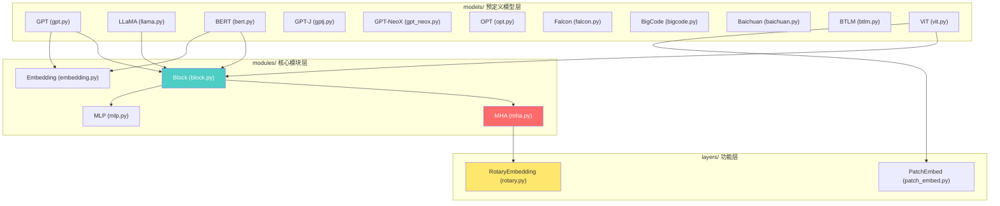
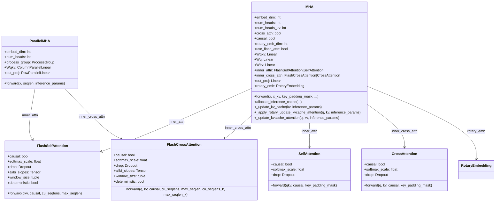
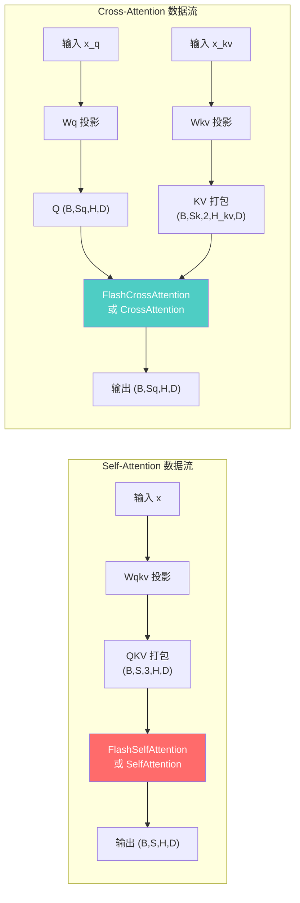
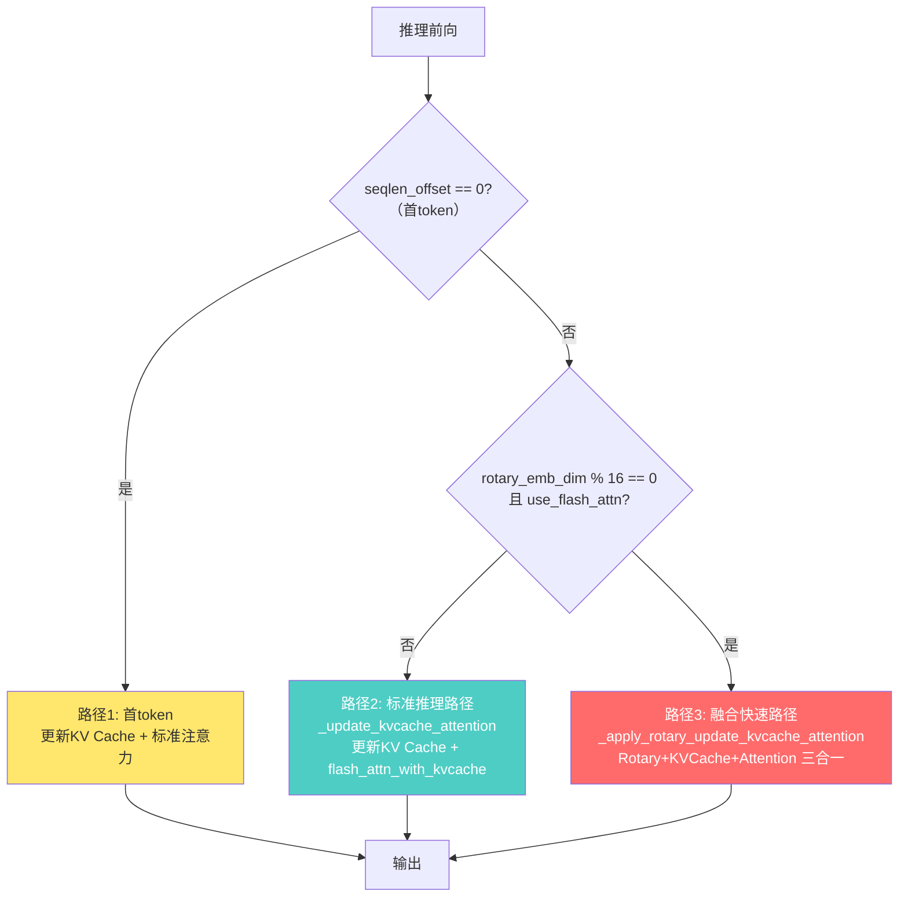
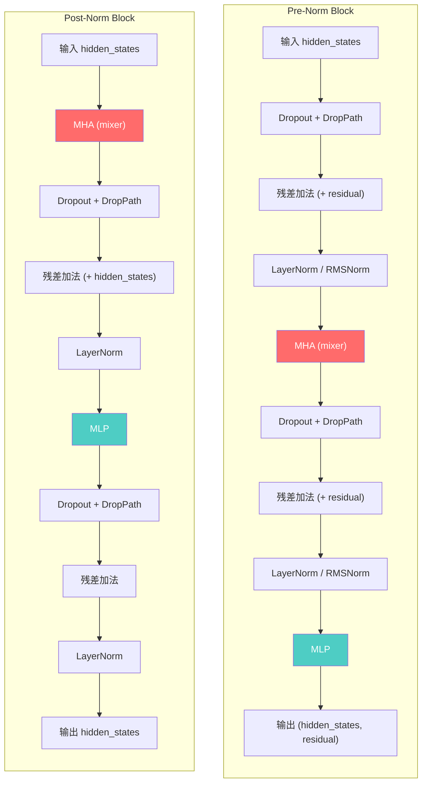
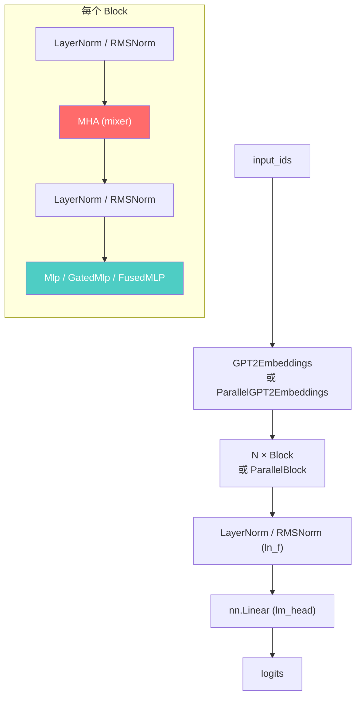

# 11 模型与模块层

## 【总】开篇

本篇分析 FlashAttention 项目的模型与模块层（`flash_attn/modules/`、`flash_attn/layers/`、`flash_attn/models/`）。这一层是 FlashAttention 从"底层内核"走向"上层应用"的关键桥梁。

**核心结论：**

1. **MHA 模块封装了 FlashAttention 的所有功能**——包括自注意力、交叉注意力、MQA/GQA、ALiBi 偏置、Rotary Embedding、KV Cache 推理加速等，是整个项目中最核心的模块层组件。
2. **11 个预定义模型展示集成方式**——项目提供了 GPT、LLaMA、BERT、GPT-J、GPT-NeoX、OPT、Falcon、BigCode、Baichuan、BTLM、ViT 共 11 个模型的完整实现，展示了如何将 FlashAttention 即插即用地集成到各类 Transformer 架构中。
3. **即插即用的设计哲学**——通过 `use_flash_attn` 参数一键切换 FlashAttention 与 PyTorch 原生注意力，无需修改模型其他部分。

---

## 【分】主体

### 1. 模型层模块关系总览



### 2. modules/mha.py —— 多头注意力模块（最核心）

`mha.py` 是 FlashAttention 模块层最核心的文件，包含 6 个主要类和 1 个辅助函数，完整封装了从底层 CUDA 内核到上层注意力接口的所有功能。

#### 2.1 类层次结构



#### 2.2 FlashSelfAttention —— Flash 自注意力

`FlashSelfAttention` 是对 FlashAttention CUDA 内核的直接封装，处理 QKV 打包在一起的场景。

**构造参数：**

| 参数 | 类型 | 默认值 | 说明 |
|------|------|--------|------|
| `causal` | bool | False | 是否使用因果（下三角）掩码 |
| `softmax_scale` | float | None | softmax 缩放因子，默认 1/√d |
| `attention_dropout` | float | 0.0 | 注意力权重 dropout 概率 |
| `window_size` | tuple | (-1,-1) | 滑动窗口注意力的窗口大小 |
| `alibi_slopes` | Tensor | None | ALiBi 位置偏置的斜率 |
| `deterministic` | bool | False | 是否使用确定性反向传播 |

**forward 方法核心逻辑：**

```python
def forward(self, qkv, causal=None, cu_seqlens=None, max_seqlen=None):
    assert qkv.dtype in [torch.float16, torch.bfloat16]
    assert qkv.is_cuda
    causal = self.causal if causal is None else causal
    unpadded = cu_seqlens is not None
    if unpadded:
        # 变长序列：使用 flash_attn_varlen_qkvpacked_func
        return flash_attn_varlen_qkvpacked_func(
            qkv, cu_seqlens, max_seqlen,
            self.drop.p if self.training else 0.0,
            softmax_scale=self.softmax_scale,
            causal=causal,
            alibi_slopes=self.alibi_slopes,
            window_size=self.window_size,
            deterministic=self.deterministic,
        )
    else:
        # 等长序列：使用 flash_attn_qkvpacked_func
        return flash_attn_qkvpacked_func(
            qkv,
            self.drop.p if self.training else 0.0,
            softmax_scale=self.softmax_scale,
            causal=causal,
            alibi_slopes=self.alibi_slopes,
            window_size=self.window_size,
            deterministic=self.deterministic,
        )
```

关键设计点：
- **双路径分发**：根据 `cu_seqlens` 是否为 None，自动选择 `varlen`（变长）或标准（等长）内核
- **训练/推理 dropout 切换**：训练时使用配置的 dropout 概率，推理时自动置零
- **仅支持 fp16/bf16**：FlashAttention 内核仅支持半精度，在入口处断言检查

#### 2.3 FlashCrossAttention —— Flash 交叉注意力

`FlashCrossAttention` 与 `FlashSelfAttention` 类似，但 Q 和 KV 是分开输入的，适用于编码器-解码器架构或 CLS token 交叉注意力等场景。

**forward 方法签名：**

```python
def forward(self, q, kv, causal=None,
            cu_seqlens=None, max_seqlen=None,
            cu_seqlens_k=None, max_seqlen_k=None):
```

与自注意力的关键区别：
- Q 和 KV 分离输入：`q: (B, Sq, H, D)`，`kv: (B, Sk, 2, H_k, D)`
- 支持独立的 Q 和 KV 序列长度参数（`cu_seqlens`/`cu_seqlens_k`，`max_seqlen`/`max_seqlen_k`）
- 调用 `flash_attn_kvpacked_func` 或 `flash_attn_varlen_kvpacked_func`

#### 2.4 Self-Attention vs Cross-Attention 数据流对比



#### 2.5 SelfAttention / CrossAttention —— PyTorch 原生注意力回退

当 FlashAttention 未安装或不可用时，`SelfAttention` 和 `CrossAttention` 提供了纯 PyTorch 实现的注意力计算，作为功能回退路径。

**SelfAttention 核心实现：**

```python
def forward(self, qkv, causal=None, key_padding_mask=None):
    q, k, v = qkv.unbind(dim=2)
    softmax_scale = self.softmax_scale or 1.0 / math.sqrt(q.shape[-1])
    scores = torch.einsum("bthd,bshd->bhts", q, k * softmax_scale)
    if key_padding_mask is not None:
        # 填充掩码：将 padding 位置的分数设为 -10000
        padding_mask = torch.full((batch_size, seqlen), -10000.0, ...)
        padding_mask.masked_fill_(key_padding_mask, 0.0)
        scores = scores + rearrange(padding_mask, "b s -> b 1 1 s")
    if causal:
        causal_mask = torch.triu(torch.full((seqlen, seqlen), -10000.0, ...), 1)
        scores = scores + causal_mask.to(dtype=scores.dtype)
    attention = torch.softmax(scores, dim=-1, dtype=v.dtype)
    attention_drop = self.drop(attention)
    output = torch.einsum("bhts,bshd->bthd", attention_drop, v)
    return output
```

CrossAttention 中还额外处理了 MQA/GQA 的 head 扩展：

```python
if kv.shape[3] != q.shape[2]:  # MQA/GQA
    kv = repeat(kv, "... hkv d -> ... (hkv g) d", g=q.shape[2] // kv.shape[3])
```

#### 2.6 MHA —— 完整的多头注意力层

`MHA` 是最核心的类，它将 QKV 投影、位置编码、注意力计算、输出投影全部封装在一起，支持自注意力和交叉注意力两种模式。

**构造函数关键参数：**

| 参数 | 类型 | 默认值 | 说明 |
|------|------|--------|------|
| `embed_dim` | int | 必需 | 嵌入维度 |
| `num_heads` | int | 必需 | 查询头数 |
| `num_heads_kv` | int | None | KV头数，None时等于num_heads；不等时启用MQA/GQA |
| `cross_attn` | bool | False | 是否为交叉注意力 |
| `causal` | bool | False | 是否因果注意力 |
| `rotary_emb_dim` | int | 0 | 旋转位置编码维度，0表示不使用 |
| `use_alibi` | bool | False | 是否使用ALiBi位置偏置 |
| `window_size` | tuple | (-1,-1) | 滑动窗口大小 |
| `use_flash_attn` | bool | False | 是否使用FlashAttention内核 |
| `dwconv` | bool | False | 是否在QKV投影后使用深度卷积 |
| `return_residual` | bool | False | 是否返回残差连接输入 |
| `layer_idx` | int | None | 层索引，推理时KV Cache需要 |

**内部组件初始化逻辑：**

```python
# 根据是否使用FlashAttention选择内部注意力实现
inner_attn_cls = (
    partial(FlashSelfAttention, alibi_slopes=alibi_slopes, window_size=window_size)
    if use_flash_attn else SelfAttention
)
inner_cross_attn_cls = (
    partial(FlashCrossAttention, alibi_slopes=alibi_slopes, window_size=window_size)
    if use_flash_attn else CrossAttention
)

# 自注意力模式：合并的Wqkv投影
if not self.cross_attn:
    qkv_dim = self.head_dim * (self.num_heads + 2 * self.num_heads_kv)
    self.Wqkv = nn.Linear(embed_dim, qkv_dim, bias=qkv_proj_bias)
# 交叉注意力模式：分离的Wq和Wkv投影
else:
    self.Wq = nn.Linear(embed_dim, embed_dim, bias=qkv_proj_bias)
    kv_dim = 2 * self.head_dim * self.num_heads_kv
    self.Wkv = nn.Linear(embed_dim, kv_dim, bias=qkv_proj_bias)
```

**MQA/GQA 的 head 映射关系：**

```mermaid
graph TB
    subgraph "MHA (标准多头注意力)"
        direction LR
        MHA_Q["Q: H个头<br/>h0 h1 h2 h3 h4 h5 h6 h7"]
        MHA_K["K: H个头<br/>h0 h1 h2 h3 h4 h5 h6 h7"]
        MHA_V["V: H个头<br/>h0 h1 h2 h3 h4 h5 h6 h7"]
        MHA_Q --- MHA_K --- MHA_V
    end

    subgraph "MQA (多查询注意力)"
        direction LR
        MQA_Q["Q: H个头<br/>h0 h1 h2 h3 h4 h5 h6 h7"]
        MQA_K["K: 1个头<br/>h0"]
        MQA_V["V: 1个头<br/>h0"]
        MQA_Q --- MQA_K --- MQA_V
    end

    subgraph "GQA (分组查询注意力)"
        direction LR
        GQA_Q["Q: H个头<br/>h0 h1 h2 h3 h4 h5 h6 h7"]
        GQA_K["K: H/g个头<br/>h0 h0 h1 h1 h2 h2 h3 h3"]
        GQA_V["V: H/g个头<br/>h0 h0 h1 h1 h2 h2 h3 h3"]
        GQA_Q --- GQA_K --- GQA_V
    end

    style MHA_Q fill:#ff6b6b,color:#fff
    style MHA_K fill:#4ecdc4,color:#fff
    style MHA_V fill:#4ecdc4,color:#fff
    style MQA_Q fill:#ff6b6b,color:#fff
    style MQA_K fill:#ffe66d,color:#333
    style MQA_V fill:#ffe66d,color:#333
    style GQA_Q fill:#ff6b6b,color:#fff
    style GQA_K fill:#a8e6cf,color:#333
    style GQA_V fill:#a8e6cf,color:#333
```



MQA/GQA 通过 `num_heads_kv` 参数控制：
- `num_heads_kv == num_heads`：标准 MHA
- `num_heads_kv == 1`：MQA（多查询注意力）
- `1 < num_heads_kv < num_heads`：GQA（分组查询注意力）

约束条件：`num_heads % num_heads_kv == 0`，即 Q 的头数必须能被 KV 的头数整除。

#### 2.7 ALiBi 偏置支持

ALiBi（Attention with Linear Biases）是一种不使用位置嵌入的位置编码方法，通过在注意力分数上添加与距离成比例的偏置来实现。

```python
def get_alibi_slopes(nheads):
    def get_slopes_power_of_2(nheads):
        start = 2 ** (-(2 ** -(math.log2(nheads) - 3)))
        ratio = start
        return [start * ratio**i for i in range(nheads)]

    if math.log2(nheads).is_integer():
        return get_slopes_power_of_2(nheads)
    else:
        closest_power_of_2 = 2 ** math.floor(math.log2(nheads))
        return (
            get_slopes_power_of_2(closest_power_of_2)
            + get_alibi_slopes(2 * closest_power_of_2)[0::2][: nheads - closest_power_of_2]
        )
```

ALiBi 斜率通过 `register_buffer` 注册，在 `FlashSelfAttention`/`FlashCrossAttention` 中传递给底层内核。使用 ALiBi 时必须启用 FlashAttention（`use_alibi=True` 要求 `use_flash_attn=True`）。

#### 2.8 Rotary Embedding 集成

MHA 通过 `rotary_emb_dim` 参数集成旋转位置编码。当 `rotary_emb_dim > 0` 时，自动创建 `RotaryEmbedding` 实例并在前向传播中应用。

关键约束：
- 旋转位置编码不支持交叉注意力（`assert not cross_attn`）
- 推理时使用融合路径 `_apply_rotary_update_kvcache_attention`，将旋转编码、KV Cache 更新和注意力计算三步合为一步

#### 2.9 KV Cache 推理支持

MHA 提供了完整的 KV Cache 推理支持，包含三个层次的实现：

**1. `allocate_inference_cache`** —— 预分配 KV Cache 内存：

```python
def allocate_inference_cache(self, batch_size, max_seqlen, dtype=None):
    dtype = self.out_proj.weight.dtype if dtype is None else dtype
    device = self.out_proj.weight.device
    return torch.empty(
        batch_size, max_seqlen, 2,
        self.num_heads_kv, self.head_dim,
        dtype=dtype, device=device,
    )
```

**2. `_update_kv_cache`** —— 更新 KV Cache：

```python
def _update_kv_cache(self, kv, inference_params):
    assert not self.dwconv, "Generation does not support dwconv yet"
    assert self.layer_idx is not None, "Generation requires layer_idx in the constructor"
    return _update_kv_cache(kv, inference_params, self.layer_idx)
```

辅助函数 `_update_kv_cache` 的实现采用预分配策略：首次调用时分配全量 Cache，后续调用只更新对应位置。

**3. 推理时的三条路径：**



路径3（融合快速路径）是最优化的推理路径，调用 `flash_attn_with_kvcache` 将旋转编码、KV Cache 更新和注意力计算融合为一次内核调用，最大限度减少 GPU 内存访问。

#### 2.10 MHA forward 完整流程

MHA 的 `forward` 方法根据配置自动选择不同的计算路径：

```python
def forward(self, x, x_kv=None, key_padding_mask=None,
            cu_seqlens=None, max_seqlen=None,
            mixer_subset=None, inference_params=None, **kwargs):
```

核心分支逻辑：

1. **标准自注意力**（`not cross_attn and num_heads_kv == num_heads`）：
   - `Wqkv` 投影 → reshape → 可选 dwconv → 可选 rotary → 注意力计算 → `out_proj`

2. **交叉注意力 / MQA/GQA**（`cross_attn or num_heads_kv != num_heads`）：
   - 交叉注意力：`Wq` + `Wkv` 分离投影
   - MQA/GQA：`Wqkv` 投影后拆分 Q 和 KV
   - reshape → 可选 dwconv → 可选 rotary → 交叉注意力计算 → `out_proj`

3. **推理模式**（`inference_params is not None`）：
   - 根据 `seqlen_offset` 和条件选择 KV Cache 更新路径

#### 2.11 ParallelMHA —— 张量并行版本

`ParallelMHA` 是 MHA 的张量并行版本，用于多 GPU 分布式训练：

- `Wqkv` 使用 `ColumnParallelLinear`（列并行线性层）
- `out_proj` 使用 `RowParallelLinear`（行并行线性层）
- ALiBi 斜率按 rank 分片
- 推理 Cache 按 `num_heads_kv_per_rank` 分配

### 3. modules/block.py —— Transformer Block

`Block` 类实现了完整的 Transformer Block，支持 Pre-Norm 和 Post-Norm 两种架构。

#### 3.1 Block 结构



#### 3.2 Block 关键特性

**构造参数：**

| 参数 | 说明 |
|------|------|
| `dim` | 隐藏维度 |
| `mixer_cls` | 注意力模块类，默认 `MHA(num_heads=dim//64)` |
| `mlp_cls` | MLP模块类，默认 `Mlp(hidden_features=4*dim)` |
| `norm_cls` | 归一化类，默认 `nn.LayerNorm` |
| `prenorm` | 是否使用 Pre-Norm 架构 |
| `fused_dropout_add_ln` | 是否融合 Dropout+Add+LayerNorm（需要 Triton） |
| `residual_in_fp32` | 是否将残差保持在 fp32 |
| `sequence_parallel` | 是否标记序列并行参数 |
| `drop_path1/2` | Stochastic Depth 概率 |

**Pre-Norm 的特殊结构：**

FlashAttention 的 Pre-Norm Block 采用了与传统实现不同的顺序：

- 传统：`LN → Attn → Dropout → Add → LN → MLP → Dropout → Add`
- FlashAttention：`Dropout → Add → LN → Attn → Dropout → Add → LN → MLP`

这种调整是为了性能优化：可以将 Dropout、残差加法和 LayerNorm 融合为一个 Triton 内核操作（`layer_norm_fn`）。

**融合路径示例：**

```python
if self.fused_dropout_add_ln:
    hidden_states, residual = layer_norm_fn(
        hidden_states,
        self.norm1.weight, self.norm1.bias,
        residual=residual,
        eps=self.norm1.eps,
        dropout_p=self.dropout1.p if self.training else 0.0,
        rowscale=rowscale1,
        prenorm=True,
        residual_in_fp32=self.residual_in_fp32,
        is_rms_norm=isinstance(self.norm1, RMSNorm)
    )
```

#### 3.3 ParallelBlock —— 并行注意力/MLP Block

`ParallelBlock` 实现了 GPT-J / GPT-NeoX / PaLM 风格的并行 Block，其中注意力和 MLP 并行计算而非串行：

```python
# 串行 Block: x → LN → Attn → Add → LN → MLP → Add
# 并行 Block: x → Add → LN → [Attn, MLP] → Add
hidden_states1 = self.mixer(hidden_states1)  # 注意力
hidden_states2 = self.mlp(hidden_states2)     # MLP 并行
return hidden_states1, hidden_states2, residual
```

支持 `tied_norm`（共享归一化）选项，当 `tied_norm=True` 时，注意力和 MLP 共享同一个 LayerNorm。

### 4. modules/embedding.py —— 嵌入层

`embedding.py` 提供了多种嵌入层实现：

#### 4.1 GPT2Embeddings

GPT-2 风格的嵌入层，包含词嵌入和位置嵌入：

```python
class GPT2Embeddings(nn.Module):
    def __init__(self, embed_dim, vocab_size, max_position_embeddings,
                 padding_idx=None, word_embed_proj_dim=None):
        self.word_embeddings = nn.Embedding(vocab_size, embed_dim, padding_idx=padding_idx)
        if self.max_position_embeddings > 0:
            self.position_embeddings = nn.Embedding(max_position_embeddings, embed_dim)
        # word_embed_proj_dim: 用于 OPT-350m 等小模型，先嵌入到低维再投影到高维
        if word_embed_proj_dim is not None:
            self.project_in = nn.Linear(word_embed_proj_dim, embed_dim, bias=False)
```

前向传播：`embeddings = word_embeddings(input_ids) + position_embeddings(position_ids)`

#### 4.2 BertEmbeddings

BERT 风格的嵌入层，额外包含 token type 嵌入：

```python
class BertEmbeddings(nn.Module):
    def __init__(self, embed_dim, vocab_size, max_position_embeddings,
                 type_vocab_size, padding_idx=None):
        self.word_embeddings = nn.Embedding(vocab_size, embed_dim)
        self.position_embeddings = nn.Embedding(max_position_embeddings, embed_dim)
        self.token_type_embeddings = nn.Embedding(type_vocab_size, embed_dim)
```

前向传播：`embeddings = word + position + token_type`

#### 4.3 并行嵌入层

- **VocabParallelEmbedding**：按词表维度切分，每个 rank 负责一部分词表
- **ColumnParallelEmbedding**：按嵌入维度切分，每个 rank 负责一部分嵌入维度
- **ParallelGPT2Embeddings**：使用 `VocabParallelEmbedding` + `ColumnParallelEmbedding` 的并行 GPT-2 嵌入

### 5. modules/mlp.py —— MLP 模块

`mlp.py` 提供了 4 种 MLP 实现：

#### 5.1 Mlp —— 标准 MLP

```python
class Mlp(nn.Module):
    def __init__(self, in_features, hidden_features=None, out_features=None,
                 activation=F.gelu, bias1=True, bias2=True, return_residual=False):
        self.fc1 = nn.Linear(in_features, hidden_features, bias=bias1)
        self.activation = activation
        self.fc2 = nn.Linear(hidden_features, out_features, bias=bias2)

    def forward(self, x):
        y = self.fc1(x)
        y = self.activation(y)
        y = self.fc2(y)
        return y if not self.return_residual else (y, x)
```

#### 5.2 GatedMlp —— 门控 MLP

用于 LLaMA 等模型的 SwiGLU / GLU 激活：

```python
class GatedMlp(nn.Module):
    def __init__(self, in_features, hidden_features=None, activation=F.sigmoid,
                 multiple_of=128, return_residual=False):
        # hidden_features 默认为 8 * in_features / 3，并对齐到 multiple_of 的倍数
        hidden_features = (hidden_features + multiple_of - 1) // multiple_of * multiple_of
        self.fc1 = nn.Linear(in_features, 2 * hidden_features, bias=bias1)  # 输出维度翻倍
        self.fc2 = nn.Linear(hidden_features, out_features, bias=bias2)

    def forward(self, x):
        y = self.fc1(x)
        if self.activation == F.sigmoid:       # GLU
            y = F.glu(y, dim=-1)
        elif self.activation == F.silu:         # SwiGLU
            y, gate = y.chunk(2, dim=-1)
            y = swiglu(gate, y)                 # 融合 SwiGLU 内核
        else:                                    # 通用门控
            y, gate = y.chunk(2, dim=-1)
            y = y * self.activation(gate)
        y = self.fc2(y)
        return y if not self.return_residual else (y, x)
```

`GatedMlp` 的 `fc1` 输出维度是 `2 * hidden_features`，因为需要拆分为值和门控两部分。`multiple_of` 参数确保隐藏维度是 128 的倍数（LLaMA 的设计），以提高 GPU 计算效率。

#### 5.3 ParallelMLP / ParallelGatedMlp

张量并行版本，使用 `ColumnParallelLinear` 和 `RowParallelLinear` 替代标准 `nn.Linear`。

### 6. layers/rotary.py —— 旋转位置编码

`RotaryEmbedding` 实现了 RoFormer 提出的旋转位置编码（RoPE），是 LLaMA、GPT-NeoX 等模型的核心位置编码方案。

#### 6.1 核心原理

旋转位置编码将位置信息编码为旋转矩阵，作用于 Q 和 K 向量，使得注意力分数自然包含相对位置信息：

```
q_m = q * cos(mθ) + rotate_half(q) * sin(mθ)
k_n = k * cos(nθ) + rotate_half(k) * sin(nθ)
```

其中 `rotate_half` 将向量的前半部分和后半部分进行旋转交换。

#### 6.2 RotaryEmbedding 类

```python
class RotaryEmbedding(torch.nn.Module):
    def __init__(self, dim, base=10000.0, interleaved=False, scale_base=None):
        self.dim = dim
        self.base = float(base)
        inv_freq = 1.0 / (base ** (torch.arange(0, dim, 2, dtype=torch.float32) / dim))
        self.register_buffer("inv_freq", inv_freq, persistent=False)
        self.interleaved = interleaved  # GPT-J 风格 vs GPT-NeoX 风格
        self.scale_base = scale_base    # XPos 缩放基
```

**两种旋转模式：**
- `interleaved=False`（GPT-NeoX 风格）：前半维度和后半维度分别旋转
- `interleaved=True`（GPT-J 风格）：奇偶维度交替旋转

**XPos 支持：** 当 `scale_base` 不为 None 时，实现 XPos（Sun et al.），通过指数缩放增强长度外推能力。推荐 `scale_base=512`。

#### 6.3 高效实现

旋转位置编码提供了多种高效实现：

1. **`apply_rotary_emb`** —— 自定义 autograd 函数，调用 Triton 内核 `apply_rotary`
2. **`apply_rotary_emb_qkv_`** —— 原地（in-place）对 QKV 打包张量应用旋转编码，减少内存分配
3. **`apply_rotary_emb_kv_`** —— 原地对 KV 打包张量应用旋转编码

`apply_rotary_emb_qkv_` 的优化：当 QKV 连续存储且 K 和 Q 使用相同 cos/sin 时，将 Q 和 K 合并为一次内核调用：

```python
if cos_k is None and sin_k is None and qkv.is_contiguous():
    # 合并 Q 和 K 为一次内核调用
    qk = qkv[:, :, :2].reshape(batch, seqlen, -1, headdim)
    qk = apply_rotary_fn(qk, cos, sin)
```

#### 6.4 forward 方法

```python
def forward(self, qkv, kv=None, seqlen_offset=0, max_seqlen=None, num_heads_q=None):
    # 更新 cos/sin 缓存
    self._update_cos_sin_cache(seqlen + seqlen_offset, ...)
    if kv is None:
        # 自注意力：原地旋转 QKV
        return apply_rotary_emb_qkv_(qkv, self._cos_cached, self._sin_cached, ...)
    else:
        # 交叉注意力/MQA/GQA：分别旋转 Q 和 KV
        q = apply_rotary_emb_func(q, ...)
        kv = apply_rotary_emb_kv_(kv, ...)
        return q, kv
```

### 7. layers/patch_embed.py —— Patch 嵌入

`PatchEmbed` 用于视觉 Transformer（ViT），将 2D 图像切分为 patch 并嵌入：

```python
class PatchEmbed(nn.Module):
    def __init__(self, img_size=224, patch_size=16, in_chans=3,
                 embed_dim=768, norm_layer=None, flatten=True,
                 bias=True, fused_bias_fc=False):
        # 使用 nn.Linear 替代 Conv2d，速度约快 8 倍
        linear_cls = nn.Linear if not fused_bias_fc or not bias else FusedDense
        self.proj = linear_cls(in_chans * patch_size[0] * patch_size[1], embed_dim, bias=bias)
        self.norm = norm_layer(embed_dim) if norm_layer else nn.Identity()

    def forward(self, x):
        # x: (B, C, H, W) → 展平 patch → 投影 → 归一化
        x = self.proj(rearrange(x, "b c (h p1) (w p2) -> b h w (c p1 p2)",
                                p1=self.patch_size[0], p2=self.patch_size[1]))
        if self.flatten:
            x = rearrange(x, "b h w c -> b (h w) c")
        x = self.norm(x)
        return x
```

关键设计：使用 `nn.Linear` 替代传统的 `nn.Conv2d`，因为等价计算下 Linear 更快（约 8 倍）。这是 FlashAttention 项目对 ViT 的一个性能优化。

### 8. models/ —— 预定义模型概览

FlashAttention 项目提供了 11 个预定义模型实现，所有模型都遵循统一的架构模式，通过配置驱动的方式灵活组合各模块。

#### 8.1 模型列表与特性

| 模型 | 文件 | 注意力类型 | 位置编码 | MLP 类型 | 特殊特性 |
|------|------|-----------|---------|---------|---------|
| GPT | gpt.py | MHA/MQA/GQA | RoPE/ALiBi/绝对 | Mlp/GatedMlp/FusedMLP | 统一框架，支持多种GPT变体 |
| LLaMA | llama.py | GQA | RoPE (interleaved) | SwiGLU (GatedMlp) | RMSNorm, 无bias, n_head_kv |
| BERT | bert.py | MHA + CrossAttn | 绝对 | Mlp/FusedMLP | 变长序列, dense_seq_output |
| GPT-J | gptj.py | MHA | RoPE | Mlp | ParallelBlock |
| GPT-NeoX | gpt_neox.py | MHA | RoPE | Mlp | ParallelBlock |
| OPT | opt.py | MHA | ALiBi/绝对 | Mlp | word_embed_proj_dim |
| Falcon | falcon.py | MHA/MQA | RoPE/ALiBi | Mlp | ParallelBlock, new_decoder_arch |
| BigCode | bigcode.py | MQA | ALiBi | Mlp | 多查询注意力 |
| Baichuan | baichuan.py | MQA/GQA | RoPE | GatedMlp | 中文大模型 |
| BTLM | btlm.py | MHA | ALiBi | GatedMlp | 3B参数模型 |
| ViT | vit.py | MHA | 绝对 | Mlp | PatchEmbed, CLS token |

#### 8.2 GPT 模型架构（统一框架）

`gpt.py` 是最核心的模型文件，它实现了一个统一的 GPT 框架，可以配置为 GPT-2、GPT-J、GPT-NeoX、OPT、Falcon、LLaMA 等多种变体。

**核心架构：**



**工厂函数模式：**

GPT 模型使用工厂函数根据配置动态创建组件：

- `create_mixer_cls(config)` —— 创建注意力模块类
- `create_mlp_cls(config)` —— 创建 MLP 模块类
- `create_block(config, layer_idx)` —— 创建 Transformer Block

```python
def create_mixer_cls(config, layer_idx=None, process_group=None, device=None, dtype=None):
    mixer_cls = partial(
        mha_cls,  # MHA 或 ParallelMHA
        num_heads=config.num_attention_heads,
        num_heads_kv=getattr(config, "n_head_kv", None),
        causal=True,
        rotary_emb_dim=int(getattr(config, "rotary_emb_fraction", 0.0) * head_dim),
        use_alibi=getattr(config, "use_alibi", False),
        window_size=getattr(config, "window_size", (-1, -1)),
        use_flash_attn=getattr(config, "use_flash_attn", False),
        ...
    )
    return mixer_cls
```

**GPTModel 和 GPTLMHeadModel：**

- `GPTModel`：纯 Transformer 模型，输出隐藏状态
- `GPTLMHeadModel`：在 `GPTModel` 基础上添加 LM Head，支持文本生成

**预训练权重加载：**

`from_pretrained` 方法支持从 HuggingFace 加载多种预训练模型权重，通过 `remap_state_dict_*` 函数将不同格式的权重映射到统一格式：

```python
if model_name.startswith("gpt2"):
    state_dict = remap_state_dict_hf_gpt2(state_dict, config)
elif model_name.startswith("facebook/opt"):
    state_dict = remap_state_dict_hf_opt(state_dict, config)
elif model_name.startswith("EleutherAI/gpt-j-"):
    state_dict = remap_state_dict_hf_gptj(state_dict, config)
elif model_name.startswith("meta-llama/Llama-"):
    state_dict = remap_state_dict_hf_llama(state_dict, config)
# ... 更多模型
```

#### 8.3 LLaMA 模型适配

`llama.py` 主要提供 LLaMA 模型的配置转换和权重映射功能：

**配置转换** —— `llama_config_to_gpt2_config`：

```python
def llama_config_to_gpt2_config(llama_config: LlamaConfig) -> GPT2Config:
    return GPT2Config(
        n_positions=0,                    # 无绝对位置编码
        activation_function="swiglu",     # SwiGLU 激活
        rms_norm=True,                    # 使用 RMSNorm
        rotary_emb_fraction=1.0,          # 完整旋转位置编码
        rotary_emb_interleaved=True,      # GPT-J 风格交错旋转
        tie_word_embeddings=False,        # 不共享词嵌入和LM Head
        qkv_proj_bias=False,              # 无 QKV 偏置
        out_proj_bias=False,              # 无输出偏置
        mlp_fc1_bias=False,               # 无 MLP 偏置
        mlp_fc2_bias=False,
        n_head_kv=llama_config.num_key_value_heads,  # GQA
        rotary_emb_base=getattr(llama_config, "rotary_emb_base", 10000.0),
    )
```

**权重映射** —— `remap_state_dict_hf_llama`：

LLaMA 的 MLP 使用 gate_proj + up_proj + down_proj 结构，映射到 FlashAttention 的 GatedMlp 的 fc1 + fc2：

```python
# HF LLaMA: gate_proj (w1) + up_proj (w3) + down_proj (w2)
# FlashAttention: fc1 = [w3, w1] (up + gate), fc2 = w2 (down)
w1 = state_dict.pop(f"model.layers.{l}.mlp.gate_proj.weight")
w3 = state_dict.pop(f"model.layers.{l}.mlp.up_proj.weight")
state_dict[f"transformer.layers.{l}.mlp.fc1.weight"] = torch.cat([w3, w1], dim=0)
```

#### 8.4 BERT 模型架构

`bert.py` 实现了 BERT 模型，使用 Post-Norm 架构，并支持变长序列优化：

**核心特性：**
- **变长序列优化**：通过 `unpad_input` 去除 padding token，使用 `cu_seqlens` 和 `max_seqlen` 传递给 FlashAttention 的 varlen 内核
- **最后一层子集**（`last_layer_subset`）：仅对 masked token 计算最后一层，节省计算
- **交叉注意力**：最后一层使用交叉注意力，仅计算 CLS token 和 masked token 的输出

```python
class BertEncoder(nn.Module):
    def forward(self, hidden_states, key_padding_mask=None, subset_mask=None):
        if key_padding_mask is None or not self.use_flash_attn:
            # 标准路径
            for layer in self.layers:
                hidden_states = layer(hidden_states, ...)
        else:
            # 变长优化路径：去除 padding
            hidden_states, indices, cu_seqlens, max_seqlen_in_batch, _ = unpad_input(
                hidden_states, key_padding_mask
            )
            mixer_kwargs = {"cu_seqlens": cu_seqlens, "max_seqlen": max_seqlen_in_batch}
            for layer in self.layers:
                hidden_states = layer(hidden_states, mixer_kwargs=mixer_kwargs)
            hidden_states = pad_input(hidden_states, indices, batch, seqlen)
```

**BertForPreTraining** 支持 `dense_seq_output` 和 `last_layer_subset` 优化，在预训练时仅将 masked token 的隐藏状态传递给分类头，大幅减少计算量和内存占用。

---

## 【总】收尾

FlashAttention 的模型与模块层展现了一个精心设计的"即插即用"架构：

1. **MHA 模块是核心枢纽**：它向下封装了 FlashAttention 的所有 CUDA 内核（自注意力、交叉注意力、varlen、KV Cache），向上提供了统一的注意力接口。通过 `use_flash_attn` 一个参数即可在 FlashAttention 和 PyTorch 原生实现之间切换，无需修改任何其他代码。

2. **模块化组合设计**：Block 通过 `mixer_cls` 和 `mlp_cls` 参数实现灵活组合，可以搭配 MHA/MQA/GQA + Mlp/GatedMlp/FusedMLP 的任意组合。Rotary Embedding、ALiBi、滑动窗口注意力等特性都通过 MHA 的构造参数控制，Block 层面无需感知。

3. **11 个预定义模型验证了通用性**：从 GPT 系列到 LLaMA、BERT、ViT，不同架构的模型都能通过配置驱动的方式复用同一套模块，只需提供配置转换和权重映射函数。这种设计使得 FlashAttention 可以即插即用地集成到任何 Transformer 模型中，真正实现了"一次优化，处处加速"的目标。
