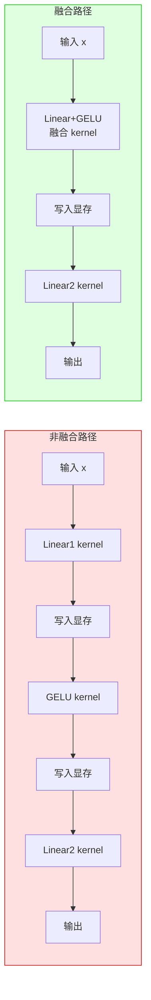
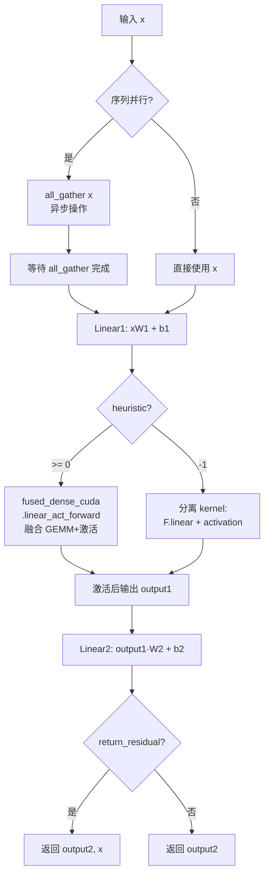

# 12. 算子与工具层

## 【总】开篇

本篇分析 FlashAttention 项目的算子与工具层。FlashAttention 不仅提供了核心的注意力机制加速，还围绕训练和推理场景构建了一套完整的融合算子和工具函数体系。

**核心结论**：融合算子消除 kernel launch 开销、Triton 实现提供跨平台可能、工具层支撑训练和推理。具体而言：

1. **融合算子消除 kernel launch 开销**：通过将多个独立操作（如 Linear+GELU、Dropout+Add+LayerNorm）融合为单个 CUDA kernel，避免了中间结果的显存写入/读取和多次 kernel launch 的开销，在训练中可带来显著的端到端加速。
2. **Triton 实现提供跨平台可能**：FlashAttention 的 Triton 实现（包括注意力机制和交叉熵损失）不依赖特定 GPU 架构的 CUDA 代码，为未来跨平台（如 AMD GPU）部署提供了可能。
3. **工具层支撑训练和推理**：从分布式通信原语、基准测试工具到推理生成框架，工具层为 FlashAttention 在大规模训练和高效推理场景中的实际应用提供了完整支撑。

---

## 【分】主体

### 1. ops/fused_dense.py：融合密集层

`fused_dense.py` 是 FlashAttention 算子层中最核心的模块之一，提供了融合线性层（FusedDense）、融合 MLP（FusedMLP）以及张量并行线性层（ColumnParallelLinear、RowParallelLinear）的实现。其设计灵感来源于 NVIDIA Apex 的 `fused_dense` 模块，但增加了对 PyTorch AMP、BFloat16 以及张量并行的支持。

#### 1.1 FusedDenseFunc —— 融合线性层前向/反向

`FusedDenseFunc` 继承自 `torch.autograd.Function`，实现了融合的线性变换 `y = xW^T + b`，其核心优化在于：

**前向传播**：
- 支持 AMP 自动混合精度，在 autocast 启用时自动将输入和权重转换为对应精度
- 支持张量并行（Tensor Parallel）与序列并行（Sequence Parallel）：当 `process_group` 不为 None 且 `sequence_parallel=True` 时，在矩阵乘法前通过异步 `all_gather` 收集各 rank 的输入
- 支持 `return_residual` 选项，返回输入 `x` 以便后续与残差连接的反向传播融合

```python
# 前向中的异步 all_gather 优化
if process_group is not None and sequence_parallel:
    # 尽早启动 all_gather，在权重类型转换之前
    total_x, handle_x = all_gather_raw(x, process_group, async_op=True)
else:
    total_x = x
```

**反向传播**：
- 使用 `fused_dense_cuda.linear_bias_wgrad` 融合计算权重梯度，避免分开计算时的额外显存开销
- 当 `return_residual=True` 时，使用 `torch.addmm` 将残差梯度与线性变换梯度融合
- 在张量并行场景下，使用 `reduce_scatter_raw` 或 `all_reduce_raw` 进行梯度同步，且采用异步操作以重叠计算和通信

```python
# 反向中的融合权重梯度计算
grad_weight, grad_bias = fused_dense_cuda.linear_bias_wgrad(
    total_x.reshape(batch_dim, total_x.shape[-1]), grad_output, ctx.needs_input_grad[2]
)
```

#### 1.2 ColumnParallelLinear 与 RowParallelLinear —— 张量并行线性层

这两个类实现了 Megatron-LM 风格的张量并行线性层，支持不均匀切分：

**ColumnParallelLinear**（列并行）：
- 将输出维度 `out_features` 切分到各 rank，每个 rank 只持有部分输出
- 前向时先 `all_gather` 输入，再执行本地矩阵乘法
- 支持通过 `multiple_of` 参数确保切分后的维度是某个数的倍数（如 256，为了 Tensor Core 对齐）

```python
# 不均匀切分逻辑
div = multiple // world_size
mod = multiple % world_size
local_multiple = div + int(torch.distributed.get_rank(process_group) < mod)
```

**RowParallelLinear**（行并行）：
- 将输入维度 `in_features` 切分到各 rank，每个 rank 只持有部分权重行
- 前向时执行本地矩阵乘法后，通过 `reduce_scatter` 或 `all_reduce` 聚合结果
- 仅 rank 0 持有偏置项，避免重复计算

#### 1.3 FusedMLPFunc —— 融合 MLP 前向/反向

`FusedMLPFunc` 是整个融合密集层中最复杂的组件，将两步线性变换和激活函数融合为一次操作：`output = Linear2(activation(Linear1(x)))`。

**关键特性**：

1. **GEMM+激活融合**：通过 `fused_dense_cuda.linear_act_forward` 将第一步线性变换和激活函数（GELU/ReLU/SqReLU）融合为单个 kernel，避免中间结果的显存写入

2. **检查点策略（checkpoint_lvl）**：
   - `0`：不重计算，保存所有中间结果（最快但最费显存）
   - `1`：重计算激活后的结果（如 GELU 输出），节省显存
   - `2`：重计算激活前的结果和激活后的结果，最大程度节省显存

3. **启发式选择（heuristic）**：
   - `-1`：不融合 GEMM+GELU，使用单独的 kernel
   - `0..4`：使用 cuBLASLt 的不同启发式算法选择策略
   - `auto`：根据 CUDA 版本和 GPU 架构自动选择最优策略

```python
# 自动启发式选择逻辑
if self.heuristic == "auto":
    if self.activation == "gelu_approx":
        if torch.cuda.get_device_capability("cuda") == (9, 0):  # H100
            heuristic = -1  # H100 上融合版本反而更慢
        else:
            cuda_ver = tuple(map(int, torch.version.cuda.split(".")))
            heuristic = 0 if cuda_ver >= (11, 8) else (1 if dtype == torch.float16 else -1)
```

4. **反向传播优化**：使用 `fused_dense_cuda.bias_act_linear_dgrad_bgrad` 融合计算激活函数梯度、偏置梯度和线性变换梯度

#### 1.4 ParallelFusedMLP —— 并行融合 MLP

`ParallelFusedMLP` 将 `ColumnParallelLinear` 和 `RowParallelLinear` 组合使用，实现 MLP 的张量并行：
- fc1 使用 `ColumnParallelLinear`（列切分隐藏维度）
- fc2 使用 `RowParallelLinear`（行切分隐藏维度）
- 前向结束后通过 `reduce_scatter` 或 `all_reduce` 聚合输出

#### 融合算子 vs 非融合算子对比图



#### Fused Dense Layer 计算流程图



---

### 2. ops/layer_norm.py：层归一化

`layer_norm.py` 实现了融合的 Dropout + Add + LayerNorm 操作，这是 Transformer 模型中最常见的操作组合之一。通过将多个操作融合为单个 kernel，避免了中间结果的显存读写。

#### 2.1 核心融合函数

模块提供了三个层次的融合函数：

**`_dropout_add_layer_norm_forward`**：底层前向函数，调用 `dropout_layer_norm` CUDA 扩展的 `dropout_add_ln_fwd`，一次 kernel 完成以下操作：
1. Dropout（可选）
2. 残差加法（可选）
3. 行缩放（rowscale，可选）
4. 列缩放（colscale，可选）
5. LayerNorm / RMSNorm

**`_dropout_add_layer_norm_backward`**：底层反向函数，调用 `dropout_add_ln_bwd`，一次 kernel 完成所有反向计算。

#### 2.2 DropoutAddLayerNormFn —— 自动微分函数

`DropoutAddLayerNormFn` 是主要的自动微分函数，支持以下特性：

- **prenorm**：返回归一化前的结果 `x = dropout(x0) + residual`，用于 Pre-Norm 架构
- **residual_in_fp32**：在 fp32 精度下计算残差，提高数值稳定性
- **is_rms_norm**：切换为 RMSNorm（无均值中心化）
- **return_dmask**：返回 dropout mask，用于调试或特殊需求
- **内存对齐**：通过 `maybe_align` 函数确保输入数据 16 字节对齐，满足 CUDA kernel 的要求

```python
def maybe_align(x, alignment_in_bytes=16):
    return x if x.data_ptr() % alignment_in_bytes == 0 else x.clone()
```

#### 2.3 DropoutAddLayerNormSubsetFn —— 子集变体

`DropoutAddLayerNormSubsetFn` 支持对输入和输出的行子集进行操作，适用于以下场景：
- 某些 token 不需要参与归一化（如 padding token）
- 通过 `x0_subset` 和 `out_subset` 指定参与计算的行索引
- 支持 `rowscale_const` 常量行缩放，避免显式构造缩放张量

#### 2.4 DropoutAddLayerNormParallelResidualFn —— 并行残差变体

`DropoutAddLayerNormParallelResidualFn` 支持并行残差连接架构（如 PaLM、GPT-J 中的并行注意力/MLP），同时处理两个分支的 dropout + layernorm：

```python
# 并行残差前向：同时处理 x0 和 x1 两个分支
z0mat, z1mat, xmat, dmask0, dmask1, mu, rsigma = \
    dropout_layer_norm.dropout_add_ln_parallel_residual_fwd(...)
```

#### 2.5 便捷接口与模块

模块提供了简洁的函数接口和 `nn.Module` 封装：

- `layer_norm(x, weight, bias, epsilon)`：纯 LayerNorm
- `dropout_add_layer_norm(...)`：Dropout + Add + LayerNorm
- `DropoutAddLayerNorm`：`nn.Module` 封装，可直接用于模型定义

#### LayerNorm 融合前向/反向流程图

```mermaid
flowchart TD
    subgraph 前向传播
        X0[x0] --> Drop{dropout_p > 0?}
        Drop -->|是| ApplyDrop[应用 Dropout<br/>生成 dmask]
        Drop -->|否| NoDrop[跳过 Dropout]
        ApplyDrop --> AddRes[dropout(x0) + residual]
        NoDrop --> AddRes
        Residual[residual] --> AddRes
        AddRes --> LN[LayerNorm / RMSNorm<br/>计算均值μ和方差σ]
        LN --> Output[输出 z = γ·(x-μ)/σ + β]
        LN --> SaveCtx[保存: xmat, dmask, γ, μ, 1/σ]
    end

    subgraph 反向传播
        DZ[dz] --> LN_Bwd[LayerNorm 反向<br/>计算 dγ, dβ, dx_norm]
        LN_Bwd --> DropBwd{有 Dropout?}
        DropBwd -->|是| ApplyDropBwd[应用 dmask<br/>计算 dx0]
        DropBwd -->|否| NoDropBwd[dx0 = dx_norm]
        ApplyDropBwd --> DRes[dresidual = dx_norm]
        NoDropBwd --> DRes
        LN_Bwd --> DGamma[dγ, dβ]
    end

    SaveCtx -.-> LN_Bwd
```

---

### 3. ops/rms_norm.py：RMS 归一化

`rms_norm.py` 复用了 `layer_norm.py` 的全部融合基础设施，通过设置 `is_rms_norm=True` 参数来切换为 RMSNorm 计算。RMSNorm 与 LayerNorm 的区别在于：RMSNorm 不进行均值中心化，仅除以均方根值，计算更高效。

**RMSNorm 公式**：`y = x / RMS(x) * γ`，其中 `RMS(x) = sqrt(mean(x^2) + ε)`

**LayerNorm 公式**：`y = (x - μ) / σ * γ + β`，其中 `μ = mean(x)`，`σ = sqrt(var(x) + ε)`

模块提供的接口与 LayerNorm 完全对称：

- `rms_norm(x, weight, epsilon)`：纯 RMSNorm（无偏置）
- `dropout_add_rms_norm(...)`：Dropout + Add + RMSNorm
- `dropout_add_rms_norm_subset(...)`：子集变体
- `dropout_add_rms_norm_parallel_residual(...)`：并行残差变体
- `RMSNorm`：`nn.Module` 封装
- `DropoutAddRMSNorm`：带 Dropout 和残差的 `nn.Module` 封装

值得注意的是，`RMSNorm` 模块通过 `register_parameter("bias", None)` 显式声明无偏置项，而 `DropoutAddRMSNorm` 在调用底层函数时传入 `None` 作为偏置参数。

---

### 4. ops/activations.py：激活函数

`activations.py` 提供了多种高效激活函数实现，主要用于 `fused_dense.py` 中的 MLP 融合计算。

#### 4.1 GeLU 相关

**`bias_gelu` / `bias_gelu_back`**：带偏置的 GeLU 激活函数，使用 tanh 近似：

```python
@torch.jit.script
def bias_gelu(y, bias):
    x = bias + y
    return (x * 0.5 * (1.0 + torch.tanh(0.79788456 * x * (1 + 0.044715 * x * x)))).to(dtype=y.dtype)
```

**`gelu_fwd` / `gelu_bwd`**：不带偏置的 GeLU 前向和反向，同样使用 tanh 近似。反向传播的推导基于链式法则：

```python
@torch.jit.script
def gelu_bwd(g, x):
    tanh_out = torch.tanh(0.79788456 * x * (1 + 0.044715 * x * x))
    ff = 0.5 * x * ((1 - tanh_out * tanh_out) * (0.79788456 + 0.1070322243 * x * x)) + 0.5 * (1 + tanh_out)
    return (ff * g).to(dtype=x.dtype)
```

**`GeLUFunction` / `FastGeLUFunction`**：分别封装了带偏置和不带偏置的 GeLU 为 `torch.autograd.Function`，使其可以无缝集成到 PyTorch 的自动微分系统中。

#### 4.2 ReLU 变体

**`relu_bwd`**：ReLU 的反向传播，使用 `torch.where` 实现：

```python
@torch.jit.script
def relu_bwd(g, x):
    return torch.where(x >= 0, g, 0.0).to(dtype=x.dtype)
```

**`sqrelu_fwd` / `sqrelu_bwd`**：平方 ReLU（Squared ReLU），即 `SqReLU(x) = ReLU(x)^2`，其反向为 `2g·ReLU(x)`。SqReLU 是一种简单的非线性激活，在某些模型中被用作 GELU 的替代。

#### 4.3 SwiGLU

**`swiglu_fwd` / `swiglu_bwd`**：SwiGLU 激活函数，使用 PyTorch 的 `jiterator` 机制实现，允许在运行时编译 CUDA kernel：

```python
swiglu_fwd_codestring = """
template <typename T> T swiglu_fwd(T x, T y) {
    return float(x) * float(y) / (1.0f + ::exp(-float(x)));
}
"""
swiglu_fwd = torch.cuda.jiterator._create_jit_fn(swiglu_fwd_codestring)
```

SwiGLU 的公式为 `SwiGLU(x, y) = x · y · sigmoid(x) = x · y / (1 + exp(-x))`，其中 `x` 和 `y` 是两个独立的输入（通常来自同一个线性层的两个切分）。其反向传播为：

```python
dx = sigmoid(x) * (1 + x * (1 - sigmoid(x))) * g * y
dy = x * sigmoid(x) * g
```

`SwiGLUFunction` 将其封装为 `torch.autograd.Function`，通过 `swiglu` 函数暴露给外部使用。

---

### 5. losses/cross_entropy.py：交叉熵损失

`cross_entropy.py` 提供了一个高效的交叉熵损失实现，其底层 Triton kernel 位于 `ops/triton/cross_entropy.py`。

#### 5.1 CrossEntropyLoss 模块

`CrossEntropyLoss` 类继承自 `nn.Module`，提供了丰富的功能：

- **ignore_index**：忽略指定标签的损失计算
- **label_smoothing**：标签平滑，防止过拟合
- **logit_scale**：logit 缩放因子，在计算损失前乘以 logits
- **lse_square_scale**（z-loss）：添加 `lse_square_scale * lse(logits)^2` 到损失中，这是一种正则化技术，可以稳定训练
- **inplace_backward**：原地反向传播，通过修改 logits 张量来节省显存
- **process_group**：张量并行支持，每个 rank 只负责词汇表的一部分
- **return_z_loss**：返回 z-loss 分量，仅用于日志记录

```python
class CrossEntropyLoss(nn.Module):
    def forward(self, input, target, precomputed_lse=None):
        loss, z_loss = cross_entropy_loss(
            input, target,
            precomputed_lse=precomputed_lse,
            label_smoothing=self.label_smoothing,
            logit_scale=self.logit_scale,
            lse_square_scale=self.lse_square_scale,
            ignore_index=self.ignore_index,
            inplace_backward=self.inplace_backward,
            process_group=self.process_group,
        )
```

#### 5.2 Triton 实现（ops/triton/cross_entropy.py）

交叉熵损失的 Triton 实现包含两个核心 kernel：

**`cross_entropy_fwd_kernel`**：前向 kernel，每行一个 program，执行：
1. 在线 softmax（online softmax）计算 `lse = log(sum(exp(logits)))`
2. 根据标签索引提取对应 logit
3. 计算交叉熵损失 `loss = lse - logit_label`
4. 支持 label smoothing 和 z-loss
5. 支持张量并行的 `SPLIT` 模式（不将 lse 计入本地损失）

**`cross_entropy_bwd_kernel`**：反向 kernel，每行每列块一个 program，执行：
1. 从 lse 恢复概率分布 `probs = exp(logits - lse)`
2. 计算梯度 `dlogits = dloss * logit_scale * (probs - one_hot_label)`
3. 支持 label smoothing 的梯度修正
4. 支持 z-loss 的梯度修正：`probs += 2 * lse_square_scale * lse * probs`

张量并行场景下的处理流程：
1. 各 rank 本地计算 lse 和部分损失
2. 通过 `all_gather` 收集所有 rank 的 lse
3. 计算全局 `lse = logsumexp(lse_allgather)`
4. 通过 `all_reduce` 聚合各 rank 的部分损失
5. 最终损失 = 聚合后的部分损失 + 全局 lse

---

### 6. utils/benchmark.py：基准测试工具

`benchmark.py` 提供了一套完整的基准测试工具函数，基于 PyTorch 的 `torch.utils.benchmark` 模块。

#### 6.1 核心测试函数

**`benchmark_forward`**：测试前向传播性能，支持 AMP 混合精度

**`benchmark_backward`**：测试反向传播性能，自动生成梯度张量

**`benchmark_combined`**：测试前向+反向的联合性能，模拟真实训练场景

**`benchmark_all`**：同时运行前向、反向和联合测试

```python
def benchmark_combined(fn, *inputs, grad=None, repeats=10, desc="", ...):
    """Use Pytorch Benchmark on the forward+backward pass of an arbitrary function."""
    def f(grad, *inputs, **kwinputs):
        for x in inputs:
            if isinstance(x, torch.Tensor):
                x.grad = None
        with torch.autocast(device_type="cuda", dtype=amp_dtype, enabled=amp):
            y = fn(*inputs, **kwinputs)
        y.backward(grad, retain_graph=True)
```

#### 6.2 PyTorch Profiler 集成

**`pytorch_profiler`**：将基准测试包装在 PyTorch Profiler 中，可以查看 CUDA kernel 级别的性能信息，支持导出 Chrome Trace 文件用于可视化分析。

#### 6.3 内存基准测试

**`benchmark_memory`**：测量函数执行时的峰值显存占用：

```python
def benchmark_memory(fn, *inputs, desc="", verbose=True, **kwinputs):
    torch.cuda.empty_cache()
    torch.cuda.reset_peak_memory_stats()
    torch.cuda.synchronize()
    fn(*inputs, **kwinputs)
    torch.cuda.synchronize()
    mem = torch.cuda.max_memory_allocated() / ((2**20) * 1000)  # 转换为 GB
```

---

### 7. utils/distributed.py：分布式工具

`distributed.py` 提供了张量并行和序列并行所需的分布式通信原语，是融合密集层和张量并行线性层的基础设施。

#### 7.1 底层通信原语（Raw Operations）

三个底层函数不支持自动微分，但支持异步操作：

**`all_gather_raw`**：将各 rank 的输入拼接为完整张量

**`reduce_scatter_raw`**：将输入在各 rank 间规约后分散

**`all_reduce_raw`**：全局规约

```python
def all_gather_raw(input_: Tensor, process_group: ProcessGroup, async_op: bool = False):
    world_size = torch.distributed.get_world_size(process_group)
    output = torch.empty(world_size * input_.shape[0], *input_.shape[1:], ...)
    handle = torch.distributed.all_gather_into_tensor(output, input_.contiguous(), ...)
    return output, handle
```

#### 7.2 自动微分通信函数

三个自动微分函数封装了底层原语，支持反向传播：

**`AllGatherFunc`**：前向 all_gather，反向 reduce_scatter

**`ReduceScatterFunc`**：前向 reduce_scatter，反向 all_gather

**`AllReduceFunc`**：前向 all_reduce，反向恒等（梯度已在各 rank 上计算）

#### 7.3 辅助函数

**`sync_shared_params`**：通过广播同步标记为 `_shared_params=True` 的参数（如 RowParallelLinear 中仅 rank 0 持有的偏置）

**`allreduce_sequence_parallel_grad`**：在序列并行训练中，对标记为 `_sequence_parallel=True` 的参数梯度进行 all_reduce，使用 `flatten_dense_tensors` 优化通信效率

**`get_dim_for_local_rank`**：根据 world_size 和 local_rank 计算本地维度，支持不均匀切分：

```python
def get_dim_for_local_rank(dim: int, world_size: int, local_rank: int, multiple_of: int = 1) -> int:
    multiple = dim // multiple_of
    div = multiple // world_size
    mod = multiple % world_size
    local_multiple = div + int(local_rank < mod)
    return local_multiple * multiple_of
```

---

### 8. utils/generation.py：生成工具

`generation.py` 提供了完整的自回归文本生成框架，支持贪婪解码、top-k/top-p 采样以及推测解码（Speculative Decoding）。

#### 8.1 InferenceParams —— 推理参数

`InferenceParams` 数据类管理推理过程中的状态：

```python
@dataclass
class InferenceParams:
    max_seqlen: int
    max_batch_size: int
    seqlen_offset: int = 0          # 当前已生成的序列长度
    batch_size_offset: int = 0
    key_value_memory_dict: dict = field(default_factory=dict)  # KV 缓存
    lengths_per_sample: Optional[Tensor] = None
```

#### 8.2 采样函数

**`sample`**：从 logits 中采样 token，支持：
- `top_k=1`：贪婪解码（argmax）
- `top_k>1`：top-k 采样
- `top_p`：核采样（nucleus sampling）
- `temperature`：温度缩放

**`modify_logits_for_top_k_filtering`**：将非 top-k 的 logits 设为 `-inf`

**`modify_logits_for_top_p_filtering`**：将累积概率超过 top_p 阈值的 logits 设为 `-inf`

#### 8.3 decode —— 标准解码

`decode` 函数实现了标准的自回归解码循环：

1. 初始化 `InferenceParams`，支持 CUDA Graph 缓存
2. 循环生成 token：
   - 调用模型获取 logits
   - 采样下一个 token
   - 更新 `seqlen_offset`
   - 检查终止条件（EOS 或达到最大长度）
3. 返回 `GreedySearchDecoderOnlyOutput` 或 `SampleDecoderOnlyOutput`

#### 8.4 decode_speculative —— 推测解码

`decode_speculative` 实现了推测解码（Speculative Decoding），使用一个小型草稿模型（draft model）加速大模型的推理：

1. 草稿模型自回归生成 `speculative_lookahead` 个 token
2. 大模型一次性验证所有草稿 token
3. 根据接受/拒绝概率决定保留哪些 token
4. 被拒绝后从修正分布中重新采样

```python
def sample_speculative(logits, logits_draft, tokens_draft, top_k=1, top_p=0.0, temperature=1.0):
    """Algorithm 1 from [Fast Inference from Transformers via Speculative Decoding]"""
    accepted = torch.rand(batch, seqlen, device=probs.device) * gather(probs_draft, tokens_draft) \
               <= gather(probs[:, :-1], tokens_draft)
    # ...
```

#### 8.5 CUDA Graph 支持

`update_graph_cache` 和 `capture_graph` 函数实现了 CUDA Graph 缓存机制，用于加速推理时的 kernel launch：

1. 为不同的 `(batch_size, decoding_seqlen)` 组合捕获 CUDA Graph
2. 使用共享内存池（`graph_pool_handle`）减少显存占用
3. 运行时通过 `graph.replay()` 重放已捕获的图，避免重复的 kernel launch 开销

```python
def capture_graph(model, inference_params, batch_size, max_seqlen, decoding_seqlen=1, ...):
    graph = torch.cuda.CUDAGraph()
    with torch.cuda.graph(graph, pool=mempool):
        logits = model(input_ids, position_ids=position_ids,
                       inference_params=inference_params, num_last_tokens=decoding_seqlen).logits
    def run(new_input_ids, new_position_ids, seqlen):
        input_ids.copy_(new_input_ids)
        position_ids.copy_(new_position_ids)
        graph.replay()
        return logits.clone()
    return run
```

#### 8.6 GenerationMixin 与 KV 缓存分配

**`GenerationMixin`**：提供 `generate` 方法的混入类，使模型可以直接调用 `model.generate()`

**`allocate_inference_cache`**：为所有层分配 KV 缓存，形状为 `(max_batch_size, max_seqlen, 2, nheads, headdim)`

---

### 9. bert_padding.py：BERT Padding 工具

`bert_padding.py` 提供了变长序列的 padding/unpadding 工具，是 FlashAttention 处理变长序列输入的基础。

#### 9.1 索引操作

**`IndexFirstAxis`**：沿第一轴按索引提取元素，自定义前向/反向实现比 PyTorch 原生索引更快：

```python
class IndexFirstAxis(torch.autograd.Function):
    @staticmethod
    def forward(ctx, input, indices):
        # 使用 torch.gather 而非 input[indices]，速度更快
        return torch.gather(
            rearrange(input, "b ... -> b (...)"), 0,
            repeat(indices, "z -> z d", d=second_dim)
        ).reshape(-1, *other_shape)
```

**`IndexPutFirstAxis`**：沿第一轴按索引放置元素的反向操作

**`IndexFirstAxisResidual`**：支持残差连接的索引操作，反向时使用 `scatter_add_` 将梯度累加回原始位置

#### 9.2 unpad_input —— 去除填充

`unpad_input` 将 padded 的 batch 输入转换为紧凑的非填充表示：

输入：`hidden_states: (batch, seqlen, ...)`，`attention_mask: (batch, seqlen)`

输出：
- `hidden_states: (total_nnz, ...)`：紧凑表示
- `indices: (total_nnz,)`：有效 token 的扁平索引
- `cu_seqlens: (batch + 1,)`：累积序列长度
- `max_seqlen_in_batch: int`：batch 中最大序列长度
- `used_seqlens_in_batch: (batch,)`：每个样本的有效 token 数

#### 9.3 unpad_input_for_concatenated_sequences —— 拼接序列去填充

`unpad_input_for_concatenated_sequences` 支持在同一个序列中拼接多个短样本（如 SFT 场景），通过 `attention_mask_in_length` 参数指定每个子序列的长度，生成对应的块对角注意力掩码。

#### 9.4 pad_input —— 恢复填充

`pad_input` 是 `unpad_input` 的逆操作，将紧凑表示恢复为 padded 的 batch 输入。

---

### 10. flash_attn_triton.py：Triton 实现

`flash_attn_triton.py` 是 FlashAttention 的 Triton 实验性实现，基于 Phil Tillet 的 Triton fused attention tutorial 改进而来。

#### 10.1 与 CUDA 版本的差异

| 特性 | CUDA 版本 | Triton 版本 |
|------|-----------|-------------|
| Dropout | 支持 | 不支持 |
| 前向速度 | 较慢 | 较快 |
| 反向速度 | 较快 | 较慢 |
| 变长序列 | 支持 | 不支持 |
| 注意力偏置 | 不支持 | 支持 |
| 跨平台 | 仅 NVIDIA GPU | 理论上可跨平台 |

#### 10.2 前向 Kernel：`_fwd_kernel`

前向 kernel 的核心逻辑：

1. **分块计算**：将 Q 按 `BLOCK_M` 分块，K/V 按 `BLOCK_N` 分块
2. **在线 softmax**：使用 `m_i`（最大值）和 `lse_i`（log-sum-exp）维护 softmax 状态
3. **增量更新**：每处理一个 K/V 块，更新输出累加器和统计量

```python
# 在线 softmax 更新
m_ij = tl.maximum(tl.max(qk, 1) * softmax_scale, lse_i)
p = tl.exp(qk * softmax_scale - m_ij[:, None])
acc_o_scale = tl.exp(m_i - m_ij)
acc_o = acc_o * acc_o_scale[:, None]  # 缩放已有累加器
acc_o += tl.dot(p, v)                  # 累加新结果
```

4. **注意力偏置**：支持向量偏置（`BIAS_TYPE="vector"`，如 ALiBi）和矩阵偏置（`BIAS_TYPE="matrix"`）
5. **因果掩码**：通过 `IS_CAUSAL` 编译时常量控制

#### 10.3 反向 Kernel：`_bwd_kernel`

反向 kernel 的核心逻辑：

1. **预处理**：`_bwd_preprocess_do_o_dot` 计算 `delta = sum(O * dO)`
2. **分块反向**：`_bwd_kernel_one_col_block` 按 K/V 的列块遍历，计算 dV、dK、dQ
3. **重计算策略**：从保存的 Q、K、LSE 重计算注意力概率 P，避免存储完整的注意力矩阵
4. **序列并行**：支持 `SEQUENCE_PARALLEL` 模式，沿 seqlen_k 维度并行化，使用 `atomic_add` 处理 dQ 的写冲突

```python
# 反向核心计算
ds = (p * (dp - Di[:, None]) * softmax_scale).to(q.dtype)
dk += tl.dot(ds, q, trans_a=True)   # dK = dS^T · Q
dv += tl.dot(p.to(do.dtype), do, trans_a=True)  # dV = P^T · dO
dq += tl.dot(ds, k)                  # dQ = dS · K
```

5. **自动调优**：使用 `@triton.autotune` 在两种配置间选择最优方案

#### 10.4 自动微分封装

模块提供了三个 `torch.autograd.Function` 封装：

- **`FlashAttnQKVPackedFunc`**：输入为打包的 QKV `(batch, seqlen, 3, nheads, headdim)`
- **`FlashAttnKVPackedFunc`**：输入为打包的 KV `(batch, seqlen_k, 2, nheads, headdim)`
- **`FlashAttnFunc`**：输入为分离的 Q、K、V

反向传播在 `torch.inference_mode()` 下执行，以避免 Triton autotune 导致的 `Tensor._version` 变化问题。

#### Triton 实现架构图

```mermaid
flowchart TD
    subgraph 前向传播
        Q[Q] --> FwdKernel[_fwd_kernel]
        K[K] --> FwdKernel
        V[V] --> FwdKernel
        Bias[Bias<br/>可选] --> FwdKernel
        FwdKernel --> O[Output O]
        FwdKernel --> LSE[LSE<br/>log-sum-exp]
    end

    subgraph 反向传播
        DO[dO] --> Preprocess[_bwd_preprocess_do_o_dot<br/>计算 delta = Σ(O·dO)]
        O --> Preprocess
        Preprocess --> Delta[Delta]
        Q2[Q] --> BwdKernel[_bwd_kernel]
        K2[K] --> BwdKernel
        V2[V] --> BwdKernel
        DO2[dO] --> BwdKernel
        LSE2[LSE] --> BwdKernel
        Delta2[Delta] --> BwdKernel
        BwdKernel --> DQ[dQ]
        BwdKernel --> DK[dK]
        BwdKernel --> DV[dV]
    end

    subgraph Kernel内部
        BwdKernel --> ColBlock[_bwd_kernel_one_col_block<br/>按K/V列块遍历]
        ColBlock --> RecomputeP[重计算 P = softmax(QK^T)]
        RecomputeP --> CompDV[dV = P^T · dO]
        RecomputeP --> CompDS[ds = P·(dP - delta)·scale]
        CompDS --> CompDK[dK = dS^T · Q]
        CompDS --> CompDQ[dQ = dS · K]
    end
```

---

### 11. flash_blocksparse_attention.py：块稀疏注意力

`flash_blocksparse_attention.py` 实现了块稀疏注意力机制，通过稀疏掩码跳过不需要计算的注意力块，大幅减少计算量。

#### 11.1 FlashBlocksparseAttention

核心注意力模块，特性包括：

- **稀疏配置**：通过 Hydra 实例化稀疏配置对象，生成稀疏布局（layout）
- **块掩码**：将稀疏布局转换为块掩码（blockmask），仅计算掩码为 1 的块
- **序列长度对齐**：将序列长度向上取整到 256 的倍数，以满足块稀疏计算的要求
- **支持变长输入**：通过 `unpad_input` / `pad_input` 处理 key_padding_mask

```python
class FlashBlocksparseAttention(nn.Module):
    def __init__(self, sparsity_config, ...):
        self.sparsity_config = hydra.utils.instantiate(sparsity_config)
        max_seq_length = ((max_seq_length + 256 - 1) // 256) * 256
        layout = self.sparsity_config.make_layout(max_seq_length)
        self.register_buffer("layout", layout)
        blockmask_converted = convert_blockmask(self.layout, causal=False)
        self.register_buffer("blockmask_converted", blockmask_converted)
```

#### 11.2 FlashBlocksparseMHA

完整的多头注意力模块，包含 QKV 投影、稀疏注意力和输出投影：

```python
class FlashBlocksparseMHA(nn.Module):
    def __init__(self, embed_dim, num_heads, sparsity_config, ...):
        self.Wqkv = nn.Linear(embed_dim, 3 * embed_dim, bias=bias, ...)
        self.inner_attn = FlashBlocksparseAttention(sparsity_config, ...)
        self.out_proj = nn.Linear(embed_dim, embed_dim, bias=bias, ...)
```

限制条件：
- 仅支持 `head_dim` 为 16、32 或 64
- 仅支持 `float16` 精度
- 需要 CUDA 设备

---

## 【总】收尾

融合算子是 FlashAttention 训练加速的重要补充。通过将 Transformer 模型中频繁出现的操作组合（如 Linear+GELU、Dropout+Add+LayerNorm、CrossEntropy）融合为单个 CUDA/Triton kernel，FlashAttention 的算子层在以下几个维度实现了显著的性能提升：

1. **减少 kernel launch 开销**：每次 CUDA kernel launch 都有约 5-10μs 的固定开销，在深层模型中这些开销会累积。融合算子将多次 launch 合并为一次，显著减少了这一开销。

2. **减少显存读写**：非融合实现中，每个操作的中间结果都需要写入全局显存再被下一个操作读取。融合算子将中间结果保留在寄存器或共享内存中，大幅减少了显存带宽压力。

3. **支持张量并行与序列并行**：融合算子内置了分布式通信操作，支持高效的模型并行训练，且通过异步通信与计算重叠进一步隐藏了通信延迟。

4. **Triton 实现的跨平台潜力**：虽然 Triton 版本目前仍为实验性质，但其不依赖特定 GPU 架构的特性为未来在 AMD GPU 等非 NVIDIA 平台上部署 FlashAttention 提供了可能。

5. **完整的工具生态**：从 padding/unpadding 到推理生成，从基准测试到分布式通信，FlashAttention 的工具层为实际应用提供了开箱即用的支持。

总的来说，FlashAttention 的算子与工具层不仅仅是注意力机制加速的附属品，而是一套完整的训练和推理优化方案，覆盖了 Transformer 模型中从底层算子到上层推理的全链路优化。
