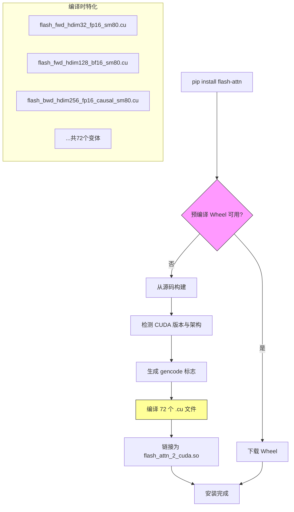
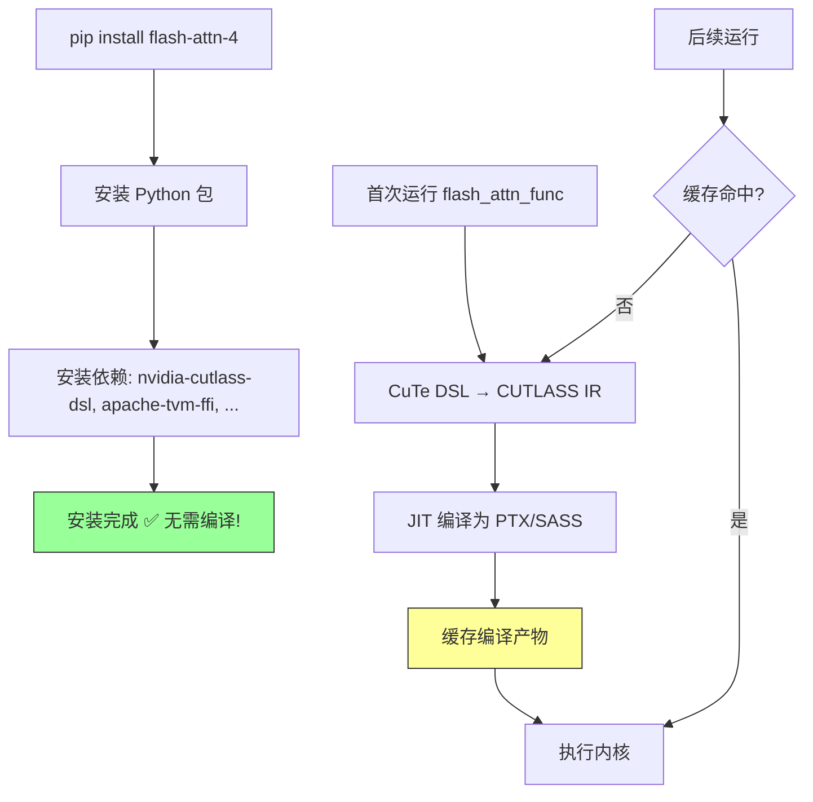
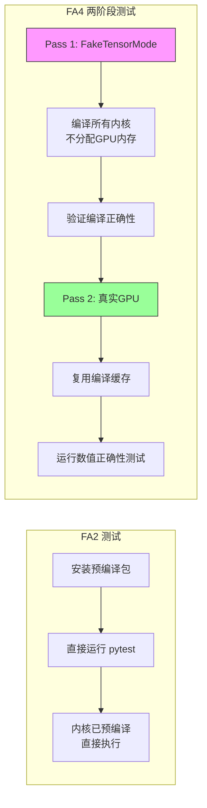
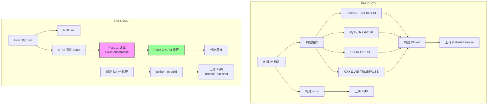

# 13 构建与测试体系

## 【总】开篇

本篇分析 FlashAttention 项目的构建与测试体系。FlashAttention 项目同时维护 FA2（传统 CUDA C++ 内核）和 FA4（CuTe DSL Python 内核）两套实现，二者在构建方式、测试策略和 CI/CD 流程上存在根本性差异。

**核心结论：**

- **FA2 使用传统 C++ 扩展构建**：通过 `setup.py` + `torch.utils.cpp_extension.CUDAExtension` 在安装时预编译所有 CUDA 内核，编译产物为 `.so` 共享库，构建耗时长、架构绑定强
- **FA4 使用 Python 包 + JIT 编译**：通过 `pyproject.toml` + `setuptools` 声明纯 Python 包，CUDA 内核在运行时通过 CuTe DSL + CUTLASS JIT 编译，无需预编译 C++ 代码
- **FA4 采用快速两阶段测试策略**：Pass 1 使用 `FakeTensorMode` 在无 GPU 内存的情况下编译内核（验证编译正确性），Pass 2 在真实 GPU 上运行测试（验证数值正确性），大幅缩短 CI 反馈时间

---

## 【分】主体

### 1. setup.py：FA2 安装配置

`/workspace/setup.py` 是 FA2 的核心构建文件，负责 CUDA 扩展的编译与安装。它是一个超过 700 行的复杂脚本，涵盖了架构检测、内核编译、预编译 Wheel 下载和 ROCm 支持等多个方面。

#### 1.1 CUDA 扩展构建

FA2 的核心编译产物是名为 `flash_attn_2_cuda` 的 CUDA 扩展模块。构建过程通过 `torch.utils.cpp_extension.CUDAExtension` 完成：

```python
from torch.utils.cpp_extension import (
    BuildExtension,
    CppExtension,
    CUDAExtension,
    CUDA_HOME,
    ROCM_HOME,
    IS_HIP_EXTENSION,
)
```

编译的源文件列表极为庞大，覆盖了不同头维度（32/64/96/128/192/256）、不同数据类型（fp16/bf16）、不同计算模式（causal/non-causal）和不同内核变体（fwd/bwd/fwd_split）的所有组合，共计 **72 个 `.cu` 文件**：

```python
ext_modules.append(
    CUDAExtension(
        name="flash_attn_2_cuda",
        sources=[
            "csrc/flash_attn/flash_api.cpp",
            "csrc/flash_attn/src/flash_fwd_hdim32_fp16_sm80.cu",
            "csrc/flash_attn/src/flash_fwd_hdim32_bf16_sm80.cu",
            # ... 共72个.cu文件
            "csrc/flash_attn/src/flash_fwd_split_hdim256_bf16_causal_sm80.cu",
        ],
        # ...
    )
)
```

这种"编译时特化"策略是 FA2 性能的基石——每个 `.cu` 文件都是针对特定头维度和数据类型的模板实例化，编译器可以针对每种组合进行极致优化。但代价是编译时间极长（通常需要 30 分钟到数小时），且 wheel 体积巨大。

#### 1.2 架构检测与 gencode 生成

`add_cuda_gencodes()` 函数根据 CUDA 工具链版本和目标架构动态生成 `-gencode` 编译标志：

```python
def add_cuda_gencodes(cc_flag, archs, bare_metal_version):
    # Always-regular 80
    if "80" in archs:
        cc_flag += ["-gencode", "arch=compute_80,code=sm_80"]
    # Hopper 9.0 needs >= 11.8
    if bare_metal_version >= Version("11.8") and "90" in archs:
        cc_flag += ["-gencode", "arch=compute_90,code=sm_90"]
    # Blackwell 10.x requires >= 12.8
    if bare_metal_version >= Version("12.8"):
        if "100" in archs:
            if bare_metal_version >= Version("12.9"):
                cc_flag += ["-gencode", "arch=compute_100f,code=sm_100"]
            else:
                cc_flag += ["-gencode", "arch=compute_100,code=sm_100"]
    # ...
```

默认编译架构通过环境变量 `FLASH_ATTN_CUDA_ARCHS` 控制：

```python
def cuda_archs() -> str:
    return os.getenv("FLASH_ATTN_CUDA_ARCHS", "80;90;100;110;120").split(";")
```

默认支持 sm_80（Ampere）、sm_90（Hopper）、sm_100（Blackwell）、sm_110（Thor）和 sm_120 架构。函数还处理了 Blackwell 的 `compute_100f` family-specific 架构和 Thor 的 `sm_101`→`sm_110` 重命名映射。

#### 1.3 NVCC 编译标志

FA2 使用了一组精心调优的 NVCC 编译标志：

```python
nvcc_flags = [
    "-O3",
    "-std=c++17",
    "-U__CUDA_NO_HALF_OPERATORS__",       # 启用 half 运算符
    "-U__CUDA_NO_HALF_CONVERSIONS__",     # 启用 half 类型转换
    "-U__CUDA_NO_HALF2_OPERATORS__",      # 启用 half2 运算符
    "-U__CUDA_NO_BFLOAT16_CONVERSIONS__", # 启用 bfloat16 转换
    "--expt-relaxed-constexpr",           # 放宽 constexpr 限制
    "--expt-extended-lambda",             # 扩展 lambda 支持
    "--use_fast_math",                    # 使用快速数学运算
]
```

同时支持通过 `NVCC_THREADS` 环境变量控制 NVCC 并行编译线程数（默认为 4）：

```python
NVCC_THREADS = os.getenv("NVCC_THREADS") or "4"
```

#### 1.4 预编译 Wheel 缓存机制

`CachedWheelsCommand` 类实现了一个智能的 wheel 下载策略——在构建前先尝试从 GitHub Releases 下载预编译 wheel，仅在下载失败时才从源码编译：

```python
class CachedWheelsCommand(_bdist_wheel):
    def run(self):
        if FORCE_BUILD:
            return super().run()
        wheel_url, wheel_filename = get_wheel_url()
        try:
            urllib.request.urlretrieve(wheel_url, wheel_filename)
            # ... 使用下载的 wheel
        except (urllib.error.HTTPError, urllib.error.URLError):
            print("Precompiled wheel not found. Building from source...")
            super().run()
```

Wheel URL 根据 CUDA 版本、PyTorch 版本、Python 版本和 C++11 ABI 标志动态生成：

```python
wheel_filename = f"{PACKAGE_NAME}-{flash_version}+cu{cuda_version}torch{torch_version}cxx11abi{cxx11_abi}-{python_version}-{python_version}-{platform_name}.whl"
```

#### 1.5 内存感知的并行构建

`NinjaBuildExtension` 类根据系统资源自动调整 `MAX_JOBS`，避免编译时 OOM：

```python
class NinjaBuildExtension(BuildExtension):
    def __init__(self, *args, **kwargs) -> None:
        if not os.environ.get("MAX_JOBS"):
            nvcc_threads = max(1, int(NVCC_THREADS))
            max_num_jobs_cores = max(1, os.cpu_count() // 2)
            free_memory_gb = psutil.virtual_memory().available / (1024 ** 3)
            max_num_jobs_memory = max(1, int(free_memory_gb / (5 * nvcc_threads)))
            max_jobs = max(1, min(max_num_jobs_cores, max_num_jobs_memory))
```

该实现假设每个 NVCC 线程峰值内存约 5GB，取 CPU 核心数和可用内存两个约束的较小值。

#### 1.6 ROCm 支持

`setup.py` 完整支持 AMD ROCm 平台，通过 `IS_HIP_EXTENSION` 和 `BUILD_TARGET` 环境变量检测目标平台：

```python
BUILD_TARGET = os.environ.get("BUILD_TARGET", "auto")
if BUILD_TARGET == "auto":
    if IS_HIP_EXTENSION:
        IS_ROCM = True
    else:
        IS_ROCM = False
```

ROCm 支持两种后端：
- **Triton 后端**（`FLASH_ATTENTION_TRITON_AMD_ENABLE=TRUE`）：使用 aiter 子模块
- **CK 后端**（默认）：使用 composable_kernel 子模块

### 2. Makefile：构建规则

`/workspace/Makefile` 非常简洁，仅包含三个规则：

```makefile
clean_dist:
	rm -rf dist/*

create_dist: clean_dist
	python setup.py sdist

upload_package: create_dist
	twine upload dist/*
```

- `clean_dist`：清理 dist 目录
- `create_dist`：创建源码分发包（sdist）
- `upload_package`：创建并上传到 PyPI

这反映了 FA2 的发布流程：先打包源码分发包上传 PyPI，预编译 wheel 则通过 CI 系统单独构建并上传到 GitHub Releases。

### 3. pyproject.toml：包配置

项目中存在两个 `pyproject.toml` 文件，分别服务于不同目的。

#### 3.1 根目录 pyproject.toml（FA2 代码风格配置）

`/workspace/flash_attn/pyproject.toml` 仅包含代码格式化工具配置：

```toml
[tool.black]
line-length = 100
target-version = 'py39'
[tool.ruff]
line-length = 100
target-version = 'py39'
```

FA2 的构建系统完全基于 `setup.py`，未使用 `pyproject.toml` 声明构建依赖。

#### 3.2 FA4 pyproject.toml（FA4 完整包配置）

`/workspace/flash_attn/cute/pyproject.toml` 是 FA4 的完整包配置，采用现代 Python 打包标准：

```toml
[build-system]
requires = ["setuptools>=75", "setuptools-scm>=8"]
build-backend = "setuptools.build_meta"

[project]
name = "flash-attn-4"
dynamic = ["version"]
description = "Flash Attention CUTE (CUDA Template Engine) implementation"
requires-python = ">=3.10"
```

**关键依赖声明：**

```toml
dependencies = [
    "nvidia-cutlass-dsl>=4.5.2",    # CUTLASS DSL 编译器
    "torch",                         # PyTorch
    "einops",                        # 张量操作库
    "typing_extensions",             # 类型扩展
    "apache-tvm-ffi>=0.1.5,<0.2",   # TVM FFI 运行时
    "torch-c-dlpack-ext",            # DLPack 扩展
    "quack-kernels>=0.5.0",          # 辅助内核库
]
```

FA4 的核心区别在于：**所有 CUDA 内核都是 Python 代码**（CuTe DSL），运行时通过 `nvidia-cutlass-dsl` JIT 编译，无需在安装时编译任何 C++ 代码。这使得 FA4 的安装速度极快——`pip install` 只需安装 Python 文件，内核编译延迟到首次运行时。

版本管理使用 `setuptools-scm`，从 git tag 自动提取版本：

```toml
[tool.setuptools_scm]
root = "../.."
tag_regex = "^fa4-v(?P<version>.+)$"
git_describe_command = "git describe --dirty --tags --long --match 'fa4-v*'"
fallback_version = "0.0.0"
```

### 4. csrc/fused_dense_lib/：融合密集层 C++ 源码

`/workspace/csrc/fused_dense_lib/` 目录包含融合密集层操作的 C++/CUDA 实现：

```
csrc/fused_dense_lib/
├── README.md
├── fused_dense.cpp        # C++ 绑定层（pybind11）
├── fused_dense_cuda.cu    # CUDA 内核实现
└── setup.py               # 独立构建脚本
```

`fused_dense.cpp` 是 Python 绑定入口，使用 `torch/extension.h` 提供的 pybind11 接口，定义了 half 和 bfloat16 的类型分发宏：

```cpp
#define DISPATCH_HALF_AND_BF16(TYPE, NAME, ...)                                \
  switch (TYPE) {                                                              \
  case at::ScalarType::Half: { using scalar_t = at::Half; __VA_ARGS__(); break; } \
  case at::ScalarType::BFloat16: { using scalar_t = at::BFloat16; __VA_ARGS__(); break; } \
  default: AT_ERROR(#NAME, " not implemented for '", toString(TYPE), "'");     \
  }
```

`fused_dense_cuda.cu` 实现了融合的 GEMM+bias 操作，使用 cuBLAS Lt API 进行 FP16/BF16 Tensor Core 计算。

该目录有独立的 `setup.py`，可以单独编译为 `fused_dense_lib` 扩展模块。

### 5. csrc/layer_norm/：层归一化 C++ 源码

`/workspace/csrc/layer_norm/` 目录包含融合层归一化操作的 C++/CUDA 实现，文件结构更为复杂：

```
csrc/layer_norm/
├── ln_api.cpp                          # 绑定入口
├── ln.h                                # 头文件声明
├── ln_kernel_traits.h                  # 内核特征配置
├── ln_fwd_kernels.cuh                  # 前向内核模板
├── ln_bwd_kernels.cuh                  # 反向内核模板
├── ln_parallel_residual_fwd_kernels.cuh # 并行残差前向内核
├── ln_parallel_residual_bwd_kernels.cuh # 并行残差反向内核
├── ln_utils.cuh                        # 工具函数
├── static_switch.h                     # 编译时分支宏
├── ln_fwd_256.cu ... ln_fwd_8192.cu   # 前向内核（按隐藏维度特化）
├── ln_bwd_256.cu ... ln_bwd_8192.cu   # 反向内核（按隐藏维度特化）
├── ln_parallel_fwd_256.cu ...          # 并行前向内核
├── ln_parallel_bwd_256.cu ...          # 并行反向内核
└── setup.py                            # 独立构建脚本
```

与 FA2 主内核类似，层归一化也采用了**编译时按隐藏维度特化**的策略，为 256/512/768/1024/1280/1536/2048/2560/3072/4096/5120/6144/7168/8192 等 14 种常见隐藏维度各生成独立的 `.cu` 文件，共计 **56 个编译单元**。

`ln_api.cpp` 声明了支持的类型组合：

```cpp
// Supported Type combinations:
// input  residual   compute   weights   output
// ============================================
// fp32     fp32      fp32      fp32      fp32
// fp16     fp32      fp32      fp32      fp16
// fp16     fp16      fp32      fp32      fp16
// bf16     fp32      fp32      fp32      bf16
// bf16     bf16      fp32      fp32      bf16
```

该模块编译为 `dropout_layer_norm` 扩展，支持融合的 dropout + add + layer_norm 操作。

### 6. csrc/flash_attn_ck/：AMD ROCm CK 后端

`/workspace/csrc/flash_attn_ck/` 目录包含 AMD ROCm 平台的 FlashAttention 实现，基于 Composable Kernel (CK) 框架：

```
csrc/flash_attn_ck/
├── flash_api.cpp                  # Python 绑定入口
├── flash_common.cpp               # 公共工具函数
├── flash_common.hpp               # 公共头文件
├── mha_fwd.cpp                    # 前向内核绑定
├── mha_bwd.cpp                    # 反向内核绑定
├── mha_fwd_kvcache.cpp            # KV Cache 前向绑定
├── mha_varlen_fwd.cpp             # 变长序列前向绑定
├── mha_varlen_bwd.cpp             # 变长序列反向绑定
└── mha_fwd_head_grouping_utils.hpp # GQA/MQA 头分组工具
```

`flash_common.hpp` 定义了 ROCm 平台的基础设施，包括 HIP 运行时头文件和条件编译宏：

```cpp
#ifdef USE_ROCM
#include <hip/hip_runtime.h>
#endif
```

在 `setup.py` 中，CK 后端的编译流程较为特殊：

1. **代码生成**：通过 CK 的 `generate.py` 脚本生成特化的内核代码
2. **文件重命名**：将 `.cpp` 文件复制为 `.cu` 文件（ROCm 的 HIP 编译器使用 `.cu` 扩展名）
3. **架构验证**：支持 `gfx90a/gfx942/gfx950/gfx1100/gfx1150/gfx1200` 等 AMD GPU 架构

```python
# 代码生成
for direction in ["fwd", "fwd_appendkv", "fwd_splitkv", "bwd"]:
    subprocess.run([sys.executable, f"{ck_dir}/example/ck_tile/01_fmha/generate.py",
                    "-d", direction, "--output_dir", "build", ...])

# 文件重命名 (.cpp -> .cu)
rename_cpp_to_cu(sources)
```

CK 编译使用 C++20 标准和大量 AMD 特定标志：

```python
cc_flag += ["-O3", "-std=c++20",
            "-DCK_TILE_FMHA_FWD_FAST_EXP2=1",
            "-fgpu-flush-denormals-to-zero",
            "-DCK_ENABLE_BF16", "-DCK_ENABLE_FP16",
            "-D__HIP_PLATFORM_HCC__=1"]
```

### 7. benchmarks/：性能基准测试

`/workspace/benchmarks/` 目录包含多种性能基准测试脚本：

```
benchmarks/
├── configs/
│   └── clc.yaml                    # CLC 基准配置
├── bench_sm90.py                   # SM90 (Hopper) 专用基准
├── benchmark_alibi.py              # ALiBi 位置编码基准
├── benchmark_attn.py               # 通用注意力基准
├── benchmark_causal.py             # Causal 注意力基准
├── benchmark_flash_attention.py    # FA2 综合基准
├── benchmark_gemm.py               # GEMM 操作基准
├── benchmark_mla_paged_kv.py       # MLA Paged KV 基准
├── clc_bench.py                    # CLC 基准运行器
└── tune_ex2_emu.py                 # EX2 仿真调优
```

`bench_sm90.py` 是 FA4 的主要基准测试工具，支持丰富的参数组合：

```python
# 用法示例：
python benchmarks/bench_sm90.py                                    # 默认：fwd+bwd, hdim 64/96/128
python benchmarks/bench_sm90.py --direction fwd --hdim 64,96      # 仅前向
python benchmarks/bench_sm90.py --sweep-tiles --hdim 96           # 扫描 tile 大小
python benchmarks/bench_sm90.py --sweep-rs-overlap --hdim 64,96   # 扫描 RS/overlap 变体
python benchmarks/bench_sm90.py --compare-configs                  # 对比新旧配置
```

`benchmark_attn.py` 是通用基准，在 CI 中也用于 FA4 的性能回归测试（参见 `run_fa4_ci.py`）：

```python
"python3", "benchmarks/benchmark_attn.py",
"--backend", "fa4", "--fwd", "--bwd",
"--headdim", "128",
"--seqlen", "1024,2048,4096,8192,16384,32768",
"--causal", "both", "--warmup", "1", "--rep", "3",
```

### 8. .github/：CI/CD 工作流

`/workspace/.github/` 目录包含完整的 CI/CD 配置：

```
.github/
├── actions/
│   └── gpu-test/
│       └── action.yml              # GPU 测试复合 Action
├── scripts/
│   ├── bump_beta_tag.py            # FA4 beta 版本标签管理
│   └── test_ci_local.sh            # 本地 CI 测试脚本
└── workflows/
    ├── README.md                   # 工作流说明
    ├── _build.yml                  # 构建模板（可复用工作流）
    ├── build.yml                   # 手动构建入口
    ├── ci.yml                      # 主 CI 流程
    ├── pre-commit.yaml             # 代码风格检查
    ├── publish.yml                 # FA2 发布工作流
    └── publish-fa4.yml             # FA4 发布工作流
```

#### 8.1 CI 主流程（ci.yml）

主 CI 流程包含两个 Job：

**Lint Job**：在 `ubuntu-latest` 上运行 ruff 代码检查，仅针对 FA4 的 `flash_attn/cute/` 目录：

```yaml
lint:
  runs-on: ubuntu-latest
  steps:
    - uses: actions/checkout@v4
    - name: Ruff check
      run: ruff check flash_attn/cute/ --extend-exclude "flash_attn/cute/flash_bwd.py,..."
    - name: Ruff format
      run: ruff format --check flash_attn/cute/ --exclude "flash_attn/cute/flash_bwd.py,..."
```

**FA4 正确性与基准测试 Job**：在自托管 B200 GPU 上运行，使用 Apptainer 容器：

```yaml
fa4-correctness-and-benchmark:
  strategy:
    matrix:
      gpu: [b200]
  runs-on: [self-hosted, '${{ matrix.gpu }}']
  steps:
    - uses: ./.github/actions/gpu-test
      with:
        test-filter: ${{ env.FA4_TEST_FILTER }}
```

测试过滤器通过 `FA4_TEST_FILTER` 环境变量控制，默认只运行关键测试用例：

```yaml
FA4_TEST_FILTER: >-
  1024-1024-128-True-0-0.0-False-False-False-mha-dtype0
  or 1024-1024-128-False-0-0.0-False-False-False-mha-dtype0
  or test_flash_attn_ex2_emu_decode_prefill_consistency
```

#### 8.2 GPU 测试复合 Action（gpu-test/action.yml）

这是一个复合 Action，封装了 FA4 的两阶段测试流程：

1. **选择 Docker 镜像**：根据 GPU 驱动支持的 CUDA 版本选择 cu129 或 cu130 镜像
2. **拉取 SIF 镜像**：使用 Apptainer 拉取并缓存 Docker 镜像
3. **编译并运行测试**：调用 `tools/ci/run_fa4_ci.py` 执行两阶段测试

```yaml
runs:
  using: composite
  steps:
    - name: Select FA4 image based on CUDA version
      run: |
        CUDA_VER=$(nvidia-smi | grep -oP "CUDA Version: \K[0-9]+\.[0-9]+")
        CUDA_MAJOR=$(echo "$CUDA_VER" | cut -d. -f1)
        if [ "$CUDA_MAJOR" -ge 13 ]; then
          echo "FA4_IMAGE=${{ inputs.fa4_image_cu130 }}" >> "$GITHUB_ENV"
        else
          echo "FA4_IMAGE=${{ inputs.fa4_image_cu129 }}" >> "$GITHUB_ENV"
        fi
```

#### 8.3 FA2 构建模板（_build.yml）

`_build.yml` 是一个可复用工作流，被 `build.yml` 和 `publish.yml` 调用。它定义了 FA2 wheel 的完整构建流程：

1. **Checkout** 代码（含子模块）
2. **安装 CUDA 工具链**（通过 `Jimver/cuda-toolkit` action）
3. **安装 PyTorch**（根据 CUDA 版本选择合适的 wheel）
4. **恢复构建缓存**（支持超时后恢复，避免重新编译）
5. **构建 wheel**（`python setup.py bdist_wheel`，5 小时超时）
6. **上传到 GitHub Release**

构建缓存机制特别值得注意——当 NVCC 编译超时（5 小时限制）时，会将构建中间产物打包为 `build.tar` 缓存，下次构建时恢复，避免从头开始：

```yaml
- name: Log build logs after timeout
  if: always() && steps.build_wheel.outputs.build_exit_code == 124
  run: tar -cvf build.tar . --atime-preserve=replace

- name: Save build cache timeout
  if: always() && steps.build_wheel.outputs.build_exit_code == 124
  uses: actions/cache/save@v4
```

#### 8.4 FA2 发布工作流（publish.yml）

`publish.yml` 在创建 `v*` 标签时触发，构建并发布 FA2 的所有 wheel 变体：

```yaml
strategy:
  matrix:
    os: [ubuntu-22.04, ubuntu-22.04-arm]
    python-version: ["3.10", "3.11", "3.12", "3.13"]
    torch-version: ["2.6.0", "2.7.1", "2.8.0", "2.9.1", "2.10.0"]
    cuda-version: ["12.9.1", "13.0.1"]
    cxx11_abi: ["FALSE", "TRUE"]
```

排除规则确保组合的兼容性（如 CUDA 13.0 仅支持 PyTorch 2.9+，PyTorch 2.7+ 默认使用 CXX11 ABI）。

发布流程最后一步是构建纯 Python sdist 包上传 PyPI（设置 `FLASH_ATTENTION_SKIP_CUDA_BUILD=TRUE` 跳过 C++ 编译）：

```yaml
- name: Build core package
  env:
    FLASH_ATTENTION_SKIP_CUDA_BUILD: "TRUE"
  run: python setup.py sdist --dist-dir=dist
```

#### 8.5 FA4 发布工作流（publish-fa4.yml）

FA4 的发布工作流完全不同，在 `fa4-v*` 标签时触发：

```yaml
on:
  push:
    tags:
      - 'fa4-v*'
  schedule:
    - cron: '0 8 * * 3'  # 每周三 08:00 UTC 自动发布 beta
  workflow_dispatch:
```

FA4 的构建极其简单——只需 `python -m build` 在 `flash_attn/cute/` 目录下执行，因为它是纯 Python 包：

```yaml
- name: Build package
  run: python -m build
  working-directory: flash_attn/cute
  env:
    SETUPTOOLS_SCM_PRETEND_VERSION: ${{ steps.strip-prefix.outputs.version }}
```

发布到 PyPI 使用 Trusted Publisher（OIDC），无需 API Token：

```yaml
publish-to-pypi:
  environment:
    name: pypi
    url: https://pypi.org/p/flash-attn-4
  permissions:
    id-token: write
```

#### 8.6 Pre-commit 工作流

`pre-commit.yaml` 在 PR 修改 FA4 核心内核文件时触发代码风格检查：

```yaml
on:
  pull_request:
    paths:
      - 'flash_attn/cute/flash_bwd_sm90.py'
      - 'flash_attn/cute/flash_bwd_preprocess.py'
      - 'flash_attn/cute/flash_bwd_postprocess.py'
      - 'flash_attn/cute/softmax.py'
```

### 9. 测试策略：FA2 vs FA4 对比

#### 9.1 FA2 测试方式

FA2 的测试位于 `/workspace/tests/test_flash_attn.py`，直接导入预编译的 C++ 扩展：

```python
from flash_attn import (
    flash_attn_func,
    flash_attn_kvpacked_func,
    flash_attn_qkvpacked_func,
    # ...
)
```

由于 FA2 的内核在安装时已预编译，测试可以直接在 GPU 上运行，无需额外的编译步骤。测试参数化覆盖了多种数据类型、头维度和 causal 模式组合。

#### 9.2 FA4 两阶段测试策略

FA4 的核心创新是**两阶段测试策略**，由 `tools/ci/run_fa4_ci.py` 驱动：

**Pass 1：编译内核（无需 GPU 内存）**

```python
Step(
    name="Pass 1: compile kernels (no GPU memory)",
    command=[*pytest_base, "-n", str(compile_workers), "-x"],
    extra_env={"FLASH_ATTENTION_FAKE_TENSOR": "1"},
),
```

设置 `FLASH_ATTENTION_FAKE_TENSOR=1` 后，测试使用 PyTorch 的 `FakeTensorMode`——该模式创建虚拟张量，保留形状和数据类型信息但不分配实际 GPU 内存。CuTe DSL 编译器仍会执行完整的内核编译流程（生成 CUDA 代码、编译为 PTX/SASS），但不会执行内核。

在测试文件中，这通过 `maybe_fake_tensor_mode` 装饰器实现：

```python
def maybe_fake_tensor_mode(fake: bool = True):
    def decorator(fn):
        @wraps(fn)
        def wrapper(*args, **kwargs):
            with FakeTensorMode() if fake else nullcontext():
                return fn(*args, **kwargs)
        return wrapper
    return decorator
```

测试代码中通过环境变量控制：

```python
USE_FAKE_TENSOR = int(os.getenv("FLASH_ATTENTION_FAKE_TENSOR", 0)) == 1
```

**Pass 2：在真实 GPU 上运行测试**

```python
Step(
    name="Pass 2: run tests on GPU",
    command=[*pytest_base, "-n", str(run_workers), "-x"],
    extra_env={
        "FLASH_ATTENTION_FAKE_TENSOR": "0",
        "CUDA_VISIBLE_DEVICES": test_visible_devices,
    },
),
```

Pass 2 在真实 GPU 上运行完整测试，验证数值正确性。由于 Pass 1 已经完成了内核编译并缓存了编译产物，Pass 2 可以直接使用缓存的内核，无需重新编译。

**两阶段策略的优势：**

1. **快速反馈**：Pass 1 可以在无 GPU 的环境中运行（如 CPU-only 机器），快速发现编译错误
2. **编译缓存**：Pass 1 的编译结果被缓存（`FLASH_ATTENTION_CUTE_DSL_CACHE_ENABLED=1`），Pass 2 直接复用
3. **并行编译**：Pass 1 使用大量并行 worker（默认 64）加速编译，Pass 2 使用较少 worker（默认 1）避免 GPU 资源争抢
4. **资源隔离**：编译阶段不需要 GPU 内存，可以在共享环境中运行

#### 9.3 FA4 测试文件结构

FA4 的测试位于 `/workspace/tests/cute/` 目录：

```
tests/cute/
├── conftest.py                       # pytest 配置（GPU 分配）
├── test_flash_attn.py                # 主测试文件（参数化测试）
├── test_flash_attn_fast.py           # 快速冒烟测试
├── test_flash_attn_varlen.py         # 变长序列测试
├── test_flash_attn_combine.py        # Split-KV 组合测试
├── test_flash_attn_race_condition.py # 竞态条件测试
├── test_cache_utils.py               # KV Cache 工具测试
├── test_block_sparsity.py            # 块稀疏注意力测试
├── test_mask_mod.py                  # 掩码模块测试
├── test_mask_mod_varlen.py           # 变长掩码测试
├── test_score_mod.py                 # 分数修改测试
├── test_score_mod_varlen.py          # 变长分数修改测试
├── test_clc_fuzz.py                  # CLC 模糊测试
└── test_utils.py                     # 测试工具
```

`conftest.py` 实现了智能的 GPU 分配策略——当使用 `pytest-xdist` 并行运行时，每个 worker 自动分配不同的 GPU：

```python
def pytest_configure(config):
    worker_id = os.environ.get("PYTEST_XDIST_WORKER")
    if not worker_id:
        return
    worker_num = int(worker_id.replace("gw", ""))
    # worker_0 查询 GPU 列表，其他 worker 等待并读取缓存
    os.environ["CUDA_VISIBLE_DEVICES"] = gpu_ids[worker_num % len(gpu_ids)]
```

`test_flash_attn.py` 的参数化极为全面，覆盖了 dtype、mha_type、has_learnable_sink、has_qv、deterministic、softcap、local_enum、causal 等多个维度的组合：

```python
@pytest.mark.parametrize("dtype", [torch.bfloat16])
@pytest.mark.parametrize("mha_type", ["mha", "mqa", "gqa"])
@pytest.mark.parametrize("has_learnable_sink", [False, True])
@pytest.mark.parametrize("has_qv", [False])
@pytest.mark.parametrize("deterministic", [False, True])
@pytest.mark.parametrize("softcap", [0.0, 15.0])
@pytest.mark.parametrize("local_enum", [0, 1, 2, 3])
@pytest.mark.parametrize("causal", [False, True])
```

### 配图

#### FA2 构建流程图



#### FA4 构建流程图



#### 测试策略对比图



#### CI/CD 流程图



---

## 【总】收尾

FlashAttention 项目的构建与测试体系清晰地反映了 FA2 和 FA4 两代实现的架构差异：

**FA2 的预编译模式**：通过 `setup.py` 在安装时编译 72 个 CUDA 内核变体，编译产物为平台绑定的 `.so` 共享库。这种方式的优势是运行时零编译开销，但代价是极长的构建时间（30 分钟到数小时）、庞大的 wheel 体积、以及必须为每个 CUDA/PyTorch/Python/ABI 组合单独构建和分发 wheel。CI 系统需要维护复杂的构建矩阵（5 个 PyTorch 版本 × 4 个 Python 版本 × 2 个 CUDA 版本 × 2 个 ABI 选项 = 80 种组合），并实现了构建缓存和超时恢复机制来应对编译超时问题。

**FA4 的 JIT 编译模式**：通过 `pyproject.toml` 声明纯 Python 包，CUDA 内核在运行时通过 CuTe DSL + CUTLASS JIT 编译。这种方式的优势是安装极快（秒级）、wheel 极小（纯 Python）、天然跨平台兼容，但代价是首次运行时的编译延迟。FA4 的两阶段测试策略巧妙地解决了 JIT 编译在 CI 中的挑战——Pass 1 使用 `FakeTensorMode` 在无 GPU 内存的情况下完成内核编译并缓存，Pass 2 在真实 GPU 上复用缓存直接运行测试，既保证了编译正确性又保证了数值正确性。

**FA4 的 JIT 编译模式比 FA2 的预编译模式更灵活**——它消除了安装时的平台绑定，简化了分发流程（一个 wheel 覆盖所有平台），并使 CI 系统从"构建矩阵地狱"简化为"构建一次 + GPU 测试"的轻量流程。这种转变代表了 GPU 内核开发从"编译时特化"到"运行时特化"的范式演进。
