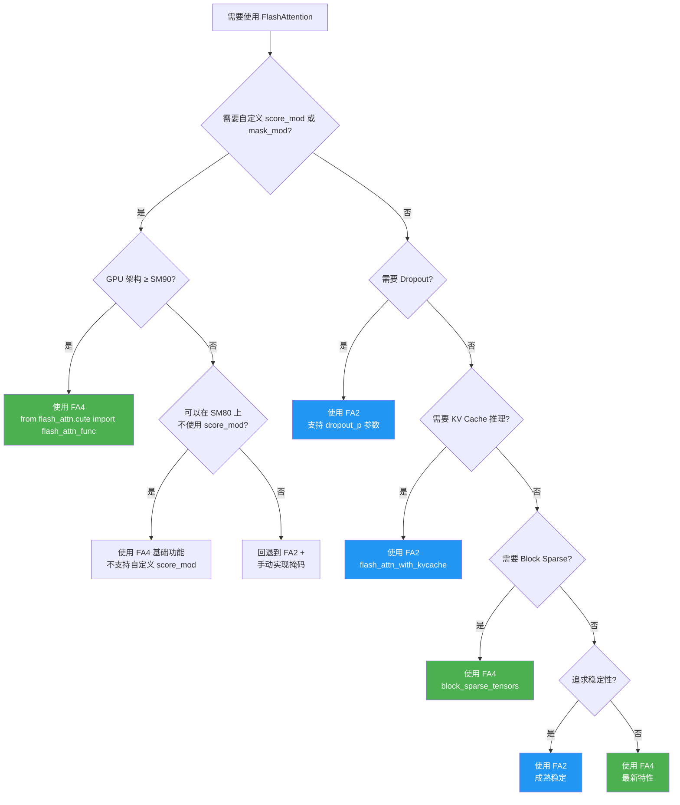
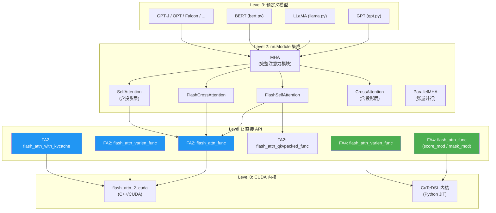
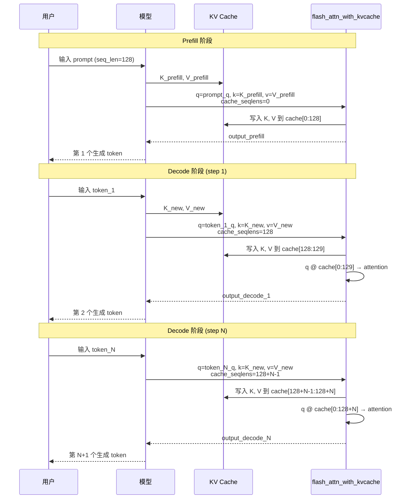
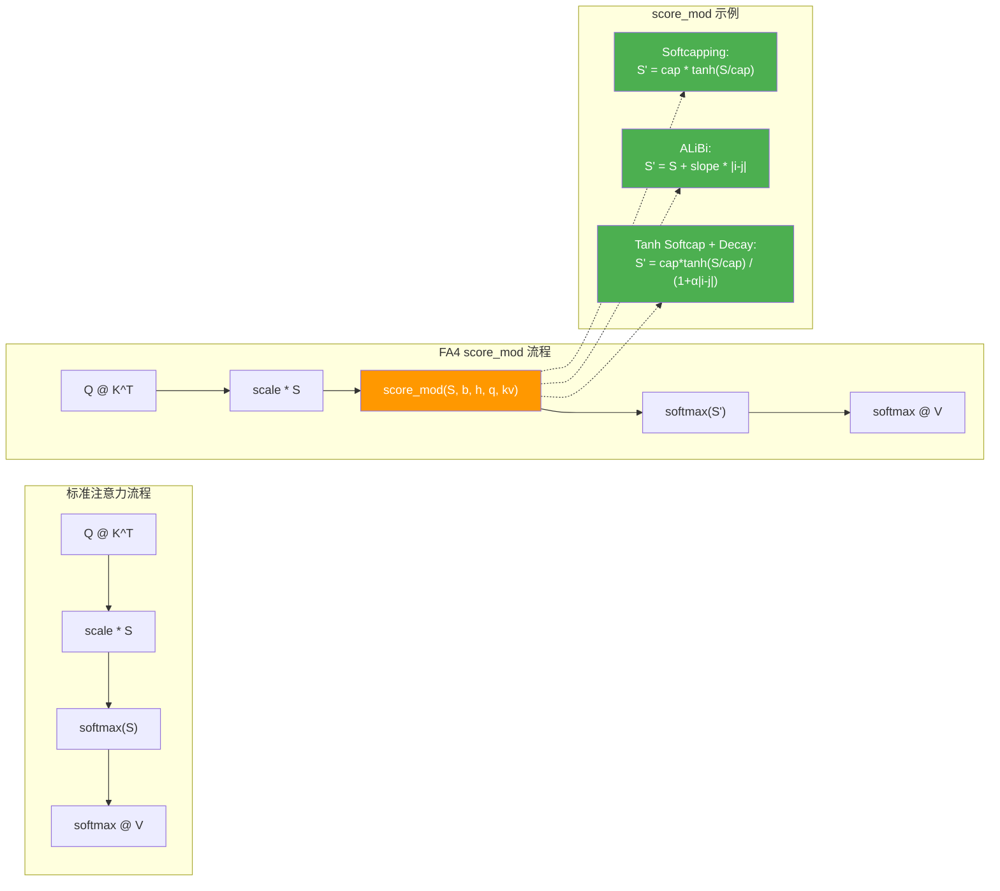
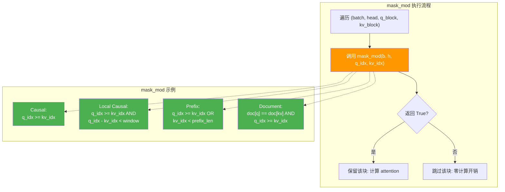
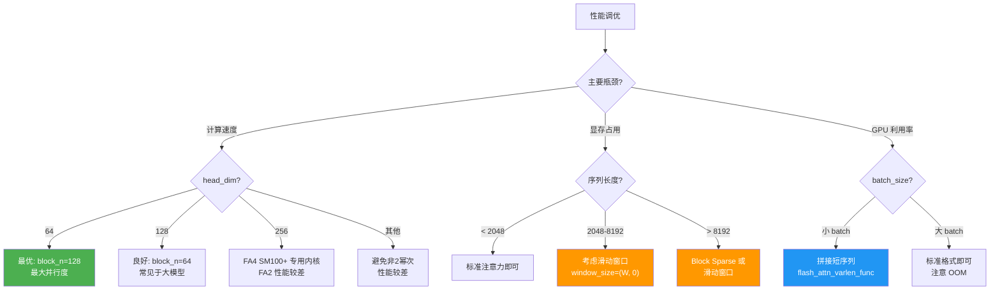

# 14 - 使用指南与实践教程

## 【总】开篇

本篇是 FlashAttention 的使用指南与实践教程，旨在帮助开发者从零开始掌握 FlashAttention 的全部使用方式，并深入理解不同版本之间的 API 差异与高级特性。

**核心结论：**

1. **三种使用方式覆盖全场景**——直接 API 调用（`flash_attn_func` 等）适合灵活控制、`nn.Module` 集成（`FlashSelfAttention` / `MHA` 等）适合模型构建、预定义模型（GPT / LLaMA 等）适合开箱即用，三者由底层到上层逐级封装。
2. **FA2 和 FA4 API 有显著差异**——FA2 提供 7 个公共 API 函数（含 QKV 打包、KV 打包、变长序列、KV Cache 推理等变体），FA4 仅导出 2 个函数（`flash_attn_func` / `flash_attn_varlen_func`）但通过 `score_mod` / `mask_mod` 参数实现更强的灵活性；FA2 的 `softcap` 是独立参数，FA4 中 `softcap` 与 `score_mod` 互斥且内部会自动转换为 `score_mod`。
3. **自定义 `score_mod` / `mask_mod` 是 FA4 高级用法**——FA4 借鉴 PyTorch FlexAttention 的理念，允许用户通过 CuTe DSL 编写自定义的分数修改函数和掩码函数，在 GPU 内核层面原生执行，兼顾灵活性与性能，这是 FA2 所不具备的核心能力。

---

## 【分】主体内容

### 1. 安装指南

#### 1.1 FA2 安装

```bash
# 基础安装（推荐）
pip install flash-attn --no-build-isolation

# 指定版本安装
pip install flash-attn==2.7.3 --no-build-isolation

# 从源码安装
git clone https://github.com/Dao-AILab/flash-attention.git
cd flash-attention
pip install . --no-build-isolation
```

**`--no-build-isolation` 的必要性**：FA2 的构建依赖 `torch`，若使用构建隔离，pip 会在隔离环境中重新安装 `torch`，导致编译时找不到正确的 CUDA 头文件。禁用构建隔离可确保使用当前环境中的 `torch`。

#### 1.2 FA4 安装

```bash
# FA4 是独立包
pip install flash-attn-4

# 从源码安装（需要 flash-attention 仓库）
cd flash-attention/flash_attn/cute
pip install .
```

**FA4 依赖说明**：FA4 依赖 NVIDIA CuTeDSL（CUTLASS DSL），安装时会自动拉取。FA4 仅支持 SM80+ 架构（Ampere 及以上），自定义 `score_mod` / `mask_mod` 需要 SM90+（Hopper 及以上）。

#### 1.3 常见安装问题与解决方案

| 问题 | 原因 | 解决方案 |
|------|------|----------|
| `ModuleNotFoundError: No module named 'torch'` | 构建隔离导致找不到 torch | 使用 `--no-build-isolation` |
| `CUDA_HOME not set` | 未配置 CUDA 路径 | `export CUDA_HOME=/usr/local/cuda` |
| `nvcc fatal: unsupported gpu architecture` | CUDA 版本与 GPU 不匹配 | 升级 CUDA Toolkit 或指定 `TORCH_CUDA_ARCH_LIST` |
| `flash_attn_2_cuda not found` | 编译失败或 GPU 架构不支持 | 检查 GPU 计算能力是否 ≥ 8.0 |
| `ImportError: flash_attn_4` | FA4 未安装 | FA4 是独立包，需单独安装 |
| 编译时间过长 | CUDA kernel 编译耗时 | 正常现象，首次编译约 5-15 分钟 |

#### 1.4 GPU 兼容性检查

```python
import torch

# 检查 GPU 计算能力
if torch.cuda.is_available():
    major, minor = torch.cuda.get_device_capability()
    cc = major * 10 + minor
    print(f"GPU 计算能力: sm_{cc}")

    if cc >= 80:
        print("✅ 支持 FlashAttention2 (SM80+)")
    else:
        print("❌ 不支持 FlashAttention2 (需要 SM80+)")

    if cc >= 90:
        print("✅ 支持 FA4 自定义 score_mod/mask_mod (SM90+)")
    elif cc >= 80:
        print("⚠️  FA4 基础功能可用，但自定义 score_mod/mask_mod 需要 SM90+")
else:
    print("❌ 未检测到 CUDA GPU")
```

**各架构支持情况**：

| 架构 | GPU 示例 | FA2 | FA4 基础 | FA4 score_mod/mask_mod |
|------|----------|-----|----------|----------------------|
| SM80 | A100 | ✅ | ✅ | ❌ |
| SM86 | RTX 3090 | ✅ | ✅ | ❌ |
| SM89 | RTX 4090 | ✅ | ✅ | ❌ |
| SM90 | H100 | ✅ | ✅ | ✅ |
| SM100 | B200 | ✅ | ✅ | ✅ |

---

### 2. FA2 基础使用

#### 2.1 基本注意力计算

```python
import torch
from flash_attn import flash_attn_func

# 参数设置
batch_size = 4
seqlen = 128
num_heads = 8
head_dim = 64

# 创建输入张量 (batch_size, seqlen, num_heads, head_dim)
q = torch.randn(batch_size, seqlen, num_heads, head_dim, device="cuda", dtype=torch.float16)
k = torch.randn(batch_size, seqlen, num_heads, head_dim, device="cuda", dtype=torch.float16)
v = torch.randn(batch_size, seqlen, num_heads, head_dim, device="cuda", dtype=torch.float16)

# 基本注意力计算
output = flash_attn_func(q, k, v)
# output shape: (batch_size, seqlen, num_heads, head_dim)
print(f"Output shape: {output.shape}")  # torch.Size([4, 128, 8, 64])
```

**参数说明**：

| 参数 | 类型 | 默认值 | 说明 |
|------|------|--------|------|
| `q` | Tensor | — | 查询张量，shape `(batch, seqlen, nheads, headdim)` |
| `k` | Tensor | — | 键张量，shape `(batch, seqlen, nheads_k, headdim)` |
| `v` | Tensor | — | 值张量，shape `(batch, seqlen, nheads_k, headdim)` |
| `dropout_p` | float | 0.0 | Dropout 概率，评估时必须为 0.0 |
| `softmax_scale` | float | None | softmax 缩放因子，默认 `1/√headdim` |
| `causal` | bool | False | 是否使用因果掩码 |
| `window_size` | tuple | (-1, -1) | 滑动窗口大小 |
| `softcap` | float | 0.0 | Softcapping 值，0.0 表示禁用 |
| `alibi_slopes` | Tensor | None | ALiBi 位置偏置斜率 |
| `deterministic` | bool | False | 是否使用确定性反向传播 |

#### 2.2 Causal 注意力

```python
import torch
from flash_attn import flash_attn_func

batch, seqlen, heads, dim = 2, 256, 16, 64
q = torch.randn(batch, seqlen, heads, dim, device="cuda", dtype=torch.bfloat16)
k = torch.randn(batch, seqlen, heads, dim, device="cuda", dtype=torch.bfloat16)
v = torch.randn(batch, seqlen, heads, dim, device="cuda", dtype=torch.bfloat16)

# 因果注意力：下三角掩码，适用于自回归模型
output_causal = flash_attn_func(q, k, v, causal=True)
print(f"Causal output shape: {output_causal.shape}")
```

**Causal 掩码对齐规则**：因果掩码与注意力矩阵右下角对齐。当 `seqlen_q=2, seqlen_k=5` 时，掩码为：
```
1 1 1 1 0
1 1 1 1 1
```
当 `seqlen_q=5, seqlen_k=2` 时，掩码为：
```
0 0
0 0
0 0
1 0
1 1
```

#### 2.3 滑动窗口注意力

```python
import torch
from flash_attn import flash_attn_func

batch, seqlen, heads, dim = 2, 512, 16, 64
q = torch.randn(batch, seqlen, heads, dim, device="cuda", dtype=torch.float16)
k = torch.randn(batch, seqlen, heads, dim, device="cuda", dtype=torch.float16)
v = torch.randn(batch, seqlen, heads, dim, device="cuda", dtype=torch.float16)

# 滑动窗口：每个 token 只关注左侧 128 个和右侧 0 个 token
# window_size=(left, right)，-1 表示无限上下文
output_window = flash_attn_func(q, k, v, window_size=(128, 0))
print(f"Sliding window output shape: {output_window.shape}")

# 滑动窗口 + 因果掩码（Mistral 等模型常用配置）
output_causal_window = flash_attn_func(q, k, v, causal=True, window_size=(128, 0))
```

**窗口语义**：位置 `i` 的 query 只关注 `[i + seqlen_k - seqlen_q - left, i + seqlen_k - seqlen_q + right]` 范围内的 key。`window_size=(-1, -1)` 表示无限上下文（即标准注意力）。

#### 2.4 MQA / GQA

```python
import torch
from flash_attn import flash_attn_func

batch, seqlen, dim = 2, 256, 64
num_q_heads = 16
num_kv_heads = 4  # GQA: KV head 数量少于 Q head 数量

q = torch.randn(batch, seqlen, num_q_heads, dim, device="cuda", dtype=torch.float16)
k = torch.randn(batch, seqlen, num_kv_heads, dim, device="cuda", dtype=torch.float16)
v = torch.randn(batch, seqlen, num_kv_heads, dim, device="cuda", dtype=torch.float16)

# GQA: Q 的 head 数必须能被 KV 的 head 数整除
# 16 / 4 = 4，即每 4 个 Q head 共享 1 个 KV head
output_gqa = flash_attn_func(q, k, v, causal=True)
print(f"GQA output shape: {output_gqa.shape}")  # (2, 256, 16, 64)

# MQA: KV 只有 1 个 head（极端的 GQA）
num_kv_heads_mqa = 1
k_mqa = torch.randn(batch, seqlen, num_kv_heads_mqa, dim, device="cuda", dtype=torch.float16)
v_mqa = torch.randn(batch, seqlen, num_kv_heads_mqa, dim, device="cuda", dtype=torch.float16)
output_mqa = flash_attn_func(q, k_mqa, v_mqa, causal=True)
```

#### 2.5 变长序列

```python
import torch
from flash_attn import flash_attn_varlen_func

# 模拟 3 个不同长度的序列: 长度分别为 128, 256, 64
seqlens = [128, 256, 64]
total_tokens = sum(seqlens)  # 448
num_heads = 16
head_dim = 64

# 拼接所有序列的 Q, K, V
q = torch.randn(total_tokens, num_heads, head_dim, device="cuda", dtype=torch.float16)
k = torch.randn(total_tokens, num_heads, head_dim, device="cuda", dtype=torch.float16)
v = torch.randn(total_tokens, num_heads, head_dim, device="cuda", dtype=torch.float16)

# 构建累积序列长度张量 cu_seqlens
# cu_seqlens[0] = 0, cu_seqlens[i] = sum(seqlens[:i])
cu_seqlens_q = torch.tensor([0, 128, 384, 448], dtype=torch.int32, device="cuda")
cu_seqlens_k = cu_seqlens_q  # 自注意力时 Q 和 K 的序列长度相同

output = flash_attn_varlen_func(
    q, k, v,
    cu_seqlens_q=cu_seqlens_q,
    cu_seqlens_k=cu_seqlens_k,
    max_seqlen_q=max(seqlens),  # 256
    max_seqlen_k=max(seqlens),  # 256
    causal=True,
)
print(f"Varlen output shape: {output.shape}")  # (448, 16, 64)
```

**变长序列的优势**：避免将短序列 padding 到最长序列长度，节省计算量和显存。`cu_seqlens` 是累积序列长度，`max_seqlen` 是批次中最长序列的长度，用于内核内存分配。

#### 2.6 KV Cache 推理

```python
import torch
from flash_attn import flash_attn_with_kvcache

# 模型参数
batch_size = 1
num_heads = 32
num_kv_heads = 8   # GQA
head_dim = 128
max_seqlen = 2048  # KV Cache 最大长度

# 预分配 KV Cache
k_cache = torch.zeros(batch_size, max_seqlen, num_kv_heads, head_dim,
                       device="cuda", dtype=torch.float16)
v_cache = torch.zeros(batch_size, max_seqlen, num_kv_heads, head_dim,
                       device="cuda", dtype=torch.float16)

# ===== Prefill 阶段 =====
prompt_len = 128
q_prefill = torch.randn(batch_size, prompt_len, num_heads, head_dim,
                          device="cuda", dtype=torch.float16)
k_prefill = torch.randn(batch_size, prompt_len, num_kv_heads, head_dim,
                          device="cuda", dtype=torch.float16)
v_prefill = torch.randn(batch_size, prompt_len, num_kv_heads, head_dim,
                          device="cuda", dtype=torch.float16)

# Prefill: 将 KV 写入 cache 并计算注意力
output_prefill = flash_attn_with_kvcache(
    q=q_prefill,
    k_cache=k_cache,
    v_cache=v_cache,
    k=k_prefill,       # 新的 K 会被写入 k_cache
    v=v_prefill,       # 新的 V 会被写入 v_cache
    cache_seqlens=torch.tensor([0], dtype=torch.int32, device="cuda"),  # 从位置 0 开始写入
    causal=True,
)
print(f"Prefill output shape: {output_prefill.shape}")

# ===== Decode 阶段（逐 token 生成）=====
for step in range(10):
    # 每步只有 1 个新 token
    q_decode = torch.randn(batch_size, 1, num_heads, head_dim,
                            device="cuda", dtype=torch.float16)
    k_decode = torch.randn(batch_size, 1, num_kv_heads, head_dim,
                            device="cuda", dtype=torch.float16)
    v_decode = torch.randn(batch_size, 1, num_kv_heads, head_dim,
                            device="cuda", dtype=torch.float16)

    current_len = prompt_len + step
    output_decode = flash_attn_with_kvcache(
        q=q_decode,
        k_cache=k_cache,
        v_cache=v_cache,
        k=k_decode,
        v=v_decode,
        cache_seqlens=torch.tensor([current_len], dtype=torch.int32, device="cuda"),
        causal=True,
    )
    print(f"Decode step {step}: output shape = {output_decode.shape}")
```

**KV Cache 推理的关键参数**：

| 参数 | 说明 |
|------|------|
| `k_cache` / `v_cache` | 预分配的 KV 缓存，shape `(batch, max_seqlen, nheads_k, headdim)` |
| `k` / `v` | 新的 KV 值，会被原地写入 cache |
| `cache_seqlens` | 每个序列当前的 KV 长度，新 KV 从此位置开始写入 |
| `cache_batch_idx` | 批次索引，用于 batch 中不连续的序列 |
| `block_table` | Paged KV Cache 的页表，shape `(batch, max_num_blocks_per_seq)` |
| `rotary_cos` / `rotary_sin` | Rotary Embedding 的余弦/正弦值，kernel 内融合旋转 |
| `num_splits` | Split-KV 并行数，0 为自动选择 |

---

### 3. FA4 基础使用

#### 3.1 基本注意力计算

```python
import torch
from flash_attn.cute import flash_attn_func

batch, seqlen, heads, dim = 2, 256, 16, 64

q = torch.randn(batch, seqlen, heads, dim, device="cuda", dtype=torch.float16)
k = torch.randn(batch, seqlen, heads, dim, device="cuda", dtype=torch.float16)
v = torch.randn(batch, seqlen, heads, dim, device="cuda", dtype=torch.float16)

# FA4 基本用法与 FA2 类似，但导入路径不同
output = flash_attn_func(q, k, v, causal=True)
print(f"FA4 output shape: {output.shape}")

# FA4 支持 return_lse 返回 log-sum-exp
output, lse = flash_attn_func(q, k, v, causal=True, return_lse=True)
print(f"LSE shape: {lse.shape}")
```

**FA4 与 FA2 API 对比**：

| 特性 | FA2 `flash_attn_func` | FA4 `flash_attn_func` |
|------|----------------------|----------------------|
| 导入路径 | `from flash_attn import flash_attn_func` | `from flash_attn.cute import flash_attn_func` |
| `softcap` | 独立参数 | 内部转为 `score_mod`，与自定义 `score_mod` 互斥 |
| `score_mod` | ❌ 不支持 | ✅ 支持自定义分数修改函数 |
| `mask_mod` | ❌ 不支持 | ✅ 支持自定义掩码函数 |
| `aux_tensors` | ❌ 不支持 | ✅ 传递辅助张量给 score_mod/mask_mod |
| `return_lse` | ❌ 使用 `return_attn_probs` | ✅ 独立参数 |
| `pack_gqa` | ❌ 自动处理 | ✅ 显式控制 GQA 打包优化 |
| `block_sparse_tensors` | ❌ 不支持 | ✅ 块稀疏注意力 |
| `dropout_p` | ✅ 支持 | ❌ 不支持（FA4 专注于推理和训练中的非 dropout 场景） |

#### 3.2 自定义 score_mod：Softcapping

```python
import torch
import cutlass.cute as cute
from flash_attn.cute import flash_attn_func

batch, seqlen, heads, dim = 2, 256, 16, 64
q = torch.randn(batch, seqlen, heads, dim, device="cuda", dtype=torch.float16)
k = torch.randn(batch, seqlen, heads, dim, device="cuda", dtype=torch.float16)
v = torch.randn(batch, seqlen, heads, dim, device="cuda", dtype=torch.float16)

# 方式1：使用 softcap 参数（FA4 内部自动转为 score_mod）
output_softcap = flash_attn_func(q, k, v, softcap=50.0, causal=True)

# 方式2：手动定义 softcap score_mod（等价于方式1）
softcap_val = 50.0

@cute.jit
def softcap_score_mod(score, batch_idx, head_idx, q_idx, kv_idx, seqlen_info, aux_tensors):
    scores = score / softcap_val
    return softcap_val * cute.math.tanh(scores, fastmath=True)

output_custom = flash_attn_func(q, k, v, score_mod=softcap_score_mod, causal=True)
```

**注意**：`softcap` 参数和 `score_mod` 参数不能同时使用。FA4 内部会将 `softcap` 自动转换为 `score_mod`（参见 `interface.py` 第 602-604 行的 `assert score_mod is None, "softcap and score_mod cannot be used together"`）。

#### 3.3 自定义 score_mod：ALiBi 位置偏置

```python
import torch
import cutlass.cute as cute
from flash_attn.cute import flash_attn_func

batch, seqlen, heads, dim = 2, 256, 16, 64
q = torch.randn(batch, seqlen, heads, dim, device="cuda", dtype=torch.float16)
k = torch.randn(batch, seqlen, heads, dim, device="cuda", dtype=torch.float16)
v = torch.randn(batch, seqlen, heads, dim, device="cuda", dtype=torch.float16)

# ALiBi 斜率（每个 head 不同）
alibi_slopes = torch.randn(heads, device="cuda", dtype=torch.float32)

@cute.jit
def alibi_score_mod(score, batch_idx, head_idx, q_idx, kv_idx, seqlen_info, aux_tensors):
    # aux_tensors[0] = alibi_slopes
    slope = aux_tensors[0][head_idx]
    distance = kv_idx - q_idx  # 注意：kv_idx - q_idx 给出相对位置
    return score + slope * distance

output_alibi = flash_attn_func(
    q, k, v,
    score_mod=alibi_score_mod,
    aux_tensors=[alibi_slopes],
    causal=True,
)
```

#### 3.4 自定义 mask_mod：自定义掩码模式

```python
import torch
import cutlass.cute as cute
from flash_attn.cute import flash_attn_func

batch, seqlen, heads, dim = 2, 256, 16, 64
q = torch.randn(batch, seqlen, heads, dim, device="cuda", dtype=torch.float16)
k = torch.randn(batch, seqlen, heads, dim, device="cuda", dtype=torch.float16)
v = torch.randn(batch, seqlen, heads, dim, device="cuda", dtype=torch.float16)

# 示例1：因果掩码（等价于 causal=True）
@cute.jit
def causal_mask(batch_idx, head_idx, q_idx, kv_idx, seqlen_info, aux_tensors):
    return q_idx >= kv_idx

output_causal = flash_attn_func(q, k, v, mask_mod=causal_mask)

# 示例2：局部因果掩码（等价于 causal=True + window_size）
local_window = 128

@cute.jit
def local_causal_mask(batch_idx, head_idx, q_idx, kv_idx, seqlen_info, aux_tensors):
    return (q_idx >= kv_idx) and (q_idx - kv_idx < local_window)

output_local = flash_attn_func(q, k, v, mask_mod=local_causal_mask)

# 示例3：前缀掩码（前 prefix_len 个 token 可以互相看到，之后是因果的）
prefix_len = 32

@cute.jit
def prefix_causal_mask(batch_idx, head_idx, q_idx, kv_idx, seqlen_info, aux_tensors):
    # 因果部分：q_idx >= kv_idx
    # 前缀部分：kv_idx < prefix_len
    return (q_idx >= kv_idx) or (kv_idx < prefix_len)

output_prefix = flash_attn_func(q, k, v, mask_mod=prefix_causal_mask)
```

**`mask_mod` 函数签名**：接收 `(batch_idx, head_idx, q_idx, kv_idx, seqlen_info, aux_tensors)` 参数，返回布尔值——`True` 表示保留该位置，`False` 表示掩码掉。FA4 会在内核编译时将此函数 JIT 编译为 GPU 代码，实现零额外开销的自定义掩码。

#### 3.5 Block Sparse 注意力

```python
import torch
from flash_attn.cute import flash_attn_func
from flash_attn.cute.block_sparsity import BlockSparseTensorsTorch

batch, seqlen, heads, dim = 1, 1024, 16, 64
q = torch.randn(batch, seqlen, heads, dim, device="cuda", dtype=torch.float16)
k = torch.randn(batch, seqlen, heads, dim, device="cuda", dtype=torch.float16)
v = torch.randn(batch, seqlen, heads, dim, device="cuda", dtype=torch.float16)

# 构建块稀疏掩码
block_size_q = 128  # Q 方向块大小
block_size_kv = 128  # KV 方向块大小
num_blocks_q = seqlen // block_size_q
num_blocks_kv = seqlen // block_size_kv

# 创建简单的对角带状稀疏模式
mask_block_cnt = torch.zeros(batch, heads, num_blocks_q, dtype=torch.int32, device="cuda")
mask_block_idx = torch.zeros(batch, heads, num_blocks_q, num_blocks_kv, dtype=torch.int32, device="cuda")

# 填充稀疏模式：每个 Q 块只关注相邻的 3 个 KV 块
for b in range(batch):
    for h in range(heads):
        for i in range(num_blocks_q):
            cnt = 0
            for j in range(max(0, i - 1), min(num_blocks_kv, i + 2)):
                mask_block_idx[b, h, i, cnt] = j
                cnt += 1
            mask_block_cnt[b, h, i] = cnt

block_sparse_tensors = BlockSparseTensorsTorch(
    mask_block_cnt=mask_block_cnt,
    mask_block_idx=mask_block_idx[:, :, :, :3],  # 最多 3 个块
    block_size=(block_size_q, block_size_kv),
)

output_sparse = flash_attn_func(
    q, k, v,
    block_sparse_tensors=block_sparse_tensors,
    causal=True,
)
```

---

### 4. nn.Module 集成

#### 4.1 使用 FlashSelfAttention / FlashCrossAttention

```python
import torch
import torch.nn as nn
from flash_attn.modules.mha import FlashSelfAttention, FlashCrossAttention

# FlashSelfAttention: QKV 打包在一起的自注意力
self_attn = FlashSelfAttention(
    causal=True,              # 因果掩码
    softmax_scale=None,       # 默认 1/√d
    attention_dropout=0.1,    # 训练时 dropout
    window_size=(-1, -1),    # 滑动窗口
    alibi_slopes=None,       # ALiBi 偏置
    deterministic=False,     # 确定性反向传播
).cuda()

# 输入: QKV 打包在一起 (batch, seqlen, 3, nheads, headdim)
batch, seqlen, heads, dim = 2, 256, 16, 64
qkv = torch.randn(batch, seqlen, 3, heads, dim, device="cuda", dtype=torch.float16)
output_self = self_attn(qkv)
print(f"Self-attention output: {output_self.shape}")  # (2, 256, 16, 64)

# FlashCrossAttention: Q 和 KV 分开的交叉注意力
cross_attn = FlashCrossAttention(
    causal=False,
    softmax_scale=None,
    attention_dropout=0.0,
).cuda()

q = torch.randn(batch, seqlen, heads, dim, device="cuda", dtype=torch.float16)
kv = torch.randn(batch, seqlen, 2, heads, dim, device="cuda", dtype=torch.float16)
output_cross = cross_attn(q, kv)
print(f"Cross-attention output: {output_cross.shape}")
```

#### 4.2 使用 SelfAttention / CrossAttention（含投影层）

```python
import torch
from flash_attn.modules.mha import SelfAttention, CrossAttention

# SelfAttention: 包含 QKV 投影层 + FlashAttention + 输出投影
self_attn_proj = SelfAttention(
    embed_dim=512,            # 嵌入维度
    num_heads=8,              # 注意力头数
    dropout=0.1,              # dropout 概率
    causal=True,              # 因果掩码
    use_flash_attn=True,      # 使用 FlashAttention
).cuda()

# 输入: (batch, seqlen, embed_dim)
x = torch.randn(2, 256, 512, device="cuda", dtype=torch.float16)
output = self_attn_proj(x)
print(f"SelfAttention output: {output.shape}")  # (2, 256, 512)

# CrossAttention: 包含 Q 投影 + KV 投影 + FlashAttention + 输出投影
cross_attn_proj = CrossAttention(
    embed_dim=512,
    num_heads=8,
    dropout=0.0,
    causal=False,
    use_flash_attn=True,
).cuda()

q = torch.randn(2, 256, 512, device="cuda", dtype=torch.float16)
kv = torch.randn(2, 128, 512, device="cuda", dtype=torch.float16)
output_cross = cross_attn_proj(q, kv)
print(f"CrossAttention output: {output_cross.shape}")  # (2, 256, 512)
```

#### 4.3 使用 MHA（完整多头注意力模块）

```python
import torch
from flash_attn.modules.mha import MHA

# MHA: 最完整的注意力模块，支持自注意力/交叉注意力/MQA/GQA/RoPE/KV Cache
mha = MHA(
    embed_dim=1024,
    num_heads=16,
    num_heads_kv=4,           # GQA: 4 个 KV head
    dropout=0.0,
    causal=True,
    rotary_emb_dim=64,        # Rotary Embedding 维度
    use_flash_attn=True,
    device="cuda",
    dtype=torch.float16,
)

# 训练时前向传播
x = torch.randn(2, 512, 1024, device="cuda", dtype=torch.float16)
output = mha(x)
print(f"MHA output: {output.shape}")  # (2, 512, 1024)

# 推理时使用 KV Cache
from flash_attn.modules.mha import MHA

inference_params = mha.allocate_inference_cache(batch_size=2, max_seqlen=2048)

# Prefill
output_prefill = mha(x, inference_params=inference_params)

# Decode（逐 token）
x_decode = torch.randn(2, 1, 1024, device="cuda", dtype=torch.float16)
output_decode = mha(x_decode, inference_params=inference_params)
```

#### 4.4 使用 MQA / GQA

```python
import torch
from flash_attn.modules.mha import MHA

# MQA: num_heads_kv=1
mqa = MHA(
    embed_dim=1024,
    num_heads=16,
    num_heads_kv=1,           # 所有 Q head 共享 1 个 KV head
    causal=True,
    use_flash_attn=True,
    device="cuda",
    dtype=torch.float16,
)

# GQA: num_heads_kv < num_heads
gqa = MHA(
    embed_dim=1024,
    num_heads=16,
    num_heads_kv=4,           # 每 4 个 Q head 共享 1 个 KV head
    causal=True,
    use_flash_attn=True,
    device="cuda",
    dtype=torch.float16,
)

x = torch.randn(2, 256, 1024, device="cuda", dtype=torch.float16)
output_mqa = mqa(x)
output_gqa = gqa(x)
```

---

### 5. 预定义模型使用

#### 5.1 GPT 训练示例

```python
import torch
from flash_attn.models.gpt import GPTLMHeadModel
from flash_attn.models.gpt import GPT2Config

# 配置 GPT 模型
config = GPT2Config(
    vocab_size=50257,
    hidden_size=1024,
    num_hidden_layers=24,
    num_attention_heads=16,
    intermediate_size=4096,
    max_position_embeddings=2048,
    activation_function="gelu_new",
    # FlashAttention 特有配置
    use_flash_attn=True,          # 启用 FlashAttention
    rotary_emb_dim=0,             # 不使用 RoPE（GPT-2 风格）
    padded_vocab_size_multiple=8, # 词表大小对齐
)

# 创建模型
model = GPTLMHeadModel(config, device="cuda", dtype=torch.float16)

# 训练前向传播
input_ids = torch.randint(0, config.vocab_size, (4, 512), device="cuda")
labels = input_ids.clone()

# 模型内部自动使用 FlashAttention
loss = model(input_ids, labels=labels).loss
loss.backward()

print(f"Training loss: {loss.item():.4f}")
```

#### 5.2 LLaMA 推理示例

```python
import torch
from flash_attn.models.gpt import GPTLMHeadModel
from flash_attn.models.gpt import GPT2Config
from transformers import LlamaConfig

# 从 HuggingFace LLaMA 配置创建 GPT2Config
llama_config = LlamaConfig(
    hidden_size=4096,
    num_hidden_layers=32,
    num_attention_heads=32,
    intermediate_size=11008,
    max_position_embeddings=4096,
)

# 转换为 FlashAttention 的 GPT2Config
config = GPT2Config(
    vocab_size=llama_config.vocab_size,
    hidden_size=llama_config.hidden_size,
    num_hidden_layers=llama_config.num_hidden_layers,
    num_attention_heads=llama_config.num_attention_heads,
    num_heads_kv=llama_config.num_key_value_heads,  # GQA 支持
    intermediate_size=llama_config.intermediate_size,
    max_position_embeddings=llama_config.max_position_embeddings,
    activation_function="swiglu",     # LLaMA 使用 SwiGLU
    rotary_emb_dim=llama_config.hidden_size // llama_config.num_attention_heads,
    use_flash_attn=True,
    rms_norm=True,                    # LLaMA 使用 RMSNorm
    padded_vocab_size_multiple=8,
)

# 创建模型
model = GPTLMHeadModel(config, device="cuda", dtype=torch.bfloat16)

# 推理
input_ids = torch.randint(0, config.vocab_size, (1, 64), device="cuda")

# 使用 KV Cache 推理
inference_params = model.allocate_inference_cache(batch_size=1, max_seqlen=4096)

# Prefill
with torch.no_grad():
    output = model(input_ids, inference_params=inference_params)

# 自回归生成
generated = input_ids.clone()
for _ in range(50):
    with torch.no_grad():
        logits = model(generated[:, -1:], inference_params=inference_params).logits
    next_token = logits[:, -1].argmax(dim=-1, keepdim=True)
    generated = torch.cat([generated, next_token], dim=-1)

print(f"Generated sequence length: {generated.shape[1]}")
```

---

### 6. 高级用法

#### 6.1 自定义 score_mod 教程

`score_mod` 是 FA4 的核心高级特性，允许在 softmax 之前对注意力分数进行任意修改。其函数签名如下：

```python
@cute.jit
def my_score_mod(score, batch_idx, head_idx, q_idx, kv_idx, seqlen_info, aux_tensors):
    # score: 当前注意力分数（标量）
    # batch_idx, head_idx: 批次和头的索引
    # q_idx, kv_idx: query 和 key 的位置索引
    # seqlen_info: 序列长度信息
    # aux_tensors: 用户传入的辅助张量列表
    return modified_score  # 返回修改后的分数
```

**完整示例：Tanh Softcapping + 位置衰减**

```python
import torch
import cutlass.cute as cute
from flash_attn.cute import flash_attn_func

batch, seqlen, heads, dim = 2, 512, 16, 64
q = torch.randn(batch, seqlen, heads, dim, device="cuda", dtype=torch.float16)
k = torch.randn(batch, seqlen, heads, dim, device="cuda", dtype=torch.float16)
v = torch.randn(batch, seqlen, heads, dim, device="cuda", dtype=torch.float16)

softcap = 50.0
decay_rate = 0.01

@cute.jit
def softcap_with_decay(score, batch_idx, head_idx, q_idx, kv_idx, seqlen_info, aux_tensors):
    # 1. Softcapping: tanh(score / cap) * cap
    scores = score / softcap
    capped = softcap * cute.math.tanh(scores, fastmath=True)
    # 2. 位置衰减：距离越远分数越低
    distance = q_idx - kv_idx
    decay = 1.0 / (1.0 + decay_rate * distance)
    return capped * decay

output = flash_attn_func(q, k, v, score_mod=softcap_with_decay, causal=True)
```

**反向传播支持**：若需要通过 `score_mod` 进行梯度传播，需同时提供 `score_mod_bwd`：

```python
@cute.jit
def softcap_with_decay_bwd(grad_out, score, batch_idx, head_idx, q_idx, kv_idx, seqlen_info, aux_tensors):
    # softcap 反向: grad * (1 - tanh²(score/cap))
    scores = score / softcap
    tanh_scores = cute.math.tanh(scores, fastmath=True)
    grad_softcap = grad_out * (1.0 - tanh_scores * tanh_scores)
    # decay 反向: decay 对 score 无依赖，直接乘
    distance = q_idx - kv_idx
    decay = 1.0 / (1.0 + decay_rate * distance)
    return grad_softcap * decay

output = flash_attn_func(
    q, k, v,
    score_mod=softcap_with_decay,
    score_mod_bwd=softcap_with_decay_bwd,
    causal=True,
)
```

#### 6.2 自定义 mask_mod 教程

`mask_mod` 允许定义自定义的注意力掩码模式，在内核层面跳过被掩码的块，实现零计算浪费。

**完整示例：文档掩码（Document Mask）**

```python
import torch
import cutlass.cute as cute
from flash_attn.cute import flash_attn_func

batch, seqlen, heads, dim = 2, 1024, 16, 64
q = torch.randn(batch, seqlen, heads, dim, device="cuda", dtype=torch.float16)
k = torch.randn(batch, seqlen, heads, dim, device="cuda", dtype=torch.float16)
v = torch.randn(batch, seqlen, heads, dim, device="cuda", dtype=torch.float16)

# 文档边界：每个序列有多个文档，文档内可以互相看到，文档间不可见
# document_ids[b][i] = 文档 ID
document_ids = torch.zeros(batch, seqlen, dtype=torch.int32, device="cuda")
# 模拟文档边界：每 256 个 token 一个文档
for b in range(batch):
    for i in range(seqlen):
        document_ids[b, i] = i // 256

@cute.jit
def document_mask(batch_idx, head_idx, q_idx, kv_idx, seqlen_info, aux_tensors):
    # aux_tensors[0] = document_ids
    doc_q = aux_tensors[0][batch_idx, q_idx]
    doc_kv = aux_tensors[0][batch_idx, kv_idx]
    # 同一文档内可见 + 因果约束
    return (doc_q == doc_kv) and (q_idx >= kv_idx)

output = flash_attn_func(
    q, k, v,
    mask_mod=document_mask,
    aux_tensors=[document_ids],
)
```

#### 6.3 Paged KV Cache 使用

FA4 通过 `PagedKVManager` 和 `page_table` 参数支持 Paged KV Cache，适用于 vLLM 等推理框架：

```python
import torch
from flash_attn.cute import flash_attn_varlen_func

# Paged KV Cache 参数
batch_size = 4
num_heads = 32
num_kv_heads = 8
head_dim = 128
page_size = 128          # 每页的序列长度，必须是 256 的倍数（FA2）或 128 的倍数（FA4）
max_num_pages = 64       # 每个序列最多使用的页数
max_seqlen = page_size * max_num_pages

# 页表：(batch_size, max_num_pages_per_seq)
# page_table[b][i] = 第 b 个序列的第 i 个页在 KV cache 中的物理页索引
page_table = torch.arange(batch_size * max_num_pages, dtype=torch.int32, device="cuda")
page_table = page_table.reshape(batch_size, max_num_pages)

# Paged KV Cache 存储
k_cache = torch.zeros(
    batch_size * max_num_pages, page_size, num_kv_heads, head_dim,
    device="cuda", dtype=torch.float16,
)
v_cache = torch.zeros_like(k_cache)

# 变长序列信息
cu_seqlens_q = torch.tensor([0, 64, 128, 256, 320], dtype=torch.int32, device="cuda")
cu_seqlens_k = torch.tensor([0, 512, 1024, 1536, 2048], dtype=torch.int32, device="cuda")

q = torch.randn(320, num_heads, head_dim, device="cuda", dtype=torch.float16)
k = torch.randn(2048, num_kv_heads, head_dim, device="cuda", dtype=torch.float16)
v = torch.randn(2048, num_kv_heads, head_dim, device="cuda", dtype=torch.float16)

output = flash_attn_varlen_func(
    q, k, v,
    cu_seqlens_q=cu_seqlens_q,
    cu_seqlens_k=cu_seqlens_k,
    max_seqlen_q=64,
    max_seqlen_k=512,
    page_table=page_table,
    causal=True,
)
```

#### 6.4 分布式训练集成

```python
import torch
import torch.distributed as dist
from flash_attn.modules.mha import ParallelMHA
from flash_attn.ops.fused_dense import ColumnParallelLinear, RowParallelLinear

# 初始化分布式
dist.init_process_group(backend="nccl")
rank = dist.get_rank()
world_size = dist.get_world_size()
process_group = dist.group.WORLD

# ParallelMHA: 张量并行的 MHA 模块
parallel_mha = ParallelMHA(
    embed_dim=1024,
    num_heads=16,
    process_group=process_group,
    sequence_parallel=True,    # 序列并行
    use_flash_attn=True,
    device="cuda",
    dtype=torch.float16,
)

# 前向传播（自动处理 all-gather / reduce-scatter）
x = torch.randn(2, 512, 1024, device="cuda", dtype=torch.float16)
output = parallel_mha(x)
```

#### 6.5 torch.compile 兼容性

FA2 通过 `torch.ops.custom_op` 和 `register_fake` 机制支持 `torch.compile`：

```python
import torch
from flash_attn import flash_attn_func

# FA2 已注册 custom_op，可直接使用 torch.compile
@torch.compile
def compiled_attention(q, k, v):
    return flash_attn_func(q, k, v, causal=True)

batch, seqlen, heads, dim = 2, 256, 16, 64
q = torch.randn(batch, seqlen, heads, dim, device="cuda", dtype=torch.float16)
k = torch.randn(batch, seqlen, heads, dim, device="cuda", dtype=torch.float16)
v = torch.randn(batch, seqlen, heads, dim, device="cuda", dtype=torch.float16)

# 首次调用会触发编译，后续调用使用缓存的内核
output = compiled_attention(q, k, v)
```

**FA4 的 torch.compile 兼容性**：FA4 使用 CuTe DSL JIT 编译，与 `torch.compile` 的交互需要特别注意。FA4 的 `FlashAttnFunc` 继承自 `torch.autograd.Function`，在 `torch.compile` 模式下会通过 `FakeTensorMode` 检测进行特殊处理（参见 `cute/testing.py`）。

---

### 7. 性能调优

#### 7.1 选择合适的 FA 版本

| 场景 | 推荐 | 原因 |
|------|------|------|
| 生产推理（A100/H100） | FA2 | 成熟稳定，广泛验证 |
| 生产推理（H100/B200）+ 自定义掩码 | FA4 | score_mod/mask_mod 原生支持 |
| 研究/实验（需要灵活掩码） | FA4 | 自定义 score_mod/mask_mod |
| AMD GPU | FA2 + Triton 后端 | 设置 `FLASH_ATTENTION_TRITON_AMD_ENABLE=TRUE` |
| Dropout 训练 | FA2 | FA4 不支持 dropout |

#### 7.2 head_dim 对性能的影响

```python
# head_dim 与 block 大小的关系（FA2）
# head_dim <= 32:  block_n = 128
# head_dim <= 64:  block_n = 128 (无 dropout)
# head_dim <= 96:  block_n = 64
# head_dim <= 128: block_n = 64 (SM80/SM90), 32 (SM8x + dropout)
# head_dim > 128:  block_n = 64

# 推荐 head_dim 选择：
# - 64: 最优性能（block_n=128，最大并行度）
# - 128: 良好性能（常见于 LLaMA 等大模型）
# - 256: FA4 有专用内核（SM100+）
# - 避免非 2 的幂次 head_dim（如 96, 192），性能较差
```

#### 7.3 序列长度与 batch size 的权衡

```python
# FlashAttention 的计算复杂度为 O(N²d)，但内存为 O(Nd)
# 实际性能取决于是否充分利用 GPU 的计算吞吐

# 短序列（seqlen < 128）：
#   - 增加 batch_size 以提高 GPU 利用率
#   - 考虑使用 flash_attn_varlen_func 拼接多个短序列

# 中等序列（128 < seqlen < 2048）：
#   - FlashAttention 优势最明显
#   - 标准的 (batch, seqlen, heads, dim) 格式即可

# 长序列（seqlen > 2048）：
#   - 考虑滑动窗口注意力减少计算量
#   - 考虑 block sparse 注意力
#   - FA4 的 SplitKV (num_splits > 1) 可提高并行度
```

#### 7.4 使用 benchmark 工具

```python
import torch
import time
from flash_attn import flash_attn_func

def benchmark_flash_attn(batch, seqlen, heads, dim, causal=False, num_iters=100, warmup=10):
    q = torch.randn(batch, seqlen, heads, dim, device="cuda", dtype=torch.float16)
    k = torch.randn(batch, seqlen, heads, dim, device="cuda", dtype=torch.float16)
    v = torch.randn(batch, seqlen, heads, dim, device="cuda", dtype=torch.float16)

    # Warmup
    for _ in range(warmup):
        _ = flash_attn_func(q, k, v, causal=causal)
    torch.cuda.synchronize()

    # Benchmark
    start = time.perf_counter()
    for _ in range(num_iters):
        _ = flash_attn_func(q, k, v, causal=causal)
    torch.cuda.synchronize()
    elapsed = time.perf_counter() - start

    ms_per_iter = elapsed / num_iters * 1000
    tflops = 2 * 2 * batch * seqlen * seqlen * heads * dim / (elapsed / num_iters) / 1e12
    print(f"batch={batch}, seqlen={seqlen}, heads={heads}, dim={dim}, causal={causal}")
    print(f"  Time: {ms_per_iter:.3f} ms/iter, TFLOPS: {tflops:.2f}")

# 运行 benchmark
benchmark_flash_attn(2, 512, 16, 64, causal=False)
benchmark_flash_attn(2, 512, 16, 64, causal=True)
benchmark_flash_attn(2, 2048, 16, 128, causal=True)
```

---

### 8. 常见问题与排错

#### 8.1 安装失败排查

**问题：`nvcc fatal: Unsupported gpu architecture`**

```bash
# 检查 CUDA 版本
nvcc --version

# 检查 GPU 架构
nvidia-smi --query-gpu=compute_cap --format=csv

# 手动指定编译目标架构
export TORCH_CUDA_ARCH_LIST="8.0;8.6;8.9;9.0"
pip install flash-attn --no-build-isolation
```

**问题：`RuntimeError: CUDA out of memory`（编译时）**

```bash
# 减少并行编译数
export MAX_JOBS=2
pip install flash-attn --no-build-isolation
```

#### 8.2 数值精度问题

```python
# FlashAttention 使用 online softmax，结果与 PyTorch 原生注意力有微小差异
# 这是正常现象，差异在 fp16/bf16 的精度范围内

# 验证数值一致性
import torch
from flash_attn import flash_attn_func

def verify_numerical_accuracy(batch=1, seqlen=128, heads=8, dim=64, atol=1e-2):
    q = torch.randn(batch, seqlen, heads, dim, device="cuda", dtype=torch.float16)
    k = torch.randn(batch, seqlen, heads, dim, device="cuda", dtype=torch.float16)
    v = torch.randn(batch, seqlen, heads, dim, device="cuda", dtype=torch.float16)

    # FlashAttention
    out_flash = flash_attn_func(q, k, v)

    # PyTorch 原生（参考实现）
    q_ref = q.float().transpose(1, 2)  # (B, H, S, D)
    k_ref = k.float().transpose(1, 2)
    v_ref = v.float().transpose(1, 2)
    scale = dim ** -0.5
    attn = torch.matmul(q_ref, k_ref.transpose(-2, -1)) * scale
    attn = torch.softmax(attn, dim=-1)
    out_ref = torch.matmul(attn, v_ref).transpose(1, 2).half()

    max_diff = (out_flash - out_ref).abs().max().item()
    print(f"Max difference: {max_diff:.6f} (atol={atol})")
    assert max_diff < atol, f"Numerical difference too large: {max_diff}"
    print("✅ Numerical accuracy verified")

verify_numerical_accuracy()
```

#### 8.3 OOM 问题

```python
# 常见 OOM 原因及解决方案

# 1. 序列长度过长
#    解决：使用滑动窗口注意力或 block sparse 注意力
output = flash_attn_func(q, k, v, causal=True, window_size=(512, 0))

# 2. Batch size 过大
#    解决：使用 gradient checkpointing 或减小 batch size
from torch.utils.checkpoint import checkpoint

def attn_forward(q, k, v):
    return flash_attn_func(q, k, v, causal=True)

output = checkpoint(attn_forward, q, k, v, use_reentrant=False)

# 3. head_dim 过大（如 256）
#    解决：FA4 在 SM100+ 有专用的 hd=256 内核，FA2 可使用 softcap 减少中间值范围

# 4. 反向传播 OOM
#    解决：使用 deterministic=True（用更多计算换更少显存）
output = flash_attn_func(q, k, v, deterministic=True)
```

#### 8.4 GPU 兼容性问题

```python
# 检查 GPU 兼容性
import torch

def check_gpu_compatibility():
    if not torch.cuda.is_available():
        print("❌ CUDA 不可用")
        return False

    major, minor = torch.cuda.get_device_capability()
    cc = major * 10 + minor

    print(f"GPU: {torch.cuda.get_device_name()}")
    print(f"Compute Capability: sm_{cc}")
    print(f"CUDA Version: {torch.version.cuda}")

    if cc < 80:
        print("❌ FlashAttention 需要 SM80+ (Ampere 及以上)")
        print("   支持的 GPU: A100, H100, RTX 3090, RTX 4090, etc.")
        return False

    print("✅ GPU 兼容 FlashAttention")

    # 检查显存
    total_mem = torch.cuda.get_device_properties(0).total_mem / 1024**3
    print(f"GPU Memory: {total_mem:.1f} GB")

    if total_mem < 16:
        print("⚠️  显存较小，建议使用较小的 batch size 或序列长度")

    return True

check_gpu_compatibility()
```

---

### 配图

#### FA2 vs FA4 API 选择决策树



#### 使用方式层次图



#### KV Cache 推理流程示意图



#### 自定义 score_mod 示例流程图



#### 自定义 mask_mod 示例流程图



#### 性能调优参数选择指南图



---

## 【总】收尾

FlashAttention 的使用从简单到高级，覆盖了从研究到生产的全场景。三种使用方式——直接 API 调用、nn.Module 集成、预定义模型——为不同需求的开发者提供了合适的抽象层次。FA2 以其成熟稳定和广泛验证成为生产环境的首选，而 FA4 通过 `score_mod` / `mask_mod` 开创了注意力机制灵活定制的新范式，让研究者无需修改内核代码即可实现 Softcapping、ALiBi、文档掩码等高级注意力模式。

在实际使用中，开发者应根据 GPU 架构（SM80/SM90/SM100）、使用场景（训练/推理/研究）和功能需求（是否需要自定义掩码/分数修改）来选择合适的 FA 版本和 API。同时，理解 `head_dim` 对 block 大小的影响、序列长度与 batch size 的权衡、KV Cache 推理的正确使用方式等性能调优知识，对于充分发挥 FlashAttention 的加速能力至关重要。随着 FA4 的持续演进和更多 GPU 架构的支持，FlashAttention 将继续在高效注意力计算领域发挥核心作用。
