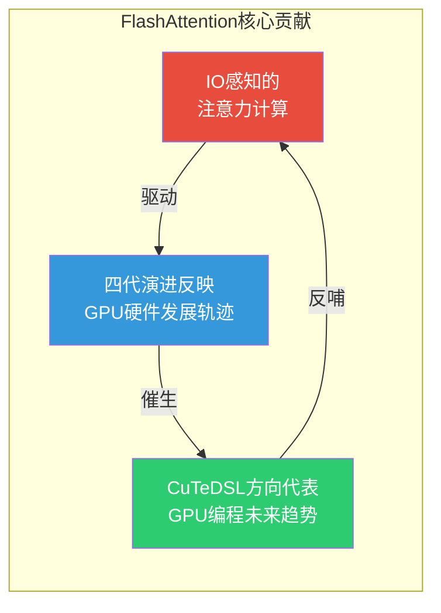
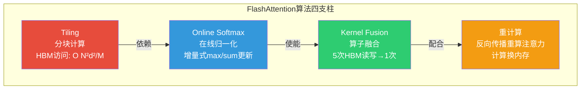
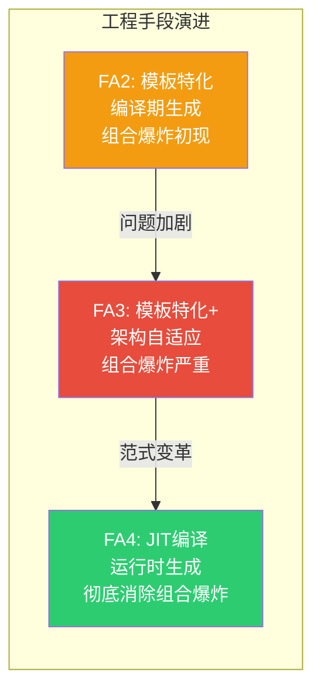
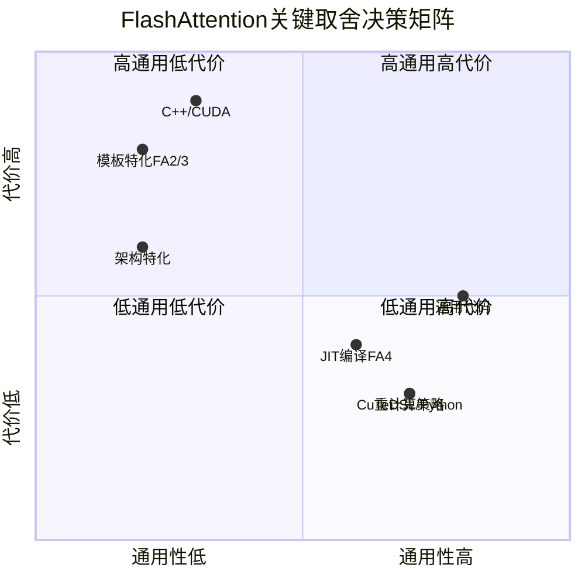
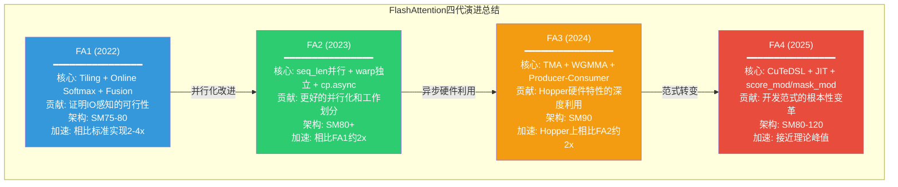
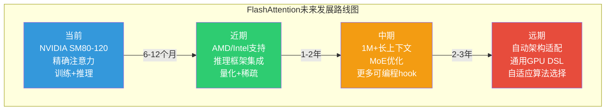

# 15 总结与展望

## 【总】开篇

本篇是 FlashAttention 项目代码分析文档的最终篇，对全文进行系统性总结并展望未来方向。

FlashAttention 自 2022 年问世以来，已经走过了四代演进，从一个学术原型发展为工业级标准实现。回顾这段历程，我们可以提炼出三个核心结论：

1. **IO 感知的注意力计算是 FlashAttention 的根本贡献**。FlashAttention 的加速并非来自近似计算——它计算的是精确的注意力结果——而是来自对 GPU 内存层次结构的深刻理解：注意力计算的瓶颈不在算力（FLOPs），而在内存带宽（IO）。通过将计算从 HBM 搬运到 SRAM 中完成，FlashAttention 实现了数量级的 IO 减少和显著的端到端加速。

2. **四代演进反映了 GPU 硬件发展的轨迹**。FA1 针对 Ampere 的 HMMA 设计了 Tiling + Online Softmax；FA2 改进了并行化以充分利用多 SM；FA3 深度利用 Hopper 的 TMA + WGMMA 实现生产者-消费者流水线；FA4 则面向 Blackwell 的 UMMA + 2CTA，同时将开发范式从 C++/CUDA 转向 CuTeDSL/Python。每一代都是对当时最新硬件特性的最优响应。

3. **FA4 的 CuTeDSL 方向代表了 GPU 编程的未来趋势**。从手写 C++/CUDA 内核到基于 CUTLASS DSL 的 Python 描述，这不是简单的语言切换，而是开发范式的根本性变革——通过 JIT 编译消除模板实例化的组合爆炸，通过高层抽象降低硬件编程门槛，同时保持甚至超越手写内核的性能。

---

## 【分】主体

### 1. 核心要点回顾

FlashAttention 的技术体系可以从算法、工程、生态三个层面进行总结。

#### 1.1 算法层面

**Tiling（分块计算）** 是 FlashAttention 的算法基石。标准注意力需要 O(N²) 的 HBM 存储来材料化完整的注意力矩阵 S = QK^T 和 P = softmax(S)。FlashAttention 将 Q、K、V 分成小块（tile），每次只将一个 Q 块和 K/V 块加载到 SRAM 中计算局部注意力，从而将 HBM 访问从 O(N²) 降低到 O(N²d²/M)，其中 M 是 SRAM 容量。这一 IO 复杂度的降低是 FlashAttention 加速的根本来源。

**Online Softmax** 解决了分块计算中的核心难题：标准 Softmax 需要先计算所有分数的最大值和求和值才能归一化，但分块计算时我们只能看到部分分数。Online Softmax 通过维护两个运行时统计量——当前最大值 m_i 和累积和 ℓ_i——实现了增量式的 Softmax 计算。每当处理一个新的 K/V 块时，用新块的局部最大值更新全局最大值，并相应调整之前的累积结果。这一算法保证了分块计算与完整计算在数学上的等价性。

**Kernel Fusion（算子融合）** 将注意力计算中的多个步骤（QK^T、Softmax、dropout、PV）融合为单个 GPU 内核，消除了中间结果在 HBM 中的材料化。标准实现需要至少 5 次 HBM 读写，而 FlashAttention 只需读写 Q、K、V、O 各一次，HBM 访问量从 O(N²) 降低到 O(Nd)。

**重计算（Recomputation）** 是反向传播中的关键优化。标准实现将注意力矩阵 P 存储在 HBM 中供反向传播使用，占用 O(N²) 内存。FlashAttention 选择在反向传播时重新计算注意力矩阵（从 Q、K 重算 S，再算 P），以额外的计算换取 O(N²) 的内存节省。在 GPU 算力过剩、内存带宽受限的现实中，这是一个净正的权衡。

#### 1.2 工程层面

**模板特化** 是 FA2/FA3 时代的主要工程手段。通过 C++ 模板参数（head_dim、dtype、causal、是否 ALiBi 等）在编译期生成特化代码，避免了运行时分支判断的开销。每个模板实例化都针对特定参数组合生成了最优的机器码。但这也带来了组合爆炸问题——FA3 的内核实例化数量急剧膨胀，编译时间和二进制体积成为严重瓶颈。

**架构自适应** 体现在多个维度：FA2 通过 `Kernel_traits` 模板为不同 SM 版本（SM75/SM80）选择不同的数据加载方式（同步/异步拷贝）；FA3 专门针对 SM90 的 TMA + WGMMA 设计了生产者-消费者流水线；FA4 则通过继承体系（`FlashAttentionForwardBase` → `FlashAttentionForwardSm80` / `FlashAttentionForwardSm90` / `FlashAttentionForwardSm100` / `FlashAttentionForwardSm120`）实现了四种架构的最优路径。

**JIT 编译** 是 FA4 解决组合爆炸的关键武器。FA4 不再预编译所有可能的内核实例，而是在运行时根据实际参数（head_dim、dtype、causal、mask_mod、score_mod 等）动态生成 CuTeDSL 代码并通过 `cute.compile()` JIT 编译为 PTX/CUBIN。编译结果会被缓存（`cache_utils.py`），后续相同参数的调用直接复用。这使得 FA4 只编译实际需要的内核，彻底消除了组合爆炸。

#### 1.3 生态层面

**PyTorch 集成** 是 FlashAttention 被广泛采用的关键。通过 `torch.autograd.Function` 封装，FlashAttention 可以像普通 PyTorch 算子一样使用，支持自动求导、混合精度训练、分布式训练等。`flash_attn_func`、`flash_attn_varlen_func`、`flash_attn_with_kvcache` 等接口覆盖了训练和推理的主要场景。

**预定义模型** 降低了集成门槛。项目提供了 GPT、LLaMA、BERT、GPT-J、GPT-NeoX、OPT、Falcon、BigCode、Baichuan、BTLM、ViT 共 11 个模型的完整实现，通过 `use_flash_attn` 参数即可一键切换。这些模型不仅是集成示例，也是实际可用的训练代码。

**分布式支持** 覆盖了大规模训练的需求。张量并行（Tensor Parallel）的 `ColumnParallelLinear` / `RowParallelLinear`、序列并行（Sequence Parallel）的异步 all-gather、以及融合的 all-reduce 操作，使得 FlashAttention 可以无缝集成到 Megatron-LM 等分布式训练框架中。

### 2. 设计亮点总结

#### 2.1 IO 感知而非计算感知的设计哲学

这是 FlashAttention 最根本的设计洞察。在 GPU 编程的直觉中，人们往往关注如何减少 FLOPs（浮点运算次数），但 FlashAttention 指出：**注意力计算的瓶颈是 IO 而非计算**。A100 的算力为 312 TFLOPS（FP16），而 HBM 带宽仅 2 TB/s。一次矩阵乘法所需的 FLOPs 可以被巨大的算力快速消化，但数据在 HBM 和 SRAM 之间搬运的时间才是真正的瓶颈。

这一洞察直接导致了 Tiling 策略的设计：不是为了减少计算量（Tiling 并不减少 FLOPs），而是为了减少 HBM 访问次数。每个 Q tile 只需从 HBM 加载一次，在 SRAM 中与所有 K/V 块计算后写出结果，HBM 访问量从 O(N²) 降至 O(N²d²/M)。

#### 2.2 渐进式优化：每一代只解决当前最大的瓶颈

FlashAttention 的四代演进体现了清晰的渐进式优化策略：

- **FA1** 面对的最大瓶颈是 O(N²) 的 HBM 访问。解决方案：Tiling + Online Softmax + Kernel Fusion，将 HBM 访问降至 O(N²d²/M)。
- **FA2** 面对的最大瓶颈是 GPU 利用率不足（batch×head 并行度太低）。解决方案：在 seq_len 维度并行，将并行度从 batch×head 提升到 batch×head×ceil(seqlen/kBlockM)。
- **FA3** 面对的最大瓶颈是 Hopper 新硬件特性（TMA/WGMMA）未被利用。解决方案：生产者-消费者流水线，将数据加载与计算完全重叠。
- **FA4** 面对的最大瓶颈是 C++ 模板实例化的组合爆炸。解决方案：CuTeDSL + JIT 编译，用 Python 描述内核逻辑，运行时按需编译。

每一代都精准地识别了当前最大的性能瓶颈，并集中资源解决它，而不是试图一次性解决所有问题。这种策略使得每一代都有明确的优化目标和可量化的性能提升。

#### 2.3 算法与硬件的深度协同设计

FlashAttention 的每一代都是算法与硬件协同设计的结果，而非纯算法创新或纯硬件适配：

- **Online Softmax** 是算法创新，但其价值只有在 GPU SRAM 容量有限的前提下才能体现——如果 SRAM 足够大，直接加载完整矩阵计算即可。
- **生产者-消费者流水线** 是算法设计，但直接利用了 Hopper 的 TMA（异步数据搬运）和 WGMMA（异步矩阵乘法）硬件特性——没有这些硬件支持，纯软件流水线的效率会大打折扣。
- **Split-KV + 持久化内核** 是算法策略，但依赖于 Blackwell 的 2CTA（两个 CTA 协作）和 UMMA 硬件特性才能高效实现。

这种协同设计意味着 FlashAttention 的算法选择始终受到硬件约束的驱动，而硬件特性的利用也始终服务于算法目标。两者不可分割。

#### 2.4 从 C++ 到 Python DSL 的范式转变

FA4 从 C++/CUDA 转向 CuTeDSL/Python，这不是简单的语言偏好变化，而是开发范式的根本性变革：

- **表达层次提升**：C++/CUDA 需要手动管理共享内存布局、warp 同步、寄存器分配等底层细节；CuTeDSL 提供了 `cute.make_tensor`、`cute.copy`、`cute.gemm` 等高层原语，开发者只需描述"做什么"而非"怎么做"。
- **编译时机改变**：C++/CUDA 在安装时预编译所有内核变体；CuTeDSL 在运行时 JIT 编译，只编译实际需要的变体。
- **可组合性增强**：CuTeDSL 的 `score_mod` 和 `mask_mod` 允许用户通过 Python 函数自定义注意力分数修改和掩码逻辑，这些自定义逻辑会被内联到 JIT 编译的内核中，零额外开销。

### 3. 关键取舍

在 FlashAttention 的设计中，有四个关键的技术取舍值得深入分析。

#### 3.1 重计算 vs 存储注意力矩阵

**取舍**：反向传播时，是将注意力矩阵 P 存储在 HBM 中供后续使用，还是从 Q、K 重新计算？

**FlashAttention 的选择**：重计算。

**分析**：存储 P 需要 O(N²) 的 HBM 空间。对于 N=8192、FP16 的注意力矩阵，每个 head 需要 128MB；对于 N=32768，需要 2GB。在多 head、多 batch 的场景下，这会迅速耗尽显存。而重计算只需从 HBM 读取 Q、K（各 O(Nd)），在 SRAM 中重新计算 S 和 P，额外增加约 1 次前向计算量的 FLOPs。在 GPU 算力过剩（312 TFLOPS）而带宽受限（2 TB/s）的现实下，重计算是净正的权衡。

**代价**：反向传播的计算量增加约 30-50%，但端到端训练速度反而更快（因为减少了 HBM 访问和显存分配开销）。

#### 3.2 模板特化 vs 运行时分支

**取舍**：对于 head_dim、causal 等编译期可知的参数，是通过 C++ 模板特化生成最优代码，还是通过运行时 if-else 分支处理？

**FlashAttention 的选择**：FA2/FA3 选择模板特化，FA4 选择 JIT 编译（本质上是延迟的模板特化）。

**分析**：模板特化消除了运行时分支，每个内核实例都是针对特定参数组合的最优代码。但模板参数的组合爆炸导致编译时间和二进制体积急剧膨胀——FA3 的编译时间可达数小时，二进制体积达数 GB。FA4 的 JIT 编译保留了模板特化的性能优势（编译后的代码同样没有分支），但只编译实际使用的参数组合，彻底消除了组合爆炸。

**代价**：FA4 首次调用某个参数组合时会有 JIT 编译延迟（通常数秒到数十秒），后续调用通过缓存复用。对于训练场景（同一模型反复运行），这是可接受的；对于需要快速启动的推理场景，需要预热策略。

#### 3.3 C++ 性能 vs Python 可维护性

**取舍**：内核代码使用 C++/CUDA 编写可以获得极致性能，但维护成本高、开发迭代慢；使用 Python DSL 编写牺牲了部分控制力，但可维护性大幅提升。

**FlashAttention 的选择**：FA2/FA3 使用 C++/CUDA，FA4 使用 CuTeDSL/Python。

**分析**：C++/CUDA 允许开发者精确控制每一条指令、每一个寄存器分配，理论上可以获得最优性能。但实际中，C++/CUDA 内核的调试极其困难（没有 printf、没有断点），模板元编程的复杂度使得代码可读性极差，新架构适配需要重写大量代码。CuTeDSL/Python 通过 CUTLASS 的编译器后端自动处理寄存器分配、指令调度等底层细节，开发者只需描述计算逻辑。虽然理论上可能不如手写 C++ 的极致优化，但在实践中 CuTeDSL 的性能已经接近甚至超过手写代码（因为编译器可以应用全局优化）。

**代价**：对 CuTeDSL 编译器的依赖。如果编译器有 bug 或不支持某些硬件特性，开发者无法像 C++ 那样直接绕过。此外，CuTeDSL 目前仍在快速迭代中，API 稳定性不如 C++/CUDA。

#### 3.4 通用性 vs 特定架构优化

**取舍**：是编写一套通用的内核代码适配所有 GPU 架构，还是为每种架构编写专门的优化代码？

**FlashAttention 的选择**：渐进式偏向特定架构优化。FA2 有一套代码适配 SM75/SM80，FA3 专门为 SM90 重写，FA4 通过继承体系为 SM80/SM90/SM100/SM120 各提供专门实现。

**分析**：通用代码的维护成本最低，但无法充分利用新架构的硬件特性。例如，SM90 的 TMA 和 WGMMA 是 SM80 不存在的硬件单元，通用代码只能使用两者共有的 cp.async + HMMA 路径，性能远低于 SM90 的最优路径。FA4 的继承体系（Base → Sm80 → Sm90 → Sm100 → Sm120）是一个优雅的折中：公共逻辑在 Base 中实现，架构特化在子类中覆盖，既避免了代码重复，又保证了每种架构的最优性能。

**代价**：代码量随架构数量线性增长。每新增一种架构，需要实现对应的前向和反向内核。但 FA4 的 CuTeDSL 大幅降低了单架构的实现成本——Python 代码比 C++/CUDA 简洁得多，且 CuTeDSL 的硬件抽象层自动处理了大部分底层细节。

### 4. 四代演进总结

#### 4.1 FA1：证明 IO 感知的可行性

FlashAttention-1 的历史贡献不在于它有多快（相比后续版本，FA1 的性能并不突出），而在于它**证明了 IO 感知的注意力计算是可行的且高效的**。

在 FA1 之前，注意力加速的研究方向主要是近似计算——稀疏注意力、低秩近似、局部注意力等。这些方法虽然减少了计算量，但牺牲了精度。FA1 指出了一条不同的路：通过优化 IO 模式而非减少计算量，可以在保持精确结果的同时实现显著加速。

FA1 的三大技术贡献——Tiling、Online Softmax、Kernel Fusion——构成了后续所有版本的技术基石。没有 FA1 的算法创新，FA2/FA3/FA4 的工程优化就无从谈起。

#### 4.2 FA2：更好的并行化和工作划分

FA2 的核心贡献是**解决了 FA1 的 GPU 利用率问题**，实现了约 2x 的加速。

FA1 的并行度受限于 batch×head，在长序列场景下大量 SM 空闲。FA2 将 seq_len 维度引入并行分配，使并行度提升到 batch×head×ceil(seqlen/kBlockM)，GPU 利用率从极低水平提升到接近饱和。

FA2 的另一贡献是改进了 warp 间的工作划分——从 FA1 的 warp 间协作（需要同步）改为 warp 独立计算（无需同步），减少了同步开销。同时引入了 cp.async 异步拷贝实现 2-stage 流水线，进一步重叠了计算与数据加载。

FA2 是目前工业界部署最广泛的版本，其稳定性和兼容性经过了大规模验证。

#### 4.3 FA3：Hopper 硬件特性的深度利用

FA3 的核心贡献是**首次深度利用 Hopper (SM90) 架构的新硬件特性**，在 H100 上实现了约 2x 的加速。

FA3 的三大硬件利用创新：
- **TMA（Tensor Memory Accelerator）**：将全局内存到共享内存的数据搬运从线程操作变为硬件单元操作，释放了线程的计算能力。
- **WGMMA（Warp Group Matrix Multiply-Accumulate）**：4 个 warp 协作执行矩阵乘法，吞吐量是 HMMA 的数倍。
- **生产者-消费者流水线**：1 个 warp group 专门负责数据加载（Producer），另 1 个 warp group 专门负责计算（Consumer），两者通过软件流水线完全重叠。

FA3 也暴露了 C++ 模板实例化的组合爆炸问题——大量编译期常量的组合导致内核实例化数量急剧膨胀，编译时间和二进制体积成为严重问题。这直接催生了 FA4 的架构重构。

#### 4.4 FA4：开发范式的根本性变革

FA4 的核心贡献不仅是性能提升，更是**开发范式的根本性变革**。

从 C++/CUDA 到 CuTeDSL/Python 的转变，解决了三个根本性问题：
1. **组合爆炸**：JIT 编译只生成实际需要的内核变体，编译时间从小时级降至秒级。
2. **可维护性**：Python 代码的可读性和可调试性远超 C++ 模板元编程，新架构适配的时间从月级降至周级。
3. **可扩展性**：`score_mod` 和 `mask_mod` 允许用户通过 Python 函数自定义注意力逻辑，无需修改内核代码。

FA4 还首次支持了 Blackwell (SM100) 架构的 UMMA + 2CTA 特性，以及 SM120 (Thor) 架构，覆盖了从 SM80 到 SM120 的四种 GPU 架构。Paged KV Cache、FP8 支持、MLA（Multi-head Latent Attention）等推理优化也首次在 FA4 中完整实现。

### 5. 未来方向

基于 FlashAttention 四代演进的趋势和当前技术发展，我们可以展望以下六个未来方向。

#### 5.1 更多 GPU 架构支持

目前 FlashAttention 主要针对 NVIDIA GPU 优化（SM75-SM120）。随着 AMD Instinct（MI300X/MI350）和 Intel Max Series GPU 在 AI 训练中的采用率提升，跨平台支持将成为重要需求。

CuTeDSL 的 Python 抽象层为跨平台提供了可能——理论上只需为不同 GPU 架构实现 CuTeDSL 的编译器后端，上层的 Python 内核代码无需修改。Triton 实验性实现（`flash_attn_triton.py`）也提供了另一条跨平台路径。但不同 GPU 架构的内存层次、指令集、编程模型差异巨大，真正的高性能实现仍需要针对每种架构的深度优化。

#### 5.2 更灵活的可编程性

FA4 的 `score_mod` 和 `mask_mod` 已经展示了用户自定义注意力逻辑的可能性，但当前的支持仍然有限——用户只能修改注意力分数和掩码，无法自定义 Q/K/V 的加载方式、分块策略、流水线编排等更深层的行为。

未来的方向是提供更多的用户自定义 hook：例如自定义 Q/K/V 的预处理（在 SRAM 中对 tile 进行变换）、自定义归约操作（替代 Softmax 的其他归约函数）、自定义 KV Cache 的管理策略等。这些 hook 需要在保持性能的同时提供足够的灵活性，是 CuTeDSL 编译器的重要优化目标。

#### 5.3 与推理框架的深度集成

FlashAttention 已经提供了 Paged KV Cache（`paged_kv.py`）和增量 KV 追加（`k_new`/`v_new` 参数）等推理优化，但这些功能尚未与主流推理框架（vLLM、TensorRT-LLM、SGLang 等）深度集成。

未来的方向包括：
- **Prefix Caching**：将共享前缀的 KV Cache 在多个请求间复用，减少重复计算。
- **Speculative Decoding**：与推测解码框架集成，为 draft token 的验证提供高效的批量注意力计算。
- **Continuous Batching**：与动态批处理框架集成，实现变长序列的高效调度。

#### 5.4 长上下文优化（1M+ tokens）

随着 Gemini 1M、Claude 200K 等超长上下文模型的出现，注意力计算在 1M+ tokens 场景下的优化成为迫切需求。即使使用 FlashAttention，1M tokens 的注意力计算仍然是 O(N²) 的计算量和 O(N²d²/M) 的 IO 量，在当前硬件上难以高效完成。

可能的优化方向：
- **Ring Attention**：将序列分片到多个 GPU 上，每个 GPU 只计算本地分片的注意力，通过环形通信传递 KV 块。
- **Sparse Attention**：结合块稀疏注意力（`block_sparsity.py`），只计算重要的注意力块，将计算量从 O(N²) 降至 O(N·√N) 或更低。
- **Hierarchical Attention**：先对序列进行粗粒度的块级注意力，再在重要块内进行细粒度注意力。
- **Quantized Attention**：将 KV Cache 量化为 FP8/INT4，减少数据搬运量和显存占用。

#### 5.5 量化与稀疏注意力的结合

量化（Quantization）和稀疏（Sparsity）是两种互补的注意力加速技术。量化减少每个元素的数据量（FP16→FP8→INT4），稀疏减少参与计算的元素数量（N²→N·√N）。

FlashAttention 已经有了初步的支持：
- FA3/FA4 支持 FP8 输入（`q_descale`/`k_descale`/`v_descale` 参数）
- FA4 的 `block_sparsity.py` 和 `block_sparse_utils.py` 提供了块稀疏注意力支持
- FA4 的 `mask_mod` 允许用户自定义稀疏掩码

未来的方向是将两者深度结合：在稀疏注意力中只对重要的注意力块使用高精度计算，对不重要的块使用低精度或直接跳过。这需要精细的稀疏性检测和动态精度调整策略。

#### 5.6 MoE 模型中的注意力优化

Mixture-of-Experts（MoE）模型（如 Mixtral、DeepSeek-V3）的注意力计算有其特殊性：每个 token 只激活部分专家，但注意力层是所有 token 共享的。这意味着 MoE 模型的注意力计算需要处理更复杂的负载均衡问题——不同专家的 token 数量不同，注意力计算的 batch 大小动态变化。

FlashAttention 的 `flash_attn_varlen_func` 已经支持了变长序列的批量计算，但 MoE 场景下的优化仍有空间：
- **Expert-aware Scheduling**：根据专家的激活模式优化 tile 调度策略
- **Shared KV Cache**：多个专家共享的注意力层如何高效管理 KV Cache
- **Dynamic Batching**：根据专家激活的 token 数量动态调整 batch 配置

---

## 【总】收尾

FlashAttention 不仅是一个高效的注意力实现，更是 GPU 编程范式演进的缩影。

从 FA1 的算法创新（IO 感知 + Tiling + Online Softmax），到 FA2 的工程优化（并行化 + 工作划分），到 FA3 的硬件协同（TMA + WGMMA + Producer-Consumer），再到 FA4 的范式变革（CuTeDSL + JIT + 可编程 hook），FlashAttention 的每一代演进都深刻反映了 GPU 编程的发展趋势：**从手写底层代码到高层抽象描述，从静态编译到动态 JIT，从硬件特定优化到通用可移植编程**。

这一演进趋势不仅适用于注意力计算，也适用于整个 GPU 编程领域。随着 GPU 架构的日益复杂和多样化，手写 C++/CUDA 内核的开发成本将持续上升，而基于 DSL 的高层编程模型将成为主流。CuTeDSL、Triton、Mojo 等新兴编程框架的出现，正是这一趋势的体现。

FlashAttention 的另一个重要启示是：**性能优化的核心不是减少计算量，而是优化数据流动**。在 GPU 算力持续增长而内存带宽增长缓慢的"内存墙"背景下，IO 感知的设计哲学将越来越重要。这不仅适用于注意力计算，也适用于所有受内存带宽限制的计算任务。

最后，FlashAttention 的四代演进也展示了开源项目的成功模式：**以学术论文为起点，以开源代码为载体，以工业需求为驱动，以社区贡献为动力**。从 Tri Dao 的个人项目到 NVIDIA 的官方支持，从学术原型到工业标准，FlashAttention 的成功离不开开源社区的持续贡献和工业界的广泛采用。

展望未来，随着 GPU 架构的持续演进（NVIDIA Rubin、AMD MI400、Intel Falcon Shores）、大模型上下文长度的持续增长（1M→10M→100M）、以及 MoE 等新架构的广泛应用，注意力计算的优化仍将是一个充满挑战和机遇的领域。FlashAttention 作为这一领域的标杆项目，其设计哲学和技术路线将继续引领 GPU 编程的发展方向。
