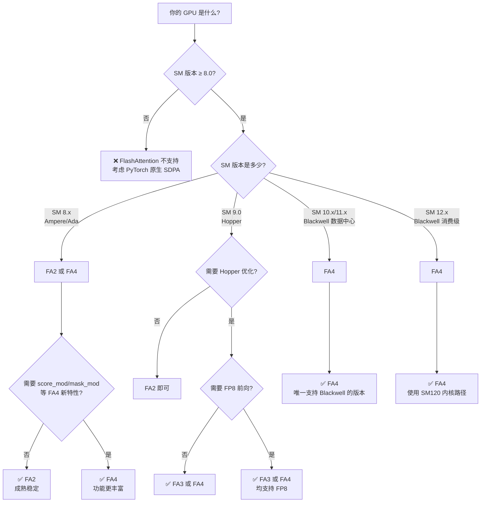
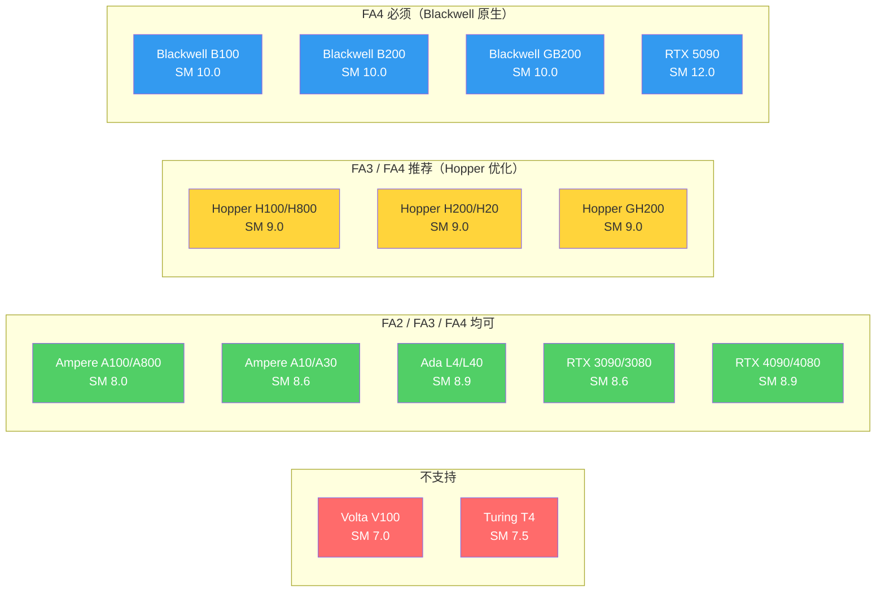

# FlashAttention 版本与 GPU 架构适配指南

## 【总】开篇

本篇梳理 FlashAttention 各版本（FA1/FA2/FA3/FA4）与 NVIDIA GPU 架构的适配关系，帮助你快速判断"我的 GPU 该用哪个 FA 版本"。

**核心结论**：

1. **FA2 是当前最通用的版本**，支持 Ampere（SM80）及以上所有架构，是大多数用户的默认选择
2. **FA3 专为 Hopper（SM90）优化**，在 H100/H800 上性能远超 FA2，但不向下兼容
3. **FA4 是面向未来的版本**，通过 CuTeDSL 同时支持 SM80/90/100/120 四种架构，是唯一支持 Blackwell 的版本
4. **GPU 架构是决定 FA 版本的第一要素**——SM 版本号决定了你能用哪些内核路径

**与其他篇章的关联**：本篇是 [03_版本演进与优化对比](./03_版本演进与优化对比.md) 的实践补充，重点从"硬件适配"角度而非"算法优化"角度分析版本选择。

---

## 【分】主体

### 一、NVIDIA GPU 架构全景图

首先厘清 NVIDIA 数据中心/AI 训练卡的架构演进脉络：

```
时间线
  │
  ├── 早期（已淘汰，FlashAttention 不支持）
  │   ├── Tesla (2006)     SM 1.x
  │   ├── Fermi (2010)     SM 2.x
  │   ├── Kepler (2012)    SM 3.x    K80
  │   └── Maxwell (2014)   SM 5.x
  │
  ├── 近代（AI 前奏，FlashAttention 不支持或有限支持）
  │   ├── Pascal (2016)    SM 6.x    P100, GTX 1080
  │   ├── Volta (2017)     SM 7.0    V100, Titan V        ← 第一代 Tensor Core
  │   └── Turing (2018)    SM 7.5    T4, RTX 2080         ← 第二代 Tensor Core
  │
  └── 现代（FlashAttention 主战场）
      ├── Ampere (2020)    SM 8.0/8.6  A100, A800, A30, A10, RTX 3090  ← 第三代 Tensor Core
      ├── Hopper (2022)    SM 9.0      H100, H800, H200, H20, GH200    ← 第四代 Tensor Core + TMA
      ├── Ada (2022)       SM 8.9      L4, L40, RTX 4090               ← 第四代 Tensor Core（无 TMA）
      └── Blackwell (2024) SM 10.0     B100, B200, GB200, RTX 5090     ← 第五代 Tensor Core + UMMA
```

> **关键概念**：SM（Streaming Multiprocessor）版本号 = `compute_capability`，格式为 `major.minor`（如 8.0、9.0）。FlashAttention 代码中用 `arch // 10` 提取 major 版本号来选择内核路径。

### 二、FlashAttention 各版本支持的 SM 版本

#### 2.1 FA2 — 支持 SM80+（Ampere 及以上）

**代码证据**：

- [setup.py](../setup.py) 第 74 行定义了默认编译架构：
  ```python
  def cuda_archs() -> str:
      return os.getenv("FLASH_ATTN_CUDA_ARCHS", "80;90;100;110;120").split(";")
  ```

- [flash_api.cpp](../csrc/flash_attn/flash_api.cpp) 第 369 行检查最低架构：
  ```cpp
  bool is_sm8x_min = cc_major >= 8;
  ```

- 所有 FA2 内核实例化文件均以 `_sm80.cu` 结尾（如 `flash_fwd_hdim128_bf16_sm80.cu`），编译目标为 `sm_80`

**支持的 GPU**：

| 架构 | SM 版本 | 代表 GPU | FA2 支持 |
|------|---------|----------|----------|
| Ampere | 8.0 | A100, A800 | ✅ 原生支持 |
| Ampere | 8.6 | A10, A30, RTX 3090 | ✅ 兼容运行 |
| Hopper | 9.0 | H100, H800, H200 | ✅ 兼容运行（但未利用 TMA/WGMMA） |
| Ada | 8.9 | L4, L40, RTX 4090 | ✅ 兼容运行 |
| Blackwell | 10.0 | B100, B200 | ✅ 兼容运行（但未利用新特性） |

**注意**：FA2 在 Hopper/Blackwell 上可以运行，但使用的是 SM80 内核路径（cp.async + HMMA），无法利用 TMA、WGMMA 等新硬件特性，性能不是最优。

#### 2.2 FA3 — 专为 SM90（Hopper）优化

**代码证据**：

- [hopper/setup.py](../hopper/setup.py) 第 508 行：
  ```python
  cc_flag.append("arch=compute_90a,code=sm_90a")
  ```

- FA3 同时编译 SM80 和 SM90 两套内核（`_sm80.cu` 和 `_sm90.cu`），运行时根据 GPU 架构自动选择

- FA3 的 SM90 内核使用了 TMA（Tensor Memory Accelerator）和 WGMMA（Warp Group MMA），这些是 Hopper 独有的硬件特性

**支持的 GPU**：

| 架构 | SM 版本 | 代表 GPU | FA3 支持 | 使用的内核 |
|------|---------|----------|----------|------------|
| Ampere | 8.0 | A100, A800 | ✅ 回退到 SM80 内核 | cp.async + HMMA |
| Hopper | 9.0 | H100, H800, H200 | ✅ 原生优化 | TMA + WGMMA |
| Ada | 8.9 | L4, L40 | ✅ 回退到 SM80 内核 | cp.async + HMMA |
| Blackwell | 10.0 | B100, B200 | ⚠️ 未针对优化 | 回退到 SM90 内核 |

**关键**：FA3 的核心价值在于 SM90 内核路径。在 A100 上，FA3 和 FA2 使用相同的 SM80 内核，性能差异不大。在 H100 上，FA3 的 SM90 内核比 FA2 快约 2x。

#### 2.3 FA4 — 支持 SM80/90/100/120（最广覆盖）

**代码证据**：

- [cute/interface.py](../flash_attn/cute/interface.py) 第 37-46 行导入了四种架构的内核：
  ```python
  from flash_attn.cute.flash_fwd import FlashAttentionForwardSm80
  from flash_attn.cute.flash_fwd_sm90 import FlashAttentionForwardSm90
  from flash_attn.cute.flash_fwd_sm100 import FlashAttentionForwardSm100
  from flash_attn.cute.flash_fwd_sm120 import FlashAttentionForwardSm120
  ```

- [cute/interface.py](../flash_attn/cute/interface.py) 第 74-89 行的架构检测：
  ```python
  @lru_cache(maxsize=None)
  def _get_device_arch():
      arch_override = os.environ.get("FLASH_ATTENTION_ARCH", None)
      if arch_override is not None:
          return _parse_arch_str(arch_override)
      major, minor = torch.cuda.get_device_capability()
      return major * 10 + int(minor)
  ```

- 内核选择逻辑（简化）：
  ```python
  if arch // 10 == 10 or arch // 10 == 11:  # SM100/SM110 (Blackwell)
      → FlashAttentionForwardSm100
  elif arch // 10 == 12:                      # SM120 (Blackwell GeForce)
      → FlashAttentionForwardSm120
  elif arch // 10 == 9:                       # SM90 (Hopper)
      → FlashAttentionForwardSm90
  else:                                       # SM80 (Ampere)
      → FlashAttentionForwardSm80
  ```

**支持的 GPU**：

| 架构 | SM 版本 | 代表 GPU | FA4 支持 | 使用的内核 |
|------|---------|----------|----------|------------|
| Ampere | 8.0 | A100, A800 | ✅ | FlashAttentionForwardSm80 (cp.async + HMMA) |
| Ampere | 8.6 | A10, A30, RTX 3090 | ✅ | FlashAttentionForwardSm80 |
| Hopper | 9.0 | H100, H800, H200 | ✅ | FlashAttentionForwardSm90 (TMA + WGMMA) |
| Ada | 8.9 | L4, L40, RTX 4090 | ✅ | FlashAttentionForwardSm80 |
| Blackwell | 10.0 | B100, B200 | ✅ | FlashAttentionForwardSm100 (UMMA + 2CTA) |
| Blackwell | 11.0 | B200 (部分型号) | ✅ | FlashAttentionForwardSm100 |
| Blackwell | 12.0 | RTX 5090, DGX Spark | ✅ | FlashAttentionForwardSm120 (SM80 MMA + 99KB SMEM) |

### 三、GPU 型号与 FA 版本完整映射表

#### 3.1 数据中心 AI 训练卡（最常用）

| GPU | 架构 | SM 版本 | 推荐 FA 版本 | 可用 FA 版本 | 性能最优路径 |
|-----|------|---------|-------------|-------------|-------------|
| **A100** | Ampere | 8.0 | FA2 或 FA4 | FA2, FA3, FA4 | SM80 (cp.async + HMMA) |
| **A800** | Ampere | 8.0 | FA2 或 FA4 | FA2, FA3, FA4 | SM80 |
| **A30** | Ampere | 8.0 | FA2 或 FA4 | FA2, FA3, FA4 | SM80 |
| **A10** | Ampere | 8.6 | FA2 或 FA4 | FA2, FA3, FA4 | SM80 |
| **H100** | Hopper | 9.0 | **FA3 或 FA4** | FA2, FA3, FA4 | SM90 (TMA + WGMMA) |
| **H800** | Hopper | 9.0 | **FA3 或 FA4** | FA2, FA3, FA4 | SM90 |
| **H200** | Hopper | 9.0 | **FA3 或 FA4** | FA2, FA3, FA4 | SM90 |
| **H20** | Hopper | 9.0 | **FA3 或 FA4** | FA2, FA3, FA4 | SM90 |
| **GH200** | Hopper | 9.0 | **FA3 或 FA4** | FA2, FA3, FA4 | SM90 |
| **B100** | Blackwell | 10.0 | **FA4** | FA4 | SM100 (UMMA + 2CTA) |
| **B200** | Blackwell | 10.0 | **FA4** | FA4 | SM100 |
| **GB200** | Blackwell | 10.0 | **FA4** | FA4 | SM100 |

#### 3.2 推理/边缘卡

| GPU | 架构 | SM 版本 | 推荐 FA 版本 | 可用 FA 版本 |
|-----|------|---------|-------------|-------------|
| **T4** | Turing | 7.5 | ❌ 不支持 | 无（SM < 8.0） |
| **L4** | Ada | 8.9 | FA2 或 FA4 | FA2, FA3, FA4 |
| **L40** | Ada | 8.9 | FA2 或 FA4 | FA2, FA3, FA4 |

#### 3.3 消费级 GPU

| GPU | 架构 | SM 版本 | 推荐 FA 版本 | 可用 FA 版本 |
|-----|------|---------|-------------|-------------|
| **RTX 2080** | Turing | 7.5 | ❌ 不支持 | 无 |
| **RTX 3090** | Ampere | 8.6 | FA2 或 FA4 | FA2, FA3, FA4 |
| **RTX 3080** | Ampere | 8.6 | FA2 或 FA4 | FA2, FA3, FA4 |
| **RTX 4090** | Ada | 8.9 | FA2 或 FA4 | FA2, FA3, FA4 |
| **RTX 4080** | Ada | 8.9 | FA2 或 FA4 | FA2, FA3, FA4 |
| **RTX 5090** | Blackwell | 12.0 | **FA4** | FA4 |
| **DGX Spark** | Blackwell | 12.0 | **FA4** | FA4 |

#### 3.4 已淘汰/不支持

| GPU | 架构 | SM 版本 | FlashAttention 支持 |
|-----|------|---------|-------------------|
| K80 | Kepler | 3.7 | ❌ |
| P100 | Pascal | 6.0 | ❌ |
| V100 | Volta | 7.0 | ❌（SM < 8.0） |
| T4 | Turing | 7.5 | ❌（SM < 8.0） |

### 四、版本选择决策流程



### 五、各架构下 FA 版本性能对比

#### 5.1 Ampere (A100) 上的性能

| 版本 | 内核路径 | 相对性能 | 说明 |
|------|---------|---------|------|
| FA2 | SM80 (cp.async + HMMA) | 1.0x (基准) | 最成熟，经过大量生产验证 |
| FA3 | SM80 (回退) | ~1.0x | 与 FA2 使用相同内核路径 |
| FA4 | SM80 (CuTeDSL) | ~0.95-1.05x | Python DSL 实现，性能接近 |

> **结论**：在 A100 上，FA2/FA3/FA4 性能基本持平，选择取决于功能需求而非性能。

#### 5.2 Hopper (H100) 上的性能

| 版本 | 内核路径 | 相对性能 | 说明 |
|------|---------|---------|------|
| FA2 | SM80 (回退) | 1.0x (基准) | 未利用 TMA/WGMMA |
| FA3 | SM90 (TMA + WGMMA) | **~2x** | 充分利用 Hopper 新特性 |
| FA4 | SM90 (CuTeDSL + TMA + WGMMA) | **~1.8-2x** | Python DSL 实现，性能接近 FA3 |

> **结论**：在 H100 上，FA3 和 FA4 远超 FA2，必须使用 FA3 或 FA4 才能获得最优性能。

#### 5.3 Blackwell (B200) 上的性能

| 版本 | 内核路径 | 相对性能 | 说明 |
|------|---------|---------|------|
| FA2 | SM80 (回退) | 1.0x (基准) | 完全未利用 Blackwell 特性 |
| FA3 | SM90 (回退) | ~2x | 利用部分 Hopper 特性 |
| FA4 | SM100 (UMMA + 2CTA) | **~3-4x** | 唯一利用 Blackwell 全部特性的版本 |

> **结论**：在 Blackwell 上，FA4 是唯一选择，FA2/FA3 均无法利用第五代 Tensor Core。

### 六、SM 版本与架构的详细对应关系

| SM 版本 | 架构代号 | 发布年份 | Tensor Core 代 | 关键新特性 | FA2 | FA3 | FA4 |
|---------|---------|---------|---------------|-----------|-----|-----|-----|
| 7.0 | Volta | 2017 | 第 1 代 | 首次引入 Tensor Core | ❌ | ❌ | ❌ |
| 7.5 | Turing | 2018 | 第 2 代 | RT Core | ❌ | ❌ | ❌ |
| 8.0 | Ampere (数据中心) | 2020 | 第 3 代 | TF32, BF16, MIG | ✅ | ✅ | ✅ |
| 8.6 | Ampere (消费级) | 2020 | 第 3 代 | 同上 | ✅ | ✅ | ✅ |
| 8.9 | Ada Lovelace | 2022 | 第 4 代 | DLSS 3, 高能效 | ✅ | ✅ | ✅ |
| 9.0 | Hopper | 2022 | 第 4 代 | **TMA, WGMMA, FP8** | ⚠️ 回退 | ✅ 原生 | ✅ 原生 |
| 9.0a | Hopper (含 TMA) | 2022 | 第 4 代 | 同上 | ⚠️ 回退 | ✅ 原生 | ✅ 原生 |
| 10.0 | Blackwell (数据中心) | 2024 | 第 5 代 | **UMMA, 2CTA, FP4/FP6** | ⚠️ 回退 | ⚠️ 回退 | ✅ 原生 |
| 11.0 | Blackwell (变体) | 2024 | 第 5 代 | 同上 | ⚠️ 回退 | ⚠️ 回退 | ✅ 原生 |
| 12.0 | Blackwell (消费级) | 2024 | 第 5 代 | 99KB SMEM 限制 | ⚠️ 回退 | ⚠️ 回退 | ✅ 原生 |

### 七、特殊情况与注意事项

#### 7.1 Ada Lovelace (SM 8.9) 的定位

Ada Lovelace（L4, L40, RTX 40 系列）的 SM 版本是 8.9，属于 Ampere 的"远亲"：
- 拥有第四代 Tensor Core（与 Hopper 同代），但**没有 TMA 和 WGMMA**
- FlashAttention 在 Ada 上使用 SM80 内核路径（cp.async + HMMA），与 A100 相同
- 因此 Ada 上的 FA 性能与 A100 相当，而非 H100

#### 7.2 SM120 (Blackwell 消费级) 的限制

SM120（RTX 5090, DGX Spark）是 Blackwell 消费级架构：
- FA4 中 SM120 继承自 SM80 内核，使用 HMMA 而非 UMMA
- SMEM 容量限制为 99KB（而非数据中心的更大容量）
- 参见 [cute/interface.py](../flash_attn/cute/interface.py) 第 525-526 行：
  ```python
  if arch // 10 == 12:
      # SM120 tile sizes tuned for 99 KB SMEM capacity
  ```

#### 7.3 环境变量覆盖架构检测

FA4 支持通过环境变量强制指定架构路径（[cute/interface.py](../flash_attn/cute/interface.py) 第 85-87 行）：

```bash
# 强制使用 SM80 内核路径（即使 GPU 是 H100）
export FLASH_ATTENTION_ARCH=sm_80

# 强制使用 SM90 内核路径
export FLASH_ATTENTION_ARCH=sm_90

# CPU-only 编译时需要同时设置
export FLASH_ATTENTION_ARCH=sm_80
export CUTE_DSL_ARCH=sm_80
```

这在以下场景有用：
- 在没有 GPU 的机器上编译/测试
- 调试特定架构路径的问题
- 在新架构 GPU 上回退到已知稳定的内核

#### 7.4 FA2 的 CUDA 架构编译选项

FA2 安装时可自定义编译目标架构（[setup.py](../setup.py) 第 74 行）：

```bash
# 只编译 SM80 内核（减小包体积）
FLASH_ATTN_CUDA_ARCHS="80" pip install flash-attn --no-build-isolation

# 编译 SM80 + SM90 内核
FLASH_ATTN_CUDA_ARCHS="80;90" pip install flash-attn --no-build-isolation

# 编译所有支持的架构
FLASH_ATTN_CUDA_ARCHS="80;90;100;110;120" pip install flash-attn --no-build-isolation
```

#### 7.5 ROCm (AMD GPU) 支持

FA2 提供了 AMD GPU 的实验性支持：
- **Triton 后端**：`FLASH_ATTENTION_TRITON_AMD_ENABLE=TRUE pip install flash-attn --no-build-isolation`
- **CK (Composable Kernel) 后端**：默认 ROCm 后端，代码在 `csrc/flash_attn_ck/`
- 支持的 AMD GPU：MI250, MI300X 等

FA3 和 FA4 目前不支持 AMD GPU。

### 八、一图总结：GPU → FA 版本速查



---

## 【总】收尾

**版本选择一句话总结**：

| 你的 GPU | 推荐版本 |
|----------|---------|
| A100 / A800 / L4 / L40 | FA2（稳定）或 FA4（新特性） |
| H100 / H800 / H200 | FA3 或 FA4（必须用 SM90 路径） |
| B100 / B200 / GB200 / RTX 5090 | FA4（唯一支持 Blackwell） |
| V100 / T4 及更早 | 不支持，使用 PyTorch 原生 SDPA |

**核心原则**：FlashAttention 的版本选择由 GPU 架构决定，而非功能需求。先确认你的 SM 版本，再选择对应的 FA 版本。在支持的版本中，优先选择能利用当前 GPU 架构特性的版本（Hopper 选 FA3/FA4，Blackwell 选 FA4），否则选择最稳定的 FA2。
